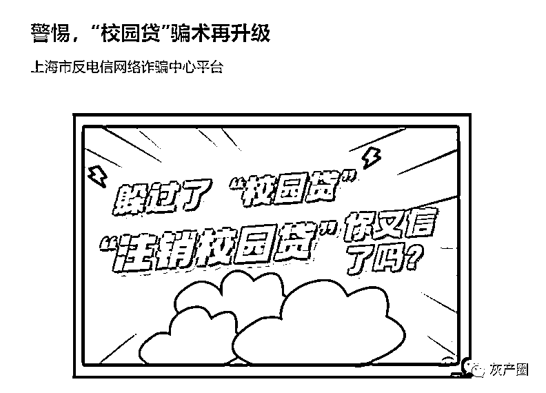
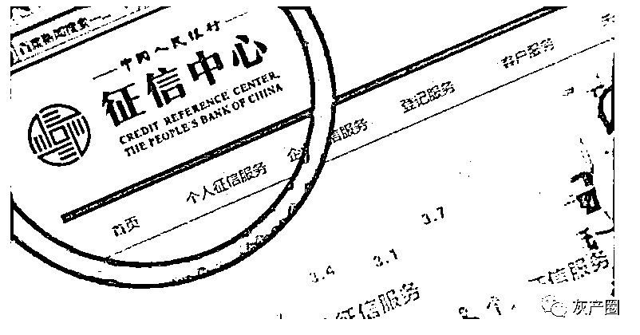
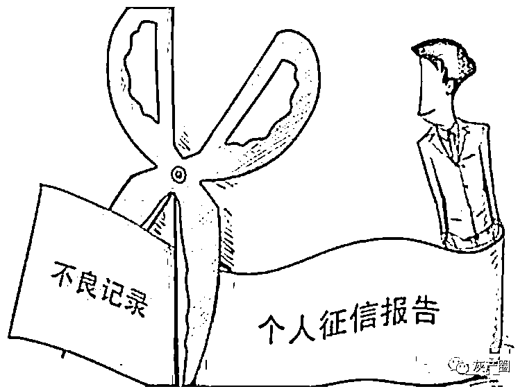

# 帮你修复个人征信？别信，是诈骗

> 原文：[`mp.weixin.qq.com/s?__biz=MzIyMDYwMTk0Mw==&mid=2247533132&idx=3&sn=8657eca7c721009b945c89cf1b5594d4&chksm=97cb8974a0bc00625b27d5dab5ccc700704210c7b8541600fe33c4616bf574f605632f2262e3&scene=27#wechat_redirect`](http://mp.weixin.qq.com/s?__biz=MzIyMDYwMTk0Mw==&mid=2247533132&idx=3&sn=8657eca7c721009b945c89cf1b5594d4&chksm=97cb8974a0bc00625b27d5dab5ccc700704210c7b8541600fe33c4616bf574f605632f2262e3&scene=27#wechat_redirect)

房贷、车贷都要看征信，征信，已是我们的个人生活绕不开的一个关键词。 

假如你有不良记录，有人要帮你修复修复？

别信！

征信，已经成为诈骗团伙开始表演的一个热词。

比如之前说过的注销校园贷骗局中，骗子冒充金融平台客服，说你在上大学时注册了该平台账号，按照政策要求需要注销，注销账户要将金融平台借款额度清空，否则将影响个人征信。

这类注销校园贷骗局，从 2020 年冒出来，到现在，骗局不断迭代——今年还有新版本新套路，但本质上依然是一样的，骗子抓住征信这个关键词。

**去年 4 月，国家反诈中心统计，从 2020 年到当年 4 月，“注销校园贷”骗局共发生了 5.1 万起，损失金额 26.5 亿元。**

今年以来，对“征信修复”乱象，国家多部委正在行动。 

3 月 30 日，国家发改委网站发布《国家发展改革委办公厅关于重点开展“征信修复”问题专项治理的通知》（下称《通知》），将依托信用服务机构失信问题专项治理机制，重点开展“征信修复”问题专项治理工作。

《通知》指出，信用服务领域一些失信问题仍然突出，特别是一些不法分子利用部分信息主体急于消除不良征信记录的心理，混淆征信异议、信用修复概念，以“征信修复、洗白、铲单”“征信异议投诉咨询、代理”为名行骗，威胁人民群众财产安全，严重扰乱社会信用体系建设大局，必须严查严处。

《通知》称，本次重点开展“征信修复”问题专项治理的对象，主要是假借“征信修复”“征信洗白”等名义招摇撞骗，通过虚假宣传、教唆无理申诉、材料造假、恶意投诉等手段骗取钱财或个人信息，严重扰乱市场秩序的市场主体。

治理目标：到 2022 年 6 月底，各地方专项治理台账退出率力争达到 100%，此后严格保持动态“清零”。

治理对象退出台账标准为：一是已向监管部门发送监管提示函。二是监管部门已反馈核实查处结果。 

**有的开发商为了卖房，**

**用征信修复做诱饵** 

很多人是在网上看到、或者是听人介绍，找人来做个人征信修复。

为什么有人要找人来征信修复？

有的是想买房办贷款。这个想法，还被开放商利用了。

去年 10 月《华商报》报道，同你按 2 月 23 日，陕西宝鸡田先生看中一套 114.25㎡房子，因他征信逾期无法办理按揭贷款，但接待他们的置业顾问称能花钱找人修复。他缴纳了首付款和征信修复费用后却一直无法办理按揭多次询问一推再推至今，现在首付款退款还在一直推脱。

田先生说，在购房时，明确告知自己征信有 31 条逾期能否办理贷款。当时接待的置业顾问说可以花钱找人修复征信，可以先缴纳首付款。待征信修复后就可以办理按揭贷款了。

随后，他交了 1000 元修复征信费用，又交了 13 多万元首付款，但征信没修复，首付款也没退给他。 

这类情况打起官司，之前也有判例，法院判开发商退回全部预付款。

**“征信修复洗白”骗局**

2020 年 10 月份，深圳小张想办一张信用卡用于资金周转，但因征信问题未能办成，动起了修复征信的心思。随后，他在网上找到自称能够帮助他人修复征信的“征信修复师”麦某。

麦某表示修复征信，要收取服务费及信用卡的逾期费共计 3 万多元，还向小张展示了征信修复成功的案例。

小张答应了，支付了 3 万多的“修复费”。谁知两个月过去了，小张见自己的征信迟迟未见修复，也联系不上麦某，这才意识到被骗，随即报警。

这是典型的“征信修复洗白”诈骗。 

骗子推出征信修复业务广告，经常会配上“银行”发出的征信信息修改的短信截图，甚至还有与“银行客服”通话的视频，让人感觉成功率很高。但实际上，这是一套精心设计的“诱饵”，短信截图都是 PS 出来的，故意用编造出来的成功案例来骗取信任。

骗子以“征信修复、洗白、铲单”“异议申诉咨询、代理”为名义开办业务或发布广告，有的收取高额费用后失联，有的教唆个人用“非恶意逾期”理由无理申诉，或运用虚假材料等非法手段以图修改不良信息，通常修改失败后不退款或失联。 

**考征信管理师资格证是假的** 

还有网上什么征信修复师培训班、考什么征信管理师证的，都是诈骗！

宋先生看到微信好友李某在发朋友圈的征信修复成功案例，准备学习“征信修复”技术。李某说，90%的个人信用报告逾期问题都能修复成功，只要交 10 万元加盟费，即可开办业务。

宋先生只需负责招揽客户，客户的逾期信用报告统一由总部机构负责修复，并承诺每成功办理一笔修复业务，可获得 40%的提成。

宋先生信以为真，当即交完加盟费，可之后，当他将几个客户的逾期信用报告交与李某修复时，却发现根本无法修复，所谓的加盟费也打了水漂。

这种骗局中，什么培训“征信修复”培训班，还说征信市场需求量大，诱导用代理、加盟方式开办征信业务，实则为骗取代理、加盟费用、个人信息等。

所谓的征信修复师、征信管理师证均未得到人力资源和社会保障部认可，不具备合法性。征信领域也不存在修复这一说法。

**记住：任何人或机构不能删除、修改征信记录**

任何机构或个人都不可能随意删除、修改征信记录，凡是声称合法的、商业性、收费的“征信修复”都是骗局。

对征信有疑义，可以向金融机构或人民银行征信中心提出异议，也可以到本地的人民银行分支机构进行投诉。国务院征信业监督管理部门及其派出机构、征信机构或信息提供者受理投诉和异议均不收取任何费用。

近日，中国人民银行印发《关于开展“征信修复”乱象专项治理“百日行动”工作的通知》，“百日行动”在 3 月-6 月开展，就是为了整治“征信修复”乱象。 

**个人征信不良记录 5 年自动消除** 

虽然个人征信，和我们生活息息相关，如房贷、车贷等等，如果有不良记录，一旦被列入黑名单，我们不仅无法办理银行相关的业务，甚至不能购买机票、购买动车票高铁票，火车不管到哪里只能坐硬座，住宿不能住酒店只能住旅馆，名下的所有银行卡不能支付中高档消费。

目前消费、买车贷款及办理信用卡等等行为都会被征信，如若个人信用不良几乎是会被银行拒之门外的，购房时候商贷也许加点利息可以贷款，但是公积金贷款是绝不可能通过的，

但个人征信记录不是终身制的。

根据规定，不良征信自然消除时间通常为 5 年，自结清欠款之日起计算。因过往逾期行为形成不良记录的，保持良好的信用习惯，用时间来修复自己的征信，5 年后不良记录即可自然消除。

2019 年 5 月新版征信报告发布，个人还款信息记录将更为全面。新版报告将还款记录和逾期记录保存期限均设为五年。

在浙江省，满足条件者最快 1 年可申请信用修复，适用范围限定浙江省。

2019 年 2 月，浙江省发展改革委近日出台《浙江省公共信用修复管理暂行办法》，文件指出，信用修复原则上需要满足三个条件：

（1）行政处理决定和司法裁判等明确的法定责任和义务履行完毕，社会不良影响基本消除；（即已结清欠款，履行完相应义务）

（2）各省级公共信用信息提供单位可结合本行业实际制定不良信息修复期限，但原则上自不良信息认定之日起修复期限应满 1 年及以上；（即最快 1 年后可申请信用修复）

（3）自不良信息认定之日起至申请信用修复期间未产生新的记入信用档案的同类不良信息。（即申请修复期间不可再次出现不良记录）

来源：深圳公安、长江日报、半岛都市报、全民反诈

← 向右滑动与灰产圈互动交流 →

