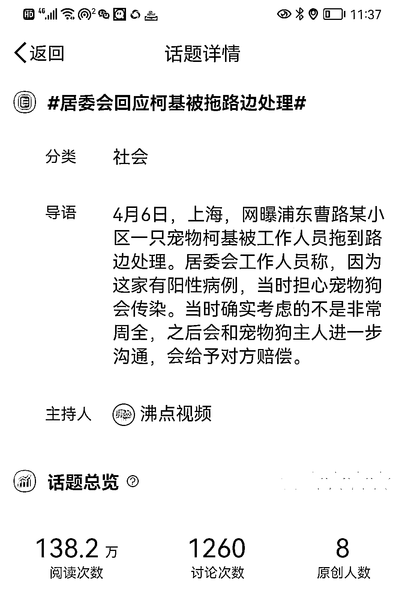
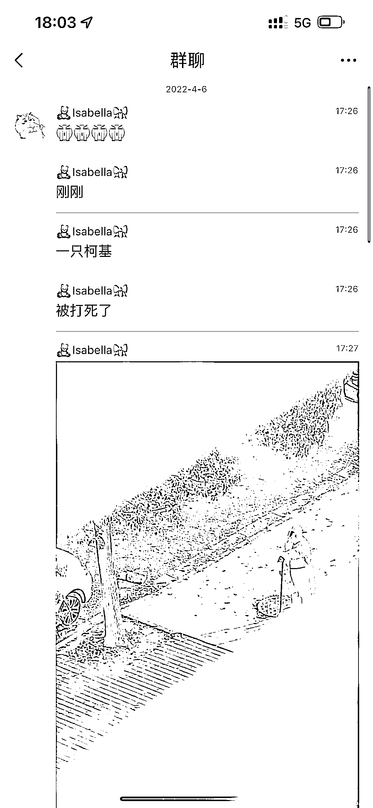
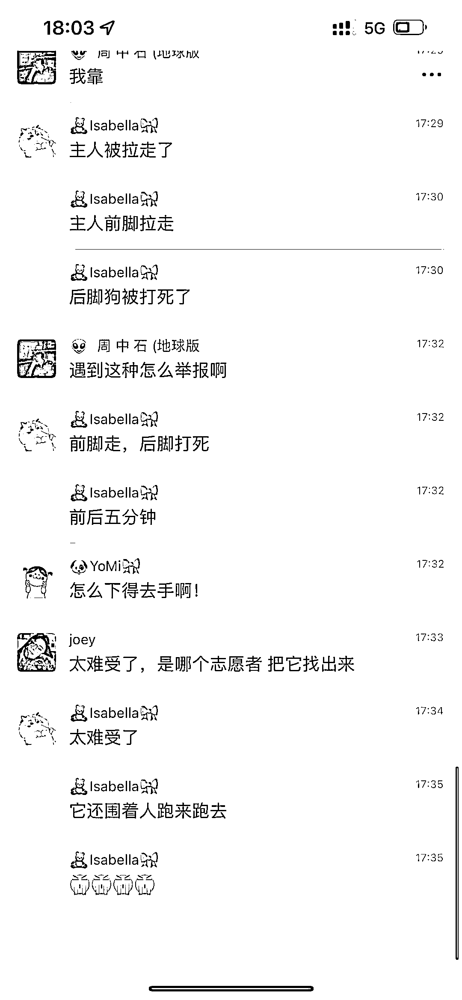
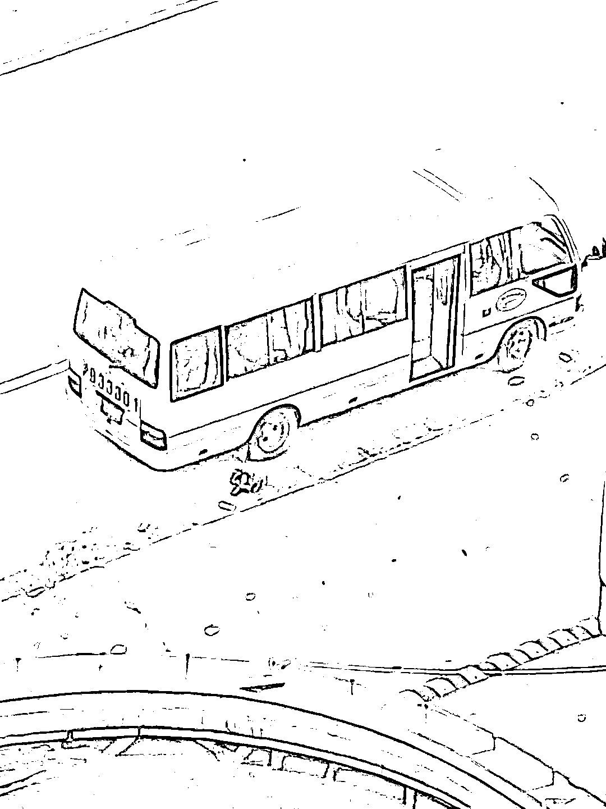
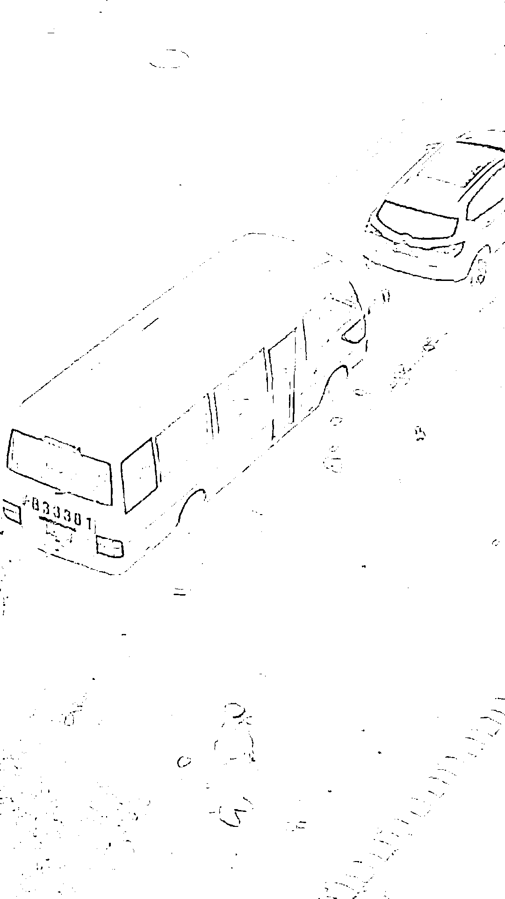

# 上海柯基犬被拍死事件，居委会回应说会赔偿！

> 原文：[`mp.weixin.qq.com/s?__biz=MzIyMDYwMTk0Mw==&mid=2247533132&idx=5&sn=b05c0a58c327e32132bd950ed1516807&chksm=97cb8974a0bc006236bbd37d55a7eb36b6d7cecbd570355574e7d96bfd229bb5a495046d23c4&scene=27#wechat_redirect`](http://mp.weixin.qq.com/s?__biz=MzIyMDYwMTk0Mw==&mid=2247533132&idx=5&sn=b05c0a58c327e32132bd950ed1516807&chksm=97cb8974a0bc006236bbd37d55a7eb36b6d7cecbd570355574e7d96bfd229bb5a495046d23c4&scene=27#wechat_redirect)

**不理解，为何，一些人一定要让这座城市曾经的那一抹温暖也要打碎！**

**据沸点视频，2022 年 4 月 6 日，上海，网曝浦东曹路某小区一只宠物柯基被工作人员拖到路边处理。居委会回应柯基被拖路边处理，工作人员称，因为这家有阳性病例，当时担心宠物狗会传染。当时确实考虑的不是非常周全，之后会和宠物狗主人进一步沟通，会给予对方赔偿。**

**赔偿，这条命能回来吗。**

**下面的这几则图片，以及视频是在上海一个柯基犬的号上看到的：**

> 在群聊的对话中可以看到，家住浦东的主人被拉走隔离，粘腻的柯基犬跟着出来，主人的车才离开，它就被拍死了！ 
> 
> 下面的视频很残酷，但我还是选择发了出来。

[`mp.weixin.qq.com/mp/readtemplate?t=pages/video_player_tmpl&action=mpvideo&auto=0&vid=wxv_2342887044412456960`](https://mp.weixin.qq.com/mp/readtemplate?t=pages/video_player_tmpl&action=mpvideo&auto=0&vid=wxv_2342887044412456960)

[`mp.weixin.qq.com/mp/readtemplate?t=pages/video_player_tmpl&action=mpvideo&auto=0&vid=wxv_2342892462245265410`](https://mp.weixin.qq.com/mp/readtemplate?t=pages/video_player_tmpl&action=mpvideo&auto=0&vid=wxv_2342892462245265410)

> 不知道这个杀狗的人是怎么想到？是狗有存在危害的风险吗？
> 
> 居委会回应是考虑不周，担心宠物狗被感染，之后会与主人沟通，给予赔偿。

来源：我永远会在你身后

← 向右滑动与灰产圈互动交流 →

