# 公寓楼用电量莫名飞涨！牵出一桩制毒大案！现场收缴超 500 万元毒品→

> 原文：[`mp.weixin.qq.com/s?__biz=MzIyMDYwMTk0Mw==&mid=2247533132&idx=8&sn=7bda8ce051e1b8be32b961cae9293254&chksm=97cb8974a0bc00629eae6613eb0412f888b5069441337060e11de53ca7c66fd4ec9bcc9a69fa&scene=27#wechat_redirect`](http://mp.weixin.qq.com/s?__biz=MzIyMDYwMTk0Mw==&mid=2247533132&idx=8&sn=7bda8ce051e1b8be32b961cae9293254&chksm=97cb8974a0bc00629eae6613eb0412f888b5069441337060e11de53ca7c66fd4ec9bcc9a69fa&scene=27#wechat_redirect)

2021 年，全国公安机关大力实施“清源断流”战略，精心组织“净边 2021”专项行动，全年共破获毒品犯罪案件 5.4 万起，抓获犯罪嫌疑人 7.7 万名，缴获毒品 27 吨，缉毒执法工作取得显著成效。毒品犯罪，隐秘性强，事实上，很多毒品大案都是从看似无关的蛛丝马迹中发现端倪的。

**从贩毒到制毒，警方追踪捣毁制毒窝点**

[`mp.weixin.qq.com/mp/readtemplate?t=pages/video_player_tmpl&action=mpvideo&auto=0&vid=wxv_2344483179434311680`](https://mp.weixin.qq.com/mp/readtemplate?t=pages/video_player_tmpl&action=mpvideo&auto=0&vid=wxv_2344483179434311680)

△央视财经《经济半小时》栏目视频

2019 年 3 月，湖北省荆州市警方调查到一名家庭主妇经常往一个账户上打款，每次都是几十万地打款。经调查，警方发现这个账户的主人是一起跨境贩卖毒品案件的主要嫌疑人。

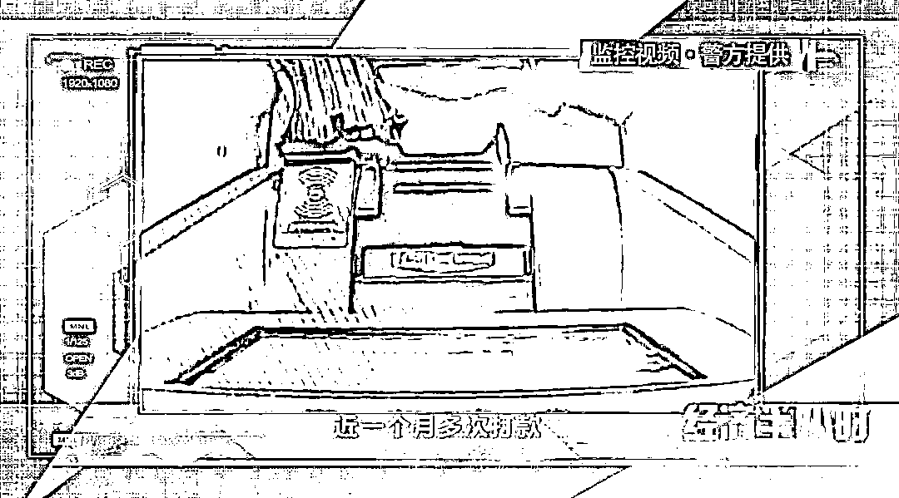

虽然家庭主妇郑雅丽没有做其它可疑的事情，但是她的前夫赵永成十分可疑。赵永成跟一些涉毒人员来往频繁，日常花销与经济收入完全不符。

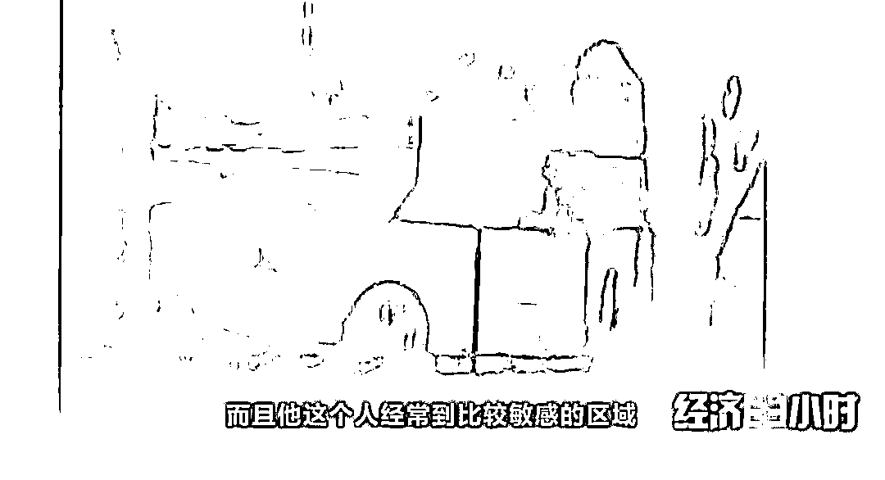

荆州警方怀疑，赵永成很可能涉嫌跨境贩毒，就在警方严密布控的时候，2019 年 5 月 7 日，警方抓获了一名正在进行毒品交易的于某，经审查，他是赵永成的马仔。

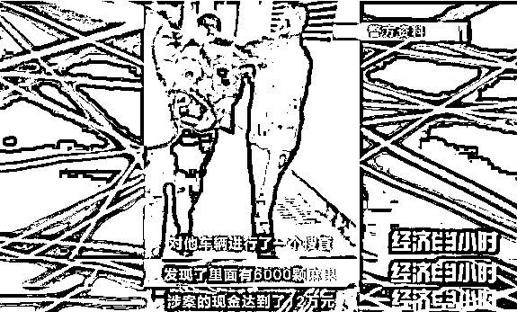

随后，荆州警方立即到几名嫌疑人家中进行了搜查，在嫌疑人张某的家中，民警查获了毒品麻果 39 颗。此次行动，荆州警方共查获各类毒品净重 571.65 克。

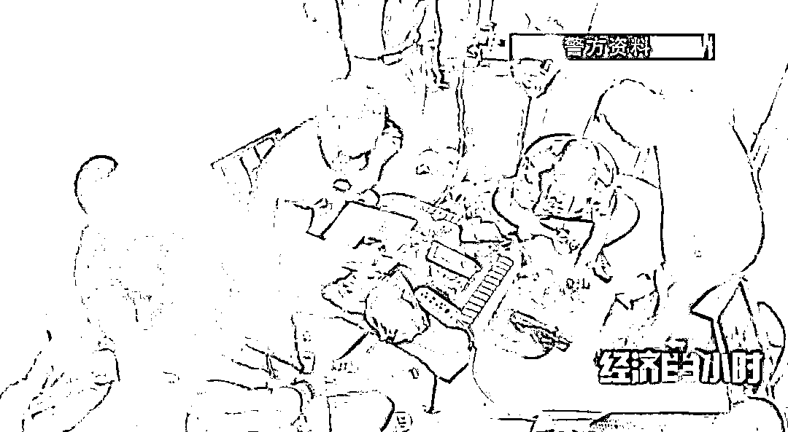

就在几个月后，赵永成又开始蠢蠢欲动，指使荆州的两名涉毒人员熊某和郑某去湖南拿货，然后再运到荆州来贩卖。

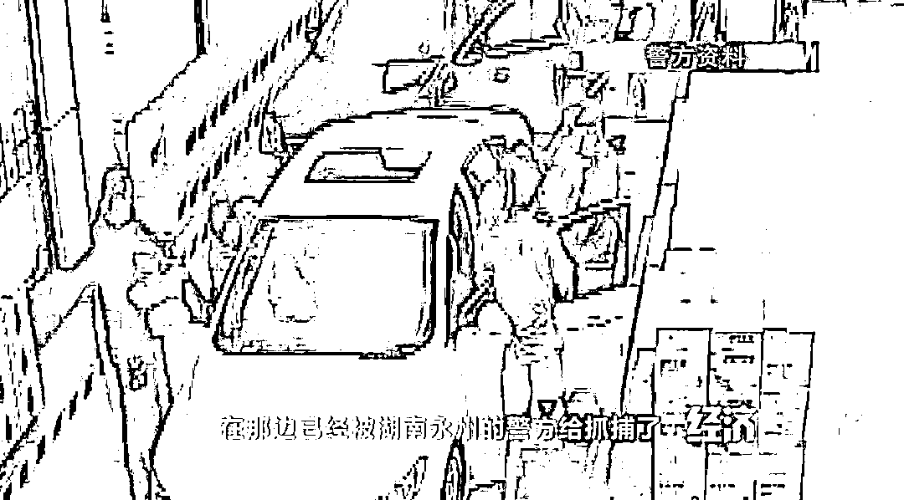

然而，两次交易都以失败告终，这让赵永成损失巨大。荆州警方猜测，此时的赵永成，要么彻底放弃毒品买卖，寻找其他挣钱渠道；要么孤注一掷，用更大的投入实现快速回本、弥补损失。果然，2020 年 3 月，赵永成又开始行动了。

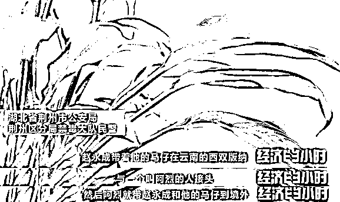

侦办民警一直守候在西双版纳的机场以及其他入境通道附近。结果发现，赵永成此次出境并没有带回什么东西，直到有一天，有一批货物通过物流公司发给了赵永成，货物名称是压片机。

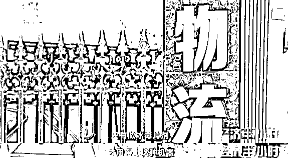

此刻，侦办民警意识到，赵永成此前经由云南西双版纳去往境外的目的，很有可能是去咨询制毒技术。没过多久，一名来自云南的可疑人员来到荆州，并住进了赵永成新租住的公寓里。此人名叫王晓辉，有涉毒前科。

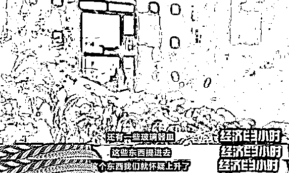

与此同时，侦办民警发现这处公寓的用电量也是飞涨。而赵永成也活跃起来，多次开车在荆州市和潜江市之间往返，并与两名可疑男子陈某和胡某频繁见面。

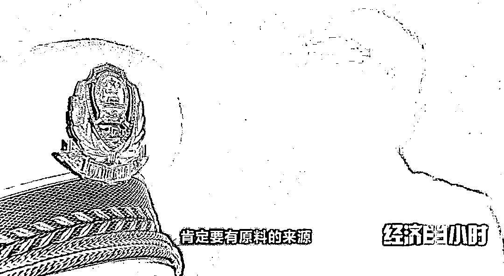

2020 年 7 月 28 日凌晨，陈某和胡某驾驶车辆到达了赵永成租住的小区，进入赵永成的住处。侦办民警意识到，抓捕时机就在此刻！

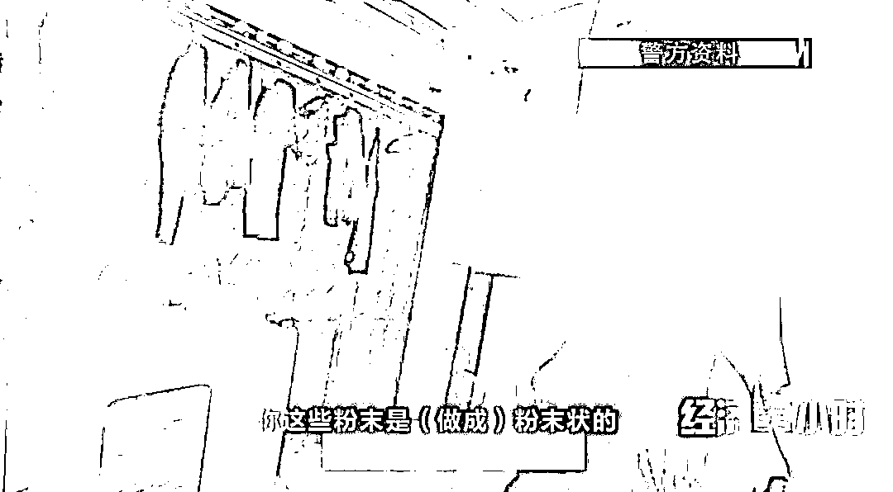

进入公寓，民警发现，房间内堆满了大大小小的容器，容器内盛放的是墨汁状的液体和酱色的膏状固体，散发出强烈的刺鼻气味。在对制毒窝点进行搜查，发现他们已经制造出了大量的毒品。

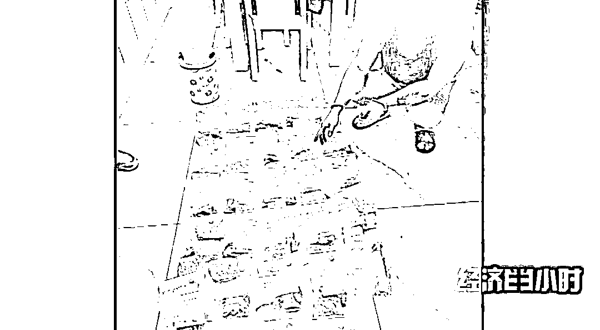

经过一年多的缜密侦查，荆州警方终于在成品毒品流入市场之前，将嫌疑人赵永成建立的这个制毒窝点彻底捣毁，现场收缴毒品 3.8 千克，毒品半成品及制毒液体共约 18 千克，抓获犯罪嫌疑人 12 人。据估算，这批毒品如果流入市场，市值将超过 500 万元。

**打击毒品犯罪 维护社会清朗**

我国对毒品犯罪一直保持严厉打击的态势，但是，一些不法分子为了牟取暴利，依然铤而走险，不惜以身试法。禁毒是一场没有硝烟的“持久战”。遏制、减少直至最终消除毒品犯罪，是全社会共同的心愿。只有从源头开始，对毒品犯罪进行全链条精确打击，才能真正对不法分子产生震慑，让此类犯罪失去滋生的土壤，最终实现“天下无毒”。

来源：央视财经（ID：cctvyscj）

← 向右滑动与灰产圈互动交流 →

