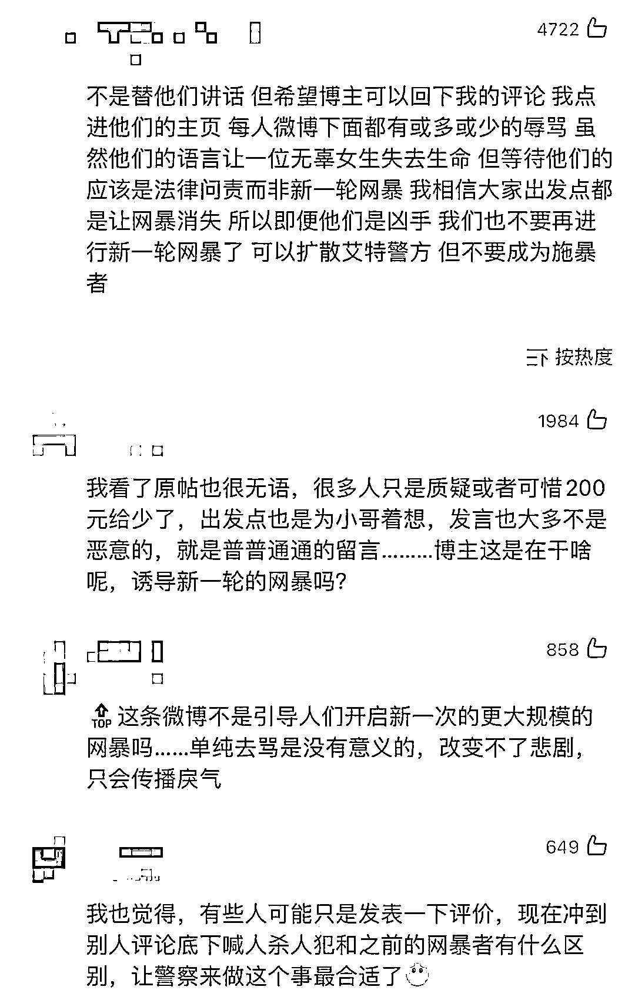

# 上海姑娘因打赏外卖员 200 元，而被无数键盘侠网暴跳楼的始末

> 原文：[`mp.weixin.qq.com/s?__biz=MzIyMDYwMTk0Mw==&mid=2247533199&idx=1&sn=ff9b62a4debe80086891b9d09eac2910&chksm=97cb89b7a0bc00a18c678dc5876ea4c90105364b97c260e8fd1172fdaf539797ef802098a703&scene=27#wechat_redirect`](http://mp.weixin.qq.com/s?__biz=MzIyMDYwMTk0Mw==&mid=2247533199&idx=1&sn=ff9b62a4debe80086891b9d09eac2910&chksm=97cb89b7a0bc00a18c678dc5876ea4c90105364b97c260e8fd1172fdaf539797ef802098a703&scene=27#wechat_redirect)

最近几天打开微博，负能量爆棚，魔幻的事件一个接一个，让人非常沮丧。

原本一个为数不多的充满正能量的故事，最后也变成了一场悲剧。

简单概括一下：一个姑娘在家做的菜给自己在几十公里外的听障父亲，找不到人送，一个帮她家送菜的叮咚小哥免费送，不肯收报酬，姑娘因为疫情经济情况也不好，充值了 200 话费送他，大 V 觉得是正能量就帮她说了这个事情，小哥也被叮咚奖励了 2000 现金。叮咚小哥乐于助人，小姑娘善良孝顺，本来这个故事很温馨，结果姑娘却因为被网暴 200 元太少，想不开跳楼了。。。

* * *

4 月 4 日，博主脊梁收到一则粉丝投稿，看完之后真的让人感觉到困难中的一束光。

这位姑娘住在虹口，他爸爸住在青浦，年纪大了还有听障耳朵是完全听不见的手痛脚痛也没有办法自己做菜
已经开始干吃白米饭了平时吃饭
都是儿女烧好了送过去这次隔离 通知的比较突然
各种平台也暂时关停了他烧好饭菜 又打包了一些速食想在线上叫快送给老人送去

但现在是特殊时期加了 100 块小费都没人接单情急之下，他想到了前一天的叮咚小哥没想到小哥真的那么帮忙从虹口到青浦区单程就有 27 公里了开电瓶车也还是蛮吃力的叮咚小哥是 19：15 出发的开着电瓶车，路上还没电了这个时候送东西想想也是更不容易路上不少地方都锁了到最后几公里的时候小哥只能拎着菜走路过去光这段路走走也要 20 多分钟叮咚小哥拎着一大包吃的还是晚上 10 点多…送到青浦的时候已经晚上 11 点了晚上 19：15 到 23 点…单程就将近 4 小时了 11 点多帮忙送完菜小哥还要再开 20 几公里回家来回大概有 50 多公里了…还好最后他找到了换电的地方现在就是普通人物资也不太好买这位小哥真的让人觉得很了不起！！而当这位姑娘给小哥打钱时
叮咚小哥却死活都不肯收钱

网银没开，支付宝也没有可能，从姑娘向他求助的那一刻起这位叮咚小哥就没想过要报酬完全就是做好人好事的而当小哥把菜送到了小区门口接力棒到了老人居住小区的居委手里网友又向居委会求助居委也很快就派人送到了老人手里

这个接力棒里每一棒都让人很暖心无私热心的外卖小哥孝顺的儿女 居委的支持在这种特殊时期里，这种好人好事更显温暖和珍贵，大家看了都很感动的。

然后因为余中帮助的是一位独居听障老人，有些老年网友看了之后，感触更深一点。这位姑娘也看到一些网友建议说，支付宝网银都无法找到账号转账的话可以充点话费，所以她给叮咚小哥余中充了话费。而且在留言区里，也有不少好心网友说离自己挺近，或许可以帮上忙的，也都是善良的人啊！ 

后来，叮咚买菜公司也看到了余中的好人好事，给他颁发了平民英雄奖及 2000 元奖金！🏅这位叮咚小哥余中，是 1991 年生人，来自安徽安庆，三年前来的上海，一直从事外卖行业，2022 年加入叮咚买菜，主要是配送虹口地区居民的物资。我找了下小哥的采访，首先小哥前一天帮她配送过，所以答应了女生的请求，一开始就没想着收钱。这样的好人好事，就像在便利店里住了 23 天的李娜一样平凡又伟大，值得传播，但没想到...“200？善良这么廉价吗”“人家不顾一切不计代价帮助你，你像打发乞丐”
“200 太小家子气”“我一个大学生都觉得 200 少”“上海人 200 块打发外地人”“我虽然穷，但是我会给 500”“充分展现了上海人的精打细算”“这个不是正能量” “感动哭了只给 200”“这不是正能量，这是欺负老实人”“200，让好人心寒”还有很多更让人难以接受的评论，我就不一一列举了。这些网友的话都非常阴阳怪气的，甚至追着姑娘私信骂，让受助的姑娘直接失眠到天明，连她爸爸都觉得心里很愧疚，跟女儿说：**这次的饭吃得不太好受、太麻烦了。**受助的姑娘给博主脊梁发私信，希望可以就这 200 块钱的事情澄清一下：

1.  **本来以为是顺利的 1.5 小时车程，没想到这么困难**

2.  **200 块的报酬他都不肯收，如果肯收一定追加补偿**

3.  **充话费也是余中不知情的，也不知道他能不能真的个人受益**

4.  **宾馆费用是叮咚买菜公司承担**

5.  **解封之后会送锦旗，也约了余中吃饭，这样的恩情是要当面感谢的**

这些键盘侠不依不饶，甚至还扒出一些她个人信息，什么双十一收了一百多个快递，游戏冲卡冲了一两千。她解释半天为什么游戏抽卡。还有质疑为什么双十一买那么多的，人家日用品囤货不行吗？还有说能买打印机（饭盒上打日期标签的）所以很多钱？？？我？？？最后她把微博都清空了，可能是绝望了，无力了。她本来可以闷声不响接受地这份帮忙，但她还是想要大声说出对余中的感谢，却没想到传播温暖的故事，还要承受这样的网络暴力。
从姑娘和脊梁聊的三言两句中也知道了，她自己的经济条件也不宽裕，看了大家的评论之后也反思过是不是 200 太少。可是这关于报酬的争议真的没必要，叮咚小哥余中帮了姑娘和她爸爸，他们由衷感激，会一直记在心里。等疫情过去，人家会请余中吃饭、当面感谢的。哎... 明明是一个遇到各种困难还坚持完成意料外工作的社会暖心事，企业给了奖励，受助人心怀感激到处感谢这个小哥！结果在微博上，被讨论最多的是 200 块是不是太少了。姑娘还跟脊梁说，在浦西封控之前，她就想接老人过来虹口一起住的，但老人觉得自己腿脚不好会给孩子添麻烦，就宁愿一个人在青浦住。后来封控了，就也没有办法接过来了。现在么，她已经把家里的菜都做好给老人送去，自己只能每天早起拼命抢菜。怎么说呢，特殊时期大家都不容易，普通人之间的守望相助真的很让人感动，而其中的无私善行和知恩图报都不是用钱就可以衡量的。更何况还给予了大家一份温暖光芒。4 月 6 日，博主脊梁突然发微博，这个女生，因为禁不住网暴，跳楼自杀了。。。结合一些微博上的信息，很可能是跳楼了。。。（具体以警方信息为准）即使姑娘离开了，仍有键盘侠指责她玻璃心。。。甚至把她跳楼的事编成了谣言。。。然后另外一个博主，开始讨打这些当初给她评论的网友。
我点进这些人的主页，有一多半的用户都注销了微博。没注销的，也基本都被骂惨了
还有人说不应该新一轮的网暴，应该做的是寻求法律。（但是目前还没有看到一个网暴被判刑的实际案例吧）还有人指责脊梁吃人血馒头，阴阳怪气。郭德纲多年前关于网暴的一段话：人需要在一个没有后果的网络世界里发泄，真要是实名制发帖，谁发帖之前都贴上，我爸爸叫什么，我儿子在哪上学，我媳妇在哪个单位她手机号多少，我再发帖，你看吧，天下太平，这就是人性。

我们不知道这个跳楼的女生，她经历了什么，也许她疫情期间，找不到工作，家里经济条件也不好，每个月捉襟见肘，本来做了个菜给父亲送去，只想感谢叮咚小哥的善良，最后却被键盘侠扣了个抠门，恶毒的帽子，一时就想不开了。普通人毕竟不是明星，明星每天生活在大量的凝视下，已经习惯了各种风波。而普通人的生活，没有那么多关注度，一旦被放到聚光灯下，就无所适从，很可能就想不开了。盖茨比开头有一句话：**“每当你想要批评别人的时候，都要提醒自己，不是所有人都有你这么好的条件”**，太适合今天的故事了。 

也许你在网络上不经意的一句话就会成为一把刺向别人的刀子，谨慎发言吧。

来源：围脖那些事儿

← 向右滑动与灰产圈互动交流 →

