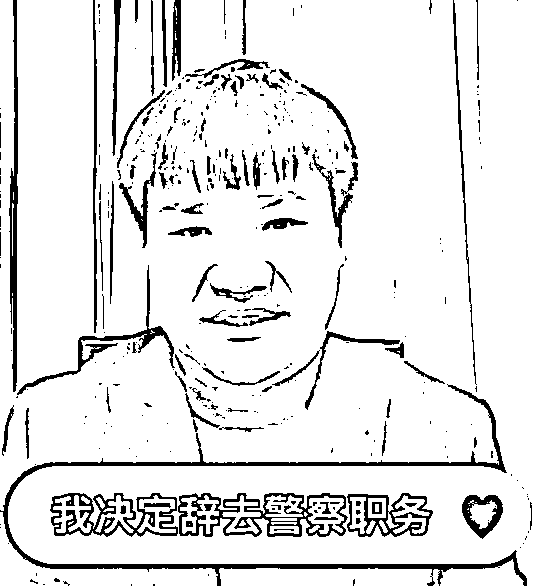
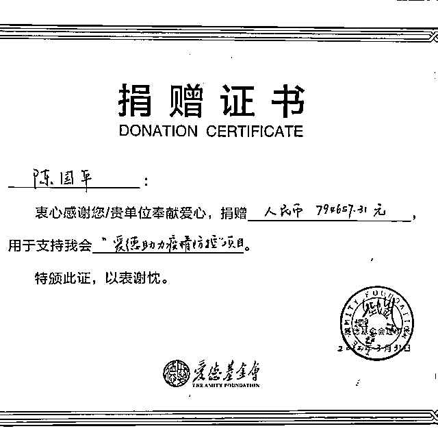

# 曾刷屏全网的他突然宣布：辞职！

> 原文：[`mp.weixin.qq.com/s?__biz=MzIyMDYwMTk0Mw==&mid=2247533199&idx=2&sn=5aeb9a3c91e8b3c9be8341745120a978&chksm=97cb89b7a0bc00a18e58b54ee145b332047e95af01c3505a61e691acd7bc25e4b59987be1569&scene=27#wechat_redirect`](http://mp.weixin.qq.com/s?__biz=MzIyMDYwMTk0Mw==&mid=2247533199&idx=2&sn=5aeb9a3c91e8b3c9be8341745120a978&chksm=97cb89b7a0bc00a18e58b54ee145b332047e95af01c3505a61e691acd7bc25e4b59987be1569&scene=27#wechat_redirect)

4 月 8 日，网名“反诈民警老陈”的陈国平发布视频，称自己决定辞去警察工作，专注公益事业。

据封面新闻报道，据了解，老陈辞职疑因与 3 月 27 日在个人账号进行公益直播时，收到 100 万的巨额打赏有关。

尽管老陈当晚就宣布**“直播的所有收入（包含个人部分和平台部分）将用于公益用途，流程完成后将向大家公示。”**但关于“公职人员直播开打赏”的质疑，并未随着老陈晒出的捐款证书而停息，反而越演越烈。

（老陈直播打赏部分捐款捐赠证书）

对此，记者于 4 月 8 日中午第一时间联系到老陈。他向封面新闻记者证实，确实有人向单位举报：**“很多黑粉骂我，到单位举报。考虑到给单位、给组织添了不少麻烦，我决定辞职，以后不再运营‘反诈警官老陈’号，不再以警察身份形象出现。辞职后，我将用‘老陈生活号’继续进行公益宣传，继续为群众办实事，我的初心永不变。”**

**据九派新闻报道，陈国平说，自己直播宣传反诈受到大量关注的同时，也受到了不少质疑。他利用自己的私人账号开通打赏功能遭到了实名举报。有网友认为，他作为公职人员不应该采取这种方式收取资金。**

**在几次遭受质疑之后，陈国平决定辞去警察工作，以个人身份开展公益宣传。**

**做出这个决定时，他瞒着身在农村的父母，只告诉了妻子，**“我性格比较犟，做了决定就没人能说服我，我妻子也了解我，愿意支持我的决定。”****

****陈国平在自己发布的视频中提到，今后将以个人身份开展公益宣传。**“老陈还是那个热心的老陈，只是以后打招呼的方式会变化，‘你好，我是反诈公益主播老陈，请问您是什么主播’。”******

 ******[`v.qq.com/iframe/preview.html?width=500&height=375&auto=0&vid=b33319nsi2m`](https://v.qq.com/iframe/preview.html?width=500&height=375&auto=0&vid=b33319nsi2m)****** 

******来源：封面新闻、九派新闻、潇湘晨报******

************

******← 向右滑动与灰产圈互动交流 →******

************