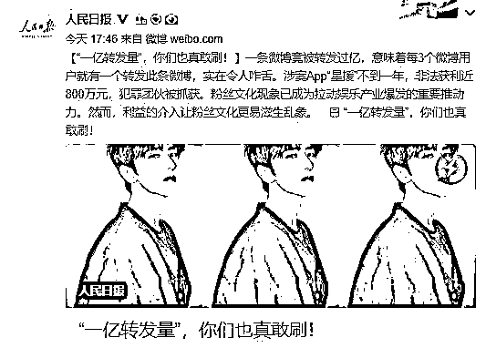

# 收手吧，水军

> 原文：[`mp.weixin.qq.com/s?__biz=MzIyMDYwMTk0Mw==&mid=2247533199&idx=4&sn=110abc6228ffadef6aa948a229e47ddc&chksm=97cb89b7a0bc00a145606b913760bf1ce1cd5879572c3e4d4a75c0d9352b8f103de6ca4ea26e&scene=27#wechat_redirect`](http://mp.weixin.qq.com/s?__biz=MzIyMDYwMTk0Mw==&mid=2247533199&idx=4&sn=110abc6228ffadef6aa948a229e47ddc&chksm=97cb89b7a0bc00a145606b913760bf1ce1cd5879572c3e4d4a75c0d9352b8f103de6ca4ea26e&scene=27#wechat_redirect)

话说近期出现了一件挺魔幻的事。

某影视剧还没播呢，点评就先出来了。

原因是技术出现一点问题，该剧的上映时间临时延迟了一小时，但是水军们不知道。

所以出现了剧还没播，评分区就有网友煞有介事地评价起故事情节和叙事节奏，并且呈现出一星、五星混战的态势。

△ 图源网络

这就是近期人民日报痛批了**影视作品过度营销、操纵水军控评**的问题。

在多年的冲浪生涯中，小珊发现，我们总是会被热度高的信息吸引，比如点赞最多的视频，转发最多的文章，这就像吃饭的时候，我们倾向选择门前大排长龙的饭馆一样。

当我们在网上看到某个艺人被不少人猛夸“人美心善”，心里不禁会对其产生一定的好感。

当看到某明星被骂“素质低下”，也难免有了一探究竟的冲动……

**不知不觉陷入娱乐圈“水军”的“推广”圈套。**

**而对于水军们来说，只要钱到位，啥话都能说。**

△ 图源网络

网络水军的刷评现象并仅限于影视剧，基本上在各行各业里面都能看到这些人群的存在。 

比如，电商、生活服务平台屡禁不止的刷单、刷评。

刷单的本质是为一个**电商店铺做假数据**，从而影响人们的选择、引导人们购买。

一开始，商家试图通过“**好评返现**”带来购买用户的好评，但后期“好评返现”像是脱缰的野马在良性市场横冲直撞，最后消费者把产品买回去后，发现根本不是那回事，返现也不为好评买单了。

△ 网友评论截图 

于是商家开始**刷好评、删差评**。

这下，越来越多消费者买到了与描述不一致的商品，渐渐的，**一批与卖家秀严重不符的买家秀常常霸占热搜头条。**

△ 图源网络

当然除了给自己买好评，也有**给对手买差评**的。

这类水军主要活跃在**电商及外卖餐饮平台**，通过**刷抹黑评论来打压竞争店铺**，价格在 1000 元/30 条左右。

△ 图源网络 

还有会玩的成立“工作室”，将水军行为包装成**舆情分析、负面处理、危机公关、SEO 优化、网络优化**等天花乱坠的名称，但干的活都是一样的。

最著名的例子就是 18 年蔡徐坤的过度营销了，彼时蔡徐坤发了一条微博，转发人次超过了一亿。

那时候微博月活用户才 4 亿，也就是说，如果这个数据真实，差不多 4 个人就有一个转发。

很快，人民日报发文批判：**一亿转发量，你咋不上天呢？**

 △ 图源网络

之所以会有这么多转发量，并不是因为他的脑残粉多，而是刷出来的。

他们用到了一个叫星援的 APP，通过这个 APP，一个账号能绑定几百甚至上千个小号，在里面能够实现批量转发操作。

当然，守护世界最好的坤坤是需要充值的。在里面消费时需要用到一种叫“爱豆”的东西，充值 100 爱豆需要花费一块钱。

而为这样转发量提供便利的星援，公司只有 4 个人。

尽管公司人数不多，但是业务相当暴利。他们凭借两个打榜软件，在短短一两年间收入就达到了 700 万。

他们一般会编好统一或者相似的文案，然后全网分发。有的是用机器人发帖，也有的是人肉发帖。

一般来说，明星这些数据越高，指标越好看，也就证明他的粉丝购买力越强，那安排他们出演角色又或者代言产品，会得到更好的回报。

有影视业内人士透露：有流量演员参与的影视作品出现刷分控评的现象往往是比较多的，“水军”其实可能都没看过这部剧，评论区甚至会出现一些一模一样的评论。

这也导致了一旦有流量明星参演，影视剧的评分就会变得很“邪乎”。

咱就是说，商家们刷评，不论好评还是差评，**无疑也都会增加商家成本，陷入恶性竞争的循环。**

针对此类乱象，监管层面不乏靶向治理动作，无论是**《网络信息内容生态治理规定》、《互联网用户公众账号信息服务管理规定》、《互联网跟帖评论服务管理规定》**等规定，还是**针对饭圈的清朗行动**，都将箭头对准了此类乱象。

在 2022 年“清朗”系列专项行动中，**“打击流量造假、黑公关、网络水军”**就作为重点任务之一。

小珊想说，水军控评行为涉及的不只是流量造假，更是对公平竞争秩序的破坏，既损害了观众知情权，也影响了各行业的健康发展。

本质上来说，就是欺诈消费者。

为落实国家网信办关于“清朗”专项行动的部署和要求，微信平台在此前就对网络水军出手，**重点****整治网络黑公关乱象，严格落实主体责任，及时处理了相关违规内容及帐号**。

**真真假假、假假真真**，本来网络信息就已经相当繁杂，现在水军又在不断制造垃圾，使得获取真实信息的成本变得愈加高昂，逼得消费者只能越来越聪明，否则一不小心就会掉入水军们的营销陷阱。

总之就是**卷来卷去会卷到自己，违心违德还会违法**，水军们，收手吧。

来源：微信珊瑚安全

← 向右滑动与灰产圈互动交流 →

