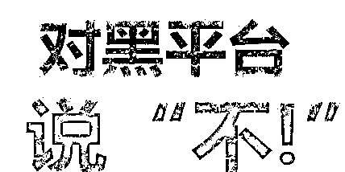

# 亲历者自述：我是这样搞非法集资，骗走别人的血汗钱的！

> 原文：[`mp.weixin.qq.com/s?__biz=MzIyMDYwMTk0Mw==&mid=2247533199&idx=5&sn=a5c853fce7508a8de0df6acc3fd2c94e&chksm=97cb89b7a0bc00a1512423a4002eff177e5293b80baa32cadb8443f4e0c2be3c86677d819f36&scene=27#wechat_redirect`](http://mp.weixin.qq.com/s?__biz=MzIyMDYwMTk0Mw==&mid=2247533199&idx=5&sn=a5c853fce7508a8de0df6acc3fd2c94e&chksm=97cb89b7a0bc00a1512423a4002eff177e5293b80baa32cadb8443f4e0c2be3c86677d819f36&scene=27#wechat_redirect)

在理财投资时

有人自以为稳操胜券最终颗粒无收

有人听信亲朋到头来南柯一梦

更有人毕生积蓄化为泡影

下面，带你从相反的角度

**听一听非法集资发起人的声音**

**小甲**

**“我的财富管理公司是没有金融牌照的”**

2013 年我到北京大学上了 EMBA，上学后我觉得 P2P 理财已经不能适应当时的形势了，当时比较流行财富公司。在北大上课和同学交流，觉得股权投资比较有前景，我就开始想做股权投资了，后来就成立了一家财富管理公司。

公司的工作流程是，我自己去外面寻找有投资前景的项目（公司），并经过实地考察。我觉得合适就和对方商定估值，随后签订增资扩股、股权投资、天使投资协议。

也就是说，我以一定金额的钱购买标的公司一些股权，对方将标的股权通过工商部门转让给我个人或者我控制的几家有限合伙企业，然后由我公司将标的公司的股权包装成理财产品，通过销售团队卖给社会上特定的老百姓，向老百姓承诺按期支付本金和一定的收益，年化收益从 10%至 15%不等，到期还利到期还本金。我公司还与客户签了一份回购函，承诺理财到期回购。

这些年我一共投资了 11 个项目，只有两三个项目赚钱了，其余的项目都有亏损。我认识到自己的行为错了，害了很多人，**这几年来借新还旧利滚利欠了好多钱，到现在还有六七个亿没有兑付投资人。我都被吓坏了，现在非常后悔。**

**小乙**

**“我非常清楚自己的行为会导致投资人的损失”**

我毕业于澳大利亚阿德莱大学，后来到某财富管理公司担任企划部负责人。公司项目经理将要做的项目基本资料交给企划部，我们就根据提供项目的基本资料按照要求制作宣传项目的海报、宣传册等材料，制作好材料交给印刷厂印刷，然后将这些材料交给我们公司的销售分部；另外企划部还需要维护公司的微信公众号，在公众号上发布与我们行业有关的新闻。

我们公司最早是业务员向社会公众发传单、打电话推销公司产品，有一段时间还在电视台登了广告。我们企划部会在公司的微信公众号上发布已经上线的项目合作方的跟踪报道，例如合作方公司获得的荣誉之类的。企划部还要组织宣传活动，例如制作披萨、观影等，还组织客户进行游艇活动，游艇上也印有我们公司的标志，我们部门就负责落实场地、组织制作海报，然后告知各个分部，由业务员联系客户来参加活动。

**我们公司没有金融牌照。直到案发，我的客户大概有 4000 万左右资金没有兑付。到现在为止，我都非常清楚非法吸收公众存款的行为会导致投资人的损失。**

**小丙**

**“我无法面对投资人和信任我的亲戚朋友们”**

我刚入职的时候是公司的理财经理，做了一段时间就开始带团队了，一是做自己的业务，二是培训我下面的员工。因为所带团队分部业绩不达标，公司领导就把它给关掉了。之后，我当上了独立客户经理，具体就是从事理财产品的销售。

我会跟客户说我们公司是做股权投资的，是投资实体项目。客户一般会问具体有哪些项目，我就会根据公司的项目产品推荐给客户，并将公司做的 PPT 发给客户，客户根据需求选择产品。客户和我确定好产品后，就签订合同也就是合伙协议，预期年化收益率 10%-12%，还会出具回购确认函。**但其实我们公司并没有金融行业许可证。**

到现在，我的客户没有兑付的有 39 个，未兑付金额是 2000 万左右。其中有 300 万是我把亲戚的钱放在一起购买的理财产品。**公司现在出现了这么大的问题，我现在真的无法面对我的投资人和这些信任我的亲戚朋友。**

**小丁**

**“我太轻易就相信了公司”**

我是 2014 年进公司做业务员的，主要工作内容就是负责销售公司的理财产品。客户信息由团队领导提供。

公司没有对业务员进行系统培训，只是跟我们说在公司没事的时候，可以用微信搜索附近的人，发展客户。另外，公司还会让我们发展身边的亲戚、朋友，多去外面参加活动，拓展客户资源。

公司的会客厅挂着股权交易的金融牌照，领导跟我们说每个项目都在工商部门备案的，我当时就相信了。另外，我看到电视台经常播放我们公司的广告，所以我一直觉得公司是有资质的。但是现在想想，公司在吸收资金的资质方面其实是存在问题的。

早期的客户是通过打电话、发传单、开门店吸引过来的。**我现在手上未到期的客户有 20 个，未兑付的资金总额是 700 万。**另外，我自己购买了 15 万公司的理财产品，亲戚朋友也买了 12 万，这些都没有兑付，只是拿到一些利息。**如果早知道公司会出现问题的话，我是不会投资的。**

听了他们的讲述，相信大家会有很深的感触。在生活中我们不仅要当心投资理财陷阱而且要理性的寻找工作，参与非法集资风险自担，进行非法集资活动成为非法集资协助人将会受到法律的制裁，希望看到文章的朋友远离非法集资陷阱，理性选择投资渠道。

来源：宜昌地方金融，利箭在行动

← 向右滑动与灰产圈互动交流 →

