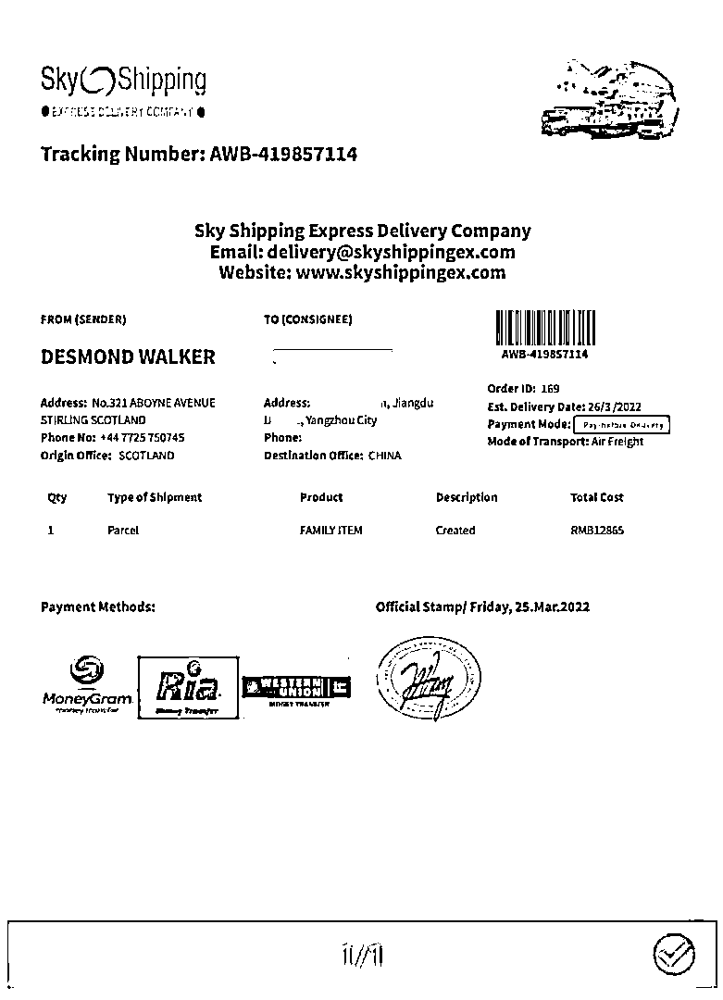

# 扬州小伙恋上“英国妹妹”，一声“哥哥”被骗 7000 元

> 原文：[`mp.weixin.qq.com/s?__biz=MzIyMDYwMTk0Mw==&mid=2247533199&idx=8&sn=5eea6d08941cc8f61e2aea6bca98abcd&chksm=97cb89b7a0bc00a1885edb33a9865c8033dc0102c1b29fcd3dbe262726bd620d9144ed5b9d5d&scene=27#wechat_redirect`](http://mp.weixin.qq.com/s?__biz=MzIyMDYwMTk0Mw==&mid=2247533199&idx=8&sn=5eea6d08941cc8f61e2aea6bca98abcd&chksm=97cb89b7a0bc00a1885edb33a9865c8033dc0102c1b29fcd3dbe262726bd620d9144ed5b9d5d&scene=27#wechat_redirect)

最近

扬州江都的小董

遇到了烦心事

因轻信网上结识的

“英国妹妹”

被骗了 7000 元

**案件回顾**

小董称，自己平时喜欢上网，3 月 22 日通过手机看新闻时，扫了扫跳出的二维码广告，安装了一款“国际交友”APP。通过此 APP，小董认识了一个自称在伦敦医院工作的“英国女孩”。尽管使用不同的语言交流，但 APP 内有翻译功能，两人聊的很投机。几天后，“英国女孩”以方便沟通为由要求添加微信好友，小董很开心地同意了。又通过微信聊了几天，两人的称呼逐渐亲昵起来。

25 日晚，“英国女孩”告知小董：近期她在加拿大旅行，随后要来中国考察，为了不耽误行程，先期寄了个装有价值 200 万美元文件的行李箱到北京。然而，由于其身处国外，没办法支付相关费用，导致行李箱即将被退回。她希望小董能帮忙垫付费用，让快递公司将行李转寄至其住处；并承诺：只要小董能帮忙保管一段时间，就能得到双倍快递费的报酬，随后发来了快递公司工作人员的微信二维码。

添加成功后，工作人员告知小董：需要支付 7000 元的费用才能转寄行李。随后，小董通过支付宝扫码、手机银行转账的方式分两次付了款，并且第一时间将付款成功的消息告知“英国女孩”。

但是两天后，快递工作人员告知小董：由于行李箱内存有大量现金被暂扣，需要支付 10000 元的罚款。“英国女孩”得知后，哀求小董继续转款。可是小董身上已经没有钱了，对方就要求其通过网络借钱，并承诺：行李箱到达后，箱内的 15 万美元现金全都送给小董。小董确实拿不出钱来，“英国女孩”却频繁催促其借钱转款，小董这才想起之前接受过的反诈宣传，怀疑被骗，随后报了警。

目前，案件正在进一步办理之中。

**友情提醒**

**网络交友要提高警惕，不要轻易相信对方的说辞，对身份不明的好友不要透露自己的个人信息，切莫被“感情”冲昏头脑，更不能抱着“虚荣心”去交友。如果涉及钱财问题，不轻信对方任何说辞、借口，及时说不。**

**来源：扬州网警、江苏网警**

****

**← 向右滑动与灰产圈互动交流 →**

****