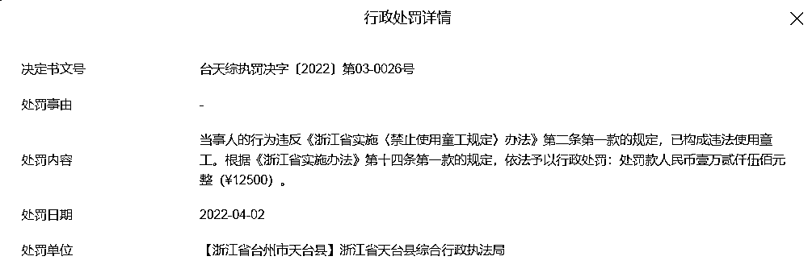
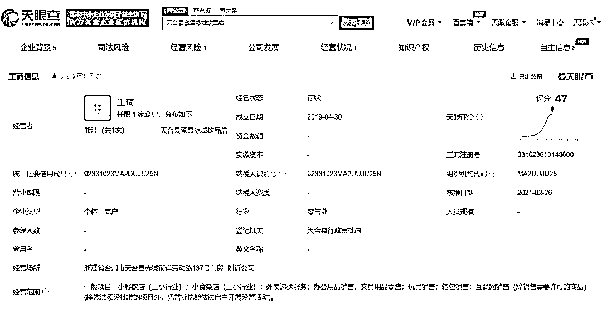
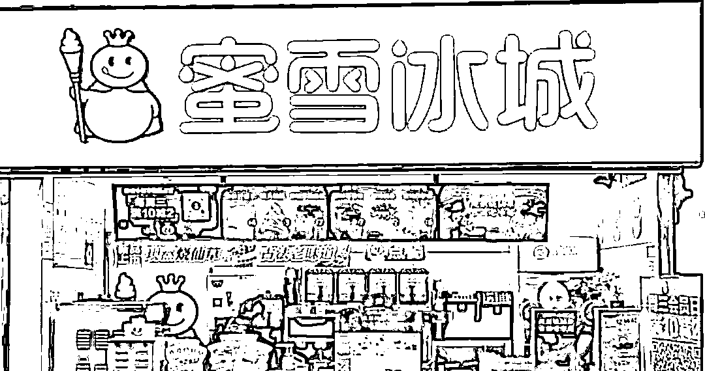
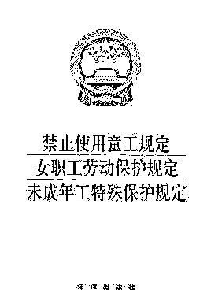
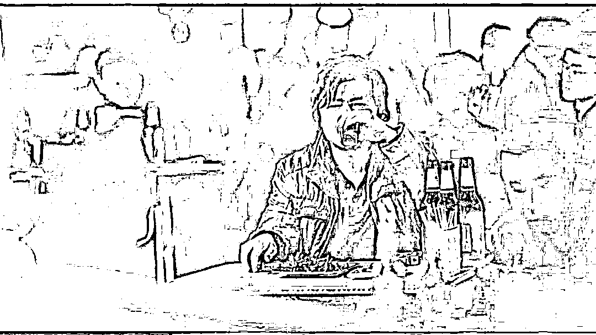
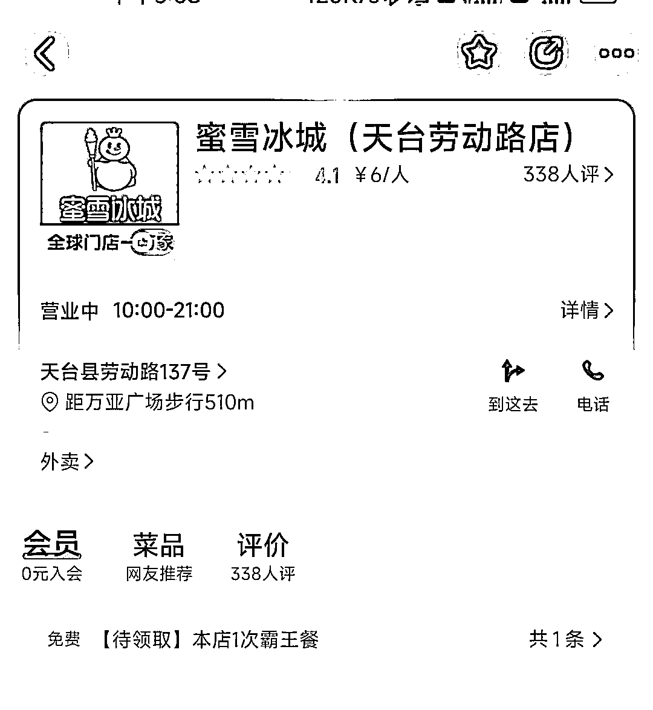

# 童工？蜜雪冰城一店长被罚：15 岁的她打了谁的脸？

> 原文：[`mp.weixin.qq.com/s?__biz=MzIyMDYwMTk0Mw==&mid=2247533264&idx=2&sn=83cb20f25754d04b6f5f8e566f8761c9&chksm=97cb89e8a0bc00feaa280e1b142221f100163e2832cf632497a4abeb356e05ef05e478be8ef4&scene=27#wechat_redirect`](http://mp.weixin.qq.com/s?__biz=MzIyMDYwMTk0Mw==&mid=2247533264&idx=2&sn=83cb20f25754d04b6f5f8e566f8761c9&chksm=97cb89e8a0bc00feaa280e1b142221f100163e2832cf632497a4abeb356e05ef05e478be8ef4&scene=27#wechat_redirect)

这个故事的后续我们知道：小女孩实在走投无路，去街上卖火柴，一直卖到大年夜的晚上，她想奶奶了......

4 月 2 日，浙江省天台县蜜雪冰城饮品店新增一则行政处罚，处罚事由为违法使用童工，被浙江省天台县综合行政执法局罚款 1.25 万元。

我国《劳动法》、《未成年人保护法》均有禁止使用童工的相关规定，《禁止使用童工规定》明确规定童工年龄标准为不满 16 周岁，使用童工罚款标准为每使用一名童工每月处 5000 元罚款。

按照每月罚款 5000 元的标准，这个小女孩应该在蜜雪冰城工作了才不到三个月。

被处罚的老板称，**现在他也不知道小女孩去哪里了，无家可归又没有收留的地方，想想都有点担心…...**

蜜雪冰城的老板应该是一个加盟店的个体商户，到现在开业三年了，也没什么处罚。

**可能老板也没想到，自己的第一个处罚会是和自己的善心有关。**

**但这个新闻，比俄乌战争、上海疫情看得都难受很多。**

让我破防。

15 岁的女孩、被遗弃、童工加到一起，我很难不同情蜜雪冰城的这个店主以及这个女孩。

[`mp.weixin.qq.com/mp/readtemplate?t=pages/video_player_tmpl&action=mpvideo&auto=0&vid=wxv_2345214552621137921`](https://mp.weixin.qq.com/mp/readtemplate?t=pages/video_player_tmpl&action=mpvideo&auto=0&vid=wxv_2345214552621137921)

来源：中国新闻周刊

**-1-** 

**消失的妇联和女权**

法律有时候总是在一些不起眼且莫名其妙的地方发生效力。

据了解，这个女童今年 15 岁，因为辍学出来打工，就被天台县蜜雪冰城门店收留了。

**店长说，女孩是被家庭抛弃的孩子，然后出来找工作，当时看一个孩子这么可怜出于自己的一些善意就给了她一份工作，但确实做错了。**

无论怎么说，雇佣童工都是不对的。

对雇佣童工单位进行处罚，是没有问题的，不这样以后会有更多人“看人可怜”给个工作的名义雇佣童工。

但掺杂了另一个社会因素，即老板出于善意帮扶才雇佣该童工。

**蜜雪冰城把这孩子关进小黑屋了吗？没有。**

**给这孩子套上锁链了吗？没有。**

**不给这孩子发工资吗？也没有。**

**一个 15 岁的孩子，有没有能力决定这件事？有。**

**所以这个自由契约伤害谁了？没有。**

可这能说明童工存在的合理性吗？并不能。

**店主违法了，请问相关部门的人失职没有？**

**女孩想有尊严地活着，难道只有通过捡废品？**

那些童星、童模算不算童工？为何不算？

农村家的孩子，哪个没有帮过农，咋没人管？

为什么没有一套行之有效的救助体制，帮助这个女孩完成义务教育？反而让女孩不得不出来打工？

**这个事件的问题并不出在童工的法律规定上，而是出在社会保障体系上。**

此时确实的妇联和女权呢？当地的保障体系呢？

**解救童工不仅仅是让其回家，更要为他们安排一条合适的道路。**

如果涉事店主说的是真的话，如何更好地帮助这个辍学女孩，才是一个更大的问题。

万不能一罚了之，说难听点这就叫“管杀不管埋”？ 

希望公安局能找到女孩查明原因，找到监护人并进行处理。

如果监护人无法抚养希望政府能有后续安排，不应让一个 15 岁女孩没有工作地在城市里流浪。

**找到这个孩子，不管回归家庭或者回归学校。**

**-2-** 

**切实的方案**

知乎 @墨昭 Difenrir 提供了两个方案，个人以为还是很有现实指导意义的。

**一、勤工俭学**

通过勤工俭学，让女孩合法打童工。

需要做到：

1、让女孩继续学业；

2、与民政、社区、学校协商，成为勤工俭学单位（非生产经营性劳动）；

3、让女孩在单位勤工俭学。

4、提供住宿、食物、薪酬。

**二、个人助学贷款**

1、让女孩继续学业；

2、与民政、社区、学校协商，提供个人助学贷款，读书时免息，自毕业起开始付息偿还。

3、每月汇报学习成绩，每月获得个人助学贷款。

其他的贫困助学金、直接金钱援助不可取，做过都懂——很容易会帮废一个人。

**-3-** 

**善心应有善报** 

电影《我不是药神》里有一段剧情： 

救人，是违法的；

有能力不救人，良心过不去。

**我们该庆幸她遇见的是蜜雪冰城的这位老板，而不是什么黑心骗子。** 

有人遇上骗子，一辈子就毁了，比如生了 8 个孩子的“丰县铁链女”。 

**我觉得这个社会，应该让这件事情有更好的结局。**

女孩有人管，奶茶店老板的爱心不会白费。

罚款？

老板用善心替当地社会保障体系擦屁股，结果反而挨了一锤，是这个意思吗？

**你看看这些有热血的人会不会把他家奶茶喝到断货？**

**为众人抱薪者，不可使其冻毙于风雪。** 

来源：昌南大队长

← 向右滑动与灰产圈互动交流 →

