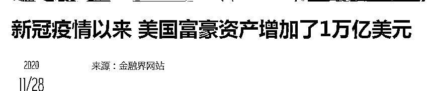
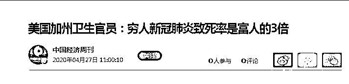

# 美国驻上海领事馆的外交官们，走好不送！！

> 原文：[`mp.weixin.qq.com/s?__biz=MzIyMDYwMTk0Mw==&mid=2247533264&idx=3&sn=5199601437bb8280f3d6c63fc5ca72d4&chksm=97cb89e8a0bc00fec8183f5287231b0a869f5e4debdbc001ce260afa23b15f7f6185426ac883&scene=27#wechat_redirect`](http://mp.weixin.qq.com/s?__biz=MzIyMDYwMTk0Mw==&mid=2247533264&idx=3&sn=5199601437bb8280f3d6c63fc5ca72d4&chksm=97cb89e8a0bc00fec8183f5287231b0a869f5e4debdbc001ce260afa23b15f7f6185426ac883&scene=27#wechat_redirect)

下午看到美国驻华大使馆发了个很不厚道的声明：

“包括美国驻华使团的人员和他们的家属在内的海外美国公民的安全与保障是美国最高等级的优先事项。

铭记这一优先事项，鉴于新冠病例激增以及中华人民共和国应对措施带来的相关限制的影响，美国国务院于 2022 年 4 月 8 日批准了非紧急美国政府雇员以及紧急和非紧急美国政府雇员的家属**从美国驻上海总领事馆领区自愿撤离**。”

“鉴于新冠病例激增以及中华人民共和国应对措施带来的相关限制的影响，”美大使馆恬不知耻到何种程度了？我赶紧查了下美国最新的疫情数据：

截止今天，美国累计确诊 8200 万，累计死亡 101 万。美国人口 3.27 亿，这么算下来，美国四分之一的人感染过新冠，千分之三的人死于新冠。

中国的疫情数据，截止今天累计确诊 49.7 万，累计死亡是 1.4 万。

特别说明的是中国的疫情数据包含了台港澳，不是差生香港和台湾拖后腿，中国的疫情数据还要好。

中美疫情数据一对比，美国驻华大使馆有什么逼脸发这个破声明？

佩洛西发言人 4 月 7 日在推特上表示，佩洛西新冠了。该发言人还特别补充称，“一个原定由佩洛西带队的国会亚洲访问团将被推迟”。这下，佩洛西的孝子蔡英文给佩洛西打洗脚水的机会没了。

此前，佩洛西还和拜登跳了个愉快健康的贴面舞呢。

近日在白宫和国会暴发聚集性疫情，大量国会议员和官员于近期感染，其中包括华盛顿特区市长穆丽尔·鲍泽、乔治城大学校长、司法部长贾兰德和商务部长雷蒙多都中招了。

美国的政治精英们纷纷感染新冠，新冠疫情在美国的广度、深度和力度可见一斑。

更可笑的是，美国总统拜登 5 日曾与佩洛西同处一室，跳了贴面舞，但根据美国疾控中心规定，拜登并不是佩洛西的“密切接触者”。这就是美国的疫情防控措施，真的是一逼屌遭、一头雾水的防控政策啊。

美国的防控拉垮，那是美国的事，中国管不了。但美国人在中国，必须服从中国的防控措施。在疫情防控方面，“外交官是没有特权的。”

对此，两年前华春莹就说过这个问题了：“病毒面前人人平等，外交官享有豁免权，但是病毒不会给外交官豁免权。”**在中国的美国外交官必须遵守中国的防控政策，上海领事馆的美国雇员必须遵守上海的防控措施，这是毋庸置疑的。**阴阳怪气地发个声明，干扰不了中国坚定的“清零”政策。

在中国，讲究的是人命关天，在美国讲究的是金钱关天，正如列宁所说：“为了赚钱，资本家可以出卖绞死自己的绳索。”再说美国新冠死的主要是穷人，富人比较难死。 

美国社会广泛存在这种心态：“我需要赚钱养家糊口，我的新冠不一定要我的命，但是如果没有钱支付房贷，车贷会让我当场死亡。”在这种心态下，中美间的防控不会在一个标准上的。在上海领事馆的美国人受不了中国的防控规矩，心情可以理解，但绝不会支持你，妥协于你。

你想走，尽管走，但走也得遵守中国的防控政策。

最后必须说一下，中国的防疫，最矮的城市放西方也是将军。上海当下的疫情再糟，也比你美国的情况好得多，回去后不要后悔哦。。

← 向右滑动与灰产圈互动交流 →

