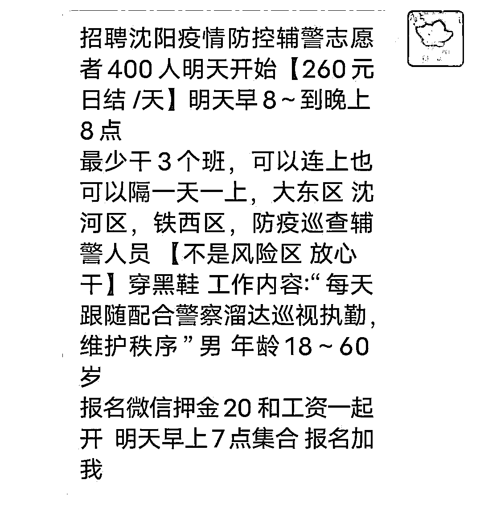
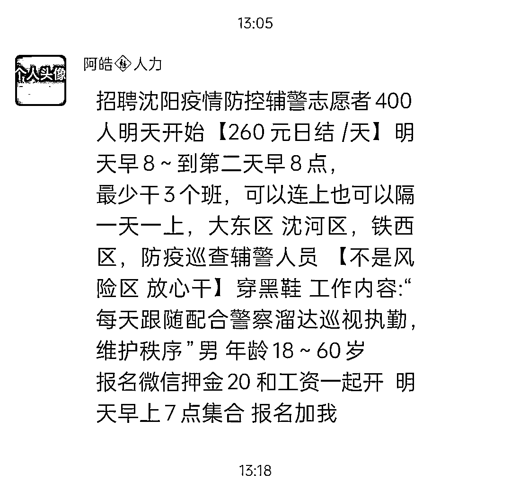
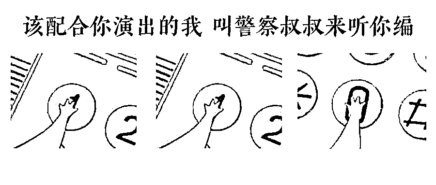
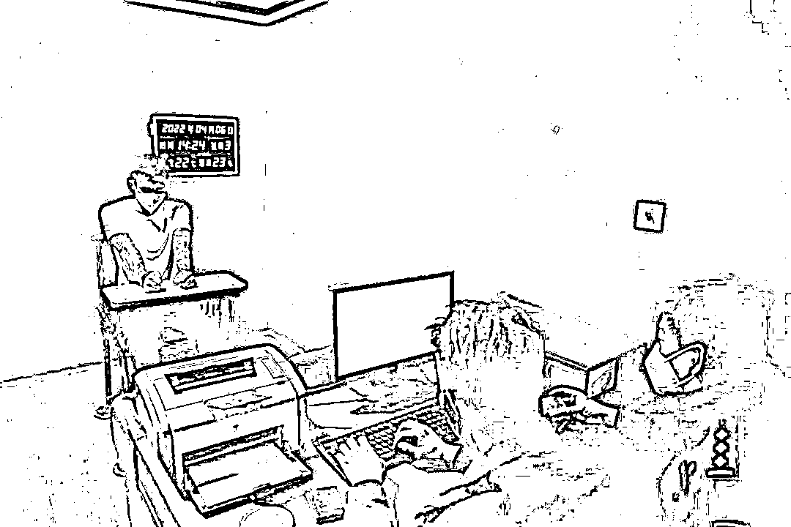

# 招募防疫志愿者,260 元日结/天,速来被骗！

> 原文：[`mp.weixin.qq.com/s?__biz=MzIyMDYwMTk0Mw==&mid=2247533264&idx=4&sn=4797d9ed332bb316cc64e09da281d92e&chksm=97cb89e8a0bc00fe46b21f7842093bcf22dcaf3a2de7d143d4b8d1060210d1c78b5733665a98&scene=27#wechat_redirect`](http://mp.weixin.qq.com/s?__biz=MzIyMDYwMTk0Mw==&mid=2247533264&idx=4&sn=4797d9ed332bb316cc64e09da281d92e&chksm=97cb89e8a0bc00fe46b21f7842093bcf22dcaf3a2de7d143d4b8d1060210d1c78b5733665a98&scene=27#wechat_redirect)

招聘沈阳疫情防控辅警志愿者 

260 元日结/天 

报名从速 

押金 20 元

在微信群里看到这样的消息 

你会动心吗？

正愁房租水电没钱交 

天下掉下个“粘豆包”

押金才 20 元

真是骗人的也不怕

嗯嗯 

骗子也是这么想的

近日，沈阳市公安局大东分局接到居民赵女士报警，她在微信群看到报名参加抗疫志愿者，结果缴纳了 20 元保证金后被对方拉黑。20 元，虽然金额不多，但是不法分子假借防疫之名行骗，这可不是小事。

大东分局反诈中心立即开展调查，很快查明了违法人员的身份和落脚点。4 月 6 日，在沈河区某公寓内将违法人员王某某（男，22 岁，抚顺市人）抓获。

经审讯，王某某交代，其通过微信群发布虚假招聘信息，骗取 70 余人保证金共计 1400 余元，该人对上述违法事实供认不讳。

[`mp.weixin.qq.com/mp/readtemplate?t=pages/video_player_tmpl&action=mpvideo&auto=0&vid=wxv_2342920333546242049`](https://mp.weixin.qq.com/mp/readtemplate?t=pages/video_player_tmpl&action=mpvideo&auto=0&vid=wxv_2342920333546242049)

上面这种骗局，门槛低到了极点，

但不管什么事，只要和疫情联系在一起，大家就会高度关注，

而骗子也瞅准了时机，借助疫情实施诈骗。

比如：2020 版本的骗口罩，

2021 版本的新冠特效药，

2022 版本的[**“社区疫苗中心”申请加好友**](http://mp.weixin.qq.com/s?__biz=MzIyMDYwMTk0Mw==&mid=2247530365&idx=7&sn=07b656f05e4e06eb3992802fd4e087fd&chksm=97cbbc45a0bc3553f7e25fc51dce271748765829917af8636c17482401fc6426e1c0a20494f9&scene=21#wechat_redirect)，**["你的快递检出阳性，即将销毁"，](http://mp.weixin.qq.com/s?__biz=MzI5NTI2NzY5Mw==&mid=2247518408&idx=2&sn=c7bb7e1519bc023c34adf2305b249984&chksm=ec54f4cadb237ddc529438fc3976a6314665fbf3fea707f7e32860888a25a81d28ce9a5a6a32&scene=21#wechat_redirect)****“**[**涉嫌发布涉疫情不当言论**](http://mp.weixin.qq.com/s?__biz=MzIyMDYwMTk0Mw==&mid=2247533039&idx=4&sn=1c464a053dc60c8d50582267dac5640d&chksm=97cb8ad7a0bc03c19e3dc492e92d575197b0294b3d781567b3534e098610b974ef9e72cd83bc&scene=21#wechat_redirect)**请配合警方的调查”**

**疫情会让人们产生焦虑和恐惧，****看到跟疫情有关的任何信息，**

**都会带着各种情绪来判断，**

**这时，即使诈骗话术再低劣、再漏洞百出，也会变得威力异常。** 

****我们接触的每一种骗术，都会痛斥骗子无耻，但更重要的是，我们应该看懂人性弱点，关注最新骗术，这样才能给自己多一层保护。****

来源：沈阳公安反电信网络犯罪查控中心

← 向右滑动与灰产圈互动交流 →

