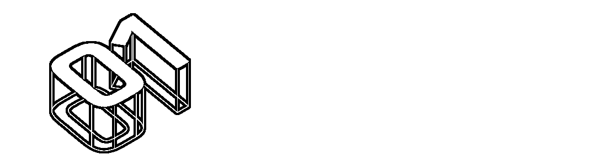
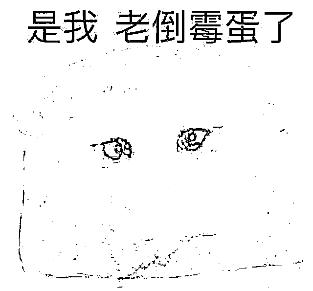
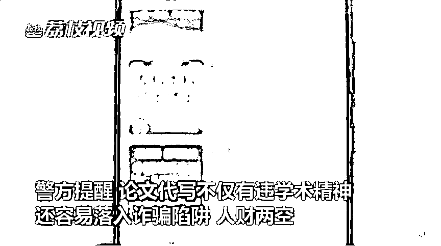
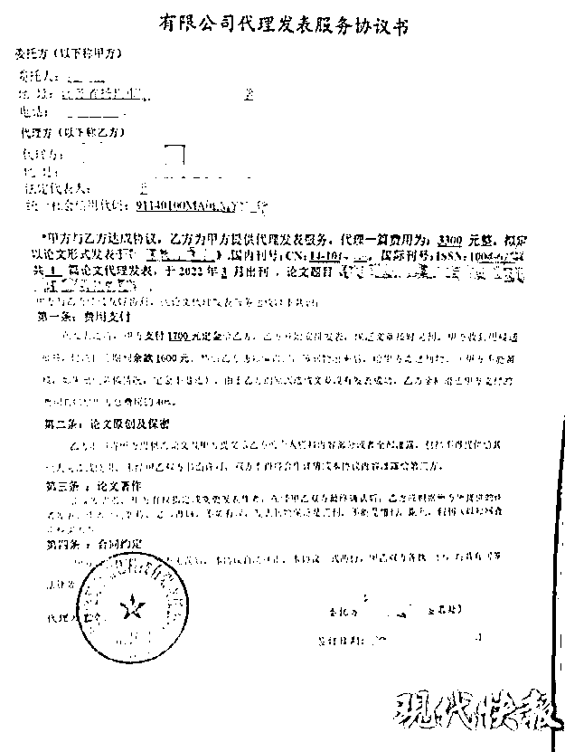
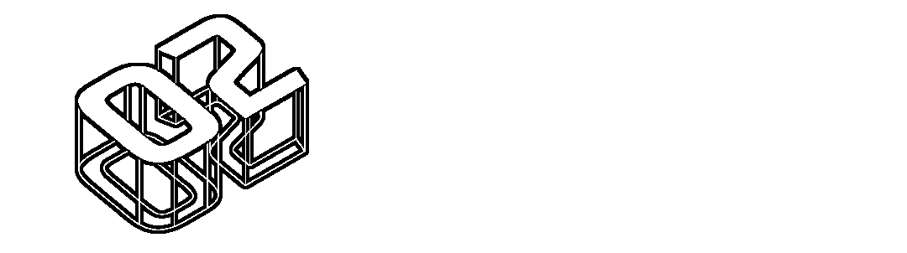
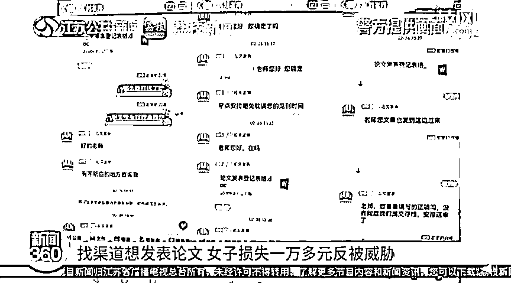
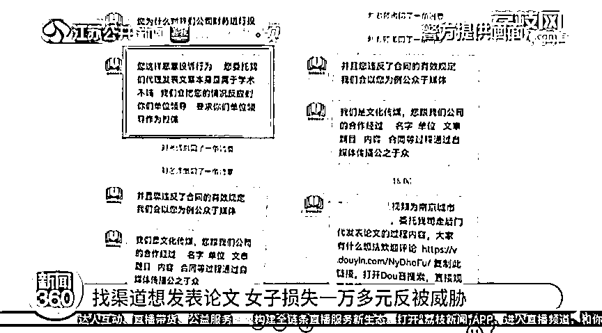
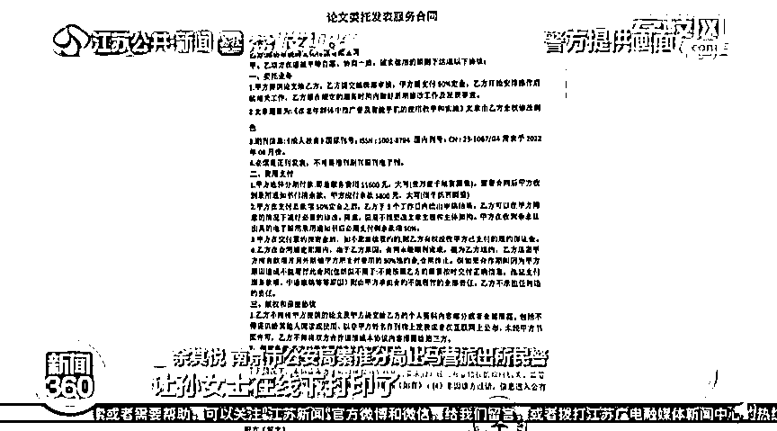
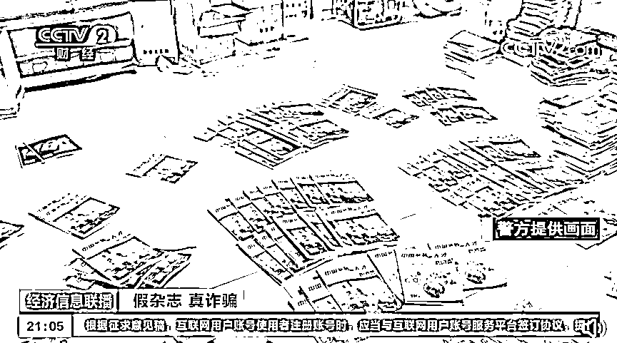
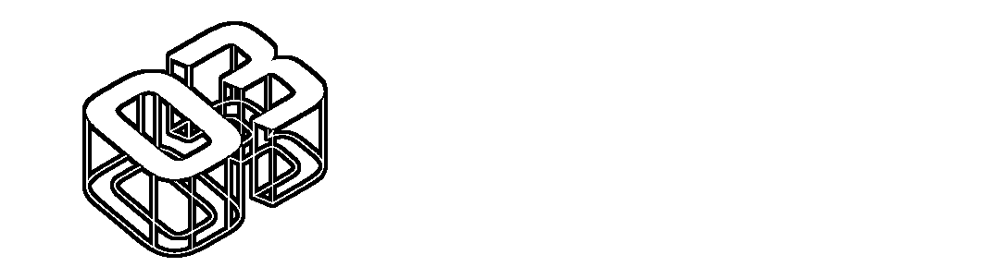

# 上万块付完就拉黑，为何他们被坑却不敢声张？

> 原文：[`mp.weixin.qq.com/s?__biz=MzIyMDYwMTk0Mw==&mid=2247533264&idx=5&sn=aee8d99c3ebdafd731183c1f38db29a4&chksm=97cb89e8a0bc00fe2ea933f50cf2ffef410a75277c2a576df35fccd5aff439d2368fb2861843&scene=27#wechat_redirect`](http://mp.weixin.qq.com/s?__biz=MzIyMDYwMTk0Mw==&mid=2247533264&idx=5&sn=aee8d99c3ebdafd731183c1f38db29a4&chksm=97cb89e8a0bc00fe2ea933f50cf2ffef410a75277c2a576df35fccd5aff439d2368fb2861843&scene=27#wechat_redirect)

随着近期高校毕业论文提交审核工作开始启动，教师、医护等行业人员职称评定有序开展，压力之下，有些人明显开始浮躁了。

面对论文撰写与发布中遇到的困难，有人灵机一动决定找他人代写代发，殊不知一脚踩进骗子挖好的坑里，被骗走“写作费”“版面费”“保证金”等各种费用，少则几千，多则上万。

让人忍不住感慨：**骗子不仅能代写代发论文，还能代花你的钱。**

**“专业代写”套路深**

****“货不对板”让你蒙****

有需求的地方就有市场，每年 3 月至 6 月，潜伏在各个校园群及电商平台、社交平台的论文代写群体便活跃起来， “生意”做得可谓是风声水起。

但代写的质量如何？就这没有人能保证了。

“一开始，我在电商平台上找了一个人代写，结果对方交稿迟缓，重复率极高；于是我又找了个自称是专业硕博的团队，结果发来的文章逻辑混乱，重复率依旧居高不下。”谈及毕业时找“枪手”的悲催经历，浙江某高校的李同学忍不住连连吐槽。

守哥发现，在“论文代写服务”过程中，**“大学教授”“专业硕博团队”**是写手和中介团队惯用的“头衔”，只求速度不管专业是他们的“服务宗旨”。一旦遭受到质问与投诉，他们便会脱下伪装，威胁要将文章上传至网络、告诉学校老师等。

最后，往往是找代写的人因为“不光彩”而选择暗自吃下闷亏。

（图源：荔枝新闻）

李同学好歹收到了“货不对板”的论文，扬州某大学的准毕业生顾同学则连论文都没见到，就搭进去了一万多元。

起初，顾同学通过弹窗广告添加了某中介公司，对方称不但可以帮忙联系编辑发表论文，甚至可以帮其代写。动了歪心思的顾同学便以 7500 元的价格向对方购买 3 篇论文，并与对方签署了印有“某某广告传媒有限公司”公章的电子合同。

本来美滋滋地准备坐享其成，对方又称“杂志要收取 5000 元的校稿保证金，发布后退还”。不疑有假的顾同学马上转账，转完钱后却发现对方已经“人间蒸发”，这才意识到被骗了。

（图源：现代快报）

不得不说，论文代写代发诈骗手段虽然老套，却总不缺上当的人。

首先，骗子们看准高峰节点，在网上发布提供代写、代发表论文服务的虚假广告，吸引目标群体注意；

其次，通过伪造的《稿件录用通知书》、客户感谢信、好评留言等内容截图发给受害者，骗取信任并逐步引入圈套；

最后，骗子向受害者收取定金，再拉黑受害者直接卷款消失。

**骗子的套路看似环环相扣，实则是成本极低的精准诈骗。**

除了学生群体，有核心期刊发表论文需求的人群，也成为了论文代写代发灰色产业链中的“目标客户”。

**“权威机构”“包刊发”** 

**这个冤大头你当吗？**

“只需支付一定费用，就可以帮您申请各类论文获奖证书、开展国家级课题研究、在权威期刊发表学术论文……”

收到这样的 “投稿广告”，刚好有此类需求的你是不是狠狠心动了？

（图源：荔枝新闻）

近日，南京孙女士为了参与评职，想尽快把自己写的一篇论文发表到国内某知名期刊，便在网找到了一个自称可以刊发论文的“刘老师”。

看着对方有板有眼地传来合同，信以为真的孙女士当即缴纳了 11600 元服务费，当被再要求支付 3 万元的保密押金时，孙女士感觉不对劲，要求对方退款却被威胁，称要曝光其走后门发论文的过程。

（图源：荔枝新闻）

原来，交易过程中签署合同的行为看似是正规流程，实则是骗子为了骗取受害者个人信息的手段。一旦有人发现上当想要追究，骗子便以**曝光、举报之名威胁受害者**，使其敢怒不敢言。

（图源：荔枝新闻）

无独有偶，北京的张先生则是花钱收到了一本“假杂志”。

为了评中级职称，他在网上找到了一家声称能够代发核心期刊的杂志社，对方表示“只要给钱，无论什么论文在国家级刊物上都能刊发，并且在某网上也能查到”。

于是张先生花费 2000 元，委托对方发表了自己的论文。然而当张先生拿着对方寄过来的样刊去申请职称时，却被一眼识破杂志是假的。

（图源：央视新闻）

令人震惊的是，张先生接触的这伙骗子实则是分工明确的犯罪组织。这些人通过仿冒建筑、医学、科技等多行业的杂志，运作着“成熟且完善”的生产链：即每个岗位上都有人，协调印刷的、编辑的、邮寄的、联系买家的、创刊的、写论文、发广告的等等。

 “假杂志，真诈骗”的作案手段之下，其主犯年收入可高达 200 万到 300 万元。

**背后利益之深，不知有多少“冤大头”栽在其中。**

**代写代发的坑** 

**千万别再踩了**

看到这里也许有人疑惑，那论文代写代发的边界应该怎么界定？

守哥了解到，在 2020 年 9 月 1 日起施行的《科学技术活动违规行为处理暂行规定》中已经明确，抄袭、剽窃、侵占、篡改他人科学技术成果、侵犯他人知识产权及从事学术论文买卖等均属于违规行为。

****也就是说，******论文代写妥妥的是学术欺诈行为，一旦被发现，需要承担法律责任。******

****而论文代发，本身是拿着自己撰写的论文找投稿的中介机构，属于学术转化行为，理论上来讲是合理合规的。只不过如今的投稿机构鱼龙混杂，真假难辨，很多人往往一着急就步入了骗子设好的陷阱里。****

****那么如何判断一个投稿机构靠不靠谱？咱们可以从以下四个方面去观察：****

******一、有清晰投稿流程，一般普刊代发不收定金，录用后才付款。**如果文章还没有录用，就着急着让你预缴定金的就要当心了。**********二、能提供公司详细信息，费用支付采取的是对公账户转帐。**正规公司都是使用公户打款，如果有人让你转给私人，十有八九是骗子。**********三、版面费低于市场价格，绝对有猫腻。**一般杂志社对外给到的价格都是统一的，投稿机构作为“中间商”也属盈利方，不可能贴钱给你发表文章。**********四、看推荐期刊是否正常更新，双刊号是否齐全。**正规靠谱的投稿公司还会帮你分析，论文怎么发最省钱，发什么期刊评职称能用上，为你精选出“性价比”最高的，而不是为了成交盲目推荐。****

****最后，守哥还想多说两句，论文只是“敲门砖”，专业技能才是“铁饭碗”。不论是为了毕业拿学位，还是身在职场为了评职晋升，都要靠自己的真才实学，千万不能投机取巧。****

****若发现被骗，及时报警，并保留好证据提交给警方。如果在 QQ/微信平台上遇到此类诈骗，请保留相关证据前往腾讯卫士小程序进行举报。****

******切勿因为不敢声张而让骗子逍遥法外，欺骗更多的受害者。******

********

****← 向右滑动与灰产圈互动交流 →****

********