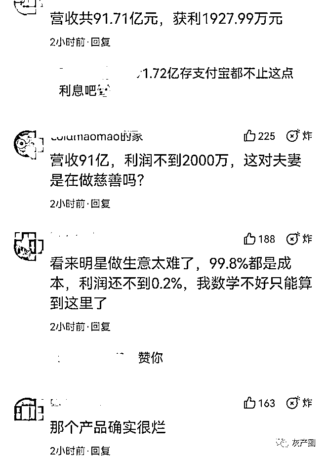
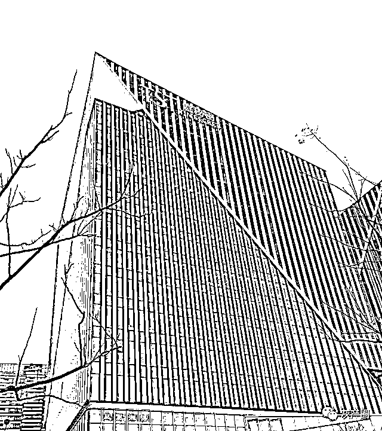

# TST 庭秘密已被认定为传销，曾被保康县市监局罚没 2100 万

> 原文：[`mp.weixin.qq.com/s?__biz=MzIyMDYwMTk0Mw==&mid=2247533346&idx=4&sn=6d2d51a93d2c484a18cf717dafbb988f&chksm=97cb881aa0bc010c2475919152abc5af484ea1075a47f4fdc2a5c3c2b3e149bcdf2a40839e47&scene=27#wechat_redirect`](http://mp.weixin.qq.com/s?__biz=MzIyMDYwMTk0Mw==&mid=2247533346&idx=4&sn=6d2d51a93d2c484a18cf717dafbb988f&chksm=97cb881aa0bc010c2475919152abc5af484ea1075a47f4fdc2a5c3c2b3e149bcdf2a40839e47&scene=27#wechat_redirect)

# 距离明星张庭和林瑞阳的品牌“TST 庭秘密”被曝涉嫌传销被立案调查已过去约四个月（此前报道：①[前代理起底张庭公司套路！](http://mp.weixin.qq.com/s?__biz=MzIyMDYwMTk0Mw==&mid=2247526777&idx=1&sn=2c0e71ca233291e2de7922f46640af44&chksm=97cba241a0bc2b579e2bc6e34f8d46ac4a971c3daf2046267dad662097fc4c1c896779bdeff5&scene=21#wechat_redirect)②[张庭公司 TST 产品为代工厂贴牌：218 元洁面乳成本约 15 元](http://mp.weixin.qq.com/s?__biz=MzIyMDYwMTk0Mw==&mid=2247526829&idx=6&sn=1e3791076eebb1cf42193ba4bea7d66a&chksm=97cba295a0bc2b83248ac4c1819b137480c3459012abb66e9926cf2d7ceb2e5fd7655c24171a&scene=21#wechat_redirect)③[张庭微博抖音均被禁言](http://mp.weixin.qq.com/s?__biz=MzIyMDYwMTk0Mw==&mid=2247527004&idx=1&sn=0dd8746e06d09890bb1a003adf2347f9&chksm=97cba164a0bc28723b4467d9039a96a572d8dac4c11f8a3c24fe970cb88e8688d9ca3e1fccb1&scene=21#wechat_redirect)）。 

据红星资本局了解到，湖北保康县市场监督管理局认定，2018 年 1 月 1 日至 2021 年 7 月，相关公司在涉及传销的主营业务上的营收共 91.71 亿元，获利 1927.99 万元。真正令人迷惑的是 1927.99 万元获利加上 170 万元罚款，总共也才 2100 万元左右。

这个数字显然不符合人们的预期。传销之所以称之为传销，就是成本低，利润高。此前就有加盟商曝光，称张庭公司的百元化妆品，成本仅 4 元。

营收近百亿，利润却只有不到两千万元，这种利润率是绝对不合理的，别说是传销公司，就是做慈善也不可能出现这种情况。

所以必然存在一种情况，就是该公司的账目存在问题。有网友纳闷了，事情闹这么大，被这么多人盯着，账目有问题肯定能够被查出来。

查出来有问题，未必能够追责。就像张庭夫妇涉嫌组织传销，但未必会因此承担法律责任，这事儿大概率罚款了事了。主要原因，是这对夫妇够“聪明”。

他们的公司结构是经过精心设计的，可以这么理解，从夫妻二人成立公司起，就意识到了会有这么一天，所以他们在违法的同时，就规避掉了自己的风险。

此前媒体曝光，张庭夫妇找了专业人士去设计 TST 的经营模式，用层层协议，既能实际控制公司，又能规避自己的责任。

比如张庭林瑞阳二人虽然是公司的法定代表人、董事以及总经理，却不是公司的股东，又通过层层协议的方式控制公司的经营和财务，成为实际 受益人 。

这是典型的 VIE 架构协议的公司，是较为“先进”的公司模式。成本、利润等也一样，看上去一切都符合法律规定，实际上却一点都不合理。比如说他们在上海买的商业大楼，是不是用来抵消利润，当成成本了？

这或许也是市场监管部门动用了几百人，耗费大量的人力物力，却依然无法将这个传销帝国彻底掀翻的原因。
更令人“服气”的是，这对夫妇完全没有税务问题，合法缴税，没有留下任何把柄。所以，就算查明了，全天下人都知道他们在搞传销，可就是拿他们没办法。

值得注意的是，关于传销被处罚的消息，并不是官方正式通报出来的消息，因此可以推测，这事儿可能还没有真正结束，可能会继续查下去。

因传销被罚没超两千万 

公开资料显示，品牌“TST 庭秘密”的运营主体公司是上海达尔威贸易有限公司（下称“达尔威公司”），由明星张庭、林瑞阳夫妇于 2013 年创立，以化妆品、护肤品为主打品类。

2021 年 12 月，石家庄市裕华区市场监督管理局在一份《查证函的回复》中称，达尔威公司涉嫌利用网络从事传销活动，其已立案调查。该事件引发了广泛的舆论关注。

 张庭和林瑞阳，图据微博@TST 庭秘密 

4 月 7 日，有曾是 TST 庭秘密经销商的人士向红星资本局曝料，保康县市场监督管理局已于 2021 年 9 月对 TST 庭秘密的运营主体进行了行政处罚。

据上述人士介绍，保康县市监局认为，达尔威公司制定的奖金制度将会员区分为蓝卡会员和红卡会员。其中，蓝卡会员属一般消费者，且针对蓝卡会员的奖金制度符合商业惯例，并无违法情形。

不过，达尔威公司的红卡会员执行的奖金制度，要求被发展人员发展其他人员加入，形成上下线关系，并以下线的销售业绩为依据计算和给付上线报酬的行为属《禁止传销条例》相关条款所指情形，属传销行为。达尔威公司作为传销行为的发起、组织、策划、管理者，构成组织策划传销违法行为。

最终，达尔威公司被要求立即停止传销行为，并没收违法所得 1927.99 万元，罚款 170 万元。也就是说，其合计被罚没 2097.99 万元。

4 月 7 日，红星资本局致电保康县市监局在保康县人民政府官网上披露的座机号码，接电话的工作人员先是称不清楚此事，要求记者前往保康县当地、找相关人员当面进行核实。当红星资本局问及去了当地后要找哪一位相关人员核实时，对方又称“不方便告知”，而后直接挂断电话。

根据上述人士提供的信息，我们注意到，达尔威公司自 2018 年 1 月 1 日至 2021 年 7 月共发展会员超 700 万人。在该段约三年半的时间内，达尔威公司涉及传销的相关主营业务上的收入约 91.71 亿元，但最终获利为 1927.99 万元。其中，主营业务成本有 56.46 亿元，实际发生的有关费用为 34.58 亿元。

上述处罚的时间早于石家庄市裕华区市场监督管理局立案调查被披露出来的时间（2021 年 12 月）。截至发稿，红星资本局无法在国家企业信用信息公示系统中查找到达尔威公司相关的行政处罚信息。

来源：红星资本局，反传联盟

← 向右滑动与灰产圈互动交流 →

