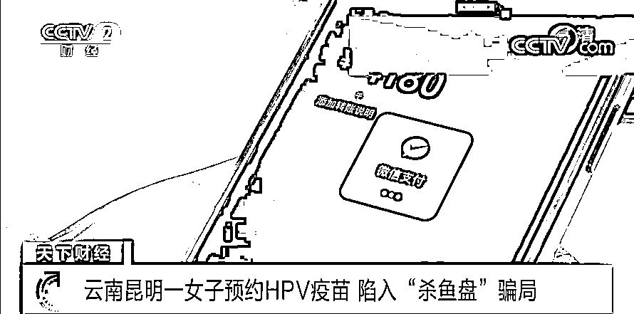

# 高度警惕！最新型骗局：“杀鱼盘”→

> 原文：[`mp.weixin.qq.com/s?__biz=MzIyMDYwMTk0Mw==&mid=2247533346&idx=5&sn=a63f5949c35e33875b121f944d1b4b94&chksm=97cb881aa0bc010cbe7229ffb1d7ae6cdd5efa91b25f7c1a46abfc6e6a17dd0d4a2b69cf17f3&scene=27#wechat_redirect`](http://mp.weixin.qq.com/s?__biz=MzIyMDYwMTk0Mw==&mid=2247533346&idx=5&sn=a63f5949c35e33875b121f944d1b4b94&chksm=97cb881aa0bc010cbe7229ffb1d7ae6cdd5efa91b25f7c1a46abfc6e6a17dd0d4a2b69cf17f3&scene=27#wechat_redirect)

随着全民健康意识的提升，能有效预防人乳头瘤病毒（HPV）感染引起的宫颈癌疫苗在众多适龄女性群体中备受关注。由于九价 HPV 疫苗经常供不应求，因此一些不法人员盯上了接种心切的人们。最近，云南昆明的姜女士就遇到这种诈骗。 

[`mp.weixin.qq.com/mp/readtemplate?t=pages/video_player_tmpl&action=mpvideo&auto=0&vid=wxv_2348562807522295812`](https://mp.weixin.qq.com/mp/readtemplate?t=pages/video_player_tmpl&action=mpvideo&auto=0&vid=wxv_2348562807522295812)

△央视财经《天下财经》栏目视频

 昆明市民姜女士在网上看到，有人可以帮忙预约 HPV 疫苗。

**云南省昆明市公安局五华分局科医路派出所刑侦副所长 范江：**姜女士在微博上，搜索了九价（HPV）疫苗信息之后，按照网站提示要求进行预约，预约后按照对方提供的名称和账户，进行了转账。

姜女士在私信博主后，**对方索要了姜女士的姓名、身份证号和手机号，而姜女士也向对方转账 4000 多元**。半小时后，姜女士就收到了已经成功预约到九价疫苗的短信，并要求她在相应时间内去昆明某卫生服务中心接种。不过就在此时，**对方以款项信息不符等理由，又提出让姜女士再次转账**。姜女士这才觉得事有蹊跷。

**云南省昆明市公安局五华分局科医路派出所刑侦副所长 范江：**核实之后，没有预约成功，姜女士发现被骗，我们调查发现这个网站是虚假的，**是最新型的“杀鱼盘”类型的电信诈骗案件**。

 “杀鱼盘”简单来说就是“鱼咬饵上钩”和“撒网捕鱼”之意。诈骗犯罪分子通过网络形式，广泛投放虚假信息，并留下自己的联系方式，等待有需要的人主动“上钩”。之后诱使受害者点击链接，再实施进一步诈骗。警方发现：除了“疫苗代预约”，“杀鱼盘”还经常以“内部渠道”“内幕消息”为诱饵设立骗局。目前，对于姜女士遭遇的骗局，警方也正在立案侦查。

来源：央视财经（ID：cctvyscj）

← 向右滑动与灰产圈互动交流 →

