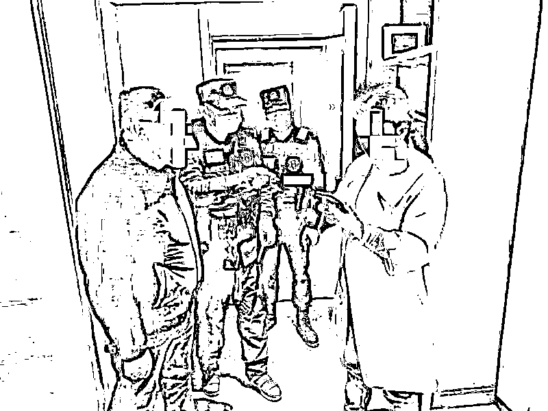
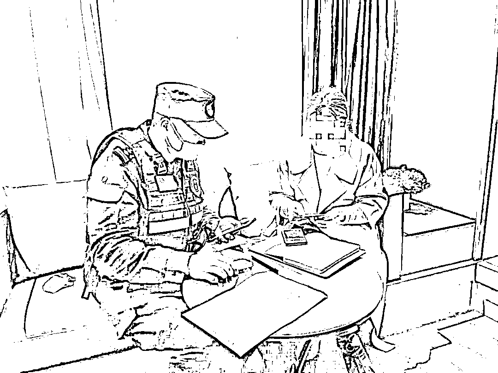

# 蜀黍推开门一瞬间，她正要给骗子转 16 万……

> 原文：[`mp.weixin.qq.com/s?__biz=MzIyMDYwMTk0Mw==&mid=2247533346&idx=6&sn=937f613c08601d0094bb6925c5746283&chksm=97cb881aa0bc010ca56bb8670ad8105de36829a86ac12cc0f219f1f30b93cd0a503ec0129b56&scene=27#wechat_redirect`](http://mp.weixin.qq.com/s?__biz=MzIyMDYwMTk0Mw==&mid=2247533346&idx=6&sn=937f613c08601d0094bb6925c5746283&chksm=97cb881aa0bc010ca56bb8670ad8105de36829a86ac12cc0f219f1f30b93cd0a503ec0129b56&scene=27#wechat_redirect)

昆明一女子盛某

半小时前在家接到

**自称上海公安办案民警**

**打来的电话**

**之后慌忙离家**

**不知去向**

其电话也无法接通

家人怀疑其遭遇电诈

急忙报警

经过查询

民警确认了其所在酒店房间号

并立即前往进行劝阻

可她将自己锁在房间内

**无论民警怎么解释**

**就是不开门**

迫不得已

民警只好喊来

酒店工作人员开门

门打开的那一刻

**她正在给骗子转账 16 万**

**到底发生了什么？**

原来

盛某接到

上海公安机关办案民警的电话

**对方说自己涉嫌洗钱**

刚开始盛某还不太相信

但是加了对方的微信

收到对方发来的工作证等资料

盛某就信以为真

便在对方的电话指示下

**下载了一个 App**

**对方进行远程操作**

**导致盛某的所有来电均被拒接**

**家人无法与之联系**

在对方的引导和恐吓下

盛某来到酒店配合调查

**并转账以配合“警方**”**查明真相**

还自己清白

最后在警方的劝导下

盛某恍然大悟

对自己的行为表示后悔

并感谢民警及时出现帮其挽回损失

**注意！注意！注意！**

**这是常见的冒充“公检法”诈骗套路**

**现在再来给大家复习一下**

**一定要牢记于心哦**

**步骤一**

诈骗分子通过非法渠道获取事主姓名、身份证号、地址等个人信息，以此获取事主的初步信任，对事主进行“洗脑”。骗子常用的话术：“我是 XX 分局的警察，你涉嫌违法，现需对你进行调查，请配合！”

**步骤二**

诈骗分子随后以严厉语气，震慑、控制事主的意志，使事主因急于证明自身清白或挽回损失，而答应配合其所谓的“调查”。

**步骤三**

为了让骗局更加真实，诈骗分子向事主发送虚假“通缉令”“逮捕令”等法律文书，利用事主的恐慌心理，进一步骗取信任。

**步骤四**

诈骗分子会诱骗受害人对手机进行设置，切断其与外界的联系，并以做笔录等为由诱骗受害人前往酒店等隐蔽场所。

**步骤五**

骗子向事主提出证明其“清白”的唯一方法：配合公安机关资金调查，将钱款转账到所谓的“安全账户”“清查账户”。

**步骤六**

诱骗受害人继续到各平台进行借贷，并将钱全部转进所谓的“安全账户”“清查账户”。

**步骤七**

资金到账，立即将受害人拉黑并消失。

**反诈民警提示**

公检法部门进行办案时，**不会通过 QQ、微信进行笔录，**更不会向市民群众通过网络发送“通缉令”“冻结令”等，一旦市民群众接到此类电话，建议直接挂断，**及时拨打 110 报警。**

凡是接到**自称公检法人员**的电话，提到安全账户、清查资金、转账汇款的都是诈骗!

凡是**自称某部门工作人员**，主动“帮你”转接电话至公检法部门的都是诈骗!

凡是**要求通话内容绝对保密**，或通过网络出示“通缉令”“警官证”的都是诈骗!

凡是自称公安人员**要求通过电话、QQ、微信做笔录**的都是诈骗!

凡是要求**前往酒店、家里、网吧等隐蔽环境接受调查或自证清白**的都是诈骗!

电信网络诈骗手法

千变万化

一定要提高警惕

**记住****“三不一多”****原则**

**未知链接不点击**

**陌生来电不轻信**

**个人信息不透露**

**转账汇款多核实**

来源：昆明反电信网络诈骗中心

← 向右滑动与灰产圈互动交流 →

