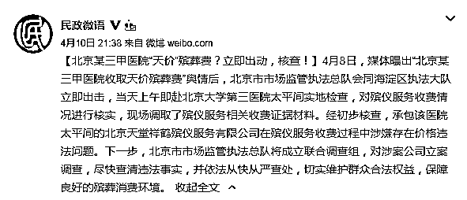
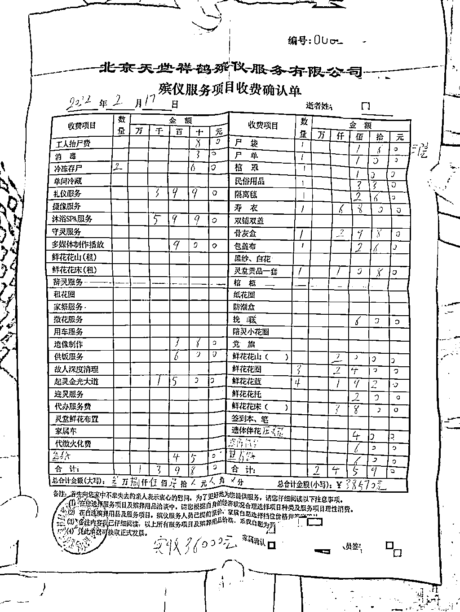
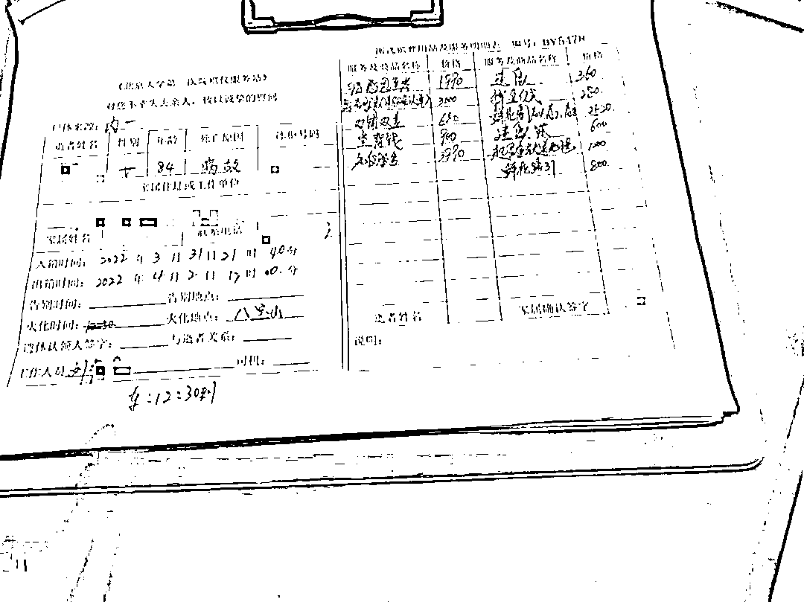
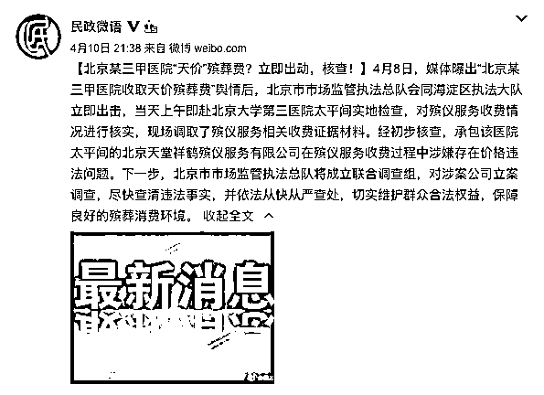
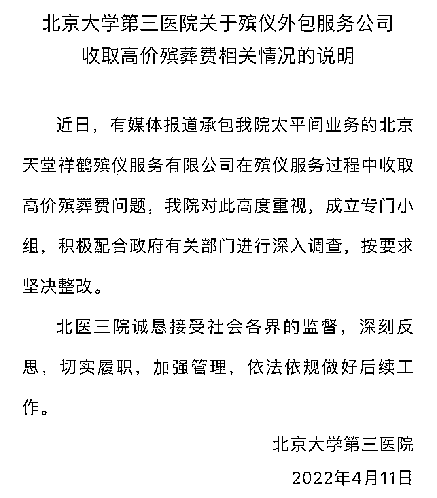

# 人死了，还要做 SPA，收费 5990...

> 原文：[`mp.weixin.qq.com/s?__biz=MzIyMDYwMTk0Mw==&mid=2247533411&idx=3&sn=b5f6765ab59207403ca5c26f877e1744&chksm=97cb885ba0bc014ddbf18393b8af23d4d8ecb7bd64194e8ce97e4cd703987b72aee7f20b235b&scene=27#wechat_redirect`](http://mp.weixin.qq.com/s?__biz=MzIyMDYwMTk0Mw==&mid=2247533411&idx=3&sn=b5f6765ab59207403ca5c26f877e1744&chksm=97cb885ba0bc014ddbf18393b8af23d4d8ecb7bd64194e8ce97e4cd703987b72aee7f20b235b&scene=27#wechat_redirect)

**沐浴 SPA5990，起灵金光大道 1500，寿衣 6800，供饭服务 600……**近日，一份由被北医三院太平间出具总价为**38570 元**的收费确认单，震惊各方。

据民政部新闻办官方微博@民政微语 4 月 10 日晚通报，4 月 8 日，媒体曝出“北京某三甲医院收取天价殡葬费”舆情后，北京市市场监管执法总队会同海淀区执法大队立即出击，当天上午即赴北京大学第三医院太平间实地检查，对殡仪服务收费情况进行核实，现场调取了殡仪服务相关收费证据材料。

经初步核查，承包该医院太平间的北京天堂祥鹤殡仪服务有限公司**在殡仪服务收费过程中涉嫌存在价格违法问题。**下一步，北京市市场监管执法总队将成立联合调查组，对涉案公司立案调查，尽快查清违法事实，并依法从快从严查处，切实维护群众合法权益，保障良好的殡葬消费环境。

**勤俭一辈子，死了被厚葬**

据北京新闻广播 4 月 8 日报道，市民邓先生（化姓）的爱人 2 月中旬在家中离世，亲属们将她的遗体送到了家附近的北医三院太平间暂时存放，等待三天之后的火化。然而，**不到三天时间却总共花费 3 万 8 千多元。**“他有一个 600 块钱吃饭钱，但是我不知道 600 块钱给死人吃的是什么。”

市民郑女士（化姓）3 月底在为自己的婆婆进行丧葬时，也遇到了类似的情况，同样是在北医三院。

郑女士说，婆婆在北医三院医治无效去世后，被送去了北医三院的太平间停放，三天后结算时，被告知要交将**近 2 万块钱**的殡葬服务费。

“有一个 5990 的叫感恩致孝，我到现在也不知道感恩致孝是什么，让我特别吃惊。我说这个 900 是什么钱，他说等于是搁到死人身下，那种纸铜钱儿。北医三院的太平间，从那个半地下的抬出来，没有 100 米，要 1200，他只不过给你铺一个金色的地毯。还一个 800 块钱的叫鲜花引路。其他 3000 元叫综合服务，我到现在不知道这综合服务里边是什么。老人们活着的时候勤俭一辈子，你让他死了这么厚葬干嘛呀。”

据记者了解，**邓先生一家和郑女士一家都没有拿到正规的收据和发票，只有一张收费确认单，并且工作人员告知他们，只能现金支付。**不过，记者留意到，邓先生的收费确认单上写着“北京天堂祥鹤殡仪服务有限公司”的字样，而郑女士提供的收费明细单上写着“北京大学第三医院殡仪服务站”。

记者又联系了北医三院进行确认，总务处的工作人员证实说，这家殡葬公司确实是经过招投标进驻医院为逝者提供服务的。

**现场：太平间仍在营业**

11 日上午 10 时，记者来到位于北医三院东南角的太平间，这是一座一层建筑，门口有一个不算宽敞、相对封闭的室外空间，一辆殡仪馆的用车停放在院内。“小院”院门紧闭，张贴着一张通告：为配合医院工作，此门关闭，只允许业务车辆出入。

从室外区域望去，等候区和告别室内都没有亲属在等候，两位身着黑色制服的工作人员出入忙碌。“您是亲属吗，您是谁的亲属？”一位工作人员上前询问记者。得知来意，工作人员告诉记者，**目前，太平间仍在营业。**针对太平间涉嫌存在价格违法的情况，该工作人员表示，不回应。

太平间收取的“天价殡葬费”是否可以退还？记者上午致电北医三院。负责接听电话的接线人员表示，“不了解”，可具体咨询太平间。

北医三院太平间一位接听电话的男性工作人员在听到“天价殡葬费能退吗”的询问后，接连说了两句“没有没有”，便立刻挂断了电话。

**起底：涉案公司已成立 14 年，还是殡葬协会会员单位**

记者在国家企业信用信息公示系统查询发现，北京天堂祥鹤殡仪服务有限公司的成立日期为 2008 年 3 月 17 日，注册资本为 500 万元，注册地址为北京市丰台区镇国寺北街 4 号院 5 号楼 1 层 01 内 01-04。在经营范围一栏中显示，该公司可提供殡葬礼仪服务、遗体搬运存放服务、殡仪馆管理服务、墓地安葬服务，还可以零售殡葬用品。

在“天眼查”网站上的公开信息显示，除北医三院外，北京天堂祥鹤殡仪服务有限公司还为北京大学首钢医院提供过相关服务。

记者随后查询发现，北京天堂祥鹤殡仪服务有限公司在 2017 年成为第六届中国殡葬协会会员单位。记者登录中国殡葬协会网站，在会员信息简介一栏中显示，北京天堂祥鹤殡仪服务有限公司目前提供包括遗体告别、骨灰告别、入殓入葬、遗体捐献等基础服务，追悼会、追思会、告别会等活动礼仪服务，灵堂搭建、祭奠奉灵等上门礼仪服务，以及悼词撰写、人生总结、告别专访等文学创作服务。

记者在北京市殡葬协会网站上看到，这家公司也同样列在北京市殡葬协会会员名单中。在会员中心公示的“北京市殡葬协会行业自律公约”中明确提出，会员单位“经营过程中，凡涉及收费项目的，要在服务场所醒目位置明示服务条款和须知。同时，要始终尊重消费者的基本权利，认真接受人民群众的投诉与建议”。

另据了解，北京市殡葬服务价格实行全市统一政策、分级管理。医院太平间不同于殡仪馆、公墓，并不属于民政部门的管理范围。

4 月 10 日，民政部新闻办官方账号回应“北京某三甲医院收取天价殡葬费”称，经初步核查，**承包该医院太平间的北京天堂祥鹤殡仪服务有限公司在殡仪服务收费过程中涉嫌存在价格违法问题**。下一步，北京市市场监管执法总队将成立联合调查组，对涉案公司立案调查，尽快查清违法事实，并依法从快从严查处。

4 月 11 日，据北京大学第三医院消息：近日，有媒体报道承包我院太平间业务的北京天堂祥鹤殡仪服务有限公司在殡仪服务过程中收取高价殡葬费问题，我院对此高度重视，成立专门小组，积极配合政府有关部门进行深入调查，按要求坚决整改。

北医三院诚恳接受社会各界的监督，深刻反思，切实履职，加强管理，依法依规做好后续工作。

来源：综合民政部新闻办官方微博、北京新闻广播、北京晚报、北京日报、中国新闻社

← 向右滑动与灰产圈互动交流 →

