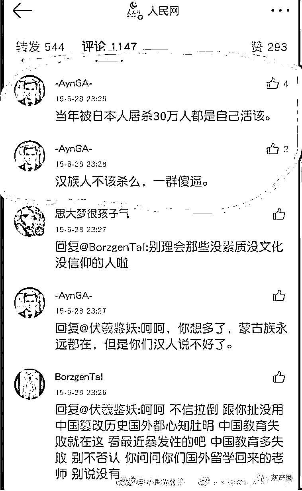
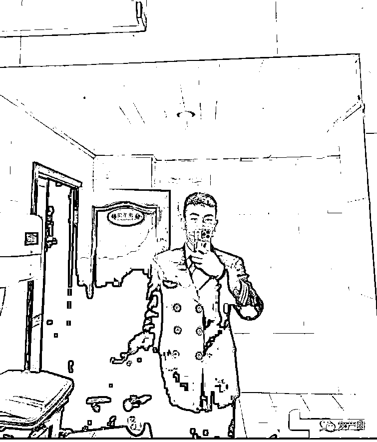

# 四川航空一飞行员在网络发布仇恨言论 遭举报现被停职

> 原文：[`mp.weixin.qq.com/s?__biz=MzIyMDYwMTk0Mw==&mid=2247533411&idx=5&sn=e0da944ec0948000353f5f491a5b0f8c&chksm=97cb885ba0bc014dd3d2011c710fe84e0a2b6e8ee9be0660a11bc23bb9751fd56b496b459454&scene=27#wechat_redirect`](http://mp.weixin.qq.com/s?__biz=MzIyMDYwMTk0Mw==&mid=2247533411&idx=5&sn=e0da944ec0948000353f5f491a5b0f8c&chksm=97cb885ba0bc014dd3d2011c710fe84e0a2b6e8ee9be0660a11bc23bb9751fd56b496b459454&scene=27#wechat_redirect)

4 月 10 日，多位网友发布消息显示，有人在网络发布仇恨言论，之后有网友指出，此人是四川航空公司的一名飞行员。

网友发现他虽是中国人，却身上穿蒙古国国旗

墙上挂蒙古国国旗

1 日凌晨，据@四川航空 ：4 月 10 日下午，有网友微博发布信息，一名公司员工于 2015 年在其个人社交媒体上发布不当言论。对此，我们高度重视，并于第一时间展开调查。经核实，此人确为公司员工，于 2021 年 8 月入职，其不当言论发表于大学期间。公司现已将此人做停职处理，涉事人员目前正接受相关部门调查。

但是网友对于此事，有不同的看法。 

来源：微博那些事儿

← 向右滑动与灰产圈互动交流 →

