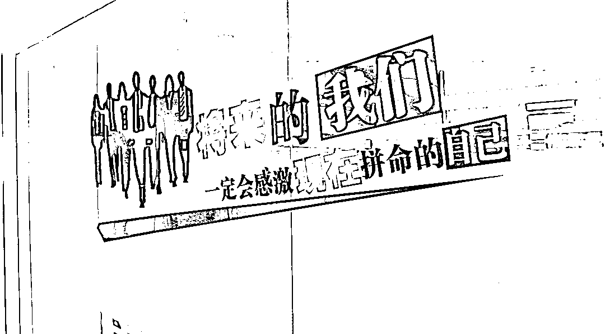

# 私建购彩 APP 流水近亿元！警方打掉一非法彩票犯罪团伙

> 原文：[`mp.weixin.qq.com/s?__biz=MzIyMDYwMTk0Mw==&mid=2247533411&idx=6&sn=1018dce3e6b07c60efccbb884a6831af&chksm=97cb885ba0bc014d9b5c050dc75170268de393281b696d84b5ca3d584d52078cb18bc52dea01&scene=27#wechat_redirect`](http://mp.weixin.qq.com/s?__biz=MzIyMDYwMTk0Mw==&mid=2247533411&idx=6&sn=1018dce3e6b07c60efccbb884a6831af&chksm=97cb885ba0bc014d9b5c050dc75170268de393281b696d84b5ca3d584d52078cb18bc52dea01&scene=27#wechat_redirect)

写字楼公司门口 

公然挂着非法彩票广告

对外大肆宣扬高赔率、高回报

……

[`mp.weixin.qq.com/mp/readtemplate?t=pages/video_player_tmpl&action=mpvideo&auto=0&vid=wxv_2342834940066873347`](https://mp.weixin.qq.com/mp/readtemplate?t=pages/video_player_tmpl&action=mpvideo&auto=0&vid=wxv_2342834940066873347)

▲ 4 月 6 日，湖北省武汉市公安局武汉东湖新技术开发区分局通报，经过近一个多月努力，该局成功打掉一个隐藏于写字楼内专门从事非法彩票犯罪的团伙，**抓获各类人员 30 余名，刑拘 25 人。警方调查显示，该团伙涉嫌流水近 1 亿元。**

**购彩者存疑虑，****警方侦查“挖大案”**

2021 年 12 月底，东新警方获得线索，称有部分购彩者通过网上下载 APP 购买彩票。**据称这类购彩者****不仅可正常通过该 APP 购彩，而且还有“博彩专家”和“定制客服”一对一帮助分析彩票走势**，有不少购彩者中奖甚至“发了财”。

接到线索后，东新分局立即展开侦查，并对线索中提到的写字楼暗中走访摸排。

警方通过分析线索来源，根据办案经验判断，该公司极有可能为团伙作案。随着侦查工作的深入，办案民警很快发现，藏身于写字楼内的一家公司，不仅大门口公然有大量彩票广告，门口还有彩票业务咨询及产品信息，初看上去让人感觉就是正规的彩票销售点。

然而，就在摸排时，民警从该公司门缝中看到，里面每名员工桌上同时有多部手机。每个工位都在不停通过电话推介产品，且桌上明显摆放类似话术本的纸张。经办民警根据办理过多起类似诈骗案件的经验，随即对该公司企业法人、相关资质及公司涉及业务开展全面调查。

**中奖藏猫腻，“兑奖”真假难辨**

“该公司大部分为年轻人，粗略估计常驻办公人员有三四十人。”在摸排掌控该公司情况同时，东新分局迅速成立由反诈中心、关南派出所、同心派出所等相关单位 60 余名警力组建的专案组，对该公司作深入调查。

由于布控周详，行动当日，该公司主要涉事的法人代表张某及所有业务员等 30 余人员均被警方成功控制。

经现场取证，办案民警发现，公司所有人员桌上均摆放了多部手机，且可正常拨打电话。每名人员还通过电脑、手机等多个端口同时登录多个微信账号。警方调查期间，所有微信聊天窗口一直在闪动，手机仍有大量电话打入。

“他们正通过电话、微信拉业务，让购彩者使用公司自己设计的 APP。”办案民警发现，该公司专门针对安卓和 IOS 平台设计了两款网上购彩软件，购彩者扫二维码下载 APP 后，便可通过支付软件定向给 APP 充值，并进行下注。

随后的调查让人惊诧。**国家明文规定禁止互联网销售彩票行为**，但警方发现，该 APP 不仅可以购彩，部分中奖购彩者竟还顺利兑到了奖金。难道这是真的购彩平台？

**循线揭黑幕，“花式”骗术迷人眼**

伴随侦查工作的深入，办案民警很快找到部分通过该平台投注的购彩者。其中，江西的购彩者谢先生就曾使用过该 APP 购彩。

据谢先生介绍，他是从 2021 年 7 月份，通过电话推销的方式，开始接触到一款为“某某小店”的 APP。由于本人是忠实购彩者，本着好奇的心理，谢先生按照电销人员的介绍，添加了一个“平台大神”的群。

**“里面每天有‘预测大神’帮助预测，每次都很准。”**谢先生说，他在该 APP 上累计充值２万多元。期间也有提现，但直到 2021 年 12 月底，仍有已中奖的 2 万多元无法提现。直到接到公安机关通知，到当地派出所协助调查，才知道自己此前进入的群内，大部分中奖人员都是诈骗公司安排的“水军”。

与谢先生遭遇相同，购彩者何某也是通过电话被邀请拉入群。这次电话客服竟称自己有线下实体店，为博得何某同情，该客服称自己是刚刚结婚，表示经营彩票店不易，希望何某在支持他们“创业”的同时，也能收获一份幸运。

通过侦查，办案民警发现，这些客服还会使用美女诱惑、高额回报等方式，拉近潜在的客户关系，之后通过二维码，定向向这些人群推送 APP 下载链接，从而将潜在的购彩者客户推到该公司自己搭建的彩票私庄平台上。其目的就是发展客户，套取资金。

**起底黑平台，资金流入“私人户”**

随着案情逐渐明朗，办案人员发现，该公司是一个有着明确分工，有组织、有架构的犯罪团伙。警方掌握，为保证引入“优质资源”客户，该公司甚至不惜重金聘请了网络技术人员，非法窃取客户信息。

公安机关审讯其中一名主要头目了解到，公司总共有 5 个组，并安排 5 名组长分别管理。所有组别的潜在客户，均由网络技术人员，通过特定技术手段到彩票论坛、贴吧等检索搜寻，之后由电话客服人员逐一筛选。

**“其中一个组，最高业绩高达 180 万。”**办案人员通过细盘该公司账目流水，发现所有注入或充值到该公司 APP 的资金，全部流入到该公司财务总监张某的个人账户银行卡中。

与此同时，为应付投注客户，该团伙还专门购买了一台假的彩票打票终端机，藏于市外一偏僻处，通过打印一张假的彩票正面，拍照给客户，打消客户顾虑。

东新分局相关负责人介绍，销售非法彩票，不但严重扰乱和冲击了国家正规彩票市场，还带来了不少社会问题和治安隐患。一些“彩民”投入大量资金，想发财的他们没想到，全都进了骗子的荷包。

截至案发，该团伙涉案流水近亿元，25 名嫌疑人因涉嫌诈骗罪已被东新警方刑事拘留。

来源：中国警察网，平安湖北

← 向右滑动与灰产圈互动交流 →

