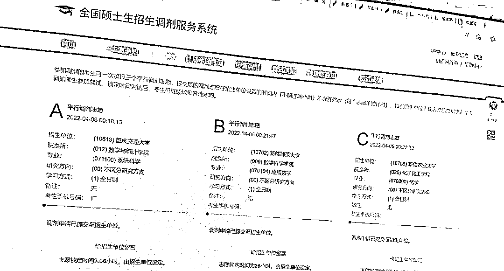
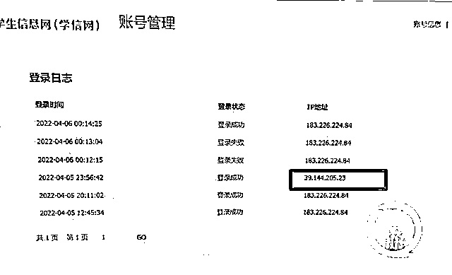
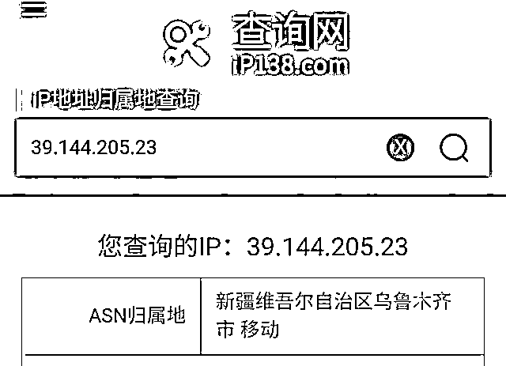

# 极度闹心！女生考研志愿频遭恶意修改

> 原文：[`mp.weixin.qq.com/s?__biz=MzIyMDYwMTk0Mw==&mid=2247533411&idx=7&sn=c0149f0eab5336426a7bbd65abd74f44&chksm=97cb885ba0bc014d01d969cd24fb2c31f33af2341eef6eaaf1e2ca5748c41906e8d9ee64b058&scene=27#wechat_redirect`](http://mp.weixin.qq.com/s?__biz=MzIyMDYwMTk0Mw==&mid=2247533411&idx=7&sn=c0149f0eab5336426a7bbd65abd74f44&chksm=97cb885ba0bc014d01d969cd24fb2c31f33af2341eef6eaaf1e2ca5748c41906e8d9ee64b058&scene=27#wechat_redirect)

大四学生小张参加

2022 年全国硕士研究生招生考试后，

先后经历了**学信网账号被人登录、**

**考试报名被取消、**

**考研调剂志愿被乱填写一通**等怪事。 

“到底是谁在背后操作？”

她既气愤又焦虑，

多次修改密码都无效，

为此，还报了警。

1

****调剂**志愿****遭更改**

**被多家学校拒绝** 

重庆人小张今年 22 岁，

是新疆某大学的大四学生。

去年 12 月，

她参加了硕士研究生考试，

在第一志愿大学的复试中“被刷”。 

4 月 6 日，

考研调剂系统开通。

**“按照规定，**

**一次可以填报三个平行调剂志愿。”**

小张说。

当天凌晨，

**她用学信网账号**

**登录中国研究生招生信息网，**

**却发现密码错误，**

**而且接连两次登录都未成功。**

**改为微信登录后，**

**她成功进入网站。**

**不过却再次傻眼：**

**“调剂志愿已经被填了！**

“3 个志愿学校都已经填好，

却都不是我想报的。

**我是物理专业，**

**被填报的专业不是化学就是**

**应用数学、系统科学，**

**完全不相关，**

**被拒绝是肯定的。**

此前我从来没有了解过这几所学校，

正常来说，

根本没理由去报这些学校。”

被人填写的调剂志愿都与小张所读的物理专业无关

而且，

**调剂志愿填写之后无法即刻修改，**

**有 36 个小时的锁定期。**

“果不其然，

因为不符合专业学科要求，

这些招生单位都把我拒绝了。”

小张表示，

虽然之后重新填报了调剂学校，

但已经对自己造成了影响，

**“比我分数低的同学，**

**都收到了调剂学校的复试通知，**

**我还在为填报而发愁！”**

2

**此前报名也被取消**

**险些失去考研机会** 

小张透露说，

自己的账号已经不是

第一次被人恶意操作了。

去年 11 月，

也发生过一件奇怪的事，

导致她差点无法考研。

她回忆，

当时自己也是通过

学信网账号登录进行网上报名，

**然而当自己再次登录网站**

**进行确认和照片上传时却发现，**

**报名被取消了。**

她不得不向新疆当地教育考试院求助， 

申请了新的报名编号，

才有考研资格。

因为当时问题已解决，

自己又忙着备考，

小张并没有深究。

目前，

小张已收到了

重新填报调剂学校的复试通知，

正忙着准备线上复试。

不过，

她仍然非常担心

自己的考研信息会再次被篡改。

按照研究生招生调剂流程，

复试通过后，

招生学校会发来待录取通知，

**规定时间内需要在中国研究生招生信息网进行确认，**

**考生此时也可以网上取消录取。**

**“如果恶意操作的人再次登录我的账号取消录取，**

**那我可能失去被学校录取的机会！”**

3

**有异地登录痕迹**

**个人信息或已经泄露**

小张表示，

自己的账号密码并未告诉过别人，

一起考研的同学也不存在同校竞争关系，

怎么也想不通，

怎么会发生这种事。

**她向学信网客服反映后，**

**对方提醒她重新设置了密码，**

**并取消了密保。**

**但这些操作并没有起到作用。**

“客服还建议我重新注册账号，

不过，

我担心考研信息丢失，

就没有注册新账号。

9 日晚上，

又登录失败，

我再次修改了密码登录，

**发现有个志愿又被修改了**。”

她说，

密码被人多次修改登录，

自己的手机却没有收到过

非本人操作的任何一条验证信息。

最后，

她选择了报警。

**“我会全程配合警方调查！”**

她表示。

4

****会不会是熟人作案？**** 

小张还向记者发来了登录时显示的 IP 地址。

记者查询发现，

**多个地址 IP 显示为重庆，**

**但其中有一个地址显示为新疆，**

**登录时间都为深夜或者凌晨。**

这个异地登录 IP 地址，常在深夜或者凌晨登录

记者登录中国研究生招生信息网发现，

**在修改账户密码时，**

**如果知道注册邮箱、姓名和身份证等信息，**

**不需要发送手机验证码也能重置密码。**

小张猜测：

**“我人现在重庆，**

**这个新疆的地址**

**会不会就是恶意操作的人的 IP？**

**我是在新疆读的大学，**

**会不会是熟人作案？”**

这个异地登录 IP 地址在新疆，巧合的是，小张读的大学就在新疆

5

**学信网工作人员：**

**无法查到登录 IP 的具体地址**

**学信网客服人员表示，**

**收到小张反映调剂信息被更改的问题后，**

**他们一直在进行核实，**

**也一直在提供解决办法，**

****但技术人员没办法查到登录 IP 的具体地址，****

****只能联系网警进行调查。****

**客服人员建议小张，** 

****找一个没有注册的手机号进行注册，****

****登录调剂系统之后，****

****根据提示把之前的信息关联到新账号，****

****提供相关材料到客服，****

****由平台协助将之前的账号注销，****

****这样这个账号其他人就无法再登录。****

**IT 业界人士胡先生向记者分析说，**

****虽然泄露方式和背景不清楚，****

****但应该是个人信息遭到了泄露。****

**“黑客攻击的可能性小，**

**如果是黑客攻击，**

**很可能是大规模、大范围的，**

**但就了解到的情况看，**

**似乎小张只是个例。”**

**至于登录 IP 地址，**

**胡先生解释说，**

****登录 IP 地址指向哪里，****

****并不具备百分百的关联；****

****当然，****

****也可能的确是异地登录。****

**胡先生建议，**

**如果小张有怀疑对象，**

**可以直接向怀疑对象表明，**

**并提前搜集好**

**对话截图、语音、视频方面的证据，**

**提供给警方。**

**6**

****律师说法：**** 

****盗号、改信息或涉嫌多个违法行为****

****律师表示，****

****考研学生账号被别人盗取，****

****盗取后还被更改了考研、调剂志愿等信息，****

****如果造成严重后果，****

******可能涉嫌构成破坏计算机信息系统罪，******

******可能会处五年以下有期徒刑或者拘役。******

****根据《刑法》第二百八十六条，****

****违反国家规定，****

****对计算机信息系统功能进行删除、修改、增加、干扰，****

****造成计算机信息系统不能正常运行，****

****后果严重的，****

****处五年以下有期徒刑或者拘役；****

****后果特别严重的，****

****处五年以上有期徒刑。****

****违反国家规定，****

****对计算机信息系统中存储、处理****

****或者传输的数据和应用程序进行****

****删除、修改、增加的操作，****

****后果严重的，****

****依照前款的规定处罚。****

****此外，****

****考生通过计算机考研志愿填报信息系统填报志愿，****

****属于电子通信行为，****

****他人擅自修改、增加等行为，****

****属于侵犯公民通信自由，****

******涉嫌构成“侵犯通信自由罪”。******

****根据《刑法》第二百五十二条，****

******隐匿、毁弃或者非法开拆他人信件，******

******侵犯公民通信自由权利，情节严重的，******

******处一年以下有期徒刑或者拘役。******

****若未达情节严重的程度，****

****不能被认定为犯罪，****

****其行为也属于违反****

****《治安管理处罚法》第二十九条第三款，****

******对计算机信息系统中存储的数据进行非法修改，******

******可能被处以行政拘留等处罚。******

******是谁多次修改小张的考研信息？******

******对此你有什么看法？******

****来源：上游新闻，央视网****

********

****← 向右滑动与灰产圈互动交流 →****

********