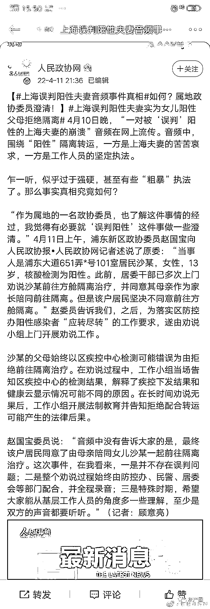

# 政协委员澄清误判阳性录音事件 网友：真以为没人听过录音？？

> 原文：[`mp.weixin.qq.com/s?__biz=MzIyMDYwMTk0Mw==&mid=2247533500&idx=2&sn=8ed5e54e06894b70fc4cd875fda7d27b&chksm=97cb8884a0bc0192959c216279f87243f0e1e08dcd6d81256ae495bd6189745ff2ac9b6d9bb4&scene=27#wechat_redirect`](http://mp.weixin.qq.com/s?__biz=MzIyMDYwMTk0Mw==&mid=2247533500&idx=2&sn=8ed5e54e06894b70fc4cd875fda7d27b&chksm=97cb8884a0bc0192959c216279f87243f0e1e08dcd6d81256ae495bd6189745ff2ac9b6d9bb4&scene=27#wechat_redirect)

据人民政协报报道，4 月 10 日晚，“一对被‘误判’阳性的上海夫妻的崩溃”音频在网上流传。音频中，围绕“阳性”隔离转运，一方是上海夫妻的苦苦哀求，一方是工作人员的坚定执法。 

 乍一听，似乎过于强硬，甚至有些“粗暴”执法了。那么事实真相究竟如何？

“作为属地的一名政协委员，也了解这件事情的经过，我觉得有必要就‘误判阳性’这件事做一些澄清。”

4 月 11 日上午，浦东新区政协委员赵国宝向记者述说了原委：“当事人是浦东大道 651 弄*号 101 室居民**沙某，女性，13 岁，核酸检测为阳性。****此前，居委干部已多次上门劝说沙某前往方舱隔离治疗，并同意其母亲作为家长陪同前往隔离。但是该户居民坚决不同意前往方舱隔离。**”

赵委员称，之后，为落实区防控办阳性感染者“应转尽转”的工作要求，遂由劝说小组上门开展劝说工作。

**沙某的父母始终以区疾控中心检测可能错误为由拒绝前往隔离治疗。在劝说过程中，工作小组当场告知区疾控中心的检测结果，解释了疾控下发结果和健康云显示情况可能不同的原因。在长时间劝说无果后，工作小组开展法制教育并告知拒绝配合转运可能产生的法律后果。**

赵国宝委员说：“音频中没有告诉大家的是，**最终该户居民同意了由母亲陪同女儿沙某一起前往隔离治疗。**这次事件，在我看来**，一是并不存在误判问题；二是整个劝说过程始终由防控办、民警、居委会等部门配合，并全程录音；三是特殊时期，希望大家能从基层工作人员的角度多一些理解，至少是双方的声音都要听听**。”（记者：顾意亮）

不过，网友似乎对此番澄清并买账。

*@在下阿潘有何贵干：*请给出证据，录音中人家夫妻是有证据，有报告的，要求执法人员给出证明是合理诉求，执法人员的态度呢？直接吼起来了，快别洗了，要洗给出证据啊，编写些文字谁不会

*@何芳敏啦啦啦：*你们上门转移没有阳性检测报告，人家手上有阴性报告，嘴巴一张就是谣言，真好笑

*@那要不就做个厨子吧：*意思就是①录音是真的②认为当事人也有错③事情已经以当事人妥协解决了，要求理解工作人员。那么，听完双方的声音觉得工作人员的做法和言行依旧无法理解。而且疾控、健康云、检测机构关于阴性阳性结论不一致的后果为什么要居民承担？

*@钟天霸爸爸-：*双方声音都要听听，你得发声啊，你得把你手上的证据拿出来啊，怎么证明别人是阳性？

*@是 Jimmy 大师噢：*讲真 你这还不如不辟谣 越描越黑了属于是

*@_57_**：*1 音频里公务人员表明是夫妻两人阳性要被带走隔离 2 夫妻两人多次合理要求看一下阳性报告，工作人员完全无视，只坚持要带走隔离 3 在工作人员"威逼"下，夫妻最终无奈同意了… 你说多听听双方的声音，可音频中公务人员就一句话一个意思呀：我不管我不看我只执行上面下达的命令

*@迟来的墨迹**：*录音中明明是说夫妻阳性，怎么这个辟谣中说孩子？？牛头不对马嘴！另外问题公民要求出示阳性证明，电子版也可以，这是权利，为啥就是不出示？

*@星星霸霸拾柒先生：*人家说了跟医院联系过了呀，检测数据张冠李戴了呀，你不去求证这个，拿出实际证据来，只在现有已知条件下硬辟谣，先开枪后画靶子我比你会啊

*@一只尼尼尼：*用辟谣和贴封条撕封条的速度来防疫上海早就清零了

*@_57_：*把你们手里的完整全程录音的音频直接甩出来辟谣会不会更有公信力一点？而不是到处删删删…

*@Kirokila：*人家有医院出具的阴性报告，你们的阳性判断从何而来？民众不是傻子。不是你们说是谣言就谣言了。

*@tutu 要做文科大学霸**：*有本事把完整录音放上来，再对录音内容进行辟谣

*@了你的名字：*音频里那个男工作人员，拿不出证据，翻来覆去说执行命令，期间态度还特别粗暴，拿不出任何证明非说人家阳性，不允许提出的复检复核，以后是不是也可以随便扣一个罪名强制执行

*@是 Jimmy 大师噢：至少双方的声音都要听听** 问题是全网追杀录音超话 逢发必删你让我们听啥啊宝*

**@唱歌好听的胖丁：*这就是权力的高傲么，这责声明一没证据，二混淆视听，三避重就轻。执法人员没有证据就可强制执行，这是将权力凌驾法律了？人家有的不只是健康云，不要老拿健康云不准作为说辞，人家是跟公立医院打电话核实的，有录音证据，退一万步说，人家是阴阳难辨，不应该安排复检么？夫妻诉求也就是复检而已！*

**@轩外白杨：*真以为没人听过录音？？*

*来源:喻言亭阁*

**

*← 向右滑动与灰产圈互动交流 →*

**