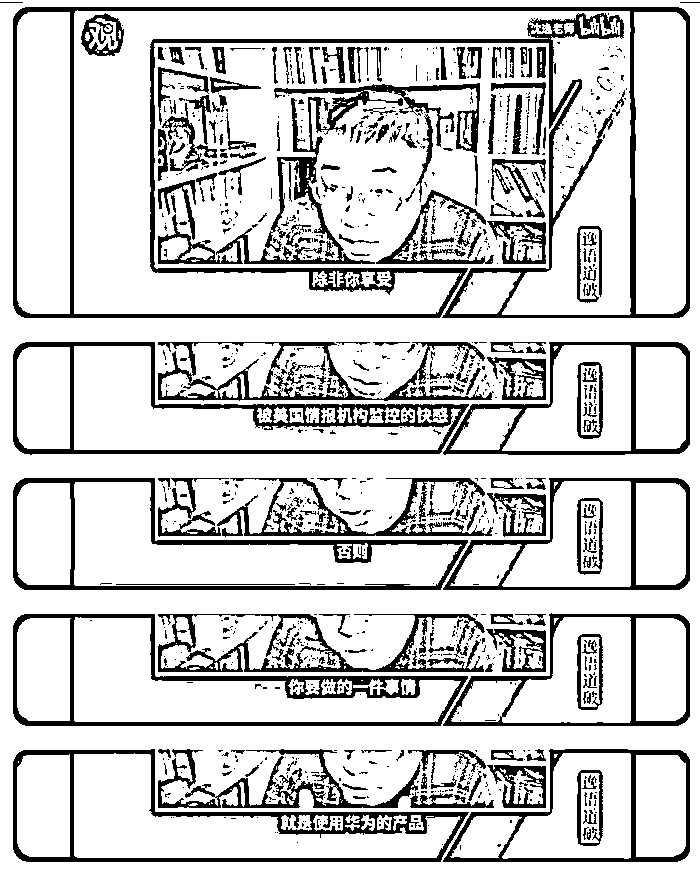

# 给境外递刀子的作家“六六”涉嫌造谣诽谤，其他大 v 也在哀嚎？

> 原文：[`mp.weixin.qq.com/s?__biz=MzIyMDYwMTk0Mw==&mid=2247533500&idx=3&sn=0205f070785c2c4a476f68b4fa63c2e5&chksm=97cb8884a0bc0192b618c4454f60a10ec8f984b3fd16e17decbd320a73e738aa5aa686525b3e&scene=27#wechat_redirect`](http://mp.weixin.qq.com/s?__biz=MzIyMDYwMTk0Mw==&mid=2247533500&idx=3&sn=0205f070785c2c4a476f68b4fa63c2e5&chksm=97cb8884a0bc0192b618c4454f60a10ec8f984b3fd16e17decbd320a73e738aa5aa686525b3e&scene=27#wechat_redirect)

“六六”是谁？

2020 年初，武汉遭疫情突袭，伤亡情况严重，“六六”在寻找疫情素材......！

我看过她写的武汉疫情相关的文章，那可谓正能量满满，也许那都因为是发生在别人身上的吧！

而现在，有些东西发生在了她自己父母身上；

上图是“六六”发的朋友圈，如果全文属实，可以得出几个信息点； 

第一，她妈没打疫苗！

第二，她爸阳了，又阴了，传染给了她妈，他妈无症状！

第三，指责居委会通知她妈要拉去方仓，把心脏病吓出来了！

第四，她诽谤上海方仓医院，把方仓比作集中营！

第五，她造谣，说隔壁小区因为阳性发烧死了一个！ 

她居然好意思在结尾问：你们从文字里能读到一个女儿绝望的心吗？

小编表示，没读到，我要用一颗正能量的心，对待作家“六六”造谣诽谤的事实！ 

目前公布的数据，整个上海就一个重症，没有发生一例因疫情而死亡，她敢造谣说死了一个，对于这个信息，还请上海疫情防控方面严查！ 

明明是阳性，还借口心脏病，其实就是不想遵守防疫规定，老老实实的去方仓医院，别人都去了，你凭什么不去！ 

国家的抗疫大局就被这样的自私鬼给破坏了，每个人都借口心脏病去不了方仓，那还怎么防疫？ 

不就拉去方仓隔离嘛，这点小事都不能作出一点牺牲，就为了隔离这种事居然要给境外势力递刀子！

这种自私的人，在别人受苦受难的时候，她们使劲歌颂正能量，极力掩盖呼救的声音，现在终于轮到她们头上了，老人无辜，但生养出这样的女儿，也算是报应了！

如今苦难终于轮到他们自己和家人身上了，他们叫的比谁都响！

这位大 V 就批评说：**“她妈还没转阴，还是阳性，应该收入方舱。居委会每天要求她母亲去方舱，她就是不去，是不服从防疫管控。”**

近几天，有多位网络名人接连翻车，有野生国师沈 Y 自己买不到菜的，有大局逼郎教授母亲没等到打针，有正能量大 V 杨某父母买不上吃的，这些以前都是标准的大局逼，正能量，平时口号震天响，因为那时候苦难都发生在别人身上！

譬如复旦正能大 V 沈逸，他也发了一个快断粮了的动态！

沈逸最出名的言论是印度疫情的时候，他叫嚣让印度人多死点，别人说你沈逸好歹是个高级知识分子，要善良一些，印度人也是人，但这位复旦的知名先生却讽刺劝他的人是圣母婊，要刷情怀就请去印度烧柴。

还有就是，他自己用着苹果手机，

每天又阴谋论苹果会检测，劝别人都用华为。

除了沈先生，还有一位叫侠骨柔情的杨华的大 v，我们可以看到，他也为自己的母亲求救了。 

杨华我一直有关注，从来不发批判揭露现实的文字，一年到头都是正能量，很多人还不知道，他其实还是上海闵行区某司法单位的一个小干部。 

就这样的人，在关键的时候，也知道痛了，也完全忘记了曾经说过的大格局了。

更有意思的是，他发的这则求助，也被曾经的“好友们”攻击了，一如他当年攻击别人一般。最终搞得他不得不妥协声明！

讲完这些人，说一下近一点的，在昨天的文章中，我们写那对夫妻阴性阳性的的事情，今天在网上依然被大量的讨论，很多人不理解，为何给一个阳性的证据咋这么难，明明医院告知阴性，为何还要上门强制这家人去方舱隔离！

在我们的这个号里，百分之九十的朋友也是对这家不幸的人报以同情，但也有几个的反向留言让我陷入思考。

譬如这位朋友说：" 博这个眼球干嘛，发点团结一心，战胜疫情的不好吗? " 

还有一位朋友说到了感恩，不要制造矛盾！

这两个朋友其实和上面的几个名人属于一类人，痛在别人身上的时候，他们感受不到，别人喊痛的时候，他们只觉得刺耳，并站在宏伟蓝图的制高点去斥责身陷水深火热之中的同类！ 

当然，他们也不是不会感到痛，区别是痛在自己的身上时，才会毫不羞涩的叫出来。

一位朋友说好，在遇到这种事情的时候，普通人能做什么：“如果有余力，尽量为有困难的人提供帮助，哪怕只是声援；如果连声援都不敢，起码不要去堵别人在绝望中求救的嘴。”

这是基本的人性； 

这种痛，也早晚会发生在你们自己的身上，一如上面那几位！

来源： 说点想说的而已，吴秀才，喻言亭阁

← 向右滑动与灰产圈互动交流 →

