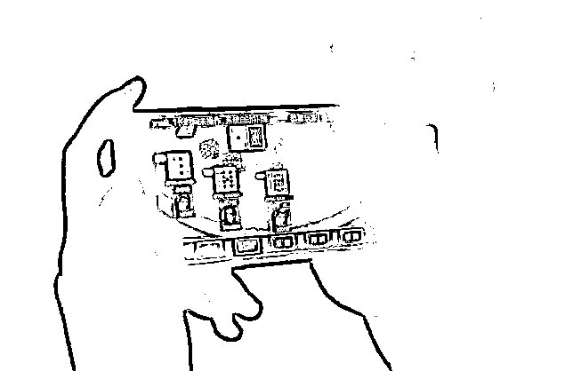
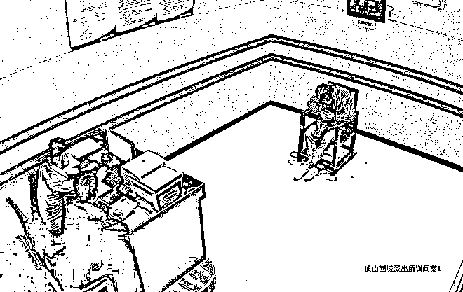

# 单位财务挪用 150 万公款用于赌博，输光后竟向领导提出这个请求……

> 原文：[`mp.weixin.qq.com/s?__biz=MzIyMDYwMTk0Mw==&mid=2247533500&idx=5&sn=ca988be0d5fb1ccbf78524d991680b5a&chksm=97cb8884a0bc0192f73c9731864a76e5b13f12306ad561f583de8e6431a73408c64a22d63a92&scene=27#wechat_redirect`](http://mp.weixin.qq.com/s?__biz=MzIyMDYwMTk0Mw==&mid=2247533500&idx=5&sn=ca988be0d5fb1ccbf78524d991680b5a&chksm=97cb8884a0bc0192f73c9731864a76e5b13f12306ad561f583de8e6431a73408c64a22d63a92&scene=27#wechat_redirect)

一掷千金的刺激

日进斗金的快感

让一些人深陷网络赌博

无法自拔

然而

十赌十输、从无例外

陷入网络赌博后

不仅原本拥有的美好生活

会一夕崩裂

更有甚者为偿还烂债

竟不惜走上违法犯罪之路

最终锒铛入狱

让人无限唏嘘

**深陷网赌走投无路** 

**竟向领导请求挪用公款翻本**

事业一帆风顺，家庭美满幸福……在外人眼里，财务科长李某俊拥有着让人羡慕的人生，没有人能把**“沉迷赌博”“贪污公款”**这些字眼与她联系在一起。

事情还要从 2019 年说起。那一日，闲来无事的李某俊在手机上点进了一个叫做“x 彩网”的网络博彩平台，次日一早，便有两位自称公益导师的网友主动联系李某俊。

随后，李某俊被拉进了一个微信群里，除群管理员教大家怎样在网站上下注赌博外，200 名群成员隔三差五在群里发红包，称自己“又赢了钱”，邀请好友们一起沾沾喜气。

（网络图，图文无关）

虚拟的世界，热闹且富有，这让李某俊很快便陷入其中难以自拔。从下注 10 元、20 元，到一把下注豪掷 20 万，很快她便输光了自己几十万的积蓄，向亲朋好友和网络平台借贷 100 多万元。

输红了眼的李某俊，开始无视国法，**竟妄想从单位“借”更多的钱来翻本**。作为财务科长，李某俊掌管着单位的银行账户，在一番“精心”计划之下，李某俊利用职务之便，以谎称帮助朋友完成存款任务为由，将单位的 150 万元公款分三次转入其个人银行账户下。

每次收到钱后，李某俊都迅速登录赌博网站，把违法挪用的钱充进账户。开始两天，仅一两个小时，50 万元便被输个精光。最后一天，赌红了眼的李某俊筹码越下越大，最后一笔投注金额高达 20 万元。

运气没有因为李某俊的胆大而改善，违法挪用的 150 万元被她全部输个精光，走投无路的李某俊仍不甘心，**开始上演最后的“疯狂”**。

某一天深夜，李某俊向单位负责人发出一条短信： 

“对不起领导，150 万元钱不是用来给朋友完成存款任务，而是被我用去玩猜大小单双的彩票游戏输掉了……我再次请求你帮我挪用公款 200 万，让我去赢回我输掉的钱，回到我原来的生活中……”

此时的李某俊已彻底将国法抛之脑后，她竟向单位领导请求挪用公款翻本……相关部门迅速启动联动机制，一边向派出所报案，一边带领李某俊到纪委监委自首。

2021 年 1 月，湖北省襄阳市襄州区监委对李某俊涉嫌挪用公款问题进行监察立案，并对其采取留置措施。公安机关迅速固定了李某俊参与网络赌博的证据，她也对自己的犯罪行为供认不讳。

李某俊利用职务上的便利，挪用公款进行赌博活动，情节严重，其行为已触犯《中华人民共和国刑法》。**2021 年 6 月，襄州区人民法院判决李某俊犯挪用公款罪，判处有期徒刑 3 年，缓刑 4 年。**

**男子收完购房款“人间蒸发”**

**自首称“都是赌博惹的祸”**

“都是网络赌博惹的祸，把我害惨了！”

3 月 14 日，在家人的劝说下，现年 27 岁的黄某来到湖北省通山县公安局西城派出所投案自首。

据黄某交代，他之前在通山某房产中介工作，业务虽说不算大，倒也做得风声水起。一次偶然，黄某接触到网络赌博，很快便深陷其中，没过多久就输了几万元。

之后，黄某不仅没有收手，反而在网络赌博中越投越多。期盼着“时来运转”的他，在花光了全部积蓄后，又从多名亲戚朋友处借款，不是用来赌博，便是用来偿还他人债务。**直至入不敷出，黄某自觉走投无路，便将歪心思动到了客户的购房款上。** 

去年 10 月至今年 1 月，黄某先后在中介公司寄售的两处房产，通过合同诈骗的形式，出售给袁某、焦某两位受害人，在累计非法获得约 53 万元购房款后，黄某随即“人间蒸发”。

受害人报警后，侦查民警很快掌握了黄某的相关情况，随后来到黄某家中，耐心做其家人的思想规劝工作。在家人的劝说下，3 月 14 日，黄某来到当地公安局投案自首，并如实供述了自己的犯罪事实经过，53 万元涉案资金也全部退赔到位。回忆起因陷入网络赌博所犯的一切，黄某无比懊悔自责。

据了解，犯罪嫌疑人黄某的行为因涉嫌合同诈骗犯罪，已被通山警方采取刑事强制措施，目前，该案还在进一步深挖中。

不怕你赢

就怕你不玩

从输掉钱财、丢掉工作

再到一无所有、家破人亡

网络赌博就像

温水煮青蛙一样蚕食着赌客

一旦上瘾

就会酿成无可挽回的悲剧

十赌十输

  网络赌博一定不能碰！

来源：拒绝跨境赌博综合自襄阳网、极目新闻等

← 向右滑动与灰产圈互动交流 →

