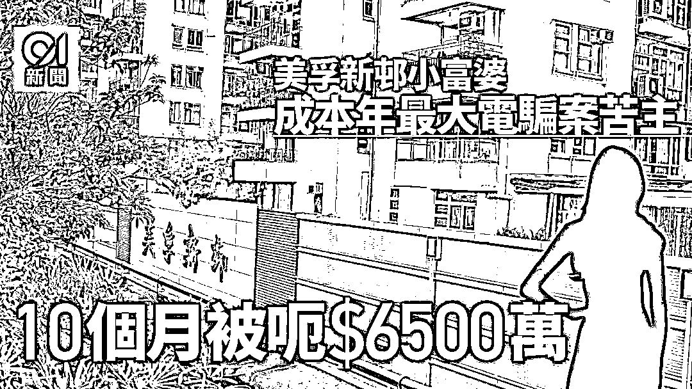

# 损失惨重！香港家庭主妇被骗 6500 万！

> 原文：[`mp.weixin.qq.com/s?__biz=MzIyMDYwMTk0Mw==&mid=2247533500&idx=6&sn=785eac19f4965294640230cbb1e70fcf&chksm=97cb8884a0bc019273fc0d5321b67a6569539e0860a5ce6e17ab850b703e9c1fa8fff34fdf11&scene=27#wechat_redirect`](http://mp.weixin.qq.com/s?__biz=MzIyMDYwMTk0Mw==&mid=2247533500&idx=6&sn=785eac19f4965294640230cbb1e70fcf&chksm=97cb8884a0bc019273fc0d5321b67a6569539e0860a5ce6e17ab850b703e9c1fa8fff34fdf11&scene=27#wechat_redirect)

香港疫情持续，**第五波疫情确诊个案已经累计 117 万宗**。而诈骗分子也没有消停，紧紧抓住这种机会，实施诈骗！

香港近日就有一名**40 岁家庭主妇被诈骗超过 6500 万元，为本年涉款最多电诈案！**

****

**40 岁主妇遇电骗失 6500 万 **

警方于 4 月 3 日接获一名 40 岁家庭主妇报案指，**去 6 月接到一个自称中联办官员的电话**，讹称她**涉嫌与一宗于内地发放假新冠疫苗资讯的案件有关**，并向受害人**提供一个冒认中国人民检察院网站网址**，以查阅自己牵涉的案件，再要求受害人将个人资料、银行帐号密码输入，作调查之用。

**骗徒利用“恶意程式”盗取银行户口密码**

女事主信以为真，在去年 6 月至 9 月期间按对方指示，**先后 5 次与 4 名说普通话的骗徒碰面**，骗徒向她提供手提电话，声称为配合内地执法机关，需要随时知道受害人行踪。**骗徒要女事主把其电话卡插进该电话**，借手机内安装的**恶意程式截取事主网上银行的一次性密码（OTP）**。

**签虚假合避银行审查**

最后一次会面，**骗徒将一份虚假的商业合同，交予受害人** ，声称协助女受害人向银行解释，与收款公司有正当生意来源，从而避过银行审查。合同上封面印有受害人名字，内容仔细，包括目录列有双方需要遵守的条款及合约内容，亦印有傀儡银行户口资料，页尾更印有受害人姓名及签名。

**整个行骗过程足足历时 10 个月**，上年 6 月至今年 3 月期间，**该女子共分 14 次转账共 4600 万元的保证金至合同上一个指定账户**。

**向家人借钱加按物业**

该女子不知其中有诈，**还在骗徒教唆下欺骗母亲**，**称丈夫生意资金周转出现问题，骗走部分款项**，骗徒亦在该女子不知情下透过网上银行转走款项，**总数约 1900 万元。**

**图骗事主丈夫终被揭发**

当受害人被骗尽积蓄时，她仍未察觉自己处身于骗局里，深信自己陷入刑事案， 骗徒打算用同样技俩，转向她丈夫下手时，**丈夫觉得可疑，于 4 月 3 日报警揭发事件。**

据悉，被骗 6,500 万元的女事主，并非阔太，而丈夫也只是做小生意。**夫妇二人在长沙湾拥有一个联名物业，本身租住美孚新邨一单位。 **

女事主账户里之所以有这么多钱，主要是**早前继承了祖父的 5,000 万遗产**，但却遭骗徒多次索款，最终惨被骗徒全部骗走。

无独有偶，香港上月也发生一宗损失过千万的电话诈骗案！

**被指涉非法运输疫苗**

**26 岁金融男堕电骗案失$1460 万**

在 3 月 30 日，西营盘高街 98 号一栋大厦，**一名 26 岁男子报案，称较早前接到一个电话声称香港卫生署电话，指他非法运输疫苗**，电话后来转驳到声称内地执法机关，以协助调查为名，要求事主向指定银行帐户转户，**事主合共将$700 万人民币(拆合约 860 万港)及$600 万港币**，分 134 次转帐至多个本港及内地户口，事主其后发现自己受骗报警。

据了解，受骗男子从事金融行业，来港约 2 年，**案中共 3 名骗徒**，第 1 名声称为卫生署职员，以普通话指事主涉嫌偷运疫苗，事主否认后，电话转驳至第 2 名自称是内地公安人士，最后电话转驳至第 3 名声称是武汉公安的骗徒，指为了证明事主没有涉案，需要进行资产审查，要求事主进行转帐，事主多次转帐约$1460 万港元后如知受骗。

早前亦有市民报称收到来电显示为**“+852 2125 2125”或“+800 2125 2125”**的电话，**冒充卫生署疫苗接种计划查询电话（2125 2125）。**

该伪冒卫生署职员利用预录语音来电，**讹称市民于较早前接种疫苗时登记的个人资料记录有误，因此未能接种第三针**。电话随后转驳至另一名假冒内地执法人员的骗徒，意图骗取其个人资料。反诈骗协调中心表示，卫生署如需要联络市民，一般会提供相关资料以核实双方的身份，但不会要求市民提供任何敏感的个人资料，如银行帐户资料及密码。

**警方提示：**真正的执法人员调查案件，并不会透过电话向你索取银行帐户密码；切勿将自己的电话卡插其他人提供的电话；多关心家人，留意他们有没有诚惶诚恐的表现。

来源：3hk.cn 官方微信：香港自由行

← 向右滑动与灰产圈互动交流 →

