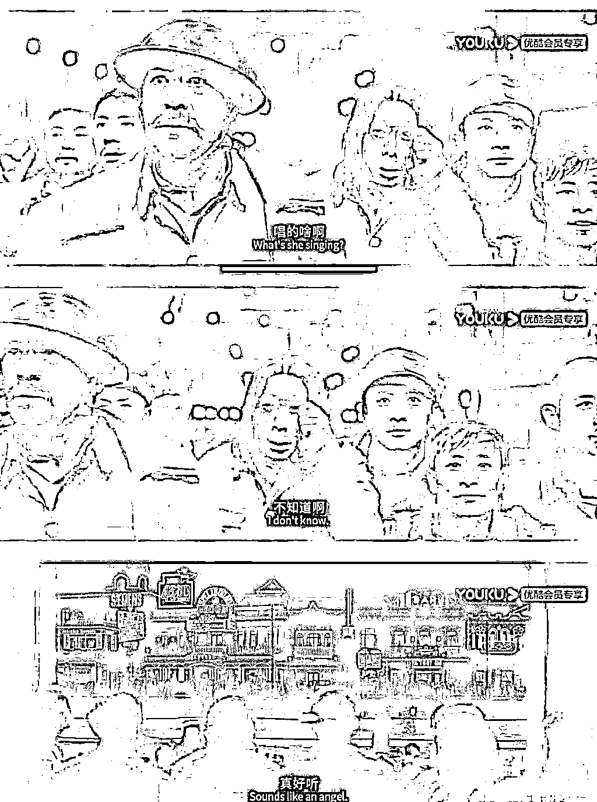
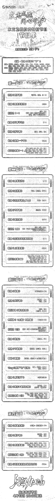

# 上海东方卫视抗疫晚会被 ban：打仗打到一半开庆功会？

> 原文：[`mp.weixin.qq.com/s?__biz=MzIyMDYwMTk0Mw==&mid=2247533545&idx=1&sn=a2c92a13b6a4943ba2bb78f78f7d381c&chksm=97cb88d1a0bc01c767255a3ca85057a4f0767220136d0f7e23e9815c25d2dbd85c90975ec29b&scene=27#wechat_redirect`](http://mp.weixin.qq.com/s?__biz=MzIyMDYwMTk0Mw==&mid=2247533545&idx=1&sn=a2c92a13b6a4943ba2bb78f78f7d381c&chksm=97cb88d1a0bc01c767255a3ca85057a4f0767220136d0f7e23e9815c25d2dbd85c90975ec29b&scene=27#wechat_redirect)

战士军前半死生，美人帐下犹歌舞。图源丨电影《八佰》

现在没什么比上海疫情更让人操心的，因为上海已经连续 5 天新增无症状数量超过了两万。

**4 月 7 日，新增本土新冠肺炎确诊病例 824 例和无症状感染者 20398 例；**

**4 月 8 日，新增本土新冠肺炎确诊病例 1015 例和无症状感染者 22609 例；**

**4 月 9 日，新增本土新冠肺炎确诊病例 1006 例和无症状感染者 23937 例；**

**4 月 10 日，新增本土新冠肺炎确诊病例 914 例和无症状感染者 25173 例；**

**4 月 11 日，新增本土新冠肺炎确诊病例 994 例和无症状感染者 22348 例。**

上海疫情究竟何时会迎来拐点？这才是目前全国人民最关心的问题！

我国疾病预防控制中心流行病学首席专家吴尊友说：**十天到两周的时间，上海就会实现社会面清零。**

也就是说最多半个月，就有可能实现社会清零，加油！ 

这时候，上海的东方卫视坐不住了。

**就在今天，上海东方卫视原本要搞个“抗疫特别晚会”，清单很长，许多大牌明星献声，重点是这些明星们几乎都生活在上海。**

原定于 4 月 13 日晚 20:30 分播出，节目单中胡歌、郎朗吉娜夫妇、马伊琍、王一博、张艺兴、易烊千玺、迪丽热巴等明星纷纷亮相。

据说之前还在搭建舞台，看来花了不少人力物力成本。

所以这时候搞晚会是什么信号？

**上海是个好地方，哪怕是疫情这么严重的时候，我要拿出几十个拿得出手的明星，分分钟的事。**

上海每天都两万的感染者了，你还搞抗疫晚会？还没做出什么就想着歌功颂德了？

**上海人民生活在水深火热，网上的各种求救呼喊在铺天盖地，东方卫视居然大张旗鼓搞一场抗疫专题晚会，似乎上海的疫情已经 over 了，已经大捷了。**

本以为你们每天辟谣够忙的了，没想到还能抽空筹办个晚会，可能整个上海市民都没想到吧。

**请问是谁这么迫不及待？是谁要看？是谁想看？是要演给谁看？**

**民众在挨饿，你在这载歌载舞，我真的不理解，这做法不就是打仗打到一半开庆功会吗？**

你要播也行，有种你 B 站同步直播把弹幕打开，让你知道什么叫“国粹”。

结局可想而知，网友一片骂声！

连歌曲作词人都看不下去了开始抵制。 

**歌舞升平、丧事喜办、麻木不仁、匪夷所思。**

百姓每天在为吃的焦虑，你让他们看晚会，相信歌舞升平里还有自己，这不是膈应人吗？

东方卫视的主要职能之一——新闻，你应该搞 24 小时直播，随便走进哪个小区拍摄，保准每天都能拍出《人间世》。

请把镜头对准孤寡老人、快递小哥、医护人员、病人这些更需要关注的人群，**那些明星们今天能唱歌明天也能唱，何必这个时候刷存在。**

如果一定要以艺人形式展示，东方卫视为什么不组织明星集体去当志愿者？

**让这些明星们带着新鲜的蔬菜、牛奶和猪肉走向各个小区，将物资送往居民手中的最后一公里。**

这才是真正的正能量！

这时候开晚会，流量明星算什么？

**有给你送肉送菜的快递小哥帅气？**

**有从全国各地赶来支援上海的医护人员美丽？**

忙着定时抢菜拉群拼团的上海市民真有心情看？ 

上海，好比我们身边的有钱邻居，平时虽然傲气了点，家里着火了周边善良的邻居肯定都会搭一把手。

**但给你帮忙是真的看你有困难，我们支援的医护人员志愿者帮你灭火累死累活，你倒好直接在一边开香槟庆祝了？**

**抱歉，火还没灭呢。**

你们真的找不到事做了吗？闲得发慌去当志愿者送菜可以吗？

**在全网的开喷下，这场抗疫晚会终于被彻底“骂”停了。**

**这应该是有史以来第一个被网友骂到取消的晚会。**

**上海人真的不需要晚会，上海人需要新鲜的蔬菜、牛奶和肉。**

其实这个晚会可以办，什么时候办？

等疫情过去了，百姓生活正常，不为吃的发愁了，切实需要这样的晚会来放松心情。

文章写到这里已经 13 号的凌晨一点，我已经不想骂了，感觉有一种无力感由心而出，让我感到很疲惫。

这 3 月份以来一切一切都太荒唐了，居然这还有更荒唐的！

每天读着这些令人啼笑皆非的新闻，慢慢瓦解对这座城市的热爱与信仰。

长太息以掩涕兮，哀民生之多艰。

永远感激在抗疫前线的每一位平凡的志愿者，每一位为这座城市守护的大白，每一位留守在上海默默付出的百姓！

上海人民，加油！

来源：昌南大队长

← 向右滑动与灰产圈互动交流 →

