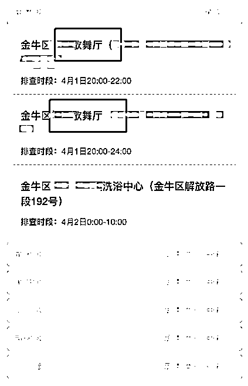
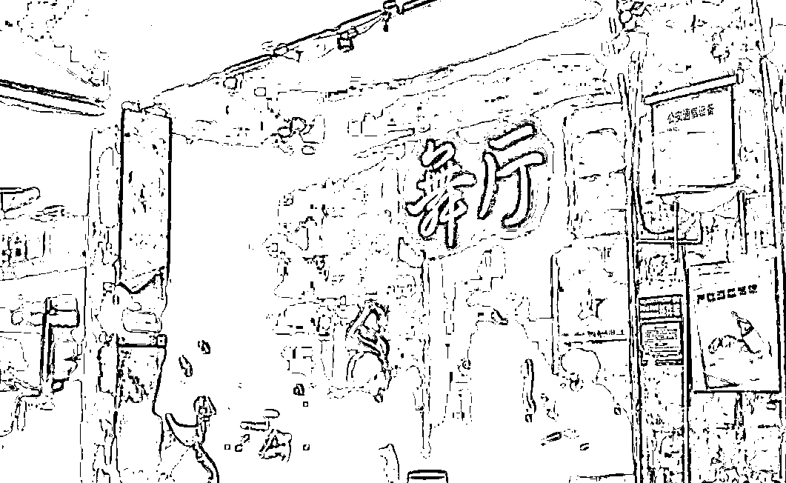
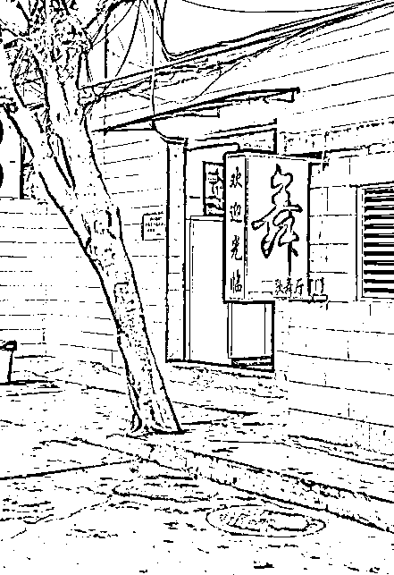
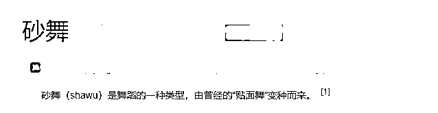
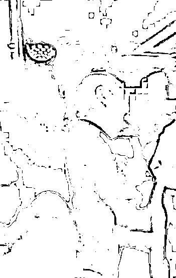
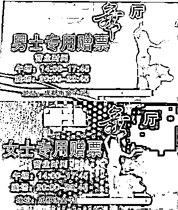
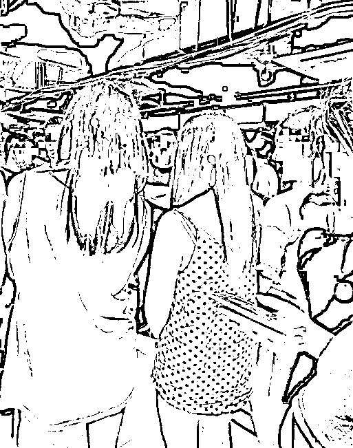
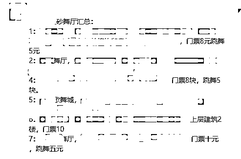
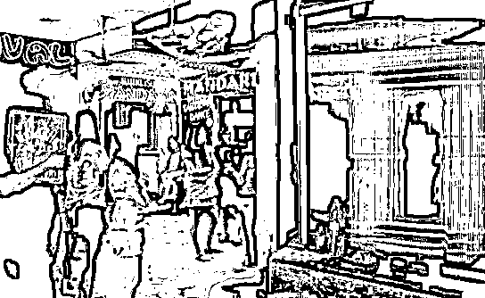
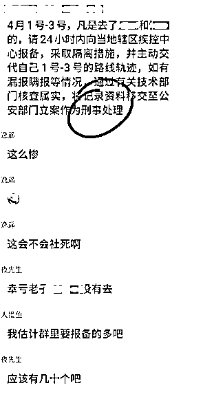

# 跳砂舞喜遭隔离，大哥你的脸往哪儿放？

> 原文：[`mp.weixin.qq.com/s?__biz=MzIyMDYwMTk0Mw==&mid=2247533545&idx=2&sn=89518d23071a5f5438c248a6b0643e2d&chksm=97cb88d1a0bc01c7feb3652e4f093b8eebd081f47685a3bed3eb38e881449d33698553f5b7e9&scene=27#wechat_redirect`](http://mp.weixin.qq.com/s?__biz=MzIyMDYwMTk0Mw==&mid=2247533545&idx=2&sn=89518d23071a5f5438c248a6b0643e2d&chksm=97cb88d1a0bc01c7feb3652e4f093b8eebd081f47685a3bed3eb38e881449d33698553f5b7e9&scene=27#wechat_redirect)

‍

**‍01****‍**

‍

果不其然，疫情就是一面照妖镜。 

病毒一来，无数潜藏在社会之中的“魑魅魍魉”，在它的面前都显露无疑。

这不，4 月初的一纸流调通告，莫名其妙地成为一大波人“社死”的契机。

网友发现，在成都市公布的中风险地区中，出现了奇怪的东西：**xx 歌舞厅**。

**？？？**

看着这个颇具厚重感的词，小呸突然有了一种置身于上个世纪八九十年代的幻觉。

是的，在那个精神生活并不丰富的时间线，舞蹈是社交最不可或缺的润滑剂。

男男女女摇曳其中的歌舞厅，一度成为都市灯红酒绿的代名词。

但无论如何，它的辉煌也只存在于过去的回忆之中。

时光荏苒，当网络以不可阻挡之势涌进千家万户，当酒吧与 KTV 占据夜生活半壁河山，曾经见证了无数繁华的歌舞厅逐渐淡出人们的视野。

至少，小呸跟许多网友是这么认为的。

但如今，事实却告诉我们：

**歌舞厅并没有消亡，它一直都在不为人知的地方生存，并且传承着几十年前就早已萌芽的舞厅文化，在短视频时代演绎着一场灰色的文艺复兴。**

回到最初的问题：

**为何公开去歌舞厅的行程=社死？**

这里就涉及到很多人的知识盲区了。

顾名思义，去歌舞厅肯定是去跳舞的，那么大家伙跳的什么舞呢？

答案是**砂舞**。

在不同的地方，砂舞有着各异的名称：**莎莎舞、黑舞、贴面舞**等等。

有关砂舞名字的来源说法不少，最可信的解释是：

跳舞的男女抱住对方，身体紧紧贴在一起。

“跳舞”过程中，两者的躯体互相交织（基本没有像样的舞步），犹如砂轮打磨一般，故取名为砂舞。

而在成都本地，砂舞的起源则有一种更现实的说法：

上个世纪九十年代的下岗潮中，不少工厂女工为了生活委身“下海”，这股风潮，又以砂轮厂最为典型。

**从某种意义上讲，砂舞并非完全是一种社交活动，而是实实在在的商业行为。**

去砂舞厅的大都是社会上摸爬滚打多年的成熟男性，身为舞伴的“砂女”则负责为他们提供贴心服务。

只需交上一二十元的“门票”钱与差不多的“服务费”，就能与心仪的舞伴跳上一曲。

曲终，则人散。

**昏暗的灯光，暧昧的乐曲，近在咫尺的脸庞，皮肤角质与丝袜尼龙的摩擦，无不给砂舞蒙上了一层香艳的色彩。**

在扫黄打非重拳出击之前，跳舞的男男女女经常会做出更大胆、更暧昧的动作，也不乏有“更进一步”者索求额外服务。

如今的砂舞虽然“正规”了不少，但本质上依旧是肉体交易，游走在黑白之间的灰色地带之中。

那些因疫情曝光行踪的老哥，若是让亲朋好友知晓了这等事迹，想必家中少不了一阵“腥风血雨”。

**“社死”二字，实至名归。**

**02**

此前，一段在网络上广为流传的砂舞视频，让不少网友直呼“三观尽碎”。

毕竟，对于习惯了 K 歌杀本蹦迪的年轻人来说，如此直白干脆且“朴素”的娱乐手段着实富有冲击力。

在他们眼中，**至今依旧火爆的歌舞厅，在 5G 时代愈发流畅的网速面前似乎显得有些格格不入。**

不过，若是带着“存在即合理”哲学思想来探究这一现象，砂舞的存在也并不算什么当代奇观。

就在这几天，恶补了一番知识的小呸，让身边的很多朋友都知晓了砂舞的存在。

有趣的是，无论将这一“人类迷惑现象”描述得多么绘声绘色，大多数人的吐槽都如同一个模子刻出来一般：

**咋这么便宜！？**

诚然，对于拖了平均工资后腿的普通老百姓而言，夜店是娱乐活动里的奢侈品。

动辄成百上千的最低消费，让人不得不在狂欢之前掂量一下自己的钱包。

而存活于吹牛皮话题里的高端会所，更是可以让人充分理解“春宵一刻值千金”这句话的分量。

相比之下，比盖碗茶还便宜的砂舞厅，显得那么大众而“亲民”。

正所谓，**“10****块钱的温柔乡，一支曲的烟花巷****”****。**

一位不愿透露姓名的老砂友告诉小呸：

**“****只要踏进舞厅的大门，身份早已无关紧要，无论你在来的路上开的是宾利劳斯还是脚踏共享单车。”**

更难能可贵的是，在酒托饭托仙人跳遍地走的当下，明码标价、公开交易的砂女少了几分套路，多了几分真诚。

当然，如果你追求的目标不仅仅是跳舞，那么砂舞厅里那些早已混迹夜场多年的女子，同样会让你领略人性的复杂与多变。

在荷尔蒙的刺激下，释放体内无处安放的欲望，是每个人的生理本能。

**从春秋战国的女闾三百到十几年前的莞式会所，性欲这根纽带贯穿着人类社会文明发展史。**

砂舞的背后，正是我们熟悉而又陌生的人间百态。

侃了这么多，小呸最后还是提醒大家：

**正规的砂舞本身虽不违法，但背后的风险不容忽视。**

容易引发家庭矛盾不说，掉进各种陷阱的概率也不小。

除此之外，在疫情反扑的当下，几乎为零的社交距离也是病毒传播的理想温床。

**古人云：一失足成千古恨。**

**小呸说：除了守护绿码，更得保住节操。**

言尽于此，祝各位身心健康。

来源：黑白呸

← 向右滑动与灰产圈互动交流 →

