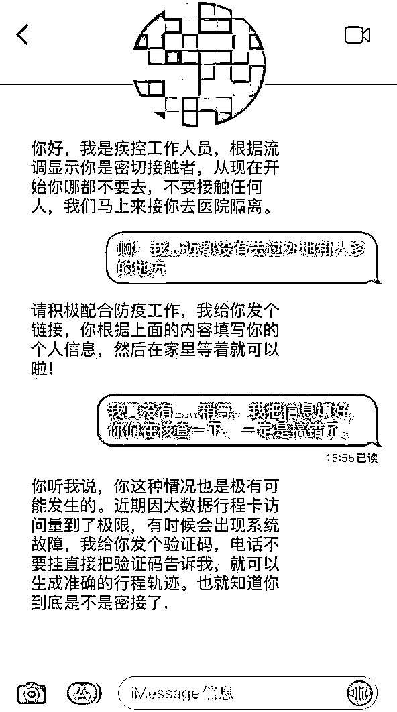
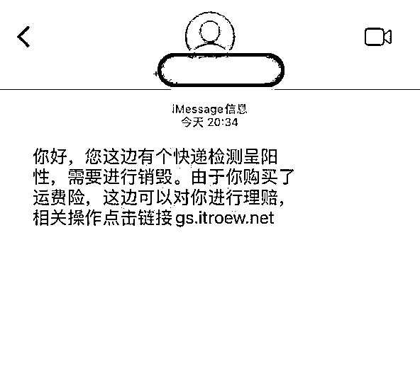
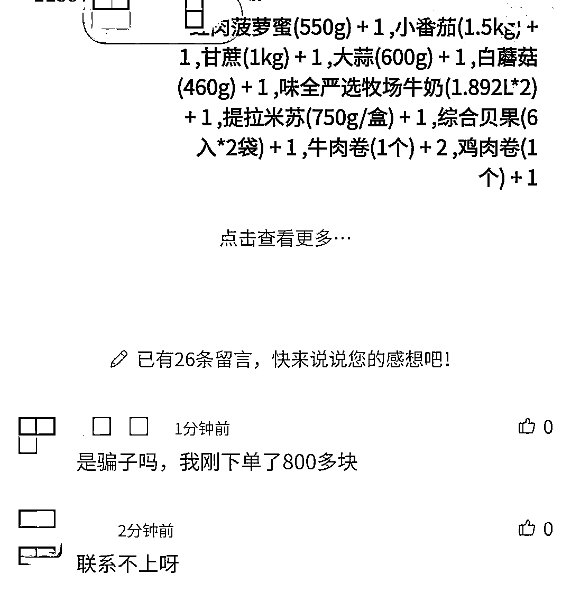
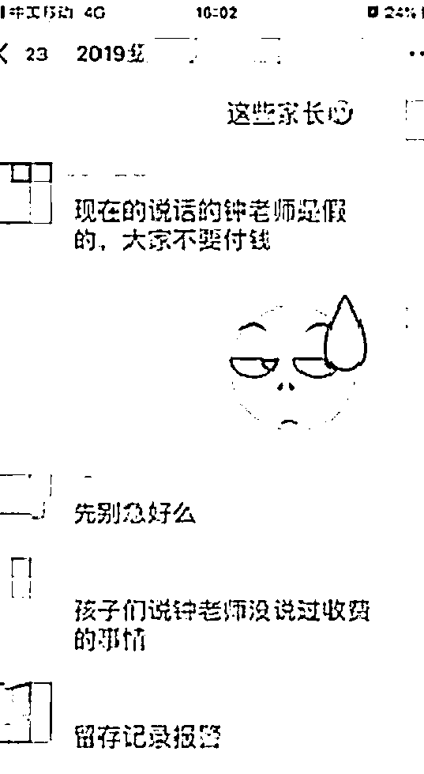

# 突然成了密接？小心！

> 原文：[`mp.weixin.qq.com/s?__biz=MzIyMDYwMTk0Mw==&mid=2247533545&idx=3&sn=91e3a581bda07761427d781347a441b6&chksm=97cb88d1a0bc01c7df036b52cb9c74726f010e5caab40887b906a32c58409018f2b62ef086c7&scene=27#wechat_redirect`](http://mp.weixin.qq.com/s?__biz=MzIyMDYwMTk0Mw==&mid=2247533545&idx=3&sn=91e3a581bda07761427d781347a441b6&chksm=97cb88d1a0bc01c7df036b52cb9c74726f010e5caab40887b906a32c58409018f2b62ef086c7&scene=27#wechat_redirect)

近来有不法分子假冒防疫中心工作人员通知“密接者”，将钓鱼短信包装成防疫提示诱导事主点击；在网上发布居家隔离买菜难可代购的信息，诱骗被害人点击链接或扫码付款；或冒充快递公司，以“快递检测呈阳性需销毁同时理赔”为由进而诈骗事主。

警方就此提示大家：**谨防疫情期间最新诈骗套路！**

**套路一**

诈骗者冒充防疫中心工作人员，**以受害者是“密切接触者”为由，向受害者发送钓鱼链接短信，诱导受害者点击链接填写个人信息**。他们还会询问受害者最近接触过的相关人员姓名和电话号码，索要身份证号码等相关信息，然后再对其他人进行骚扰。

警方提醒居民们要警惕，疫情期间有不法分子冒充“权威部门机构”，将钓鱼短信包装成各类防疫提示，或谎称疫情防控工作人员，非法获取公民个人信息。而开展核酸检测，不会要求您填写银行卡，手机验证码等敏感信息。

无论骗子冒用任何机关的名义，**骗局的最后一步一定是诱导填写银行卡号、密码、手机验证码，甚至直接转账**。所以，不要点击可疑链接，不轻易透露个人信息、银行卡信息、验证码等，切勿上当。

**套路二**

**“快递检测呈阳性，需要销毁，同时可以进行理赔。”**有不法分子假冒快递公司来电，进而引导事主下载软件填写银行卡号，验证码以及支付密码。

在此警方提示大家，**网购商品有任何问题，一定要通过官方 App 或网站进行联系**，涉及身份证号、银行卡号、验证码和密码等信息，务必谨慎；也可拨打各快递公司官方服务电话咨询，千万勿听信所谓的“客服”人员，随意添加其微信、QQ，听从对方进行转账、汇款、扫码支付等。

**套路三**

诈骗分子利用疫情期间市民买菜难、对生活物资急需的心理，**利用微信群、网站链接及小程序等发布代购物资的信息**。后利用网络推手留言诱导急需物资的市民上当受骗，以**“要交税”“付押金”**等理由，避开正规第三方支付平台，要求被害人通过微信私下转款、扫码交易。还会编造收取运费、收取定金优先发货等理由，诱骗被害人继续转账汇款，一旦被害人付款成功，立即就会被拉黑。

警方提醒居民在购买蔬菜等生活物资请通过官方渠道订购，**切勿轻信添加、下载、点击来历不明微信群、小程序和不明链接等**，在购置物品交纳货款之前一定要核实对方身份。

**套路四**

诈骗分子冒充学校老师、教职员工“潜入”班级群，在群中发布二维码或者提供银行账号，**以交纳班费、学费、教材费等为由，通知家长转账付款购买“教材”**， 或者在网络课堂中插入链接，引诱学生点击从而套取银行卡、微信、支付宝等密码，骗取财物。等到真正老师核实澄清或家长与老师沟通发现破绽时，诈骗分子已得逞。

在此警方提醒大家，对确有需要通过网上支付的合规收费事项，**建议学生和家长要与学校老师进行沟通确认，不可盲目进行网上支付**。

来源：山东公安，公安部网安局、山东反诈骗中心

← 向右滑动与灰产圈互动交流 →

