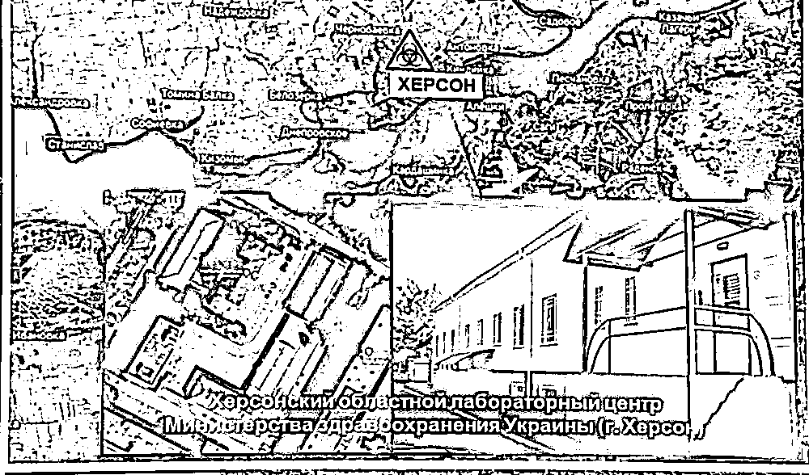
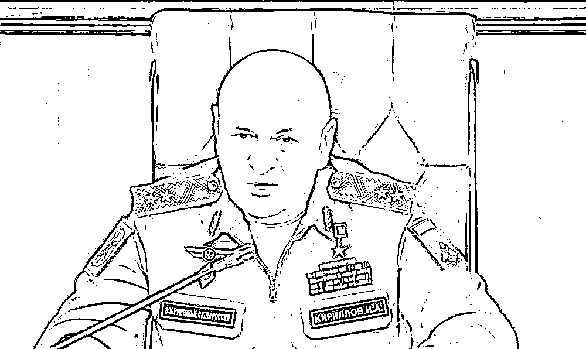
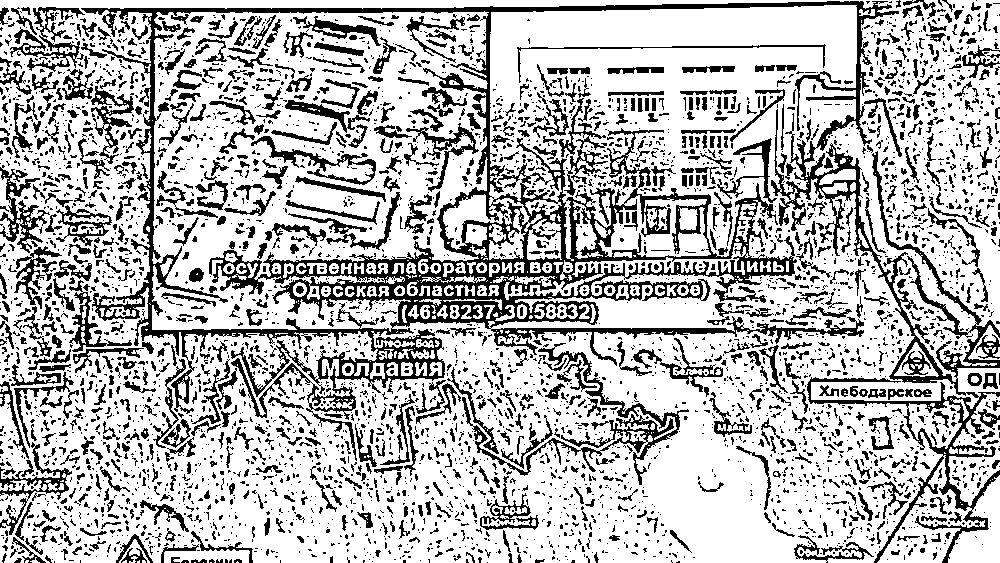

# 乌克兰前安全官员爆料！

> 原文：[`mp.weixin.qq.com/s?__biz=MzIyMDYwMTk0Mw==&mid=2247533545&idx=4&sn=f5849e84943d063dff819871f310a8d3&chksm=97cb88d1a0bc01c7b8255ace69ff687f6f044afcd7f6f15adad13b6d74a17373da7f4e4d6d46&scene=27#wechat_redirect`](http://mp.weixin.qq.com/s?__biz=MzIyMDYwMTk0Mw==&mid=2247533545&idx=4&sn=f5849e84943d063dff819871f310a8d3&chksm=97cb88d1a0bc01c7b8255ace69ff687f6f044afcd7f6f15adad13b6d74a17373da7f4e4d6d46&scene=27#wechat_redirect)

[`mp.weixin.qq.com/mp/readtemplate?t=pages/video_player_tmpl&action=mpvideo&auto=0&vid=wxv_2351225663674040321`](https://mp.weixin.qq.com/mp/readtemplate?t=pages/video_player_tmpl&action=mpvideo&auto=0&vid=wxv_2351225663674040321)

**全球连线丨乌前安全官员爆料美主导生物实验室：不能只听美国官方回复**

近日，自称为乌克兰前安全官员的瓦西里·普罗佐罗夫披露，**美国主导的乌克兰生物实验室长期从事秘密研究，相关研究活动对乌本国及其他国家人民构成潜在威胁，而乌克兰人民却长期对此一无所知。**相关内容被俄罗斯媒体广泛报道。新华社记者日前对他进行了视频专访。

**“我很担心病毒从（美国主导的这些）实验室泄漏出来，那不仅对乌克兰是灭顶之灾，至少对整个欧洲来说后果也难以想象。”**普罗佐罗夫说。他建议派国际专家组前往这些生物实验室进行核查。

对普罗佐罗夫披露的内容，新华社记者无法进行核实。

俄军辐射、化学和生物防护部队司令基里洛夫 3 月 17 日表示，俄国防部从乌克兰生物实验室工作人员处获取的文件表明，美国与其北约盟友在乌境内开展了生物军事项目。新华社/卫星社

**“乌克兰科学界的代表们**

**也无法进入这些设施”**

普罗佐罗夫介绍说，自己曾长期在乌克兰国家安全局工作，2014 年后曾在乌首都基辅的乌克兰国家安全局反恐中心工作 4 年。他在工作中接触到一些有关美国在乌生物实验室活动的文件。“**我确****信，乌克兰境内这些实验室的活动对乌克兰人民和其他国家人民都构成潜在威胁****。**”

普罗佐罗夫说，根据美国防部与乌卫生部 2005 年签署的生物安全合作协议，美方首先对乌境内一些生物实验室进行现代化改造，之后完全将这些实验室的活动纳入己方主导。“2005 年以来，美国开始与乌克兰合作，曾积极游说建立一个中央参考实验室，那里需要收集所有最活跃的菌株和特别危险的传染病病原体。”

最终，在 2014 年后美国成功游说乌克兰创建了一个存有病原体和极度危险物质的储存库。“事实上，自苏联时期以来，大量传染病病原样本一直保存在那里。2010 年这些传染病病原样本估价为 20 亿美元，2014 年之后美方将最有价值的样本带往美国。”

“到后来，乌克兰科学界的代表们也无法进入这些设施，无法确保那里没有进行违禁的研究活动。**他们根本不被允许进入那里，理由是这些实验室是高危险和高保密级别的场所。而与此同时，美国国防部和承包商的代表却可以正常进入这些实验室从事研发工****作。”**

**他说，自己手头掌握的一些文件，如关于“UP-4”（UP 是“乌克兰项目”的缩写）和“UP-5”项目的文件，上面明确无误地写着相关项目负责人的名字。“这些人不是乌克兰公民，他们是美国科研人员，具体而言，他们是来自美国路易斯维尔大学、美国陆军传染病医学研究所和其他医疗机构的医生。”**

****

**俄军辐射、化学和生物防护部队司令基里洛夫 3 月 17 日表示，俄国防部从乌克兰生物实验室工作人员处获取的文件表明，美国与其北约盟友在乌境内开展了生物军事项目。新华社/卫星社**

****“乌克兰老百姓不知道****

****他们与危险病原体比邻而居”****

**普罗佐罗夫表示，乌克兰人民长期对这些美乌合作生物实验室的活动一无所知。他说：“即使乌克兰最高拉达的议员试图了解这些问题，他们也一无所获。也就是说，实验室活动的机密内幕使立法机构代表也无法探究内情。**乌克兰老百姓与这些实验室比邻而居，对邻近街区进行鼠疫、霍乱和炭疽等危险病原体研究完全不知情。”****

******谈及这些生物实验室的安全性，普罗佐罗夫称，虽然由于严格的保密制度，目前没有明确的关于实验室泄漏的书面记录，但 2014 年以来，乌克兰传染病暴发数量激增确有其事。“比如麻疹，这种疾病早就没有了，但在 2018-2019 年数万乃至数十万人罹患麻疹，并有人员死亡。奇怪的巧合是，美国（主导的）乌克兰生物实验室所在的地区染病人数最多。”******

******据普罗佐罗夫介绍，美国在乌克兰实验室的工作计划非常庞大，人们只可能知道这些实验室活动部分信息。“不过，我们确定和掌握的信息都清楚地表明，美国的军事科学家、美国防部和承包商的代表在乌克兰从事了生物武器研究，其中也许包括选择型功效研究，就是对各种类型的基因组施加影响的研究。”******

******他认为，受生物武器影响的客体大致可分为人、动物和植物三类，因此制造生物武器未必需要培育能致人死命的病原体，也可能是导致动物和植物大量死亡的病原体。如果使用生物武器对某国这三种类型的影响客体发动袭击，会让对方不得不付出巨大努力以控制感染源和疫情蔓延，并动用海量资源来添置药品、保障人力、确保医院运行并新建医疗中心，这一切会侵蚀该国的经济和国防实力。“因此，**我认为生物武器首先是一种进攻性和侵略性武器。**此外，生物武器当然也是实施恐怖主义行为的武器”。******

********

****俄军辐射、化学和生物防护部队司令基里洛夫 3 月 17 日表示，俄国防部从乌克兰生物实验室工作人员处获取的文件表明，美国与其北约盟友在乌境内开展了生物军事项目。新华社/卫星社****

******“应当成立国际委员会******

******对这些实验室进行核查”******

****现有公开信息显示，2019 年 3 月底，普罗佐罗夫曾在俄罗斯首都莫斯科召开新闻发布会，爆料了一些乌方的涉密信息。同一天，乌克兰媒体援引乌国家安全局新闻处的消息说，普罗佐罗夫已被开除，理由是其经常在上班时间饮酒。****

****普罗佐罗夫表示，自己 2018 年后已不再供职于乌国家安全局，但仍能通过自己的消息源获取相关文件。“譬如，我设法与卫生部的官员取得联系，他们为我提供了涉及这个问题的相关文件。”“我掌握的文件包括我在安全局工作期间得到的，以及 2018 年之后我通过自己的消息源获取的。我完全相信这些文件和消息源的可靠性，为此，我愿意上法庭作证。”****

****二战期间，侵华日军曾在中国设立 731 部队进行生化武器研究。普罗佐罗夫说，日本这类生物武器研究导致很多中国战俘和平民死亡，成千上万的受害者成了日本病毒学和生物学研究者的实验品。“战后，虽然哈巴罗夫斯克法庭对日本 731 部队军官进行审判，但后来美国方面把他们全都带走了。据我所知，从解密的资料来看，他们都在美国国防部专门从事生物武器研究的德特里克堡基地开始了新工作。因此，美国人现在正重走日本刽子手的老路也就不足为奇了。”****

****普罗佐罗夫认为，国际社会应当要求美国提供有关乌克兰及在原苏联多个加盟共和国境内相关生物实验室活动的全部信息，并派国际专家组前往这些生物实验室进行核查。“**不能局限于美国的官方答复，应当成立一个有外国代表参与的国际委员会，对这些实验室进行核查……如果事实证明美方进行了新型生物武器研发，那么国际社会应该对美国采取最严厉的制裁，因为这是《禁止生物武器公约》明确禁止的。**”****

****“据我所知，美国方面已将所有研究成果、菌株和病原体样本从乌克兰运出。我们应该问问美国和美国人。应当向那里（美国在中亚地区主导的实验室）派遣专家并要求当地政府和美方监护人允许国际专家进入实验室核查，就像国际原子能机构专家能够对全世界核设施进行核查，或者禁止化学武器组织专家能够前往各国对疑似存有化学武器和从事化武研发的设施进行核查一样。此外，《禁止生物武器公约》同样应该拥有国际专家组和监管机构。不幸的是，因美国的反对无法组建类似机构，事实就是这样。**除了派遣能够核查真相的国际专家组，我们别无选择。”******

******来源：新华社******

************

******← 向右滑动与灰产圈互动交流 →******

************