# “发育宝”下架涉事猫粮，公开道歉！

> 原文：[`mp.weixin.qq.com/s?__biz=MzIyMDYwMTk0Mw==&mid=2247533545&idx=5&sn=7da1495cd3b3d0bcef50d05efc8e91a2&chksm=97cb88d1a0bc01c7c3e402c5f3005af92b1d31bbeed47e125069d895454a5647c868dcd1e43e&scene=27#wechat_redirect`](http://mp.weixin.qq.com/s?__biz=MzIyMDYwMTk0Mw==&mid=2247533545&idx=5&sn=7da1495cd3b3d0bcef50d05efc8e91a2&chksm=97cb88d1a0bc01c7c3e402c5f3005af92b1d31bbeed47e125069d895454a5647c868dcd1e43e&scene=27#wechat_redirect)

近日，

有消费者反映， 

**180 余只小猫在食用**

**信元发育宝猫粮后出现不良反应。**

**近百只宠物猫在食用同批次猫粮后死亡**

北京的徐女士是受害猫主人之一，

她讲述了自家宠物猫食用发育宝猫粮后

从发病到死亡的过程。 

1

2 月 11 日

徐女士在淘宝信元旗舰店购买了信元发育宝“饕餮”系列、1 月 8 日生产批次的猫粮；

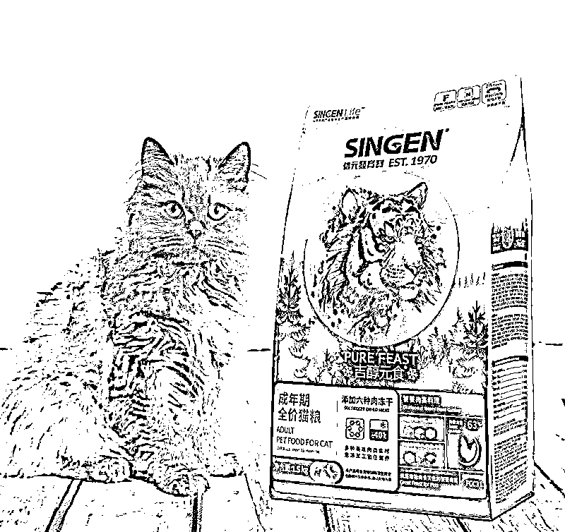

2

3 月 25 日

徐女士的宠物猫出现食欲不振、精神不好的情况，随后多次就医；

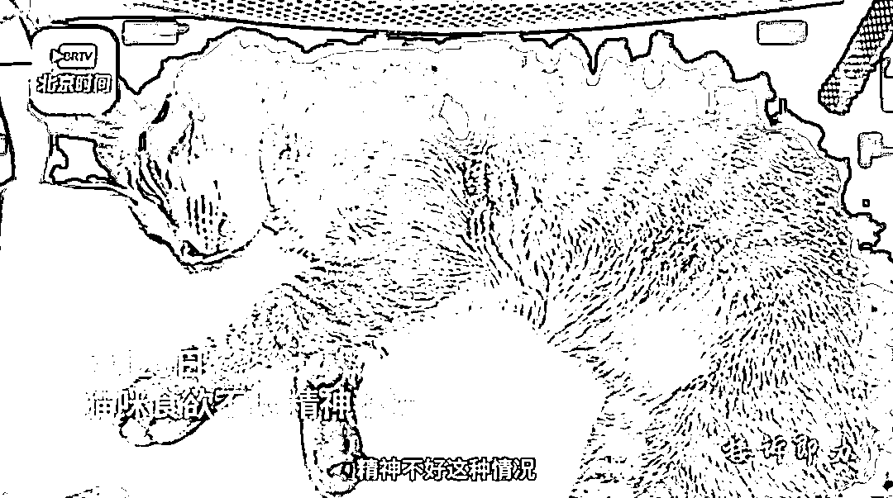

3

3 月 28 日

宠物医院的检查结果显示，小猫肝脏受损严重；

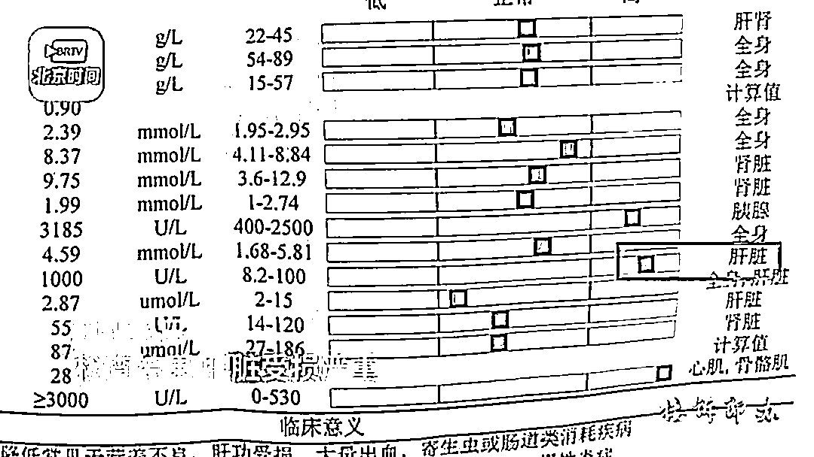

4

4 月 6 日

宠物猫出现小便失禁、呼吸困难的情况；

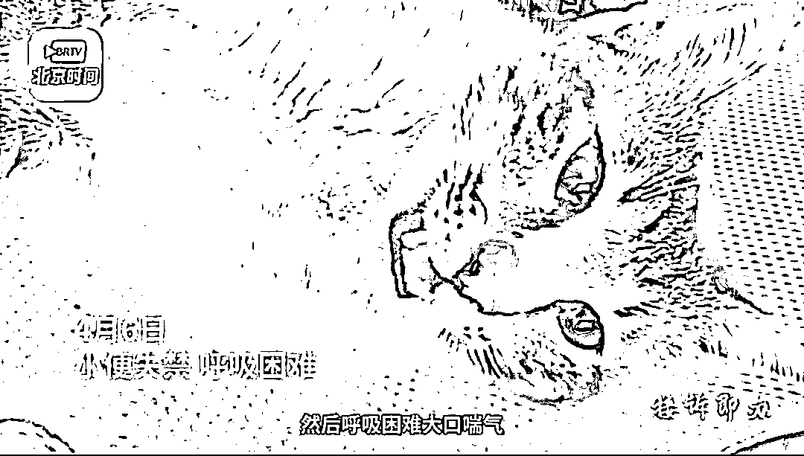

5

4 月 7 日

宠物猫在就医路上不幸“离世”。

徐女士在网络上发现，

有许多购买同品牌、同批次猫粮的

消费者也有相同遭遇，

**目前已涉及到 180 只小猫，**

**有 70 多只小猫离世。**

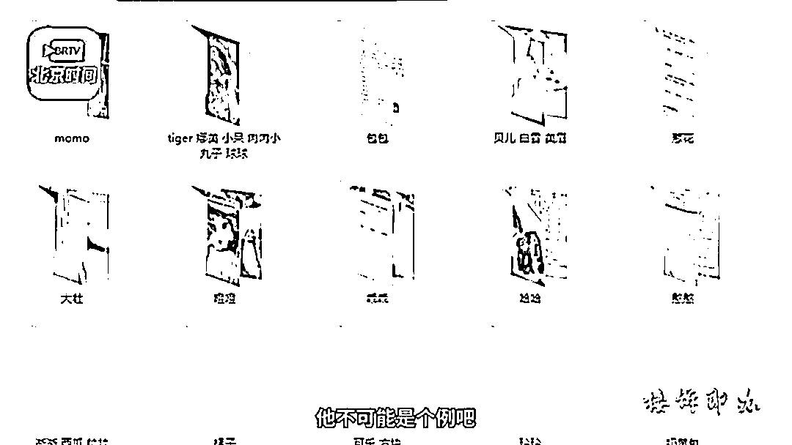

而据其他媒体报道， 

发育宝的问题猫粮

已涉及 269 只猫咪。 

有消费者称：

“（宠物）发病很迅猛，

两三天就没了。”

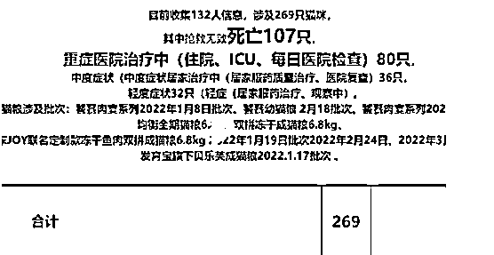

[`mp.weixin.qq.com/mp/readtemplate?t=pages/video_player_tmpl&action=mpvideo&auto=0&vid=wxv_2352928548614701058`](https://mp.weixin.qq.com/mp/readtemplate?t=pages/video_player_tmpl&action=mpvideo&auto=0&vid=wxv_2352928548614701058)

**大量宠物猫病亡，谁来负责？**

信元发育宝公司的售后表示，

**公司已将对应批次猫粮送检，**

**还在等待检测报告。**

**猫粮如果有问题，**

**公司会给大家说法。**

就发育宝猫粮“翻车”事件，

记者也联系了淘宝售后客服。

客服表示，

**平台会对上架产品进行审核处理，**

**但她并不清楚审核流程。**

在视频中，

徐女士表达了她的诉求： 

**希望信元发育宝公司**

**公开猫粮检测过程，**

**接受第三方监督；**

**希望信元发育宝公司**

**主动联系消费者停止喂食，** 

**避免更多小猫受到伤害。**

**信元发育宝公司回应**

**4 月 10 日，**

**信元发育宝公司在其官方微博上**

**发布了关于**

**“饕餮成猫粮”事件（2022 年 1 月 8 日生产批次）**

**的致歉声明，**

****称已通知相关客户****

****下架并暂停该品的销售，****

****关联产品回样已送检；**** 

****购买相关产品的客户如有疑虑，****

****可联系信元售后客服，****

****可无条件退款或者更换其他产品。**** 

**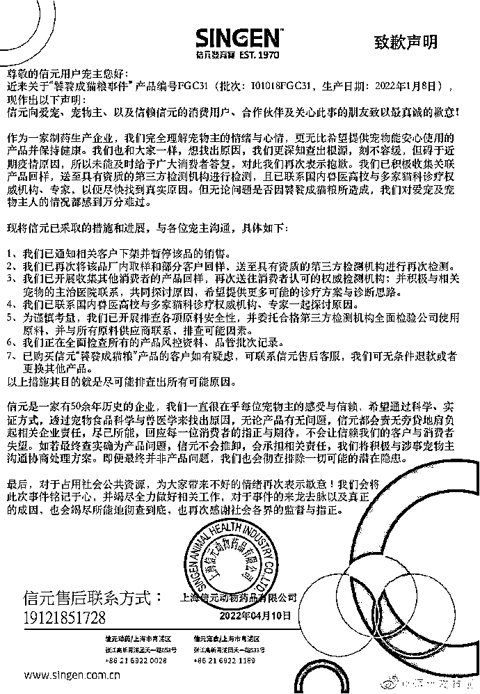**

**4 月 11 日、12 日，** 

**信元发育宝官微发布了**

**《信元与宠物主治医师、宠物主关于诊疗方案的沟通》**

**1.1 与 1.2 两条博文，** 

**其中提到了国内权威猫科医师们对案例的评估与研究，** 

**并提出了诊断思路与诊疗方案参考。**

**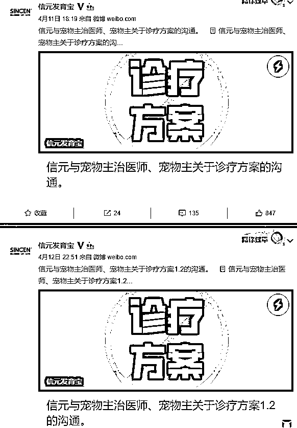**

**4 月 13 日，** 

**信元发育宝官微发布了**

**《关于“饕餮成猫粮”事件第一阶段处理方案沟通函》，**

****称目前仍旧未找到相关原因，**** 

****对于发病机制、造成原因都仍未明；**** 

****函中提到救治猫是目前第一要务。****

**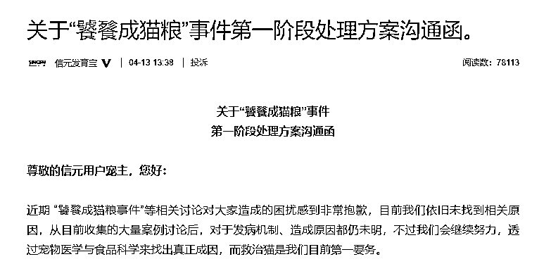**

**此外，** 

**记者注意到，** 

**在 2022 年“3·15 国际消费者权益日”，**

**信元发育宝曾获**

**“全国宠物食品行业质量领先品牌”称号。**

**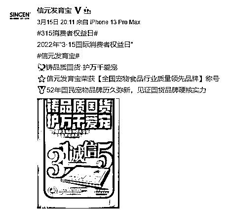**

****养宠网友纷纷表示“揪心”****

********

****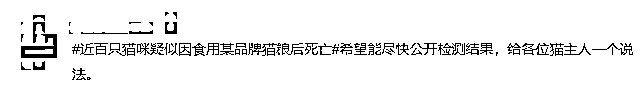****

****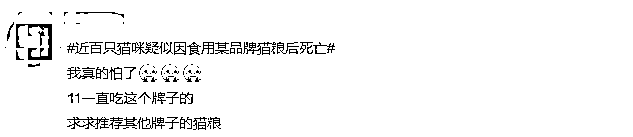****

********

****来源：央视网综合北京时间、大象新闻、信元发育宝官方微博****

********

****← 向右滑动与灰产圈互动交流 →****

********