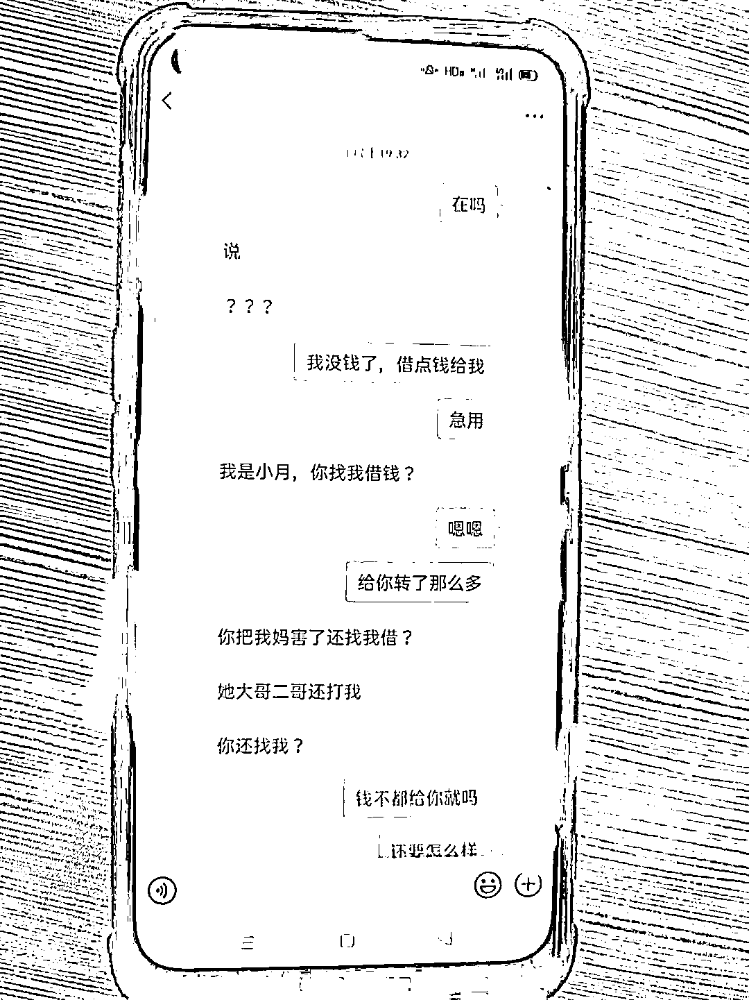
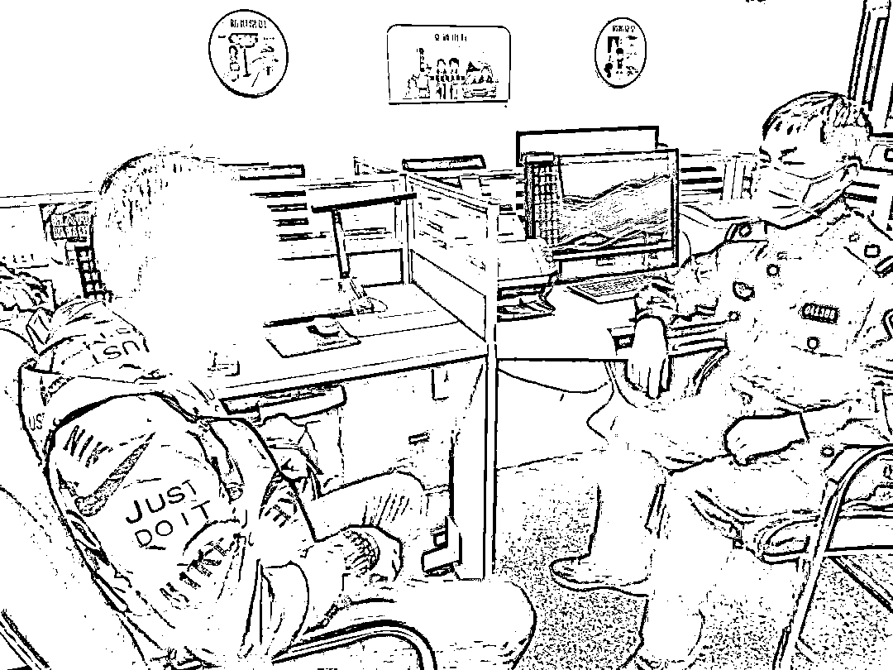
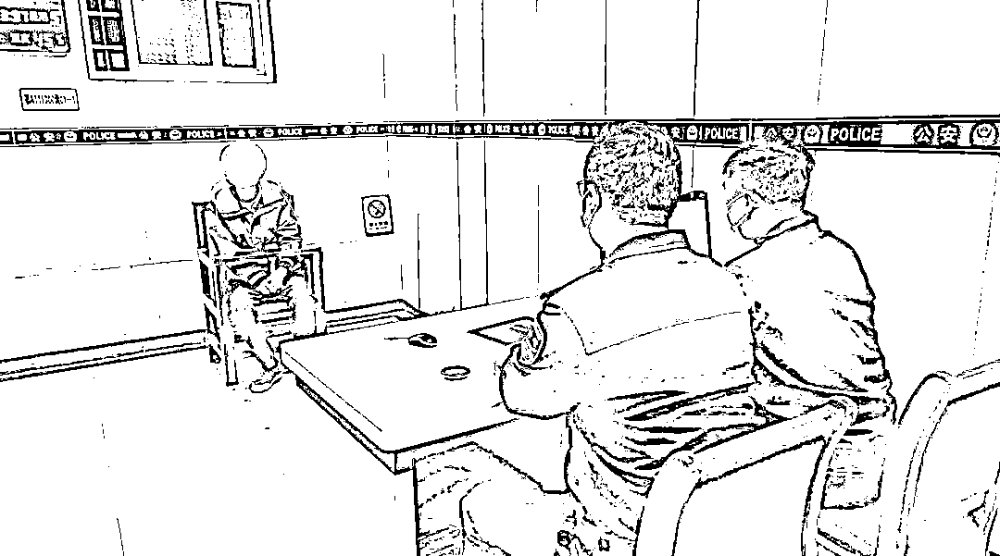

# 女友和闺蜜相继爱上你？快醒醒吧！

> 原文：[`mp.weixin.qq.com/s?__biz=MzIyMDYwMTk0Mw==&mid=2247533545&idx=6&sn=73e3a74b950af2031d1baa1fab34c4c6&chksm=97cb88d1a0bc01c722930539000f78ba4d0af54a1ca83332b372ea443f63d607b44c5846699c&scene=27#wechat_redirect`](http://mp.weixin.qq.com/s?__biz=MzIyMDYwMTk0Mw==&mid=2247533545&idx=6&sn=73e3a74b950af2031d1baa1fab34c4c6&chksm=97cb88d1a0bc01c722930539000f78ba4d0af54a1ca83332b372ea443f63d607b44c5846699c&scene=27#wechat_redirect)

本以为走了桃花运

在网上遇到温柔美丽的“女友”

还与“女友闺蜜”玩暧昧

殊不知“她俩”竟是男儿身

还由同一人分饰

男子不仅赔了感情还折了财

4 月 11 日

湖北省武汉市公安局黄陂区分局

通报了这起诈骗案件侦破始末

[`mp.weixin.qq.com/mp/readtemplate?t=pages/video_player_tmpl&action=mpvideo&auto=0&vid=wxv_2351417161702801409`](https://mp.weixin.qq.com/mp/readtemplate?t=pages/video_player_tmpl&action=mpvideo&auto=0&vid=wxv_2351417161702801409)

**天上掉下个“杨妹妹”？**

**27 岁的小武性格内敛，在自家附近一物流园内工作。2021 年 7 月，小武的 QQ 突然收到一网名为“夕月颜”的陌生好友申请。通过申请后，对方自称“杨月”，26 岁，在武汉市内某商场做销售。**

**这样的坦诚让小武卸下了防备，两人很快便陷入热聊。杨月的热情主动更是让单身的小武日渐生情，两人关系慢慢从暧昧发展成恋爱。其间，小武提出电话或视频通话要求，均被杨月以工作忙不方便等理由拒绝，陶醉在爱情甜蜜里的小武并未起疑。**

**“她第一次找我要钱是说家人生病了，我就给她转了七八百块钱。”小武对第一次被“女友”要钱的情形记忆犹新。**

**殊不知，骗局才刚刚开始。**

**此后，杨月经常以逛街买东西、买化妆品等理由向小武要钱，小武也都会发去几十元到几百元、几千元不等的红包。**

**有一次，杨月突然告知小武，自己妈妈看到他们露骨的聊天信息后非常生气。**

**为此，小武特地发了 1500 元的红包安慰她。**

****

****小武和杨月微信聊天记录****

****天上又掉下个“杨妹妹”？****

****今年年初，杨月称手机坏了，暂时要与同住的闺蜜“杨语潇”共用一部手机，小武因此结识了她的闺蜜。****

****就这样，小武不仅与杨月继续交往，一来二往间又与其闺蜜关系变得暧昧。一时间，小武以为自己桃花运爆棚，深陷与杨语潇暧昧的刺激中。面对杨语潇与“女友”如出一辙的要钱借口，小武没有多想，照单全收。****

****今年 3 月底，杨月发现小武与闺蜜有染后十分生气，“将闺蜜杨语潇打伤”，并与小武正式分手。即便如此，小武仍未发现破绽。****

****虽然失去了杨月，新“女友”杨语潇依旧与他关系火热。为了稳固这段感情，小武还拿出 1500 元替杨语潇疗伤。****

******“杨妹妹”竟是抠脚大汉？******

******突然变得入不敷出，常常还要向家中要钱的小武引起了家人怀疑。一再逼问下，小武这才向家人道出了与杨月、杨语潇二人网恋的事情。******

******“聊了半年多，连面都没见，钱花了不少，这不是诈骗是什么？”3 月 31 日，小武在姐姐的陪同下到武汉市公安局黄陂区分局天河街派出所报了警，说起弟弟的遭遇，姐姐又气又恨，希望民警帮忙追回弟弟被骗走的 3 万余元。******

************

********图为小武到公安机关报案。梅胭 摄********

******为弄清事情真相，民警张定辉决定先让小武尝试与对方通过电话或视频联系。电话一再被挂断后，民警查看小武与对方的聊天记录，初步判定小武遭遇了婚恋诈骗，并且小武已将到派出所报警的事告知了对方。******

******见状，民警只好直接表明警察身份，一番软硬兼施，对方终于接通民警电话，可沉默许久后，电话那头居然传来清晰的男声。******

******在场众人震惊：“怎么还是个男的？”******

******电话里的男子承认自己就是报警人小武网恋多时的“女友”。不仅如此，所谓的杨月和杨语潇都是由他一人扮演。4 月 1 日，该男子在父亲陪同下被传唤到派出所配合调查。******

********“杨妹妹”还是惯犯？********

******在天河街派出所，小武第一次见到了心心念念的“女友”。望着眼前的男子，他一度不敢置信，仍幻想一切都是误会。******

************

********图为小武和冯某（右）在派出所相遇。梅胭 摄********

****民警张定辉介绍，嫌疑男子冯某今年 30 岁，黄陂区人，在汉南某商场做分拣员，此前因盗窃和赌博多次被拘留。因常年孤身在外，家人对他的所作所为毫不知情。****

****民警联系冯某父亲帮忙劝说冯某到派出所配合调查时，他怎么都不愿相信儿子会在网上搞婚恋诈骗，一再称儿子冯某是个“老实吖”。****

****调查过程中，民警发现冯某很狡猾，很多情况都是在证据无法狡辩的情况下才如实交代。他特意找来某游戏主播照片，将自己的交友软件伪装成女性账号，利用受害人渴望爱情以及猎奇心理，以女性口吻交友聊天，一步步引其上钩后再以各种理由骗取钱财。****

********

******图为公安机关审讯嫌疑人冯某。梅胭 摄******

****被冯某骗的远不只小武。早在 2020 年 5 月，他就曾以同样的方式骗了武昌一网名为“幸福男孩”的网友共计 2200 余元。****

****目前，冯某因涉嫌诈骗已被公安机关依法采取刑事强制措施。****

## ****来源：法制日报，邯郸市反诈中心****

********

****← 向右滑动与灰产圈互动交流 →****

********