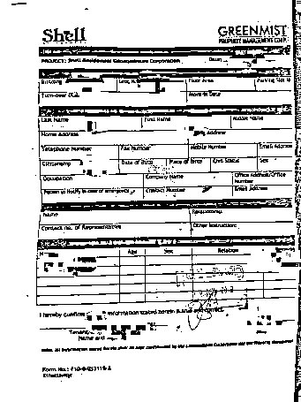

# 诈骗中心不只缅北，我在菲律宾的亡命经历

> 原文：[`mp.weixin.qq.com/s?__biz=MzIyMDYwMTk0Mw==&mid=2247533633&idx=1&sn=2098c7c28210ddc35c81e81f0eb56361&chksm=97cb8f79a0bc066f11d652d2888072a37e59e930220a45595625f1fc2ea515eb627d8ea98215&scene=27#wechat_redirect`](http://mp.weixin.qq.com/s?__biz=MzIyMDYwMTk0Mw==&mid=2247533633&idx=1&sn=2098c7c28210ddc35c81e81f0eb56361&chksm=97cb8f79a0bc066f11d652d2888072a37e59e930220a45595625f1fc2ea515eb627d8ea98215&scene=27#wechat_redirect)

缅北“血奴”事件发生后，每次刷到相关新闻我都会想起过去一年在菲律宾务工的工作经验，犹豫再三决定还是分享自己的故事，没有多惊心动魄，有的只是平静过后的后悔，以及漫长的等待，等待那一纸审判。 

2019 年 11 月，经朋友介绍我前往菲律宾做 UI（界面交互设计），当时乘坐的是廉价的亚航，机票只需要 274 元。下飞机后我并没有见到我朋友，而是见到一个司机，在司机带领下，我见到一大群年轻的中国人，男生居多，司机引导我很快入境了菲律宾。

刚开始我以为这一大群人都是我将入职的公司招聘过去的，没想到一路上七绕八绕，最终把我送到地方时，只有我一个人下车。酒店门口两个挎着真枪的保安让我意识到，我脚下这片土地，并不安全。

等待了半小时，终于见到了姗姗来迟的行政，他帮助我办理好入住后，嘱咐我入住单拍照保存好。

<shape type="#_x0000_t75" filled="f"><imagedata title="image1"></imagedata></shape>

入住的酒店，门口装备真枪实弹的保安 

酒店入住凭证，无法出示将不能进入酒店 

在酒店简短休息 2 小时后，下午两点我被带去公司，公司距离很近，只隔着一条马路，但行政还是叫车把我们送了过去。路上他介绍 “公司上下班 24 小时都有车辆接送，不要觉得距离近就不叫车，附近很多当地小孩，会抢东西” 我点点头，轻说了一声好。

到达公司大楼后需要在前台做登记，我掏出手机查资料时，由于信号不好下意识举高晃了晃，旁边保安以为我拍照，马上过来制止了我，一番解释后，行政对我说“这边严禁拍照，出入一定要带好工牌，不然进不来”。

至此，到达异国的最后一丝兴奋消失殆尽，心里只想着，干活，攒钱，还信用卡。

公司楼下，对面密密麻麻的房间就是宿舍楼

公司周边

在公司我终于见到了我的朋友，他在那边做了个小管理，没有国内的客套跟画大饼，交代了我两句之后让我取个花名，就把我丢给组员熟悉工作流程，毕竟薪资待遇都是国内聊好再过来的。

我所在的组是开发引流产品，也就是所谓的低风险组，没有开始正式运营，也就是没有到变现阶段，我的工作就是不停设计马甲包 UI，这些马甲包成功上架后公司会买量进行推广投放，等圈了一定目标用户后，马甲包功能关闭，强制用户升级更新版本，更新后的就是主包，即为涉及棋牌、博彩的 App。

所谓高风险的组就是正在运营的主包，有用户在 App 上玩棋牌、博彩，有技术维护后台，有客服维护用户，有运营不断更新活动刺激用户充值投注更多钱，同样的，他们有绩效，工资收益也更高，工作时间也更长。

跟缅北事件不同，或者说跟大部分网络流传的遭遇有区别，我遇到的这家公司确确实实属于博彩公司。其实可以这样说，马尼拉中国人办的公司，无论大小，都涉及灰色产业，其中电信诈骗占一大半，网络赌博占一大部分，色情直播、信息三件套、个人微信 QQ 支付宝账号、洗黑钱换汇的又占一部分，哪怕是那边的外卖平台，都会出售你的个人信息给中介，所以后面听多了，当发现这家公司不会限制你的人生自由，没有殴打谩骂，工资每月 10 号按时发放现金披索，每周休息一天去哪都行之后，我竟然有一种很幸运的感觉。

除了上班要缴手机、公司大楼不允许拍照、办公使用花名不允许透露真名之外，工作时间久了，一切都让你产生在国内的错觉，但仅仅是短期而已，长期生活，周遭的人事物，统统会告诉你，这样的工作、这样的环境，有多不正常。

菲律宾披索硬币及纸币

疫情前菲律宾的圣诞节商场大促

临近新年，菲律宾本地明星来到中国城演出

在菲华人常去的中国城 

在菲律宾的工作枯燥又漫长，我把这段时间分为【疫情前】和【疫情后】。武汉疫情爆发后，国内人心惶惶，国外有不少幸灾乐祸的。当时菲律宾还没有疫情，大楼所有人早中晚都一起在六楼吃饭，多的时候估摸五六百人在一块吃饭，讨论的大多是国内疫情以及国外流传的各种阴谋论。

可能你们不信，这有什么幸灾乐祸的？不应该关心、尽自己一份力么？但海外的环境是这样的，出海的大部分在国内身负债务，小部分有前科，前者解决债务后又因为来钱快而回不去国内的生活，从而又返回到菲律宾；后者在国内只能从事个体户或者打零工，应付不了个人及家庭开支，所以只能一直待在海外，加上从事的都是博彩行业，这些人汇在一起，相互认可相互取暖，从精神层面，已经没有作为中国人的特质了，道德感极低。

而且我认识的在国内已婚的人，在海外百分百都出轨，富裕的不止包养一个人。另外由于本地服务业（主要指餐馆按摩店理发店超市酒店清洁）的工作人员（我们都叫小菲）都有索要小费的习惯，而中国人通常又大方，所以这些底层人员服务态度特别好，这也让在菲的中国人产生了一种优越感。

当地人常坐的嘟嘟车，只需 20 披索就能上车，1 人民币=8.15 菲律宾披索，20 披索相当于 2.5 元 

抽烟区眺望的街景，白色的面包车都是周边各公司的用车

偷偷拍摄的食堂早餐、午餐

菲律宾当地最大的赌场，很多公司员工发了工资后过去赌博 

疫情后，菲律宾由于管理无效以及亲美政策，贫民窟人又多，很多确诊人数激增。公司大楼在 2020 年 3 月初封楼，所有人都只能在家办公，在公司的安排下，我开始了疫情后在宿舍办公的生活。

由于工作普通，我跟 1 个客服、2 个推广同住，酒店房间跟国内的布局还是差距不小的。整个房间呈长方形，一进门左边是厨房右边是厕所，然后是一张上下铺，一个隔板，里面再是一张上下铺，最里面是一个小阳台，不过不能晾晒衣服，被抓到保安会罚款 1000P~3000P（约合人民币 120~360）。由于空间狭小，即便严格规范，还是有不少人偷跑出去玩乐，这导致我们公司员工是酒店最快确诊得新冠的一批人之一。

这段时间我的经济压力挺大的，因为在宿舍就意味着自己解决吃喝，公司补贴的 1000 元完全不够用，菲律宾虽然贫穷但物价并不低，尤其是中国人聚集的马尼拉，消费更是高，我们宿舍从最开始的叫外卖（平均一餐 80 元）到叫菜自己做饭，不过短短一个月时间，因为消费实在太高。

水果更是贵的离谱，因为菲律宾只产热带水果，所以除了芒果香蕉很便宜之外，橘子橙子草莓都很贵，差不多是国内的 5~10 倍，我们经常戏言【中国人只坑中国人】因为我们使用的所有外卖平台，都是中国人开发的，点的所有外卖，加的都是中国老板的飞机号。在海外我们主流的通讯软甲就是 telegram，由于软件 logo 像纸飞机，所以都叫飞机号。

疫情后，酒店周围新增的保安 

宿舍办公阳台的风景，每个房间都住满中国人 

本地街景，相比不会马上死的新冠，吃饱饭对本地人更重要 

贫民窟 

超市水果物价，一个柚子/一盒脐橙需要人民币约 40 元，外卖平台点单更贵

3~5 天的买菜费用，约人民币 500 元 

疫情期间由于办公效率低下，老板让各项目负责人安排了好几次返回大楼办公的骚操作，最终因为确诊人数激增以及假疫苗事件无疾而终，直到我返回国内，公司员工依旧是在宿舍办公。

2020 年 8 月开始，流传称有一批福建到来的疫苗在马尼拉流通，老板花了大价钱采购，安排员工免费接种，一共两针，全部接种后分次安排返回大楼上班。疫苗接种的很快，不到三天，公司所有人就都已经安排完接种疫苗，我也打了，对比回国后接种的疫苗的感受，当时接种的疫苗真可谓假的可以，没有丝毫痛感，接种后拿盒子快测居然还是阴性，所以假疫苗事件爆发的很快，在第一批员工上班不到一周（一共分了四批，优先客服跟推广），还没轮上我组，就爆出接种的疫苗不是真疫苗，是葡萄糖，最后在确诊数据下，又返回了宿舍办公。

虽然办公不便，但疫情对当地的冲击显然要比中国大，由于国内管控的好，逐渐恢复了生机，国外就不同了。2020 年下半年，菲律宾疫情大部分时候每日都是过万的增长，而且这个统计数字并不准确，所以这个新增数只有更多，没有减少。

这个情况导致本地失业人数骤增，发生了不少抢砸中国人、中国人店铺的事件。公司随即发布减少外出的通知，但这并没有什么用，在我回国前，我所悉知的，公司员工发生了 5 起大额抢劫敲诈事件，其中最多的，就是仙人跳事件。

我宿舍隔壁住着公司平台技术组的开发，其中有一个安卓开发叫小舟，他在对外 招 ji 的时候被对方扣押，也就是我们常说的【仙人跳】。据同寝室的人说，小舟在疫情前就认识这个女的，是四川人，疫情后也约了两次，没想到这次就出事了。

据说女方约小舟在宿舍附近的酒店开房，小舟过去完事后房间来了三个男的，一个中国人，两个外国人，其中一人持枪，对方收了他的手机绑在凳子上，直接对他说 “抓奸成双，我老婆不能让你白嫖，五十万，你就可以出门，不然断第三条腿出门” 说完就等小舟做决定。

小舟原本以为是五十万披索，想着破财消灾，谁让自己好色，结果转去 50 万披索的人民币后，对方狮子大开口又说要五十万人民币，小舟说没有，就接着被威胁拿枪指着大腿，后来被迫查了所有银行卡支付宝微信余额，一共转账过去 17 万 6 千，完全被榨干才被放出来，手机也被拿走了。

出事后小舟告诉公司行政，希望报警能够追回这笔钱，行政跟他说菲律宾这类事情太多了，几百万的金店被抢之后都追不回来，更何况是中国人做局的仙人跳，报警之后能追回的概率几乎没有，加上转的是人民币，早被洗走了，根本没办法追回来，只能认栽。

回国前需要每日做的健康申报 

随着疫情迟迟不见转折，加上还完了信用卡，11 月，我决定回国。机票找的是票贩子，花了 28880 元，马尼拉-广州直达。终于熬到了回国时间，当时我所购买的南方航空的政策是【双阴+酒店两阴政策】也就是在马尼拉先进行血清+核酸检测，双阴之后拉去酒店隔离 3 天，这 3 天会再做两次核酸检测，等酒店这两次核酸也是阴性之后，才可以上飞机，这也是为了防止航班垄断所做的严格措施。

那三天可以说是我人生中最煎熬的三天，几乎没有睡过完整觉，非常焦虑，生怕上不了飞机，在酒店当时隔离的人群有两百多人，最后被检测结果刷下来三十多人，其中一大半是血清呈阳，这可能代表曾经感染过新冠自愈了，也可能是抽烟喝酒熬夜生病导致血清阳性，总之血清呈阳被刷的，每个航班占主流。

终于熬到回国那天，大家都全副武装穿着防护服，其中我看到有一队约莫七八个人，他们防护服上写着字，戴着手铐，听说是被遣返的，这让我回国的喜悦冲散了一些。突然想起临回国前，马尼拉有一家博彩大公司亚博被人攻破了服务器，数千在亚博上过班的人护照信息被泄露，因此被国内派出所打电话查询是否在菲从事网络赌博、电信诈骗工作，要求即刻返乡报道。

说实话，我也担心我的信息会被人泄露，被公安机关调查，这种担心，直到下飞机被安排坐上去佛山隔离酒店的车后，担心才渐渐淡去。

回国前排队做核酸、血清检测

回国隔离酒店免费赠送的物品 

在国内平淡过了两个月后，新工作也逐渐走上了正轨，但该来的，还是来了，哪怕内心深处一直有一个预期，真正来的时候，还是非常恐惧。

我是被区派出所民警在出租屋里被带去派出所的，出示了行程码及绿码后，我被收缴了手机搜了身，关在了派出所里，就跟打架斗殴小偷小摸的人关在一起，每间人数不等，基本都是 6、7 个人一间，铁栏杆围着，里面就一张长铁凳。

那些做完笔录确定案情要长期羁押的，手续下来做了核酸一般在被关的第三天就会被送走。我是在被关的第二天做的笔录，内容无非就是问我是否在菲律宾 xxx 公司上过班，知不知道那家公司是做什么的，我在那边的工作内容等等，对完笔录按完指纹后，我被拉去录入了个人信息，身高体重声纹眼纹这些，然后我想 24 小时内就会放我出去吧。

第三天晚上，前一天给我做过笔录的警官过来找我，对我说 “你的案件不归我管，是山东那边立的案，明天山东的警方会过来带你去山东处理案情，你且等着。” 我当时就惊呆了，一是没想到我要被提去山东办案，二是没想到这件事远不远不是待 24 小时就能结束的。

我不知道这件事最终会是什么走向。几乎 24 小时没睡，我终于等到了山东的警官，一共有三个人过来提我，两个男生，一个女生，办完交接手续后，第四日凌晨，他给我戴上手铐，坐上出租，到了深圳北坐高铁去青岛。

我从来没想过坐高铁会如此难熬，由于戴着手铐，一路上被不少人关注，期间我问询过一次能否摘下口罩，我保证不会离开你们的视线范围，被拒绝后真的觉得做人的最后一丝自尊心被消磨掉了，加上连上厕所也是不允许关门被盯着的，那一刻，真的很后悔去过菲律宾。

抵达青岛后，并没有马上去派出所，而是坐警车约三个小时去了胶州，最后我被关在了胶州的派出所。第二天上午，我被拉去人民医院做了一次核酸，确定阴性之后当晚做了第一次笔录，同样的问题，同样回答，警官并没有说话，也没有告知离开派出所时间，他们回答我说，会对我说的话进行调查，之后，我继续被关在派出所。

可以说关在派出所是非常痛苦的，一日三餐都是馒头+咸菜，此外不能洗澡不能洗漱，就这样跟当地违法乱纪的人关在一起，一天 24 小时都有协警值班盯着你，不允许你大声交谈，不允许你额外做引人歧义的动作，上厕所必须有人看着，非常压抑。

关押第三天，没有消息，没人理你；

关押第七天，身边走了两批卖淫嫖娼的人，还是没有任何消息；

关押第十天，我开始睡不着，反复想着自己的口供，我知道自己说谎了，口供里我一直强调我不知道公司性质，我只是设计产品的，产品也没有上线运营，没有骗人也没有骗钱。但实际我知道公司性质，我确实为博彩公司服务了，我在知道公司性质的情况下，还是因为高收入去为他们服务，去为他们设计引流产品，这些产品最终都会走向变现。我就像刽子手的磨刀石一样，一下两下，把刀具磨的锃亮，我跟那些狗推，其实没两样。

关押第十五天，我再次被提讯，我交代了我认识的所有人，指认了公安机构破译的所有身份信息，最后我被通知可以取保候审，在缴纳了押金一万元后，我终于走出了派出所大门。

后来，我联系上了在菲的室友，得知我在回国后三个月，国内技术团队被端，服务器被破译，公司所有护照信息泄露，财务回国被抓，在菲因为机票、疫情、金钱等种种原因未能回国的员工，都接到了公安机构的电话，在惴惴不安中，等待回国的时机...

今年首次传讯收到的传讯通知书

2022 年 2 月，我再度收到胶州公安机构发来的传讯通知书，过去后我得知了大部分员工已经落网的信息，过去主要是做指认工作，指认结束后，警官告诉我说，案子再过半年就可以结束了，我的罪名是帮信罪，大概率判 2~3 年缓刑。返回深圳后，我再度尝试联系我室友，但他的飞机号此时显示已经注销。

缅北事件或有反转，但出海务工，只要去灰色产业公司上过班，都不会有反转。

**文章由亲历者投稿 来源:挖数**

← 向右滑动与灰产圈互动交流 →

