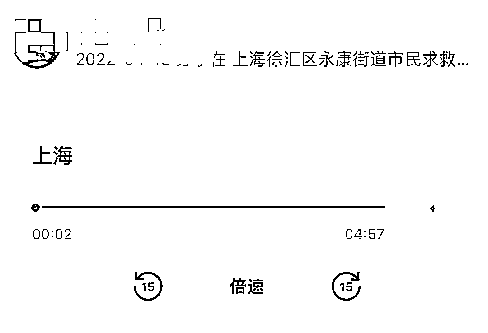
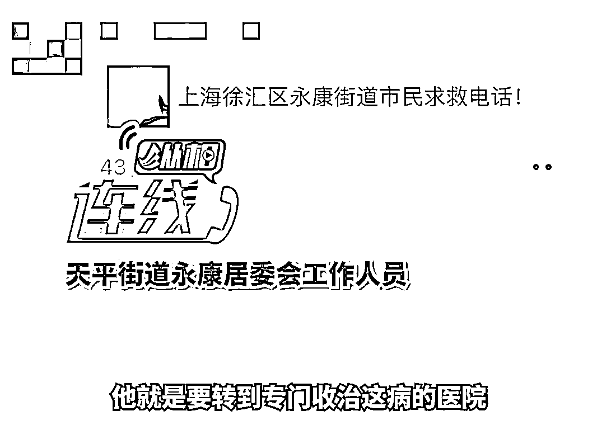
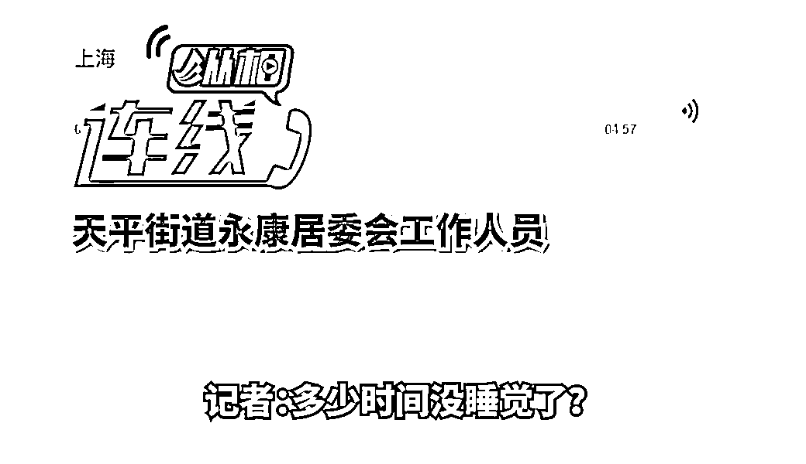
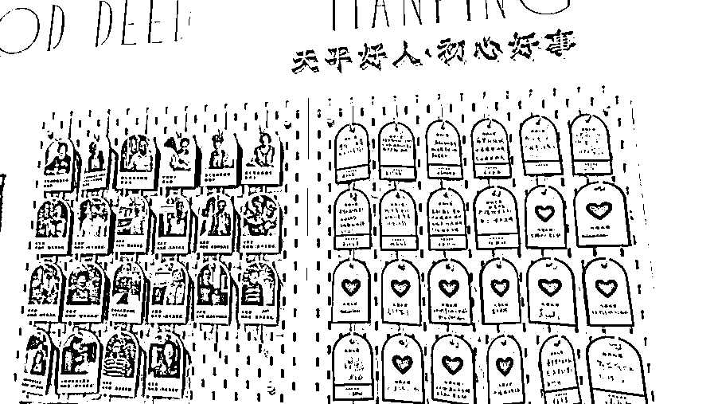
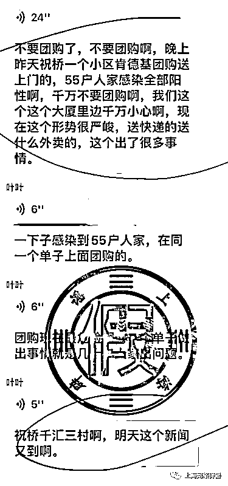
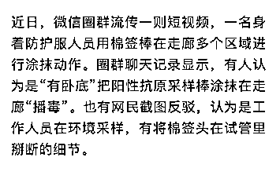
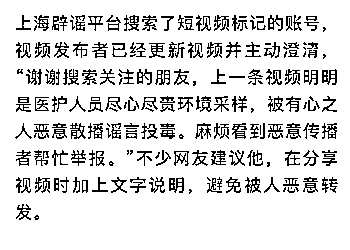
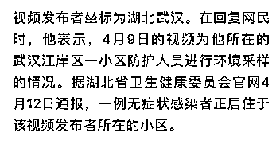
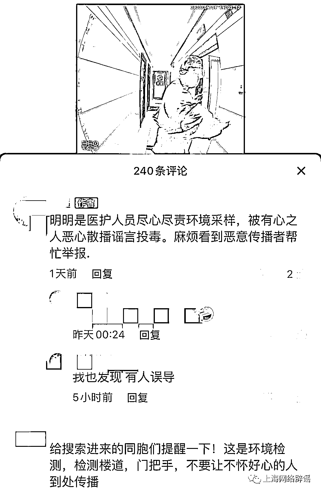

# 录音疯传！上海永康路老人电话求救，后续来了

> 原文：[`mp.weixin.qq.com/s?__biz=MzIyMDYwMTk0Mw==&mid=2247533633&idx=3&sn=668588628a7a071b95543c8731c48e12&chksm=97cb8f79a0bc066f364eda44862bf6426b051137c03d375c1348c6b052b76bbcf3825ecf8968&scene=27#wechat_redirect`](http://mp.weixin.qq.com/s?__biz=MzIyMDYwMTk0Mw==&mid=2247533633&idx=3&sn=668588628a7a071b95543c8731c48e12&chksm=97cb8f79a0bc066f364eda44862bf6426b051137c03d375c1348c6b052b76bbcf3825ecf8968&scene=27#wechat_redirect)

该公众号已被封禁

4 月 13 日，一段名为

**“上海徐汇区永康街道市民求救电话”**

的电话卡录音

在互联网传播

牵动广大市民和网友的心

<mpvideosnap class="js_uneditable custom_select_card channels_iframe" data-pluginname="videosnap" data-id="export/UzFfAgtgekIEAQAAAAAAgR8oKo_yGwAAAAstQy6ubaLX4KHWvLEZgBPEwaNAeUsTIO2DzNPgMIvoYyi61olzMqUSR4MWDAUc" data-url="https://findermp.video.qq.com/251/20304/stodownload?encfilekey=S7s6ianIic0ia4PicKJSfB8EjyjpQibPUAXoldmjGkcNSsKNCbhh7r4xCz7DRuTs9CvfMjibBO3DicnUNVBDvK0MFhu4rVqQic6iaIf4oabib7VwxPkk3yGzWnDUCmDg&amp;adaptivelytrans=0&amp;bizid=1023&amp;dotrans=0&amp;hy=SH&amp;idx=1&amp;m=&amp;scene=0&amp;token=x5Y29zUxcibCgw7r9NPXkAV4bXr3Y7M8XCgCOx6BAxJ4G5eeSjlanvmhJrMt2kHRRp6CzDoSvOys" data-headimgurl="http://wx.qlogo.cn/finderhead/ibq4aVwOt6HNqrr8OD3sCviaytF3B8TqCwHicxsuIanAJo/0" data-username="v2_060000231003b20faec8c6e48a1acbd3ce04ef33b077a1e41d0d3794ed88ea537878dbe65910@finder" data-nickname="灰产圈+" data-desc="上海怎么会这样？#上海疫情@灰产圈+ " data-nonceid="13401185881432061076" data-type="video"></mpvideosnap>

据徐汇区最新消息

**4 月 13 日下午**

**于老先生已经在徐汇区疾控部门安排下**

**转运至区级定点医疗机构**

**第八人民医院收治**

经解放日报·上观新闻记者核实，该段通话发生在 4 月 12 日中午，**接听电话的徐汇区天平路街道永康居民区党总支书记张臻。致电的是居民于文明老先生，4 月 7 日确诊新冠病毒阳性。**

于老先生今年 82 岁，和妻子蔡女士、儿子于先生同住在永康路 37 弄。据徐汇区天平街道介绍，4 月 6 日，于老先生拨打街道保障热线电话，称自己发热达到 37.8 摄氏度，且伴有体感不适，需请街道为其配药。街道转接社区卫生服务中心的医生问诊，老人当时无咳嗽、咳痰、腹泻等症状，且最近一次核酸检测结果阴性，因此由永康居民区的社区干部为其代为配药，并送至老人家中。

但是，4 月 7 日，天平街道接到了于老先生的核酸确诊阳性报告。4 月 8 日，永康居委与老先生的儿子于晖建立了微信联系，当天便回应了于先生帮母亲蔡女士配药的诉求。社区干部前往中山医院，为蔡女士配到了盐酸多奈哌齐片，与政府统一发放的保供食蔬一同送上了门。此后不久，于老先生开始感到身体不适，居委干部将莲花清瘟颗粒送到了老人家中。

4 月 11 日晚，于老先生再次感到身体不适，有低热情况，需要去医院接受专业治疗。永康居委根据工作流程，申请上报，请老人在家耐心等待。

4 月 12 日中午，于老先生再次致电居委会，接听电话的正是永康居民区党总支书记张臻。此后发生了录音中的通话内容。

“我跟于老师电话沟通过很多次，也加了他儿子的微信，也穿着防护服到他们家里送过药。”4 月 13 日晚，解放日报·上观新闻记者联系到了张臻，他向记者说明了老人的情况。而时隔一天半后再次回忆起电话中的“失控”，他告诉了记者原因。

**“在接到于老师电话前，我刚好应急处理完三件事，包括电话中提到的孕妇转运，还有为一位高龄过世老人料理后事，这些对我后来的情绪是有影响的。”**张臻说。

根据解放日报·上观新闻记者过去一个月中的采访，包括张臻在内，徐汇区几乎所有的社区干部均于 3 月 12 日起就驻扎在属地社区。但相比自己的辛苦，张臻在电话中告诉记者，有一点更需要立即重视起来。

**“大部分老人在封控前所配的常用药物，都是根据此前发布的浦西 4 月 1 日至 5 日这个封控时长来储备的，但是今天已经是 4 月 13 日，很多老人的常用药即将耗尽，代配药的需求缺口非常大，这是一个眼门前非常大的问题。”**

3 月 12 日到 4 月 13 日，张臻已经 30 多天没有回家，既想念身在浦东的父母，也想念妻子和年仅 4 岁的女儿。在很多问题还没有一个妥帖的解答前，他和同事们还将继续坚守岗位，直到迎来曙光的那一刻。

**上海查处多起涉疫谣言，13 人被处罚**

据新华社消息，近日，接网民举报并经查实，圈群传播的**“居委倒卖 20 万箱捐赠物资”“市民信息登记不全导致核酸白做”“宝山方舱隔离人员睡纸箱”“‘黑快递’为了赚钱，核酸造假”“原浦东新区北蔡镇领导倒卖保供物资”“松江九亭哄抢超市”“售卖上海疫情防控通行证”**等传言均为虚假信息，性质恶劣，上海有关部门已组织公开辟谣澄清。

经上海网信办与公安部门联合溯源调查，依据互联网相关法律法规，已协调相关部门对**“幸福一家人”“黎明—通告群”“宝华足球闲聊队”等**6 个散播虚假信息的网络群组予以封停，并对首发谣言的多名微信个人用户予以处罚。为加大对涉疫谣言的打击力度，针对上述不实信息，上海警方近期已对柳某某等 13 人依法立案侦查或依法行政处罚。 

此外，上海网络辟谣发布最新消息，对两则网络传言辟谣！

# **肯德基团购导致居民感染阳性？**

**未发现网传现象** 

4 月 13 日，有数段主题为“不要团购”的聊天记录在圈群传播。较早的聊天记录称，祝桥千汇三村团购了肯德基，配送上门后，有 55 户居民感染阳性。此后，相关谣言还衍生出不同版本，涉及浦东三林等地。不少网友对以上信息将信将疑，希望上海辟谣平台求证。

因初始聊天记录中提及了祝桥镇千汇苑三村，上海辟谣平台联系到该居民区党总支书记缪光明，他表示网传信息不实：“千汇苑三村居委会没有组织过肯德基团购，不存在 55 户居民因为团购餐饮感染病毒的情况。”

肯德基表示，根据系统记录，千汇苑三村附近的门店根据居民自行下单情况，于 4 月 9 日向该小区配送过 12 份餐食。目前，肯德基相关门店已经逐一联系了涉及相关订单的居民，核对其核酸检测情况，没有发现网传现象。

**“有卧底”在上海楼宇里“播毒”？** 

**原视频作者出面辟谣**

来源：中国青年报（ID：zqbcyol 整理：张小松）综合上观新闻（作者 舒抒）、纵相新闻、上海网络辟谣，中国青年网微信（ID：youthzqw）

← 向右滑动与灰产圈互动交流 →

