# 跑腿小哥日入过万，不加价不接单？我们测了测

> 原文：[`mp.weixin.qq.com/s?__biz=MzIyMDYwMTk0Mw==&mid=2247533633&idx=5&sn=b44e298500c6801ee847a14fb1775ab3&chksm=97cb8f79a0bc066fce5529066e778213c9130c77fd77f2c4e502b5586c7466af6f18eba2f845&scene=27#wechat_redirect`](http://mp.weixin.qq.com/s?__biz=MzIyMDYwMTk0Mw==&mid=2247533633&idx=5&sn=b44e298500c6801ee847a14fb1775ab3&chksm=97cb8f79a0bc066fce5529066e778213c9130c77fd77f2c4e502b5586c7466af6f18eba2f845&scene=27#wechat_redirect)

近日，网传图片显示一位顺丰同城跑腿小哥 4 月 9 日一天的收入高达 10067.75 元，引起热议。

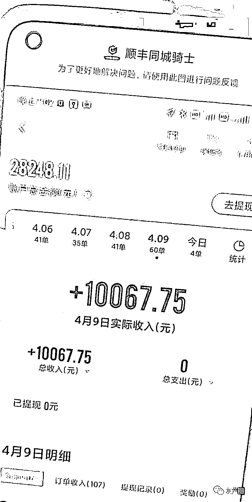

对此，顺丰同城回应称属实。当日的收入中基础佣金 534 元，各类特殊奖励约 1678 元，用户打赏约 7856 元。顺丰同城指出，这也意味着，该骑士平均每单不含打赏收入为约 36.9 元，平均每单获得打赏约 131 元。

更有传闻称，某头部电商的不少快递员都开始接私活，搞得没有人去配送快递了。 

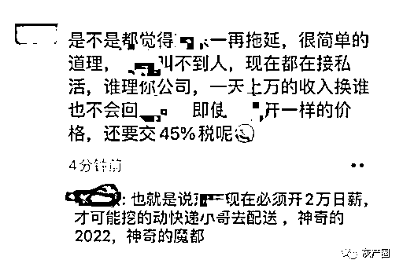

真的如此魔幻吗？ 

**有人加价 700 买菜** 

**有人加钱也找不到人**

在网上晒跑腿收入的并不多，有网友曝出的几页疑似跑腿小哥的聊天记录。

聊天记录显示，某跑腿小哥自述 4 月 9 号赚了 3900，还下定决心第二天要突破 8000。 

该跑腿小哥还表示上海市里的人舍得花钱，跑腿不接单对方就会加价，甚至有人加价 800。 

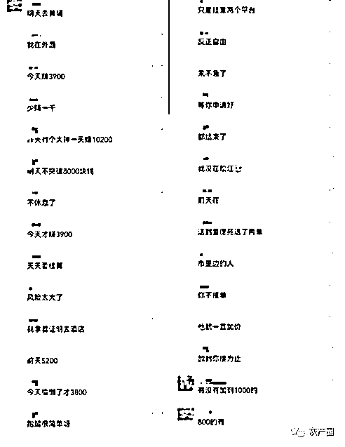

有网友称自己表弟看到有人日入过万后，已经连夜注册成为跑腿小哥。 

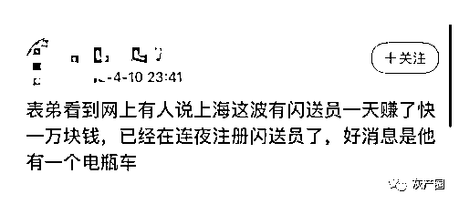

**更多人则反映找跑腿买东西花了大价钱，不仅东西本身溢价很明显，跑腿费更是夸张。**

有人通过跑腿给朋友买了一些蔬菜水果肉，下图有所展示。 

这些商品平时应该顶多也就 300，不过这位网友却花了 888 元。再加上 700 元的跑腿费，总共花费 1588，着实有点夸张。 

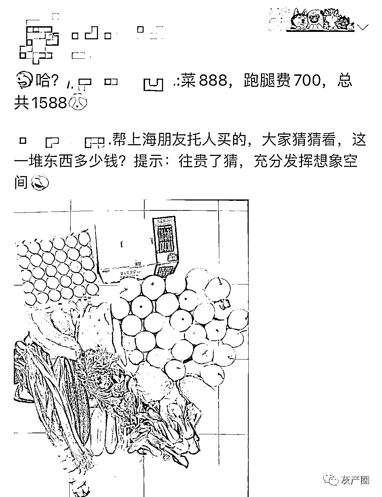

还有人通过跑腿用 347 买了一个西瓜。 

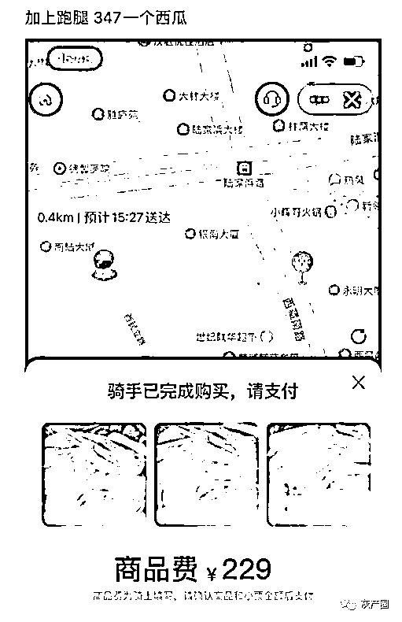

浦东到浦西送个东西，配送费要 800。 

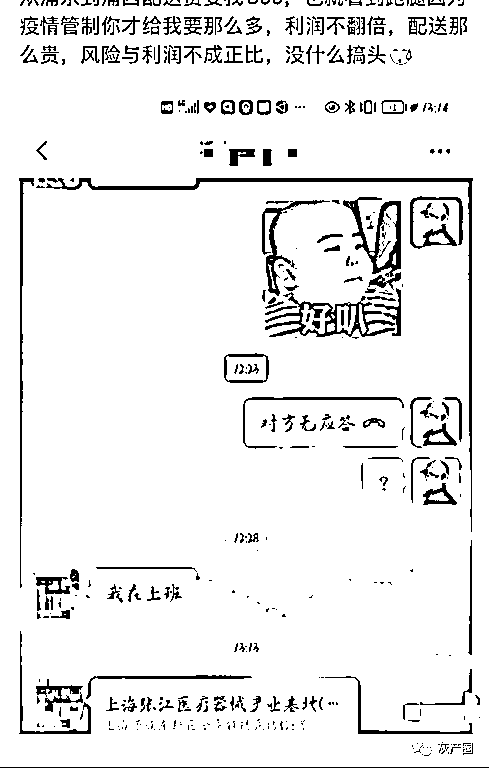

以及通过跑腿 200 块买 60 个鸡蛋；2 倍的价格买到纯净水；130 块的水果，跑腿费 120；用平时能买 8 袋猫砂的钱买了 2 袋猫砂。

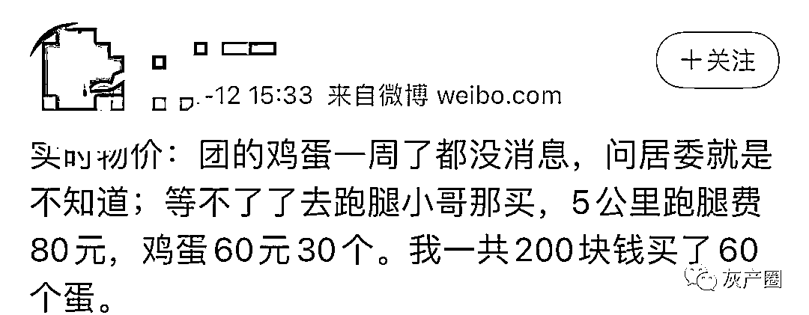

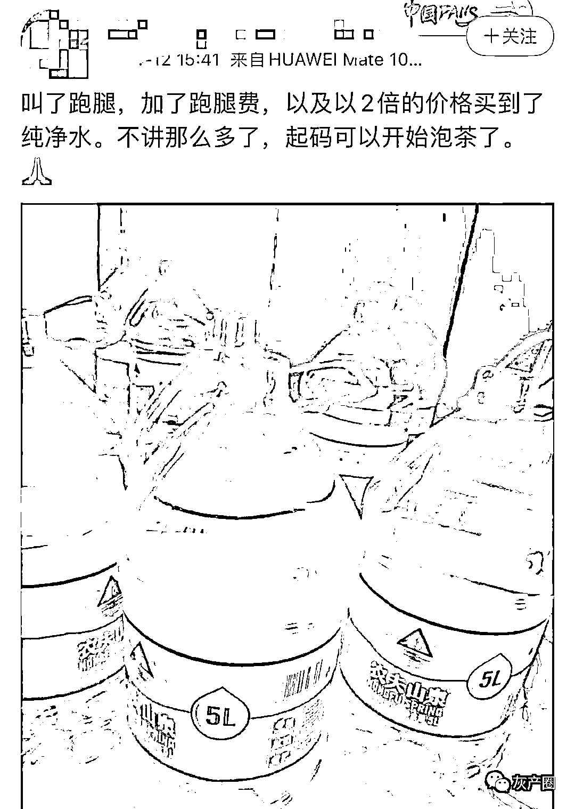

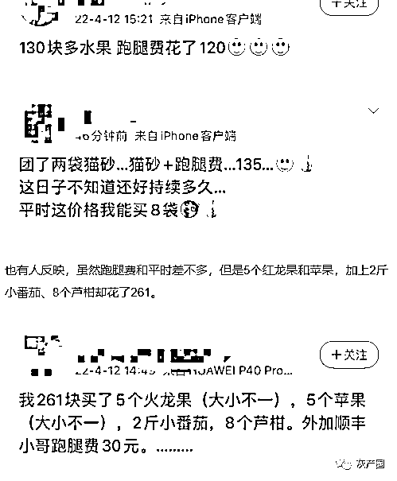

**另外也有网友对于网传高额的跑腿费表示怀疑，**因为她两次的跑腿订单中，长短距离都有，跑腿费分别为 10 和 50。 

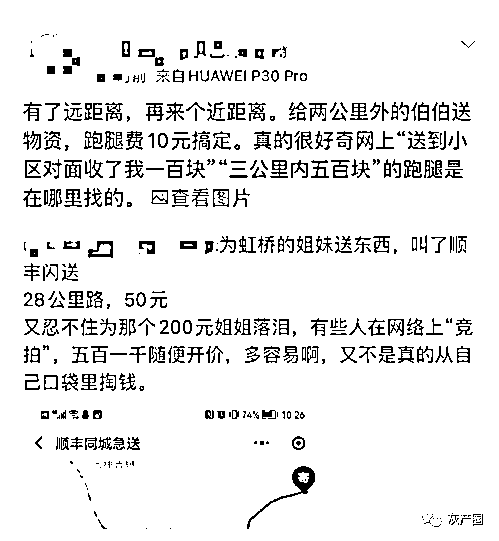

还有网友称几次帮家人叫跑腿，都只是花了 25。 

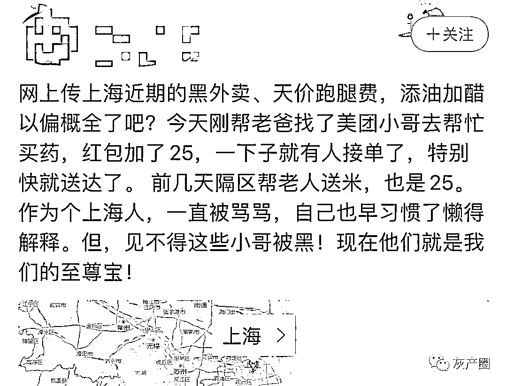

除了买菜，有人想转运宠物，路程仅仅 5 公里，却花钱也找不到人。 

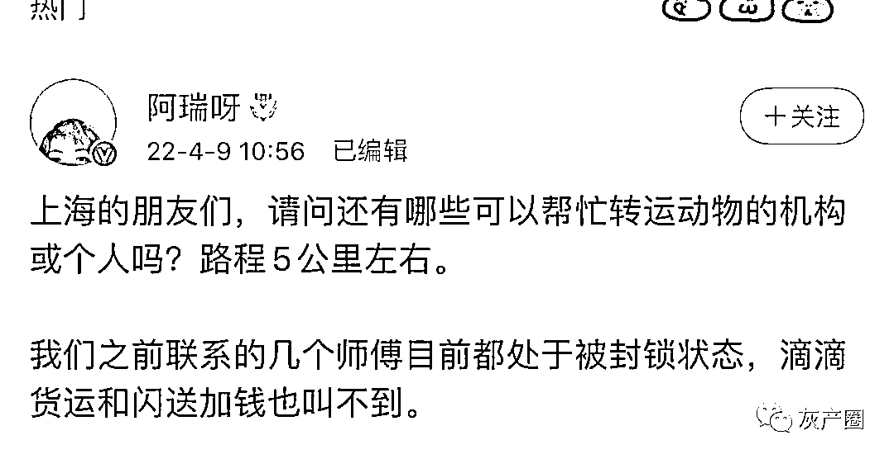

不少热心网友出谋划策，一句话就是疯狂加小费，总会有人接单的。

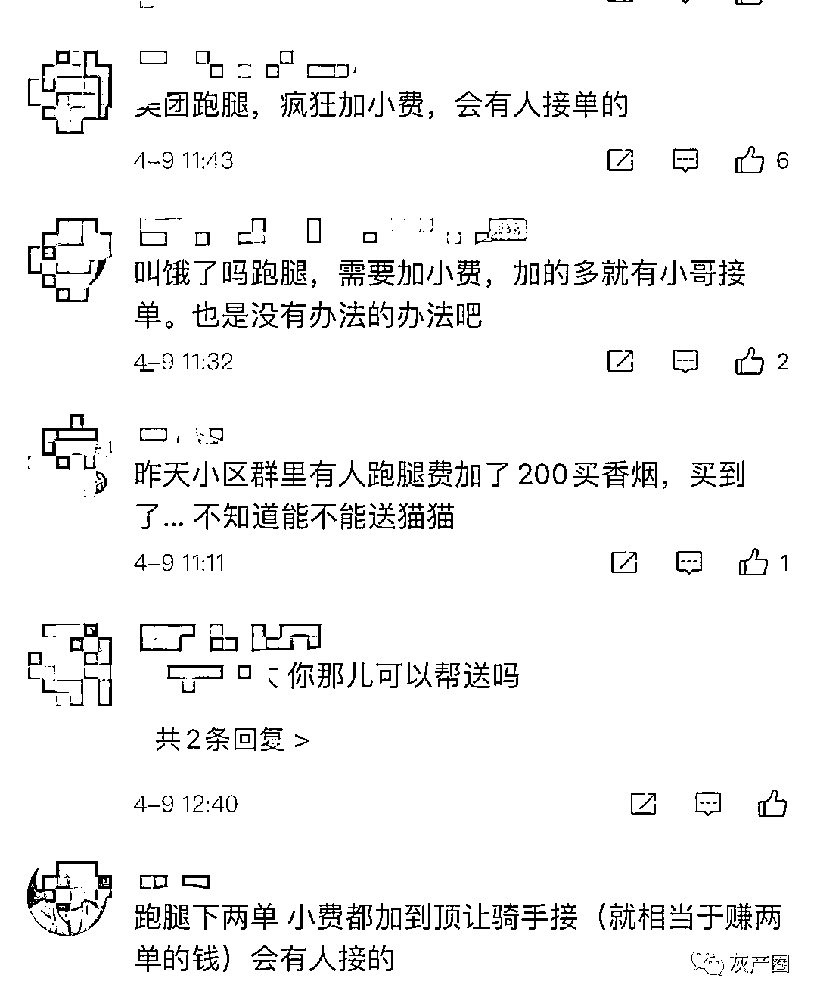

**客观上讲，不同区域的配送能力和需求是不同的，供需矛盾很可能引起跑腿费的巨大差异。**

**但正如不少网友所质疑的，到底有没有刻意不接单以“逼迫”加价呢？**

网传一些闪送员因擅自加价被处理，截图显示紧闭时间从 7 天到 30 天不等。 

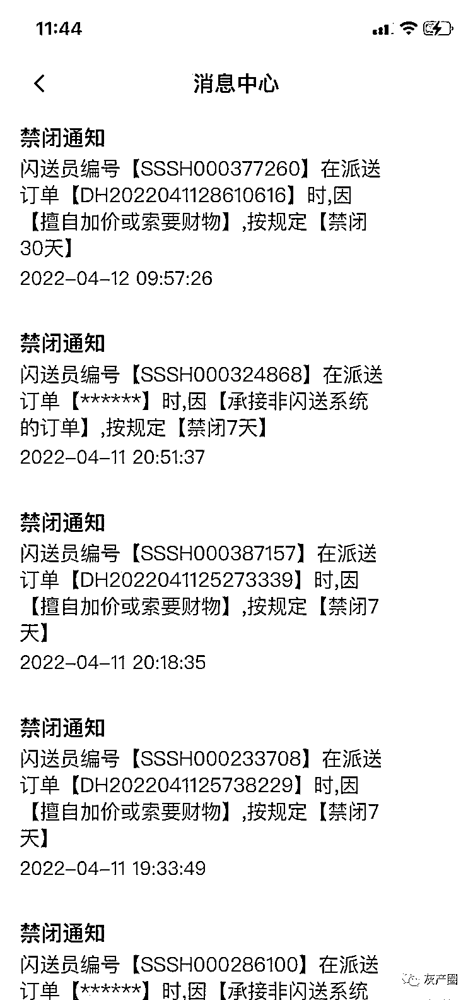

为此，三言财经在美团、饿了么、闪送、顺丰同城、达达 5 个平台做了测试。 

**5 个平台仅有一个接单**

**不加价真不能找到跑腿？** 

先说测试结果，5 个平台只有顺丰同城在未加价的情况接单。 

测试收货地点选择了两个，分别在徐汇区和黄浦区。测试都是选择的“就近购买”，跑腿小哥在收货地点 3 公里以内购买。 

**本次测试所要代买的东西都是日常生活所需**，包括：金龙鱼食用油 5L，番茄、菠菜、黄瓜、红薯、豆腐各 3 斤，共 15 斤。

第一个测试的平台是闪送。 

14:12 分下单，预估商品的费用是 200 元，一般都是先由跑腿小哥垫付。页面显示配送费是 28 元，跑腿小哥可以就近购买商品。 

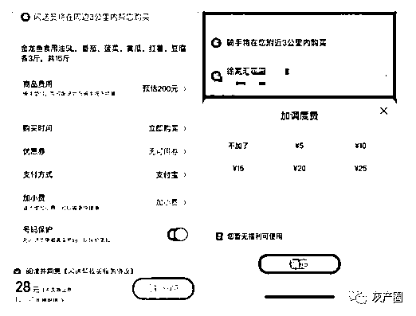

**在各大跑腿平台中，都有小费这个选项，用户可以通过打赏小费增加跑腿小哥接单的意愿。小费的上限普遍设置为 200 元。**

下单大概 3 分半后，闪送弹窗建议增加 8 元小费。

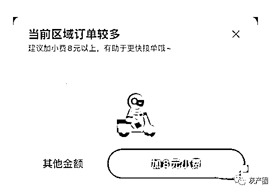

**下单半个小时后，该订单因超时无人接单被自动取消。**

**事实上，反映闪送加价的信息随处可见。而在互联网上都能搜到各平台加价的信息。**

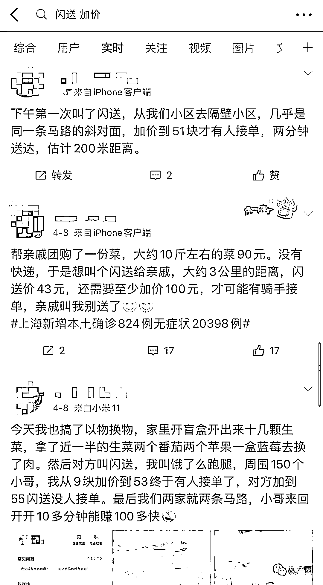

三言财经在测试中的两个收货地点均下单，**结果美团和饿了么都无法下单。** 

美团显示“因特殊原因（恶劣天气/疫情/交通管制等），跑腿订单暂无法配送”。饿了么提示“因特殊原因，您所在的区域暂时无法配送，敬请谅解”。

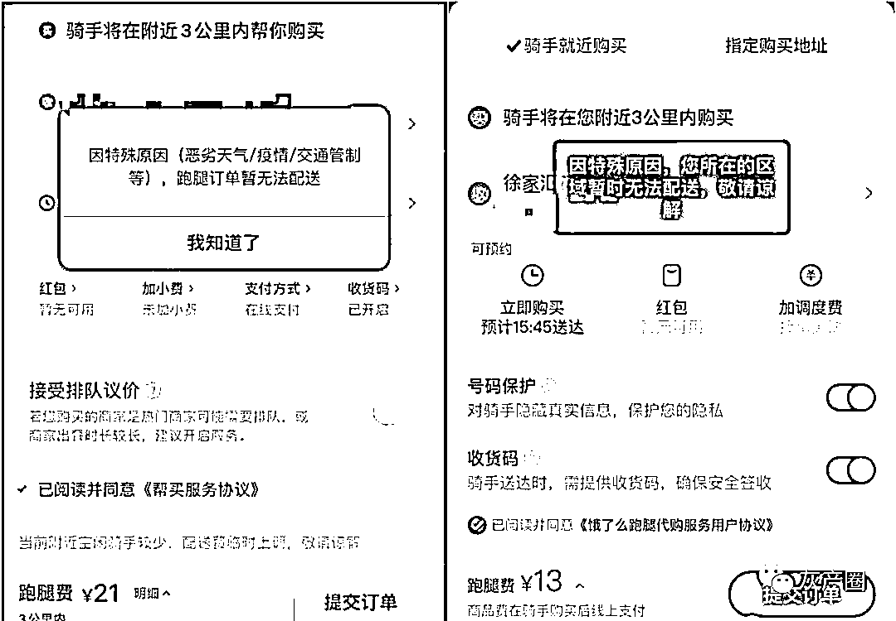

**事实上，各个平台的基础配送都不高，选择就近购买方式的话，通常配送费不会超过 30。**

达达的代买菜服务会跳转到京东到家，不过将定位选择上海时，却并没有生鲜果蔬等商品。 

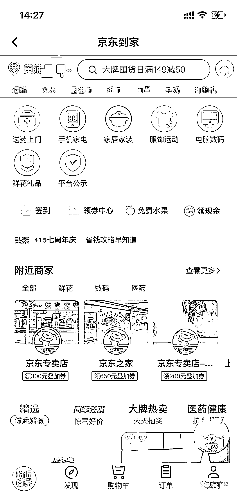

**顺丰是唯一一个未加价接单的，虽然在下单 17 分钟后也曾提醒打赏，但最终还是在 1 个小时后有人接单。而且接单后并未要求加价。** 

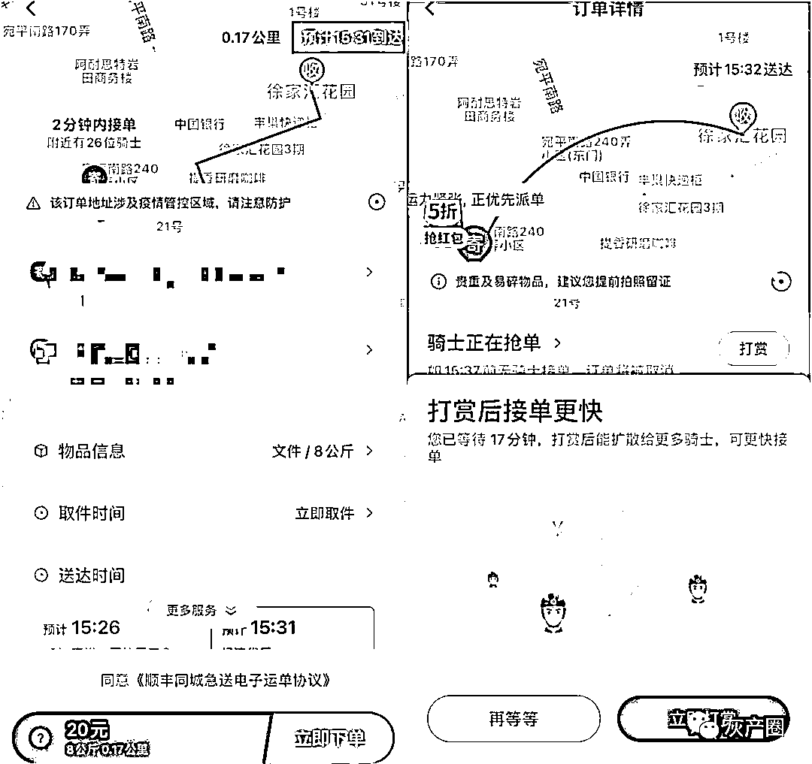

从上述测试能够看出，如果不加价想快速被接单是有很大难度。而且部分平台暂时不能提供跑腿服务，对消费者来说更是雪上加霜。 

加价似乎成了一种无奈的选择。但有没有其他方法能够避免这种无序“加价”所带来的争议？

**如何看待“加价”？**

在顺丰同城的那封公告下，网友对于跑腿小哥的收入，尤其是打赏收入进行了激烈的讨论。 

热评第一的网友认为，很多跑腿小哥的打赏都是强讨来的。她认为这种“讨打赏”的做法将带来病态发展，其他跑腿小哥会效仿。 

有人质疑道：加价到 200 还没有人接单，这真的是自愿打赏？ 

用户是不是自愿打赏，跑腿小哥是不是应得，这是讨论的两个核心点。

在一些人眼里，跑腿小哥靠辛苦赚钱，不偷不抢，无可厚非。 

持反对意见的人则认为，这是在变相涨价，是发不义之财。在他们看来，打赏的额度已经远超自愿的范畴，加价都是逼不得已。

说实话，对于普通消费者来说，加价确实能加快跑腿的速度。但是这个所谓的加价幅度到底合不合适，确实很难去判断。 

对于疫情严重的地区来说，快递员、跑腿小哥发挥了很大的作用，这不可忽视。他们不仅辛苦，也冒着极大的风险。 

而这份风险由谁买单？笔者觉得平台方应该针对目前的特殊情况，对配送费作出合理的调整，显然原来的基础费太低，这与实际情况不匹配。 

没有秩序和规则的打赏虽然能灵活调动跑腿小哥的积极性，但却容易失去公平性。懂得耍心眼的人挣钱了，老老实实出力的人却得不到应有的回报，这不应该。 

前两天看到一个上海跑腿小哥曾召兵的报道，他在上海街头连续送单 21 天，曾为方舱送过物资，也曾给连续几天抢菜无果的癌症病人送过食物，但却分文未收。 

他说：“你对别人的好，别人都记得。将心比心做好事，没人说你傻。”

而这样的跑腿小哥就在我们身边。

出品|三言财经 作者|丰收

← 向右滑动与灰产圈互动交流 →

