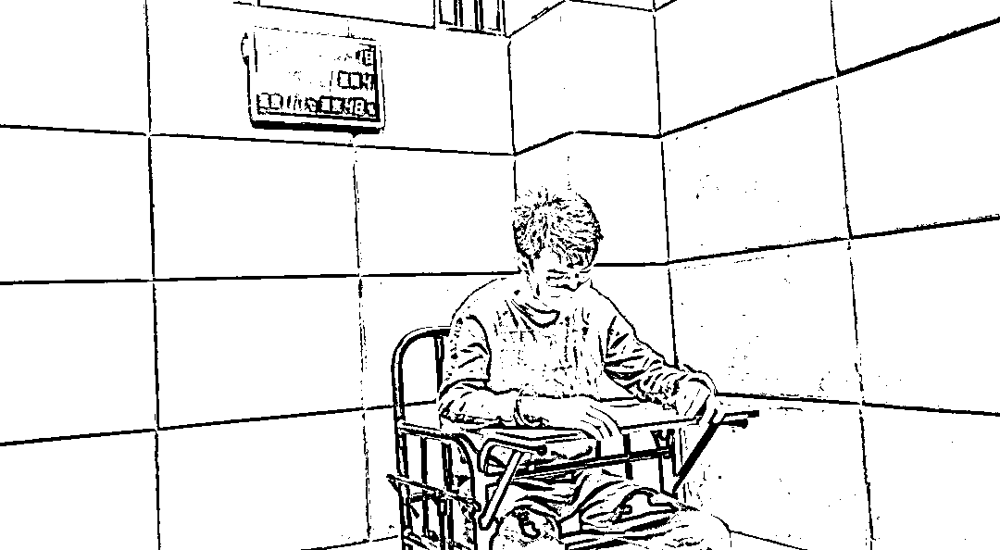
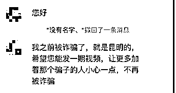
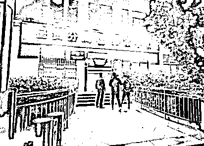
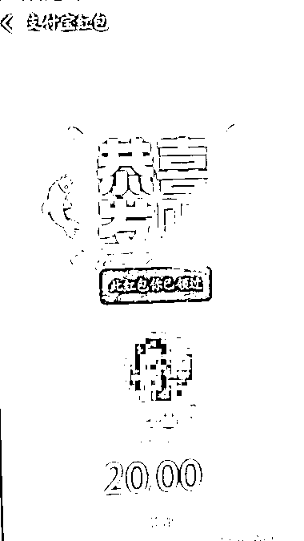
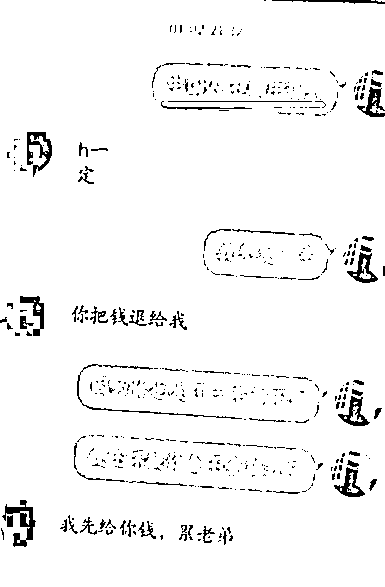
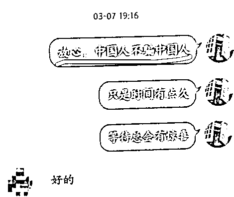
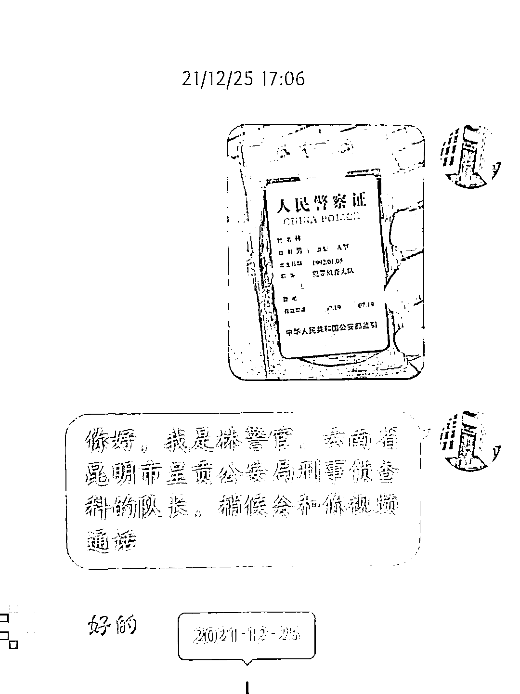
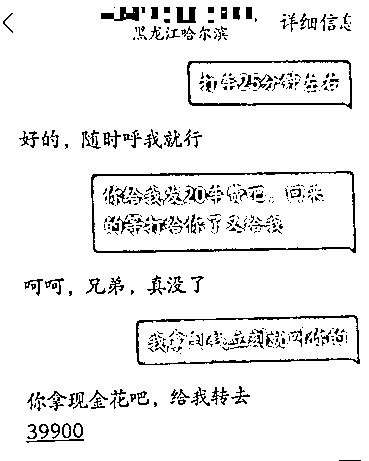

# 呈贡刑侦队长抓了“呈贡刑侦队长”，民警：救命！这是我从警生涯里做笔录笑场最多的一次

> 原文：[`mp.weixin.qq.com/s?__biz=MzIyMDYwMTk0Mw==&mid=2247533633&idx=6&sn=5338548d752872eef09b6aeaa15928c4&chksm=97cb8f79a0bc066fd95b0be2d2230b64538653ba0a738809c3cfffc3295055daf5c2cf63c85c&scene=27#wechat_redirect`](http://mp.weixin.qq.com/s?__biz=MzIyMDYwMTk0Mw==&mid=2247533633&idx=6&sn=5338548d752872eef09b6aeaa15928c4&chksm=97cb8f79a0bc066fd95b0be2d2230b64538653ba0a738809c3cfffc3295055daf5c2cf63c85c&scene=27#wechat_redirect)

近日

呈贡刑侦副大队长派人抓了呈贡“侦查科队长”

你敢信吗？

讯问室内

一场令人啼笑皆非的笔录正在进行

**问：**你骗了多少钱

**答：**10 块、20 块、几百块都有，单次没超过 1000 块

**问：**你是怎么冒充呈贡公安分局侦查科队长进行诈骗的？

**答：**“我就从网上随便找了两张警察的照片发过去，他就信了”

**问：**去找个工作好好上班不比你几十几十去骗人香吗？

**答：****上班太累了**

……

这位 95 后“侦查科队长” 

在讯问室一坐

侃侃而谈

自己的诈骗和人生经历

可言语间却透露出

他对人生的迷茫

**事情要从这说起**

****

**3 月 25 日，昆明反诈中心快手号收到陕西咸阳某大学生的求助私信，他在非官方渠道购买游戏账号被骗 1300 元，忍了半年还是觉得不甘心，得知骗子的手机号码是昆明的，希望得到反诈中心的帮助。**

****

**[**《这名大学生找到我们，说被骗后，忍了半年没报案……》**](http://mp.weixin.qq.com/s?__biz=MzIyMDYwMTk0Mw==&mid=2247532301&idx=3&sn=aed46d1fbb805ed6f3ab3c882ddbb802&chksm=97cbb435a0bc3d236ba86d252cfea23207688097a93bb3287e1d73b22da5745110078814d04c&scene=21#wechat_redirect)**

**（戳链接看原文）**

**接到求助后，昆明反诈中心联合呈贡警方第一时间开展侦查。**

**根据该名大学生提供的信息，呈贡公安分局刑侦大队副大队长刘文贤带领民警开展研判。很快，便锁定了居住在昆明市呈贡区洛龙街道的一名流动人员常某红。**

****“我现在头有点晕，想安静一下”****

**3 月 31 日晚上 8 点半，根据掌握的线索，呈贡公安分局刑侦大队中队长孙浩带队到嫌疑人常某红的出租屋对其实施抓捕。** 

**但当民警到达社区后，发现该地为城中村，面积较大、地形复杂，背街小巷众多且私宅号码排列较乱，加之天色昏暗，很难找到嫌疑人的出租屋。**

**但民警巧用计谋，最后在社区门口成功将其抓获。**

 **[`mp.weixin.qq.com/mp/readtemplate?t=pages/video_player_tmpl&action=mpvideo&auto=0&vid=wxv_2352948043404394496`](https://mp.weixin.qq.com/mp/readtemplate?t=pages/video_player_tmpl&action=mpvideo&auto=0&vid=wxv_2352948043404394496)** 

 **“我现在头有点晕，想安静一下”，在戴上手铐的那一刻，常某红身体止不住颤抖，腿也直打哆嗦，在民警的搀扶下才勉强站稳。他告诉民警，知道自己迟早会被抓。

[`mp.weixin.qq.com/mp/readtemplate?t=pages/video_player_tmpl&action=mpvideo&auto=0&vid=wxv_2352947575554949123`](https://mp.weixin.qq.com/mp/readtemplate?t=pages/video_player_tmpl&action=mpvideo&auto=0&vid=wxv_2352947575554949123)

随后，他交代了自己确实利用售卖游戏皮肤的方式实施诈骗，但具体金额和数量他却含糊带过，民警便将其带回分局进行审讯。

据办案民警介绍，常某红今年 26 岁，是曲靖陆良人，初三没毕业就开始打工，2019 年也曾以游戏皮肤为由在武汉诈骗了 8080 元，因此被判刑 7 个月，此次被抓已是“二进宫”。** 

****14 人遭遇诈骗****

****犯罪嫌疑人落网后声称“要给他们上一课”****

**“我是在时空召唤这个游戏里售卖皮肤诈骗的”。在讯问室里，常某红对自己的诈骗行为供认不讳。** 

**2019 年 11 月，常某红出狱后来到昆明市呈贡区找工作，起初，他曾在餐饮店做过配菜员，但因为与同事产生矛盾辞职。之后，游手好闲已成习惯的他过起了网吧、出租屋两点一线的生活，每天除了打游戏就是睡觉，不久后，他仅有的积蓄被挥霍一空。**

**于是，常某红便重操旧业，以卖游戏皮肤、假冒警察、办理网贷等手段诈骗他人。**

**常某红的诈骗金额从 10 元、20 元、几百元不等，实施诈骗时，他能诈骗多少就诈骗多少。**

****

 **据常某红交代，2021 年 4 月，他在游戏世界频道喊话低价出售皮肤，陆续吸引了不少人加他为 QQ 好友进行咨询。加上好友后，他便以 20-200 元不等的价格和玩家谈好价格交易皮肤。

然而，在成功收到转账后，常某红随便捏造一个皮肤兑换码发过去。等玩家发现自己上当后，他就把对方的联系方式删除。

其中，也有受害者是购买后收到常某红发的游戏账号和密码，却始终登陆失败。这时，常某红再推荐给对方代刷平台，以不退钱为由索要对方的游戏账号密码，声称可以帮忙代刷皮肤。随后，再以交手续费退钱等一系列理由进一步骗对方转钱。

被抓时，常某红卡里只有 80 元钱，诈骗来的所有钱都被他用于日常开销和上网。

“我想着是给他们上了一课，别人怎么骗我的，我也怎么骗回去”，他告诉民警自己曾经也在游戏上被人骗走 600 块，用这样的方式，也是让受害人们“长记性”。

“当时直接炸锅了，呵呵。”在被问起自己被骗时的感受时，坐在审讯室冰冷的铁桌前，常某红已经不像刚被抓时那样害怕，对一切都表现得无所谓，经历过第一次处罚，他仿佛看到了同样重复的人生道路。

“就看个人的选择，你想犯罪就可以犯，不想犯罪就不犯。”犯罪，在这个年轻的 95 后小伙口中说出是如此轻描淡写。** 

****说好“中国人不骗中国人”**** 

****他却连****5****块都骗****

**“我是云南省昆明市公安局呈贡分局刑事侦查科队长，稍后会和你视频通话。”**

**“好的。”**

**……**

**“警官，我确实没钱了。”**

**“中国人不骗中国人！你被骗的钱会给你追回的。”**

**民警查看聊天记录发现**

**他多次向受害人表示**

**“中国人不骗中国人”**

**却连 5 块都要骗**

******

审讯结束后，民警调出他手机上所有交易记录，截止到被抓当晚，共有 14 人被游戏皮肤诈骗转账 2000 余元。此外，还有一笔较大金额的转账以及一段奇怪的聊天记录。

次日，呈贡分局刑侦大队副大队长刘文贤通过常某红手机交易找到该名受害者，并电话联系了对方。

令人震惊的是，受害者黄先生仍然沉浸在常某红的骗局里，竟以为打电话来的是假警察，常某红才是真警察。

“我们加了微信视频通话，看到反诈中心后他才相信了我的身份”，随后，刘文贤告诉黄先生之前一直和他联系的“队长”其实就是用皮肤诈骗的他的嫌疑人，并引导他马上在当地派出所报警。

通过聊天记录和黄先生的讲述，事情的经过才被完整还原出来。

2021 年 12 月 25 日，常某红给黄先生发了一张假的警察证，他自称呈贡公安局刑事侦查科队长，告诉对方抓到了此前以游戏皮肤诈骗他的诈骗犯，要求对方配合办案。

“我就从网上随便找了两张警察的照片发过去，他就信了”，常某红直言。

之后，常某红以退还被骗金额需要请律师、到法院协调为由诱导黄先生多次转账，其中甚至还有 20 块的车费，最小的一笔钱才 5 块，林林总总加起来骗了黄先生 1.6 万余元。

“常某红将自己第一次被捕后的经历融汇在骗局中，他和受害人的聊天记录里对电诈嫌疑人抓捕过程以及检察院起诉、法院审判的程序都是正确的”，在和常某红对话中，民警惊讶地发现他对帮信罪了解颇深。

在看守所的经历并没有让他痛定思痛、改过自新，反而让他在二次犯罪的过程中有意识地运用相关知识进行规避。** 

**目前**

**该案件还在经一步侦办中**

**常某红将会面临法律的制裁**

**在该案中**

**常某红的骗术其实很低级**

**却仍有很多人上当受骗**

**轻易转钱**

**不仅是因为自身防范意识不够**

**更重要的原因是爱贪小便宜**

****民警提醒****

****凡是**接到自称公检法人员的电话，提到安全账户、清查资金、转账汇款的，都是诈骗!公检法机关作为执法部门，绝不会使用电话办案，更不会在相关部门之间互转电话。**

****凡是**在电话里声称对所谓的犯罪、银行卡透支等问题进行调查的，都是骗子。公检法机关及其他司法机关根本不存在所谓的“安全账户”。**

****凡是**通过电话、短信要求市民转账汇款，或声称对资金进行审查的，肯定是骗子。**

**来源：昆明反电信网络诈骗中心 ，巴蜀反诈**

****

**← 向右滑动与灰产圈互动交流 →**

****