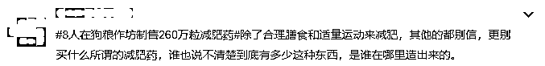

# 狗粮作坊“变身”减肥药加工厂，百倍暴利，8 人获刑！

> 原文：[`mp.weixin.qq.com/s?__biz=MzIyMDYwMTk0Mw==&mid=2247533633&idx=7&sn=2f349b2440ba28d5bf974024d0b5bbb5&chksm=97cb8f79a0bc066f0b2e564916e4f3b79af5c317a52d4fc5e6326bc0ae36351c00c746b91928&scene=27#wechat_redirect`](http://mp.weixin.qq.com/s?__biz=MzIyMDYwMTk0Mw==&mid=2247533633&idx=7&sn=2f349b2440ba28d5bf974024d0b5bbb5&chksm=97cb8f79a0bc066f0b2e564916e4f3b79af5c317a52d4fc5e6326bc0ae36351c00c746b91928&scene=27#wechat_redirect)

江苏南通的李先生 

在情人节购买了两盒减肥产品送给女友，

谁知女友吃后腹泻不止。

警方追根溯源发现，

**这两瓶排毒养颜片竟来自于**

**徐某自家的狗粮加工作坊。**

徐某用酚酞原料生产出散装片剂，

卖给下家齐某等人，

而后，

在美容店销售。

据悉，

**酚酞为国家药监局明令禁止**

**在食品中添加的原料，**

**长期服用会损害肠神经系统。**

今年 3 月，

齐某等 8 名被告人因生产、

销售有毒、有害食品罪分别被判相应刑罚。

**减肥药哪儿来的？**

李先生购买的排毒养颜片

来自获刑的齐某夫妇。

据了解，

齐某夫妇销售两款排毒养颜片，

一种名叫“**果缘康**”，

一种名叫“**纤秀丽颜**”，

包装十分精美。

对于产品的成分，

外包装上表述为水果提取物、

蛋白质、膳食纤维等。

**该两款减肥产品在江苏各地美容店广泛销售**。

然而包装如此精致的产品，

销售却非常“隐秘”。

齐某夫妇在销售给美容店店主时，

特别嘱咐他们

“**不要放在展柜上展览，**

**要放在隐蔽一点的地方，**

**不能被相关部门查到**”。

据了解，

购买该减肥产品的多为

具有瘦身需求的“爱美人士”，

也不乏一些深受便秘困扰的人，

**甚至还有客户买来给家中小孩服用**。

**“神秘”减肥药，销售渠道一环套一环**

然而，

齐某夫妇所销售的排毒养颜片不是原装，

而是**私人灌装**。

经查，

2014 年以来，

**齐某夫妇从方某甲处购进**

**桶装散装片剂及包装盒、包装瓶、**

**标签贴、防伪码等，**

**安排员工在租赁的仓库内**

**灌装、贴标、塑封，**

**包装成“果缘康”和“纤秀丽颜”**

**两个品牌的排毒养颜产品。**

并通过美容产品展会、

微信朋友圈等途径推销，

对外宣称具有润肠通便、

排毒养颜、减肥瘦身等功效。

据介绍，

**方某甲处的散装片剂是从顾某处订购的**，

顾某多年从事化妆品和减肥片剂的销售。

2020 年 12 月，

顾某在获知方某甲的订购需求后，

**向上家周某一次性订购减肥片剂 260 万粒**。

**周某又找到上家王某，**

**与之达成 260 万粒散装片剂的生产协议，**

**王某再将该 260 万粒散装片剂交由徐某生产**。

谁能想到，

**徐某的工作地点就位于**

**自家的宠物饲料加工作坊内**。

**徐某将周某提供的 300 公斤酚酞原料、**

**淀粉、香精等辅料加水混合搅拌，**

**用模具压片后生产出 260 万粒散装片剂**，

装入木桶后发货给顾某。

**层层加价，“狗粮牌”减肥药身价翻百倍**

经检测， 

该片剂中酚酞成分含量在

**60.1g/kg 至 109g/kg**。

**酚酞是一种刺激性轻泻药，**

**长期服用可损害肠神经系统，**

**为国家药监局明令禁止在食品中添加的原料。**

据办案检察官介绍：

*   齐某通过方强以**0.32 元/粒**的价格向顾某订购 260 万粒散装减肥片剂；

*   顾某以**0.15 元/粒**的价格向周某订购该减肥片剂；

*   周某以**0.03 元/粒**的价格与王某达成散装片剂的生产协议；

*   王某又以**0.025 元/粒**的价格将该 260 万粒散装片剂交由徐某生产；

*   齐某夫妇收到该片剂后通过自行灌装、贴标等方式加以包装，**每盒以****40 元至 80 元不等**的价格卖给美容店；

*   美容店店主再以**每盒****128 元至 198 元不等**的价格卖给消费者。

**从初始生产费用 0.025 元/粒，**

**到终端消费者购买价格 198 元/瓶（30 粒），**

**其中的利润空间高达 264 倍！**

****

今年 1 月，

如东县人民检察院以

上述 8 人涉嫌生产、销售

有毒、有害食品罪向法院提起公诉。

**上述 8 人被分别判处有期徒刑 1 年至 10 年不等，**

**并处罚金 1 万元至 90 万元不等，**

**同时禁止在缓刑考验期及刑罚执行完毕后 3 年内**

**从事食品、药品的生产、销售及相关活动。**

由于整个案件反转太多，

网友们纷纷吐槽：

来源：央视综合检察日报、中国网

← 向右滑动与灰产圈互动交流 →

