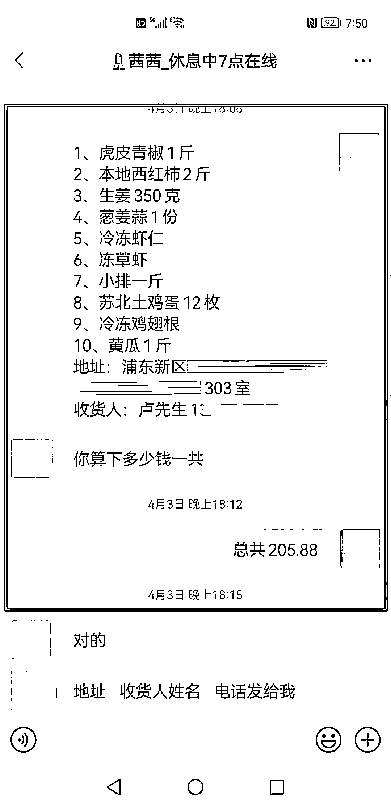
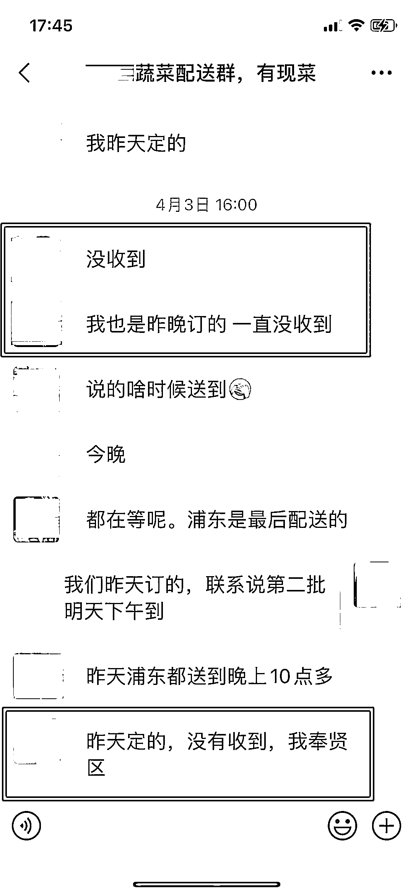
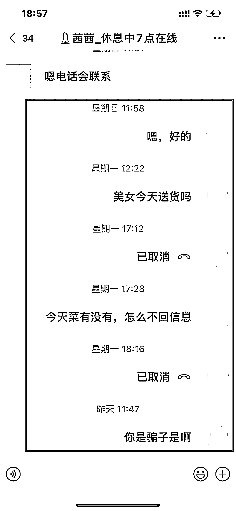

# 蔬菜套餐 280 元？查！“团长”收钱后失联？抓！

> 原文：[`mp.weixin.qq.com/s?__biz=MzIyMDYwMTk0Mw==&mid=2247533633&idx=8&sn=b6f6bff4a9d7c7e8fa9825ff83537846&chksm=97cb8f79a0bc066fc03df19668bd19dbda6985493da8abe32bff9c6b8bbff33d681f3f192fe6&scene=27#wechat_redirect`](http://mp.weixin.qq.com/s?__biz=MzIyMDYwMTk0Mw==&mid=2247533633&idx=8&sn=b6f6bff4a9d7c7e8fa9825ff83537846&chksm=97cb8f79a0bc066fc03df19668bd19dbda6985493da8abe32bff9c6b8bbff33d681f3f192fe6&scene=27#wechat_redirect)

**崇明一商家销售 280 元蔬菜套餐，涉嫌哄抬价格被立案调查**

**近日，崇明区市场监管局执法人员在日常巡查中发现，有商家通过某视频平台以 280 元每份的价格在线销售蔬菜套餐，该套餐内含芹菜、西红柿、红薯、莴笋、草头、卷心菜、大蒜、西葫芦、青菜、甜菜 10 种蔬菜共计 5 千克。** 

**经初步核查，其所售蔬菜的进销差价率不符合《关于疫情防控期间认定哄抬价格违法行为的指导意见》的相关规定，涉嫌违反《中华人民共和国价格法》第十四条第（三）项的规定，当日区市场监管局对其涉嫌哄抬价格的行为立案调查。该案件目前正在办理中。**

****

**崇明区市场监管局工作人员在超市检查   **

**3 月以来，区市场监管局累计出动执法人员 2999 人次，检查药店、商超、防疫用品零售店等共计 3760 户，发放价格提醒告诫函 2363 份，告诫经营者不得有哄抬物价、囤积居奇等损害消费者合法权益、扰乱市场秩序的价格违法行为，引导、监督经营者诚信经营，加强行业自律，主动承担社会责任，服务疫情防控大局。** 

**为规范“社区团购”价格，切实保障消费者合法权益，区市场监管部门向辖区内各“社区团购”组织者、相关经营者发布了《关于规范疫情防控期间“社区团购”价格行为的提示函》。要求辖区内各“社区团购”组织者、相关经营者应当自觉严格遵守《中华人民共和国价格法》《禁止价格欺诈行为的规定》等价格法律、法规；依法做好明码标价工作；不得有捏造、散布涨价信息，哄抬价格，推动商品价格过快、过高上涨的价格违法行为；不得有虚构原价、以次充好等违法行为。**

****

**崇明区市场监管局工作人员检查 **

**“社区团购”组织者、相关经营者如有相关违法行为，一经发现，区市场监管部门将进行严肃查处，并依法实施以下行政处罚：** 

**一、违反明码标价规定的，市场监管部门将责令改正，没收违法所得，可以并处 5000 元以下的罚款。**

**二、捏造、散布涨价信息，哄抬价格，推动商品价格过快、过高上涨的，市场监管部门将责令改正，没收违法所得，并处违法所得５倍以下的罚款；没有违法所得的，处５万元以上 50 万元以下的罚款，情节较重的处 50 万元以上 300 万元以下的罚款；情节严重的，责令停业整顿，或者由市场监管部门吊销营业执照。**

**三、利用虚假的或者使人误解的价格手段，诱骗消费者或者其他经营者与其进行交易的，市场监管部门将责令改正，没收违法所得，并处违法所得５倍以下的罚款；没有违法所得的，处５万元以上 50 万元以下的罚款；情节严重的，责令停业整顿，或者由市场监管部门吊销营业执照。**

**区市场监管部门表示，消费者在社区团购过程中一旦发现经营者存在哄抬价格等价格违法行为的，可通过拨打 12315、12345 向市场监管部门反映，或通过微信、支付宝小程序登录全国 12315 互联网平台投诉举报。市场监管部门将依法查处，确保市民的诉求能得到及时、妥善解决。同时，也建议市民们尽量优先选择正规渠道购买相关物资，以免遭受不必要的经济损失。‍**

****

**崇明区市场监管局工作人员检查物价  以上图均为崇明区供图**

****上海警方侦破一起网购蔬菜诈骗案，号称全城配送，收款后解散群聊****

****4 月 11 日，上海警方从群众求助线索入手，经过缜密研判侦查，成功抓获一名以“网购蔬菜、全城配送上门”为幌子诈骗钱财的犯罪嫌疑人，涉案金额 1.9 万余元。**** 

****目前警方已退款 9900 余元，其余退款工作仍在有序开展中。**** 

****4 月 4 日，市反诈中心和闵行警方先后接到多位市民报警求助，称几天前分别通过不同的渠道加入了一个名为“蔬菜配送群，有现菜”的微信群，群内一个网名“茜茜”的人发布了可以“全城配送果蔬肉蛋奶”的信息。****

********

****微信对话  以下图均为上海市公安局供图****

********

****诈骗用的微信群****

****家住闵行的李先生看到信息中提供的食材价格适中，还能保障配送，当即在群内表达了购买意愿，然后根据对方要求互加好友，提供了选购清单并转账 180 元。而浦东的李小姐和奉贤的姚女士在前一晚就完成了下单，原本承诺次日发货，却迟迟没有收到货物。更让所有人都没想到的是，这个“买菜”群当天突然被解散，也无法再联系上那个所谓的“茜茜”。****

********

****微信对话****

****接报后，闵行警方立即开展侦查，会同市反诈中心对初步梳理出的被害人逐一进行电话回访，结合调查资金流水情况，证实嫌疑人确实存在收到钱款但未发货的情况。**** 

****经过循线追踪，警方最终锁定叶某某有重大作案嫌疑，并于 4 月 11 日下午，在宝山区将其抓获归案。****

********

****警方抓捕嫌疑人****

****经查，犯罪嫌疑人叶某某使用其女友名下两个实名认证的微信号，在各个微信群内发布出售蔬菜的信息，并将有意购买的客户通过扫二维码的方式拉入名为“蔬菜配送群，有现菜”的微信群，陆续接受群内成员转账 1.9 万余元。事实上，叶某某并没有供货渠道，也没有向任何买家发货。****

********

****警方抓捕嫌疑人  ****

****目前，叶某某因涉嫌诈骗罪已被闵行警方依法采取刑事强制措施，案件正在进一步侦办中。**** 

****警方提示，疫情防控期间，不法分子往往利用市民急需生活物资的心理，在社交群聊、网站论坛等渠道发布虚假团购、代购信息骗取钱财。警方提醒市民群众在购买生活物资时，要提高警惕，切勿轻信个人兜售行为。如发现类似诈骗行为，请及时向公安机关举报。**** 

****此外，警方在工作中还发现，有不法分子假冒电商，谎称被害人的订单受疫情影响或处于疫情地区，导致延迟发货，需要进行所谓的退款操作，以此诱骗被害人提供账户信息实施诈骗。警方提示，如接到自称商家的类似理赔电话，务必提高警惕，通过官方渠道进行核实，以免受骗。****

****来源：澎湃新闻综合自澎湃新闻记者 邓玲玮 通讯员 沈俊、澎湃新闻高级记者 朱奕奕****

********

****← 向右滑动与灰产圈互动交流 →****

********