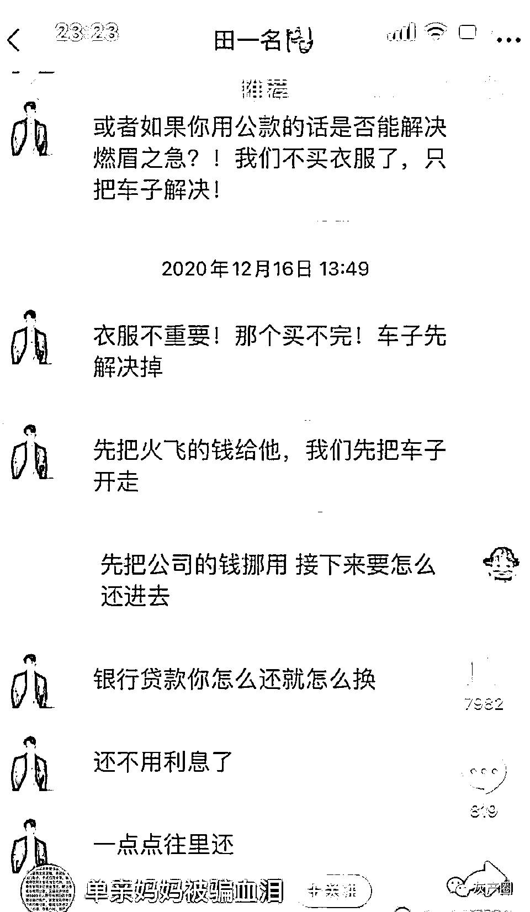
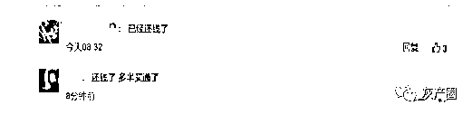

# “人间油物”勾搭少妇，，又一位百万粉网红翻车了！

> 原文：[`mp.weixin.qq.com/s?__biz=MzIyMDYwMTk0Mw==&mid=2247533747&idx=1&sn=ed8a6d4f41eb496478f8b263051a431a&chksm=97cb8f8ba0bc069db43d20a73667eaaf615629588ddad3f6e45c13811c8f8174f3ebfbee3ea7&scene=27#wechat_redirect`](http://mp.weixin.qq.com/s?__biz=MzIyMDYwMTk0Mw==&mid=2247533747&idx=1&sn=ed8a6d4f41eb496478f8b263051a431a&chksm=97cb8f8ba0bc069db43d20a73667eaaf615629588ddad3f6e45c13811c8f8174f3ebfbee3ea7&scene=27#wechat_redirect)

昨晚，网红圈再次曝出“大瓜”，又一位百万粉网红翻车了！

一位单亲妈妈在社交平台上发文控诉，被一位叫“田一名”的网红给骗钱骗感情了，女方通过贷款、挪用公款等方式先后为其代付了 51 万元后失联，让人震惊。

说起田一名，大家或许对这个曾经夸张地唱着“super idol 的笑容都没你的甜”，以“人类高质量男性”的梗成功出圈，日常“油腻”的网红还有些印象。

田一名通过这个视频迅速在网上走红，光是在某音上就有 870 万粉丝，还上过浙江卫视的综艺节目《请吃饭的姐姐》，与蔡少芬、朱茵、陈法蓉等女星同框，可以算得上是一个大网红。

然而，谁也没有料到，田一名竟然被曝出这样的丑闻。 

13 日晚，一位名叫“单亲妈妈被骗血泪”的网友在网上实名举报，指出田一名的真名为田欣，而她是一位单亲妈妈。通过男方主动添加好友，两人在 2020 年相识。

为了证明自己，单亲妈妈还在视频中附上了两人的身份证照片。从年龄上看，女方还要比田一名大 2 岁。

两人认识以后，田一名每天对这位单亲妈妈嘘寒问暖，了解了她的具体情况，还多次约她到江苏盐城及上海，让她代付购买昂贵的奢侈品和服饰。

田一名明知女方生活困难，却承诺会照顾他们母子，许诺未来，还以此哄骗对方用信用卡套现代付。 

透支完所有的信用卡后，田一名又怂恿单亲妈妈去挪用公款买车，还骗其去贷款了 18.万元。 

直到女方花光了所有的钱，没有再给田一名付款，他就消失不见。电话不接，消息也不回。 

女方这次在网上发文就是想要回自己花掉的这 519434 元。 

事情曝光后，不少网友都觉得不可思议，田一名竟然能干出欺骗单亲妈妈这样的事情来，表示对他相当无语。

也有人质疑田一名的行为是不是已经构成了诈骗，建议这位爆料女网友报警。

不过，到 14 日早上，再搜索“单亲妈妈被骗血泪”这个 ID 已经查无此人了。

一些网友也对此非常疑惑，发文提问，为啥搜不到了？

有网友爆料称，田一名已经还钱了，所以单亲妈妈就删帖了。

只是一夜之间，田一名就还上了这 50 多万，让人不禁怀疑，他既然有这个钱，又为什么要怂恿一个单亲妈妈去为他透支信用卡、找银行贷款，甚至是挪用公款呢？

如今，当事人已经删除发言，打算息事宁人，田一名这边又迟迟没有回应，两位当事人先后闭麦，也让人很难再去深究此事中的是非对错。

只希望大家日后在与人的交往中，多留一份心眼，不要盲目相信网红，还是要擦亮眼睛，避免上当受骗。

来源：吃瓜不吐葡萄皮

← 向右滑动与灰产圈互动交流 →

