# 一个叫钱文雄的男人，决定去死：他不是一个人，他就是“我们”

> 原文：[`mp.weixin.qq.com/s?__biz=MzIyMDYwMTk0Mw==&mid=2247533747&idx=2&sn=c2a89e6435e35ac067eac6d8bc8b3bc0&chksm=97cb8f8ba0bc069dde7f98b752ec5a009ac49b1f92031e356740b6f2d8bfd173993cbd04e18e&scene=27#wechat_redirect`](http://mp.weixin.qq.com/s?__biz=MzIyMDYwMTk0Mw==&mid=2247533747&idx=2&sn=c2a89e6435e35ac067eac6d8bc8b3bc0&chksm=97cb8f8ba0bc069dde7f98b752ec5a009ac49b1f92031e356740b6f2d8bfd173993cbd04e18e&scene=27#wechat_redirect)

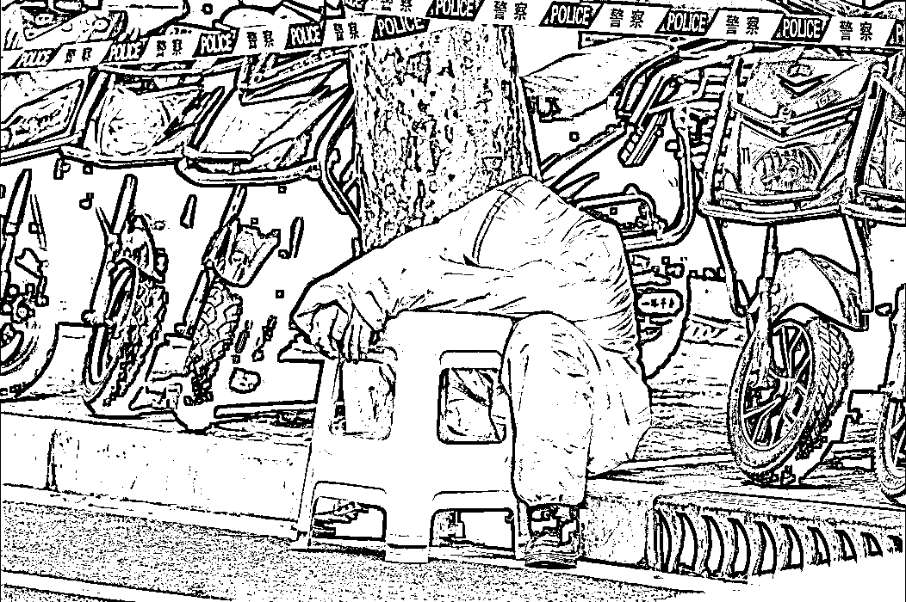

如果一个人选择了走向死亡，那他一定对生存充满了悲观。

钱文雄自杀身亡。

上海市虹口区卫生健康委员会 14 日通报称，该委干部钱文雄同志(男，55 岁，上海人)4 月 12 日下午不幸身亡，对他的不幸离世该委深表痛心和哀悼。该委已第一时间上门对其家属表达慰问和关切，正协助妥善做好善后等事宜。

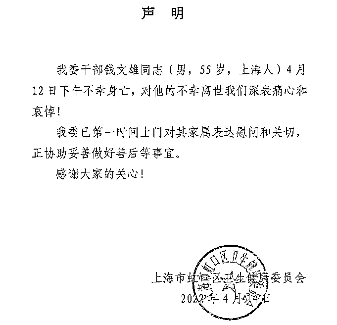

**上海通报钱文雄不幸身亡，却对死因讳莫如深。**

很可惜，在上海抗疫的最关键时刻，不管出于什么原因，都是让人悲痛和惋惜的。 

网上关于钱文雄的资料信息不多，只看到他是虹口区卫生健康委员会信息中心的主任。

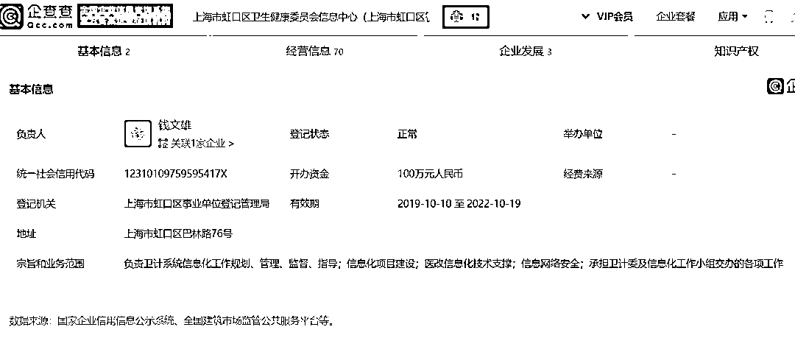

一个在基层工作稍微高级的普通干部。

**网上说他可能是压力太大了，最终发生了这样的悲剧。**

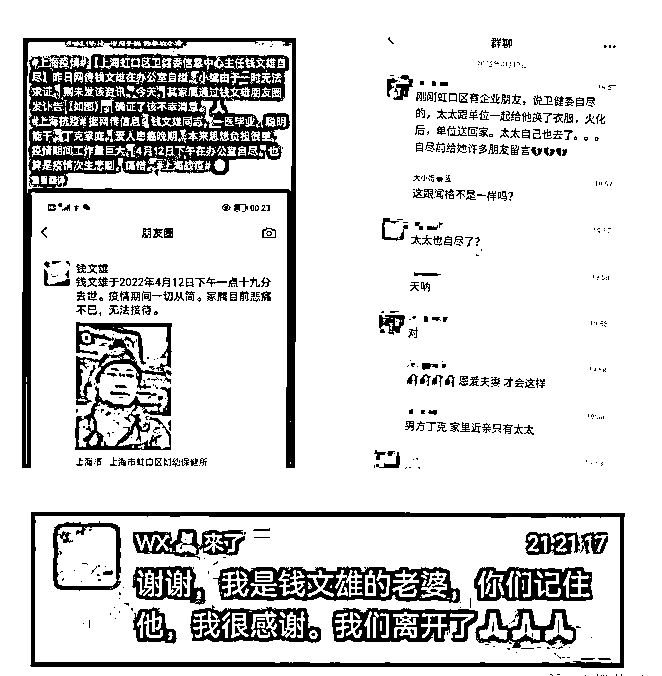

太太料理了钱先生丧事后，给大家留言：“我们离开了。”

网上因此传言钱太太自杀，后来这条消息被辟谣，连夜不少文章一夜被删。

上海警方回应：”钱文雄夫人自杀系谣言，将依法追究法律责任。“，但同时也反证了钱文雄去世的消息。

**钱文雄去世之所以牵动人心，因为他不是一个人，他就是“我们”。**

**不是每个人面对这样的难关，都能扛下去；我们已经看到太多人生活的“脆断”，解封和回归正常却还遥遥无期。**

假如钱文雄之死不能带来改变，他的去世就只成了一种逃避。

**-1-**

**全域静止封住了物资流动的源头**

从划江而治，到全域静止，上海目前最大的问题就是基本的物资供应——吃饭。

民生多艰，市民有情绪很正常，饭要吃、菜也是要吃的。

**但不禁有疑问：为什么到现在还缺吃的？**

截至 4 月 11 日，内蒙古、浙江、福建、江西、山东、河南、湖北、四川、广西、云南、宁夏等省区已累计向上海供应蔬菜 1.8 万吨，米面 850 吨，肉蛋 500 吨，另外还无偿支援了蔬菜、水果、牛奶、面包、罐头等食品 5400 多吨。

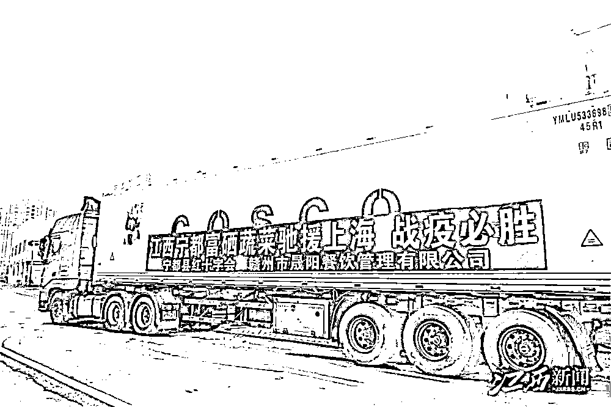

4 月 12 日，江西宁都 28 吨爱心物资驰援上海

**其实，上海目前的问题不是缺物资，而是物流堵塞。**

上海平时肯定有民生物资储备，现在连一个月也顶不住，显然不可能。

根据 2018 年全国第四次经济普查的数据，上海日常从事批发、零售、交通、物流、餐饮等各类商业和生活服务的人员，有 389.9 万人。

正是这 389.9 万人，为城市的物流体系提供了保障。

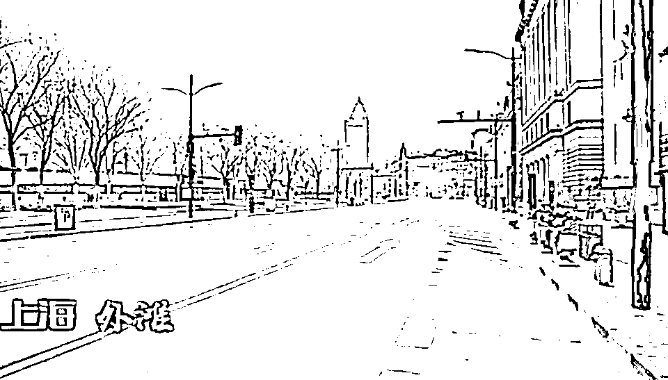

疫情下，空荡荡的上海街头 

疫情的全域静止让这些人都居家了，外面的东西进不来，进来的东西也运不走。

**平时给上海运送物资的苏州昆山等地，都被众所周知的原因祸害得天天核酸，人家也全域禁止了，高速也封了，那谁给你发货？**

严格的防疫政策下，全国十几个省市的物流受影响，行程码一带星就不让下高速，多少货车司机到上海吉林送完货就回不去了。

**一群大卡车滞留在高速路上，谁还敢给送货？**

哪个供应商愿意承担高昂的成本和风险？

道路封闭、司机被封，物流车辆大减。

**所以一个超大型城市的物流系统崩溃，也只是时间问题。**

**-2-**

**人手不足让物资堵在“最后一公里”** 

上海不是一座城市，有全国各个省市兄弟的支援。

**有物资却没有物流渠道的现实情况下，连接社区的最后 100 米也成了物流的“断头路”。**

不止一次在网友流传的截图里看到，物资是有的，都烂在仓库里，没有人手去运。 

甚至有人造谣说物资被一部分囤积居奇倒卖，乃至冒出因怕物资账目对不上而火烧仓库死无对证的谣言。

只能说，对也不对。

**居委一级的基层工作人员不是“不作为”，而是有心无力。**

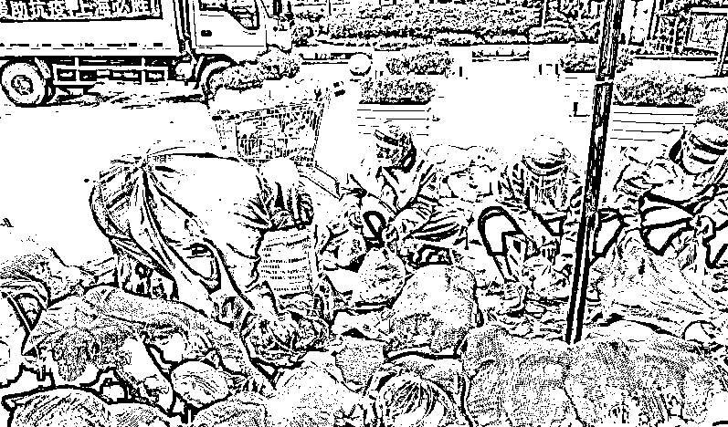

上海不少大型社区的居委会也就十个人左右，对应的是四五千居民。

就算加上一些志愿者，大规模分配物资的能力是极其有限的。

全上海“公共管理、社会保障和社会组织”这一项下的人员，仅有 29.1 万人。

**要 29.1 万人顶替 389.9 万人的工作，你觉得能做到吗？**

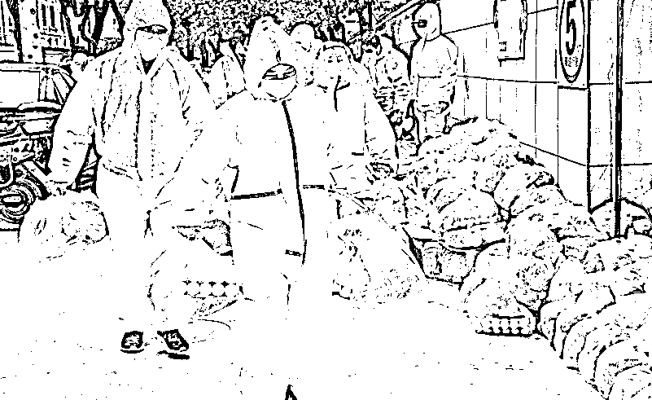

就算加上志愿者、物业等编外社区服务人员，临时喊来的杂牌军又能做好吗？

**管理不善导致无序化，没几次大规模练兵估计连小区的核酸检测都做不好。**

小区的管理人员，并不见得比你公司的行政更懂人员管理，人家平时也就在办公室跟你一样整理材料搞文件。

**不是腐败造成了物资匮乏影响了民生保障，而是全域静止防控造成物流受阻，导致了民生保障乏力。**

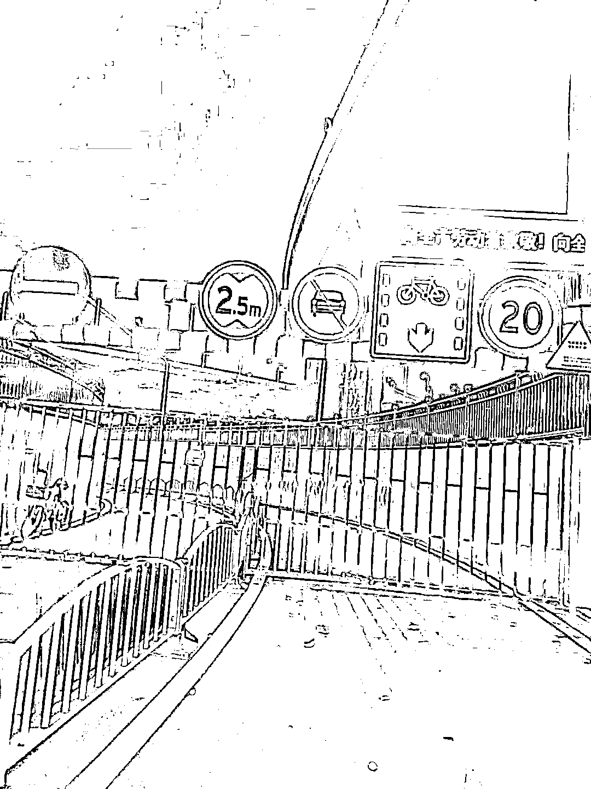

全域静止下到处都是封控

**缺菜缺肉不是因为没有“物”，而是“流”不起来。**

那些相信政府只封四天就买了四天食物的市民，一下子就陷入断粮危机，不开喷才怪！

**-3-**

**防疫情也难防人性**

一切反人性的行为，都是很困难的。 

这次上海疫情这么缺物资，可分为市民群众和管理者的人性纠葛。 

**从市民角度：**

疫情来了，人心惶惶，就会造成大量民众的集中物资抢购。

市民大家心里都没有底，所以恐慌心理加倍，**本来存两周的物资就可以，结果必须买冰柜存够 2 个月才踏实。**

我身边的一些上海朋友，他说自己不缺物资，但大家都在网上抢社区团，所以有买的机会他一定会买。

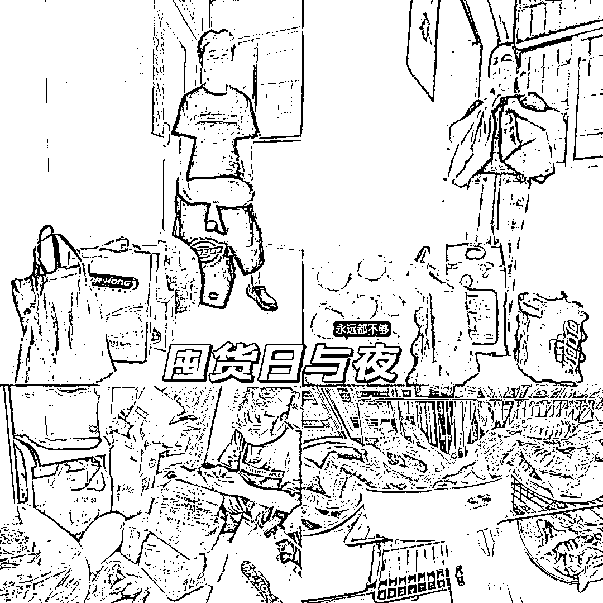

**身边人都跟他说：多存点，因为谁也不知道后面要封多久。**

但任何一个地方都满足不了这么大的物资储备。

另一个角度看，全国各个地方捐赠的物资，由于管理不善，调集不到位，导致物资的不平衡，浪费严重。

所以我们能看到，**有的区蔬菜物资发了五六次，有的也就收到一两次甚至更少。**

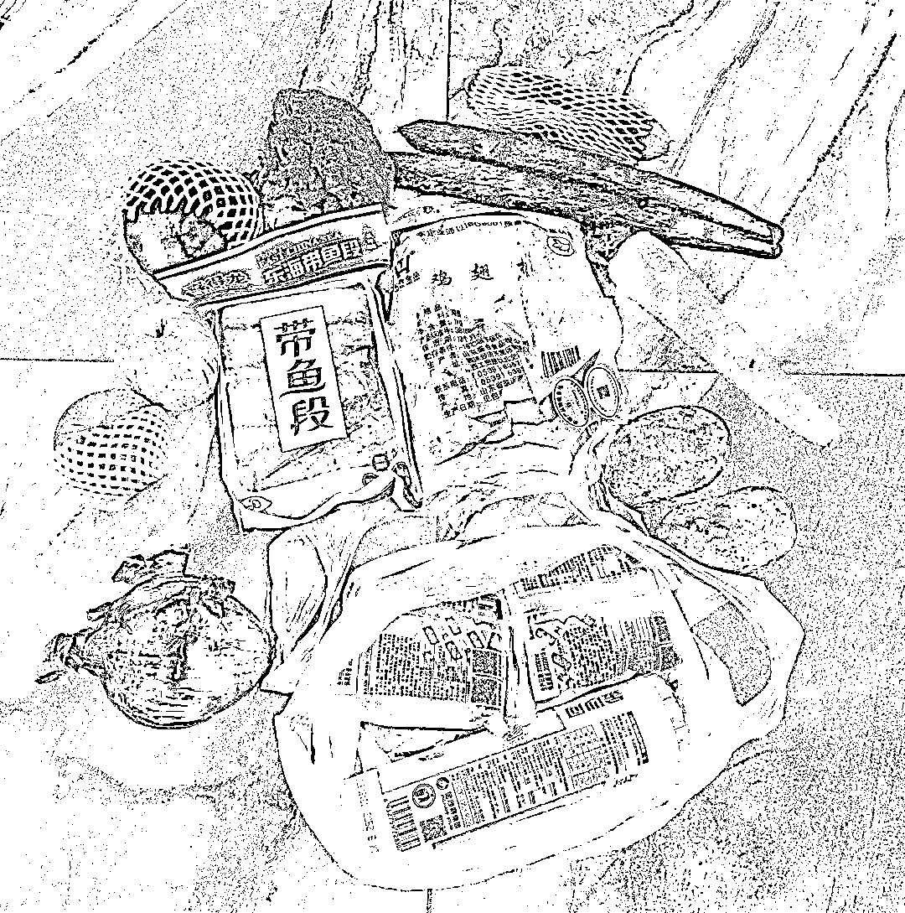

疫情三年，已经有统一的物资调配经验，为什么不借鉴一下呢？

疫情期间最关键的就是物资，民众有物资，手中有粮，心中不慌，藏富于民就是这个道理。

**缺乏物资，才是导致负面舆论最大的原因。**

**从城市管理者角度：**

上海这一轮疫情结束，最后问责下来肯定会有几个最大的领导倒霉，因为起因就是这帮领导带头压低了事情的严重程度，导致疫情迅速扩散。

中层干部不会害怕问责到自己头上，他们知道即使有惩罚，也属于自罚三杯的水平。

**而基层干部，不在于没惩罚，而是在没奖励。**

很大一部分基层干部已经在基层一线疲于奔命，或者说麻木了，这些是我们生活中的英雄。 

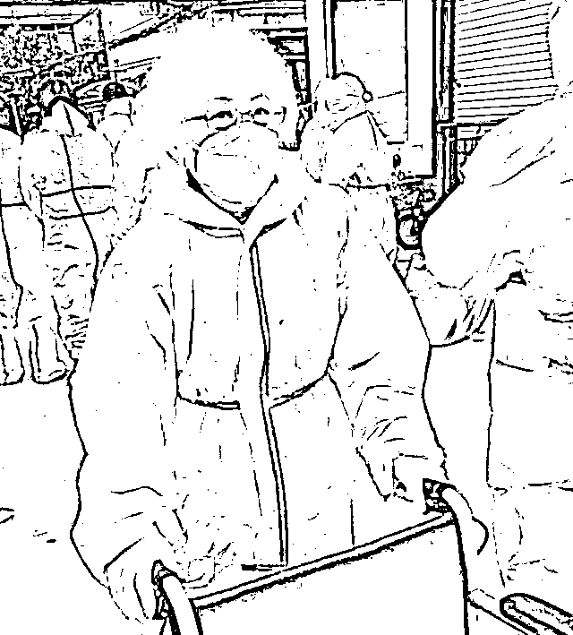

4 月 12 日，上海一 70 多岁老人在浦东新区一社区当志愿者，让人敬佩

但还有一部分干部，觉得既然干好干坏都一样，都受到指责，索性就磨洋工或者就只对上不对下：**领导说不能进就不能进，我只按规定办事，其他的我不管。**

所以有老人小孩生病四处求药而不得，打 120 都需要排队等待领导同意——**真放你过去了，疫情扩散了我可担不了责任。 **

还有一些志愿者或管理人员，纯属拿着鸡毛当令箭，有了一点小权力不去帮助大家，而是给民众添堵，这就是纯属坏了。

**人性都是趋利避害的，其实每一环谁都没大错，把你放到那个位置可能你也会那么选择，但在此刻是那么地扎眼。**

好消息是，吉林抗疫成果证明“动态清零”是制胜法宝。 

我们目前方法没错、路子没错，现在差的只是时间来打熬。 

但我们也要提高警惕，钱文雄之死应该被正视为一个临界点的到来：

**防疫一线干部承受力已到极限。**

**时代的灰落到每一个人头上都是一座山，打到每一个人身上的就是一堵墙。**

**希望有些“矫情”的人，就不要给基层干部添乱了，人家也是人，说不定会比你更难更扛不住。**

来源：昌南大队长

← 向右滑动与灰产圈互动交流 →

