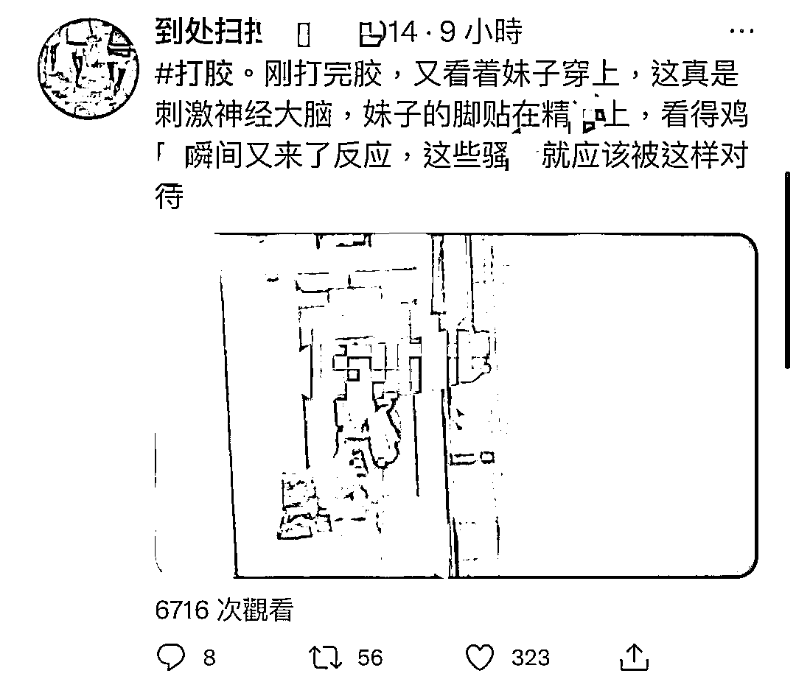

# 他们的飞机杯，是女人的高跟鞋

> 原文：[`mp.weixin.qq.com/s?__biz=MzIyMDYwMTk0Mw==&mid=2247533747&idx=4&sn=a67894534db527437665c948ad737060&chksm=97cb8f8ba0bc069d0292ab1aac6ccb58d3dda0f2a1582663f4a64a2c38b3277fb00b84b52e51&scene=27#wechat_redirect`](http://mp.weixin.qq.com/s?__biz=MzIyMDYwMTk0Mw==&mid=2247533747&idx=4&sn=a67894534db527437665c948ad737060&chksm=97cb8f8ba0bc069d0292ab1aac6ccb58d3dda0f2a1582663f4a64a2c38b3277fb00b84b52e51&scene=27#wechat_redirect)

**写在前面**在小蓝鸟有关情色的词条里，“打胶”是最常见的类目之一。他们在黑夜里潜入楼道专偷女人高跟鞋，并将高跟鞋作为暂时的飞机杯用于自慰用途。行话管这叫扫楼打胶。 扫楼打胶：打胶是行话，指男性在发泄欲望后分泌液体的过程；而扫楼打胶，则是指部分有着特殊癖好——恋足的男人们，在楼道里寻找女性放置在门外的鞋子，借此宣泄自己的欲望的一种行为。**一**关于打胶，扫楼不过是其中一个较为“显著”的分支，扫楼打胶的特征很好辨认——满屏的女士高跟鞋和丝袜是主体，拍摄的男性会因为这些具有强烈女性特征的物品被唤起性欲，而唤起性欲的下一步，就是要把自己的体液打到这些物品上“宣示主权”。除了高跟鞋以外，有部分男性也会对女性的贴身衣物和日常所用的杯具下手，对于他们来说，任何与女性有关的贴身物品都有可能成为打胶的载体。也许是办公室里女同事用过的杯子，也可能是女同学坐过的椅子，甚至有可能是老师放在办公室里的鞋子。也许是无意间放在门外地毯上没来得及收进去的鞋子、也许是晾在公共阳台上的衣服。我曾经看过一个关于打胶的帖子，博主沾沾自喜的炫耀他在给女同事接水的时候，把精液混入了她的茶杯里，“如果她问起来，我就说那是上好的蜂蜜。”打胶的根源，其实是一种恋物癖。但这种恋物癖的危险之处，就在于对于大部分女性来说，它是防不胜防的，我们无从预知那些体液可能遁于何处。**二**
在众多打胶的视频里，我们可以注意到，许多始作俑者的口罩和帽子上都写了自己的“代号”，他们认为打胶本身是一种艺术行为，需要尊重原创。扫楼打胶的历史悠久，所以其背后的产业链也形成得很完整，在扫楼和打胶的标签里，免费帖子虽然不少，但时长一般都很短，对于有这类癖好的人来说，时间一长，他们总会不满于这些简短的视频或是单一且带着水印的图片。在寻找视频的过程中，他们最终的落点总是同样的——进入付费资源分享群，然后在“同好”的教育下开始在现实里实行打胶。在这其中，最常见的一种实施方法，就是在闲鱼上收购女性穿过的贴身衣物，针对部分有警惕心理的女孩儿，他们会从购买二手闲置衣物开始。主页、性别一律伪装成女性，熟练的老手甚至会伪装成二次元同好，从收 cos 服开始，再一步步收购贴身衣物，在这个过程里，有的甚至会要求出物的女孩儿穿上衣物摆出特定姿势，以满足他们的特殊癖好。 除了购买所谓的“原味”以外，他们还会以各种理由，在现实里要求看女孩儿的脚。在提供扫楼打胶的视频账号里，经常可以看见的一类视频，就是关于一个女生在路边等人，然后就有一个举着手机拍摄的男性，谎称自己需要做一个学生作业，这个作业是要观察女生的足部，他们可能会说自己是人类学、社会学甚至是医学生和美术生，用“田野调查”和“画画做模特”的缘由欺骗女孩。这一类视频，被他们称为“街射”，和打胶属于同一分支。在获得女孩儿的信任以后，他们会伺机下手。对于女性来说，这无疑是一场无妄之灾。试想一下，我们身边一旦出现了有类似癖好的男性，则意味着我们的杯子、椅子、甚至留下用来御寒的衣物，都有可能在某天成为打胶的载体而沾染上精液。不仅如此，谁也不知道那些尾随着女性、企图用她的高跟鞋作为飞机杯自慰的男性，下一步会做出什么更加令人发指的行为来。我们无从预知他们的下一步行为，更无法预知那些跟在我们身后如影随形的危险，到底会做到哪一步。他们真的只会止步于对着女孩儿的高跟鞋打胶吗——？换个角度想一想，既然源头是“恋物癖”，那是不是对于部分有着相似癖好的同性恋者而言，男性的球鞋、衣物，也同样可能成为他们的载体呢？

← 向右滑动与灰产圈互动交流 →

