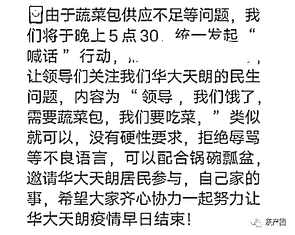
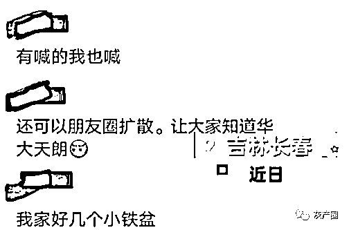
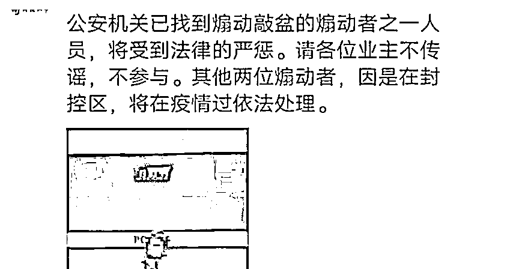

# 网传长春一居民煽动敲盆行动被拘，网友：这事赖谢广坤！

> 原文：[`mp.weixin.qq.com/s?__biz=MzIyMDYwMTk0Mw==&mid=2247533747&idx=5&sn=3ca4bee5afdb9c01269e7e1481aa1c53&chksm=97cb8f8ba0bc069d7cc47465536886e4d0fa96b92ef8a4ae35a6155e2c8d681d5c9264b5d470&scene=27#wechat_redirect`](http://mp.weixin.qq.com/s?__biz=MzIyMDYwMTk0Mw==&mid=2247533747&idx=5&sn=3ca4bee5afdb9c01269e7e1481aa1c53&chksm=97cb8f8ba0bc069d7cc47465536886e4d0fa96b92ef8a4ae35a6155e2c8d681d5c9264b5d470&scene=27#wechat_redirect)

近日，吉林长春，网传一住户王某在基本生活物资有保障的情况下，在业主群内煽动“敲盆行动”，性质严重影响恶劣。

据极目新闻，警方已对其违法行为给予治安拘留 7 日，并处 300 元罚款。

[`v.qq.com/iframe/preview.html?width=500&height=375&auto=0&vid=g3332nwqnvf`](https://v.qq.com/iframe/preview.html?width=500&height=375&auto=0&vid=g3332nwqnvf)

4 月 12 日，辖区警方证实了此消息。该小区一位居民称：小区封控管理至今已有 30 多天了，基本生活物资由政府负责配送，是有保障的。不过居民申报的生活物资，一般来说是必需品，非必需品肯定无法得到满足。

* * *

建议立即逮捕审问谢广坤，因为这事儿根源应该就是从广坤这来的

[`mp.weixin.qq.com/mp/readtemplate?t=pages/video_player_tmpl&action=mpvideo&auto=0&vid=wxv_2353763947553701889`](https://mp.weixin.qq.com/mp/readtemplate?t=pages/video_player_tmpl&action=mpvideo&auto=0&vid=wxv_2353763947553701889)

来源：微博那些事儿

← 向右滑动与灰产圈互动交流 →

