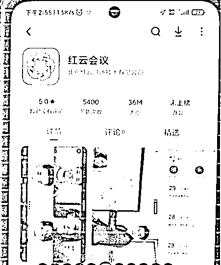
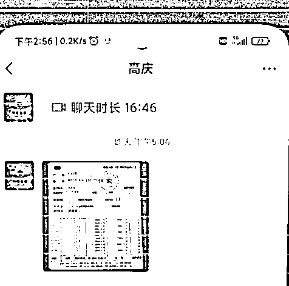

# 昆明已有多人被骗！骗子软硬兼施，骗你还不忘安抚你的情绪

> 原文：[`mp.weixin.qq.com/s?__biz=MzIyMDYwMTk0Mw==&mid=2247533747&idx=7&sn=7a5217a07895030a4ceb1b712ebf492d&chksm=97cb8f8ba0bc069d000ff54a32b5e9c5dbb44ce57516b8e29eca9ace339c790ec5a080ef4c4e&scene=27#wechat_redirect`](http://mp.weixin.qq.com/s?__biz=MzIyMDYwMTk0Mw==&mid=2247533747&idx=7&sn=7a5217a07895030a4ceb1b712ebf492d&chksm=97cb8f8ba0bc069d000ff54a32b5e9c5dbb44ce57516b8e29eca9ace339c790ec5a080ef4c4e&scene=27#wechat_redirect)

“你好，我是 xx 公安局的警官”

“你涉嫌经济犯罪”

“你的身份证被盗用”

“你的医保卡即将被停用”

“你银行账户有犯罪行为”

“洗黑钱”“通缉令”“逮捕令”

“请你配合调查”

……

**警惕**

**这是冒充公检法诈骗的常用话术**

**昆明已有多人被骗**

**真实案例**

近日，家住昆明市经开区的王女士接到一个陌生电话，对方自称是某某通信管理局的工作人员，因王女士名下的一张电话卡在某网络平台上发布了 6000 余条“垃圾信息”，该行为触犯了国家的相关法律法规。

王女士向对方解释并不知晓此事，对方便声称王女士如果没有发送过违法短信，可以向公安机关报案。

这时候，王女士被对方的言语恐吓到，急忙问对方要如何处理，**对方告知她，一会儿会帮她把电话转接到公安局，**让王女士耐心等候。

约一分钟后，自称是湖南省长沙市某区公安局的民警高某来电，告知王女士现要确认其名下电话卡发送信息的情况，但是**具体情况需要到“红云会议”APP 内让单位的“刘队长”进行核实，****之后王女士通过手机应用商城下载了“红云会议”APP，并进入了对方提供的“网络会议室”内。**

**王女士根据对方的提示，在“红云会议”APP 会议室内提供了个人信息及一些支付账号，用来进行情况核实。**

过了一会儿，“刘队长”称电话卡的事情已经帮王女士处理好了，但是其名下还有一张银行卡涉及到“洗钱”，如果查实将会被公安机关逮捕，具体的情况需要和刚才的“高警官”联系。

对方还向王女士提供了联系方式，正处于慌乱中的王女士来不及多想就添加了“高警官”的微信。

添加微信后，**这位自称“高警官”的人就通过微信截图给王女士发送了其银行卡涉案的基本情况。**

在看到对方发来的照片上确实是自己的身份信息、个人照片后，王女士懵了，极力向微信那头的“警察”表明自己是清白的。

对方拿捏了王女士着急的心理，告知其“解决方法”——进行“资金核查”，称若王女士的资金来源清白就不会被逮捕。

随后开始通过微信视频跟王女士进行交谈，**主要对王女士的家庭、工作、银行卡保管使用等情况进行询问。**

期间王女士应对方要求，将自己的身份证、银行卡拍照发送给了对方，对方告知王女士相关的材料已收到，次日会帮王女士处理，让王女士保管好手机，期间还安慰王女士要好好休息。

次日 9 时许，对方通过微信联系上王女士，王女士咨询对方是否可以在“当地报案”。

**对方询问了王女士所处的位置，以及周边环境，并告知王女士，此案件属于重大案件，要高度保密，不可以到当地公安机关报案处理，并且该案件不能和家里人说，以免泄露案件，待案件查清楚之后才能告知家里面的人。**

现为了帮王女士“建档”，需要找一个比较安静的地方，对方告知王女士不能在家里进行，需要找一个没有人的地方进行核查。

完全乱了阵脚的王女士便急急忙忙下楼，找到小区楼下一处空地，对方还要求对王女士用手机拍摄周边环境。

**对方确认了王女士所处的位置后表示，为了进一步查清案件事实，需要证明王女士名下资产是否合法，要将所有的资金转到昨天核查的那一张银行卡里**，随后王女士将自己所有银行卡账户内的钱都转到被核查的银行卡账户时，**对方又称，为了保证所有资金的合法性，需要把钱转到他所指定的安全账户内，**才能更好的进行核实。

已经方寸大乱的王女士，对对方深信不疑，老老实实地按对方指引，再次将自己银行卡内的**10.7 万元**转到对方提供的银行卡账户内。

**之后对方又以案件侦办为由让王女士继续转钱。**惊慌失措的李女士左思右想发现不对劲，遂报警。

此外

近期安宁也有两人

遭遇冒充“公检法”诈骗

**案例 1**

4 月 8 日，张女士在安宁市家中接到一个自称社保局的电话，称其在上海有一张社保卡涉嫌骗保，需要本人去上海核实，否则会将其名下银行卡冻结、社保卡拉黑。

其称最近没有时间去处理，对方便说可以通过 QQ 调查处理，后其通过 QQ 视频电话根据对方提示操作，向对方银行卡**转账 5000 元**。

**案例 2**

4 月 10 日，王女士在安宁市某商铺内接到一自称“唐山市公安局”的陌生电话，称其涉嫌一起诈骗案件，让其保密，不能告诉任何人，并缴纳一笔保证金，如果其不配合将会被拘留。

对方还给其发送了几张有重大嫌疑人指认书和取保候审决定书的图片。

其被恐吓威胁后相信对方，点击对方发送的链接下载了一个软件，通过软件跟对方视频通话、向对方银行卡**转账 2 万余元**。

**反诈民警提示**

“公检法”机关**不会**通过电话或者网络进行办案调查，**不会**让公民自行上网查询“通缉令”、“逮捕令”，**不会**通过社交平台发送法律文书和个人工作证件。

**凡是**以你“涉嫌洗钱、涉案诈骗”等为由，主动帮你转接“公安机关”的，**都是骗子！ **

**凡是**要求你“电话/QQ 视频/微信视频”做笔录的，**都是骗子！**

**凡是**你通话内容要“绝对保密”，要求你找隐秘地方的，**都是骗子！**

**凡是**要求把资金归集到指定账户（无论是自己名下的账户，还是对方提供的账户），要求提供银行账号、密码、验证码的，**都是骗子！**

来源：昆明市反电信诈骗中心综合自经开警方、安宁警方

← 向右滑动与灰产圈互动交流 →

