# “急需异性解决生理需求”，上海民间自助求助平台出现找乐子信息，疫情不忘发情

> 原文：[`mp.weixin.qq.com/s?__biz=MzIyMDYwMTk0Mw==&mid=2247533818&idx=1&sn=ff7d2ab455ec4ad93b68b216dab19942&chksm=97cb8fc2a0bc06d41386c2bf7db07b2a53ba4032ae4d6f750d20d11c6ebba718cfd79380fc05&scene=27#wechat_redirect`](http://mp.weixin.qq.com/s?__biz=MzIyMDYwMTk0Mw==&mid=2247533818&idx=1&sn=ff7d2ab455ec4ad93b68b216dab19942&chksm=97cb8fc2a0bc06d41386c2bf7db07b2a53ba4032ae4d6f750d20d11c6ebba718cfd79380fc05&scene=27#wechat_redirect)

由于疫情管控，进入“隔离模式”的上海居民们的生活方式发生巨大变化，很多问题也凸显出来，甚至一些日常几乎无视的小问题如今也成了“一文钱难倒英雄汉”的尴尬。

BU 校友 Stanley 做了一个互帮互助网站（**daohouer.com**），可供被隔离在家的人们留下联系方式和需求，寻求大家帮助。

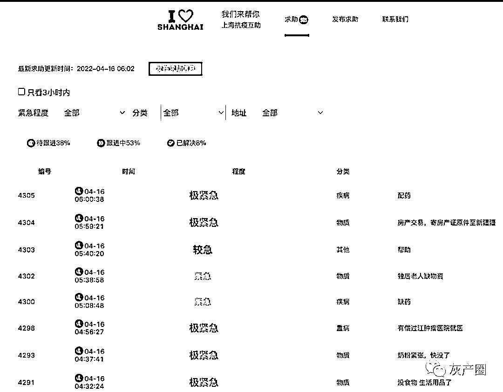

这个民间自发的上海抗疫公益求助平台，取得了很好的效果，解决了很多然的燃眉之急，也能看出疫情下的人生百态

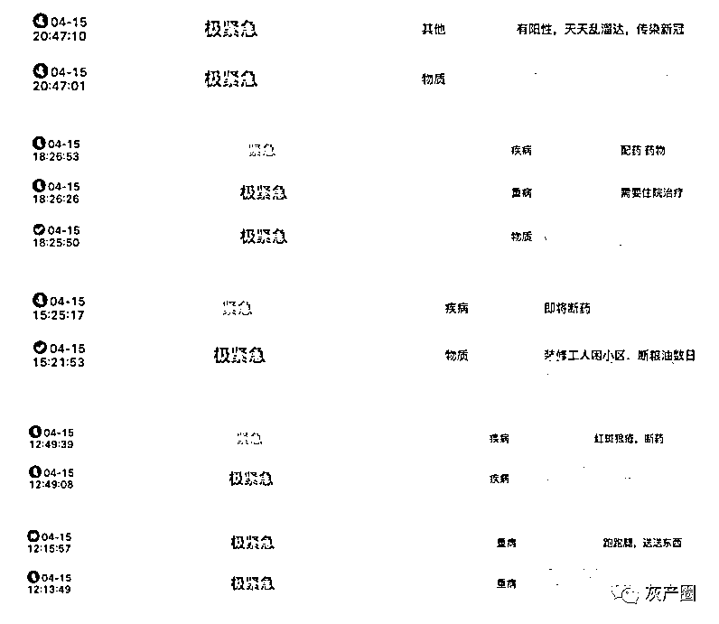

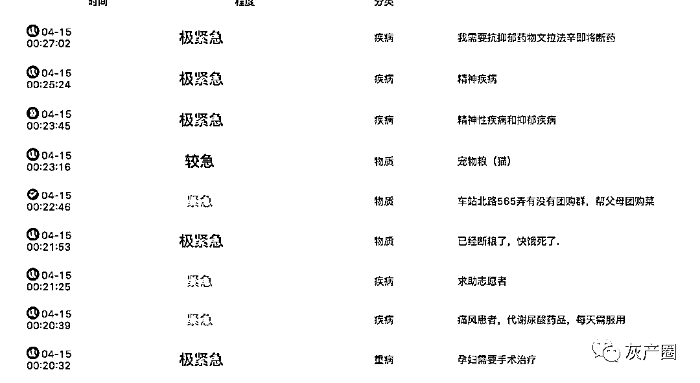

然而，大量事实表明这次疫情中，有很多给上海添乱的人，或许是纯属素质低，或许是被境外势力蛊惑，或许是故意挑起矛盾... 

微博博主@豆豆酱有点闲接到网友的投稿：上海抗疫求助平台上出现了很多要求解决生理需求的信息，本来疫情之下各种公共资源都紧张，这纯属抢占公共资源添给国家乱！

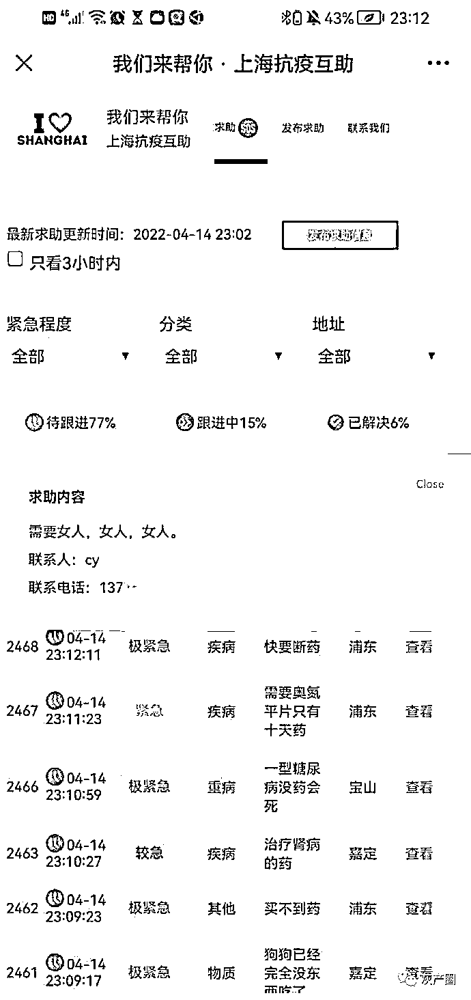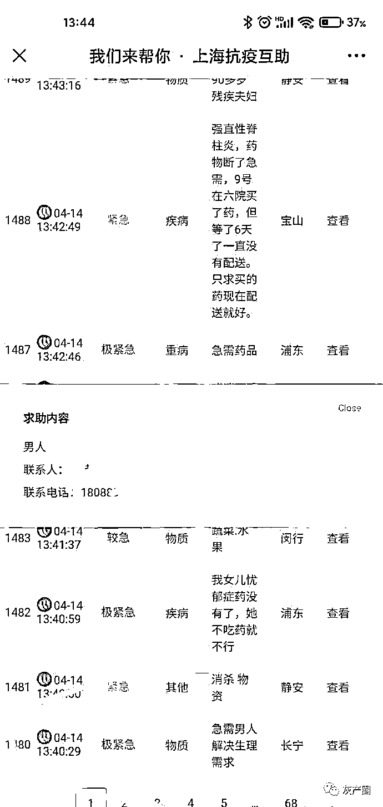

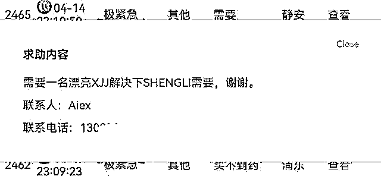

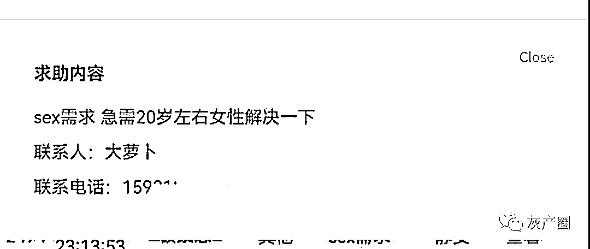

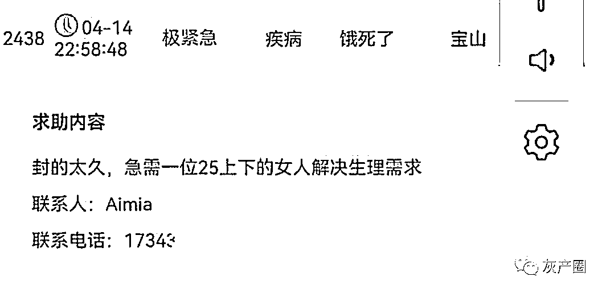

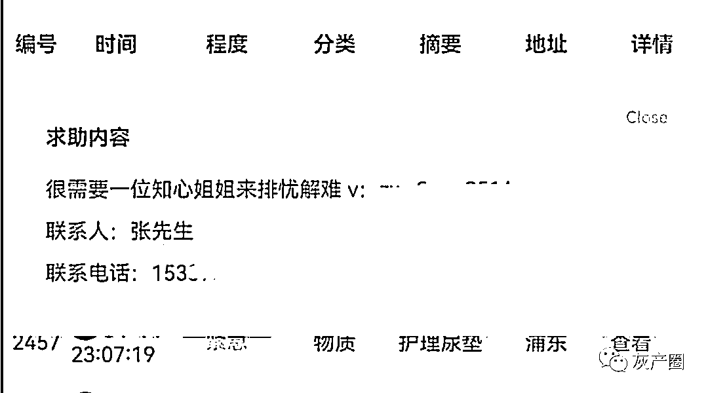

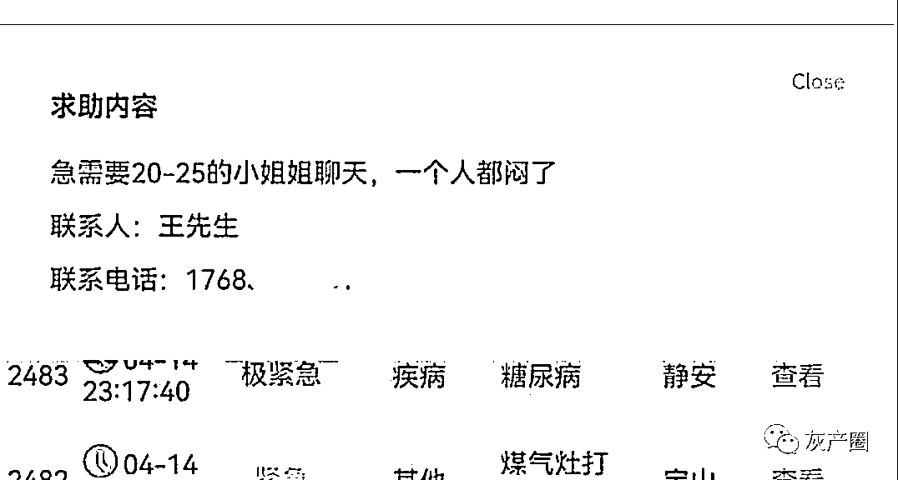

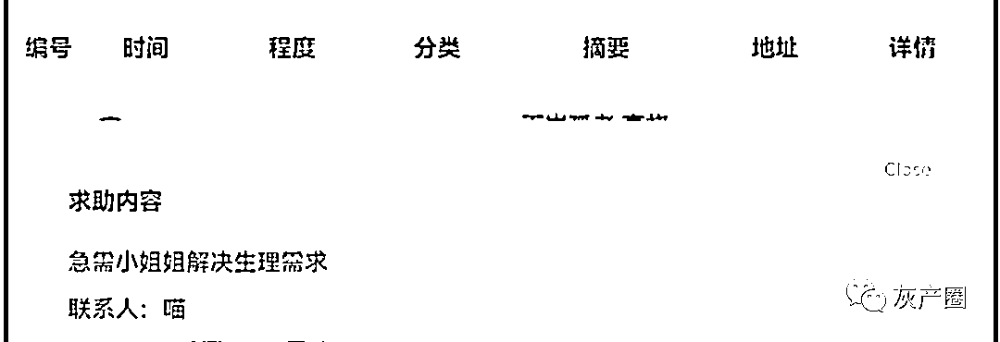

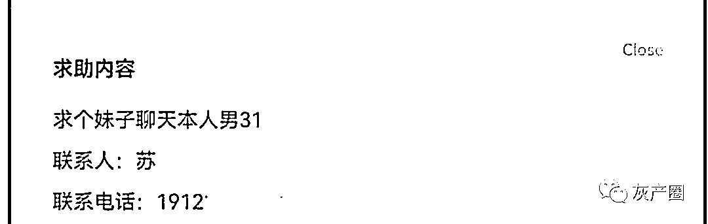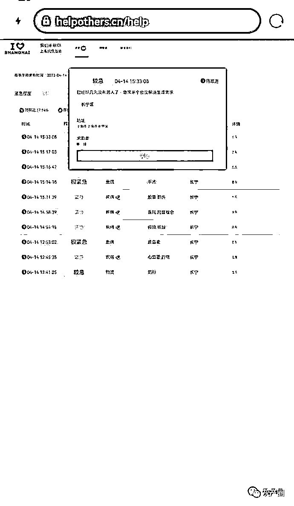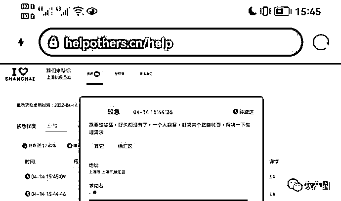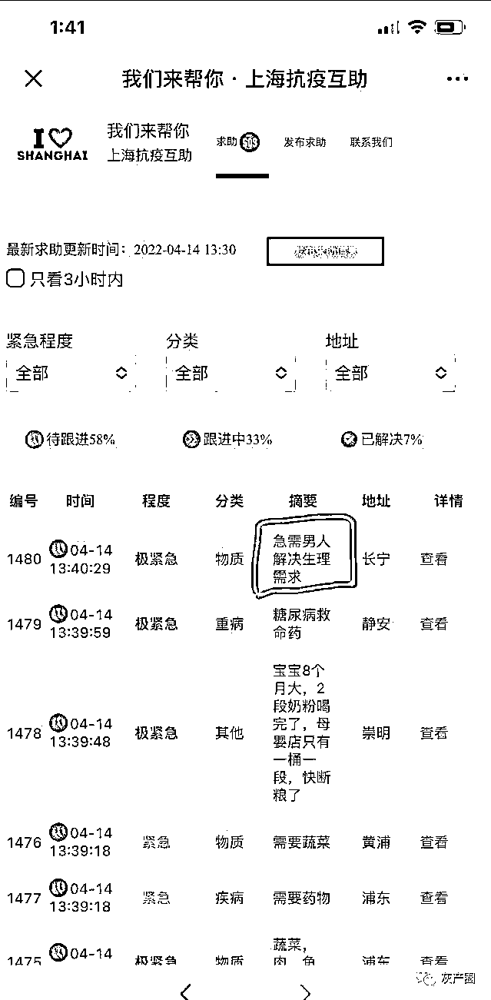

看了一下网站已经把这种耽误求助资源的内容移除了

* * *

啦咔咔 20310:疫情之下不忘发情

尉蓝的泪雨:给一批人抓一抓罚一罚就好了

_Reno_ 挚爱 FF:打码是因为这些人有可能留别人的手机号，这类垃圾干这种事太正常了

    来源：微博那些事儿

← 向右滑动与灰产圈互动交流 →

