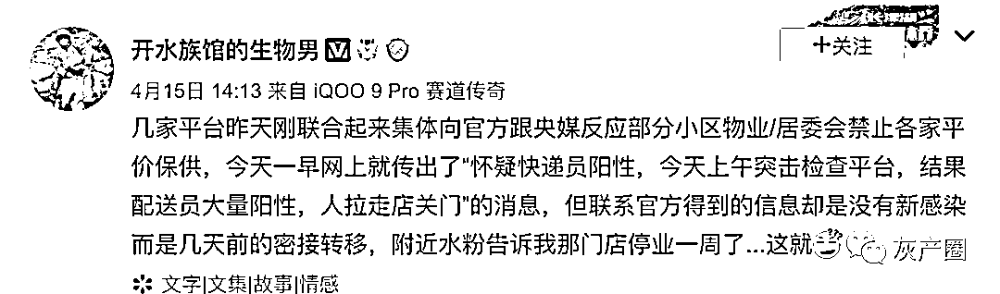
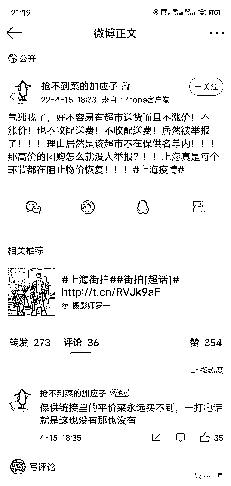
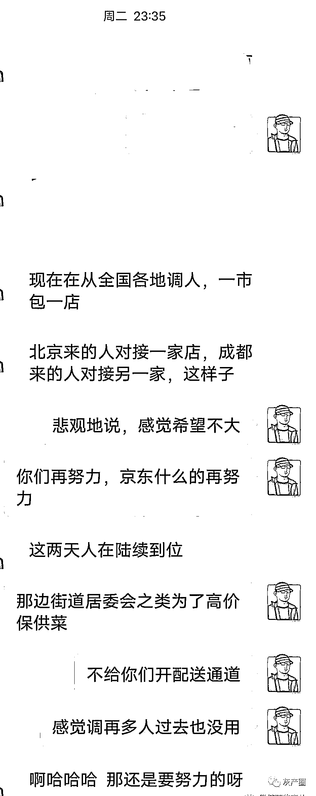
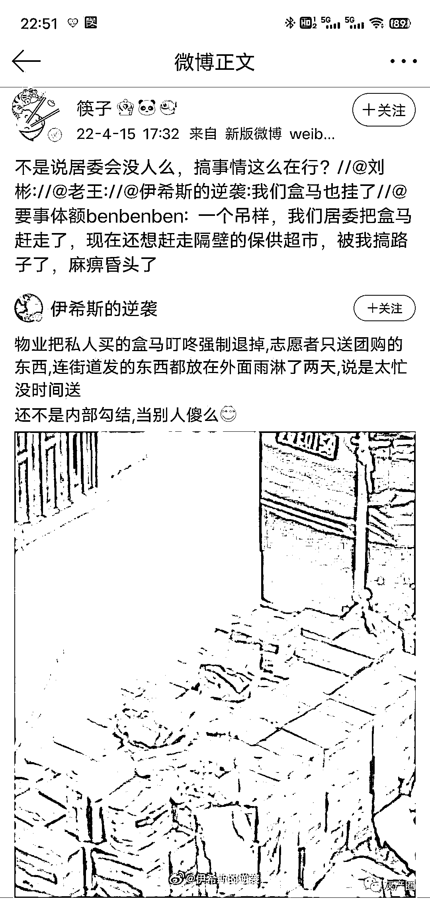
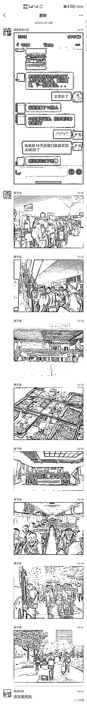
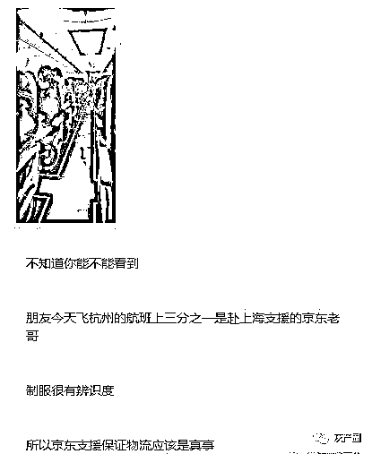
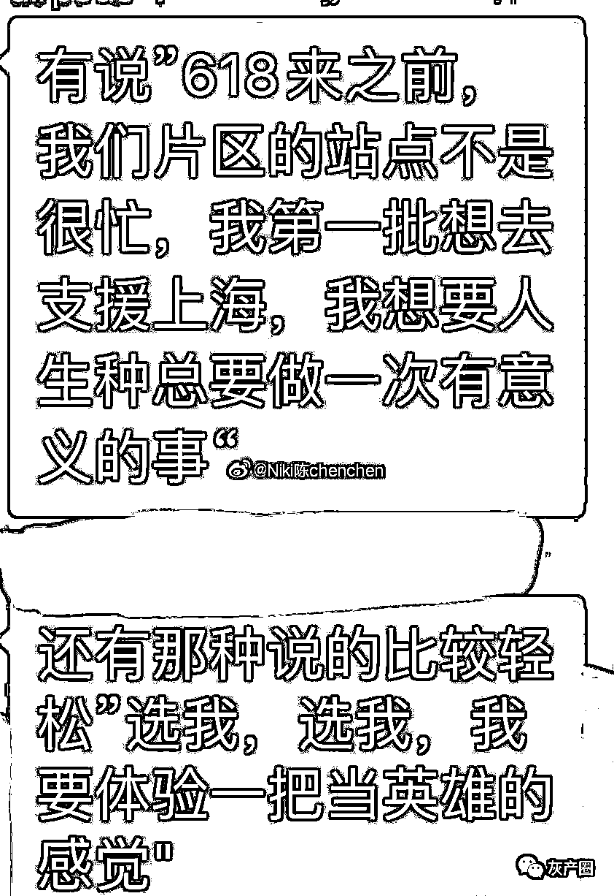
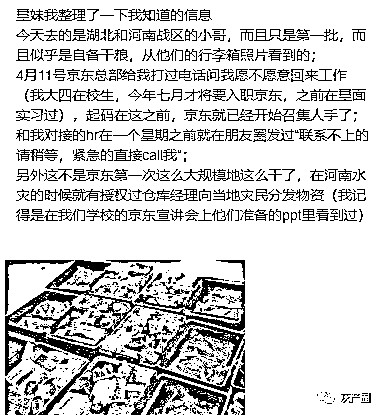

# 京东用“人海战术敢死队”进上海！挑战上海地头蛇！

> 原文：[`mp.weixin.qq.com/s?__biz=MzIyMDYwMTk0Mw==&mid=2247533818&idx=2&sn=54d43b15b52af9473acde9448aa5591e&chksm=97cb8fc2a0bc06d44c1a8c51d4706f00067a861ec4c666613e6d1891349d772ee51de93ad761&scene=27#wechat_redirect`](http://mp.weixin.qq.com/s?__biz=MzIyMDYwMTk0Mw==&mid=2247533818&idx=2&sn=54d43b15b52af9473acde9448aa5591e&chksm=97cb8fc2a0bc06d44c1a8c51d4706f00067a861ec4c666613e6d1891349d772ee51de93ad761&scene=27#wechat_redirect)

上海现在真成魔都了，各种魔幻的事。
尤其是作为中国第一大经济城市，物资供应竟然堪比灾荒年代。前几天，盒马运送了一大批配送员去上海，但是网友并不乐观 有消息称京东物流通过“自杀式物流”方式向上海运送物资，一批次京东小哥、小姐姐进入上海后需要就地隔离，接着下一批次小哥继续运输。消息称共有 14 批次小哥，通过循环实现每天都有物流运输。京东朋友发来的小哥们报名时候说的据第一财经记者独家了解，上述信息部分属实，京东确实从多地调派了多名小哥支援上海。数量上，京东物流调派的小哥不止 14 批次。同时，所有被调派的小哥都已打过三针疫苗，进入上海后并非就地隔离，在遵守政府管控的情况下小哥可以正常派送商品。截至目前，全国多地约 3000 名快递小哥等一线抗疫保供人员将陆续抵达上海。

* * *

艾斯佩刀 :上海滩 资本家的乐园  金融中心  绝不放过能发财的机会 没有机会 都要创造出机会别梦依稀笑逝川 :上海滩新两白一黑大战，地头蛇再牛逼，挡不住全国调兵啊nacho:也给个佐证，浦东看数字比浦西严重太多，但我家免费发放+居委满足一般生存要求了，老年人也能米油菜肉齐全；关闭的一刻居委还联系了旁边 2 个超市、菜鸟，加 SAMS 盒马和私人团，也不难抢，我甚至买到了金鲳鱼。徐汇同事：饿 sven_shi:这些平台开起来，供应马上就能保障。但是中间那批人就没钱赚了。上海目前的物价，很多在中间的就真的抱着法不责众的心态在瞎搞。

看内容名字不重要:想给普通市民供点正常物资比攻碉堡还难，一波又一波硬是被莫名的力量给消灭了，在全国人民的眼皮子底下坚持这么干还真是很有种。拭目以待看有没有真正的苍蝇老虎伏法。

来源：微博那些事儿

← 向右滑动与灰产圈互动交流 →

