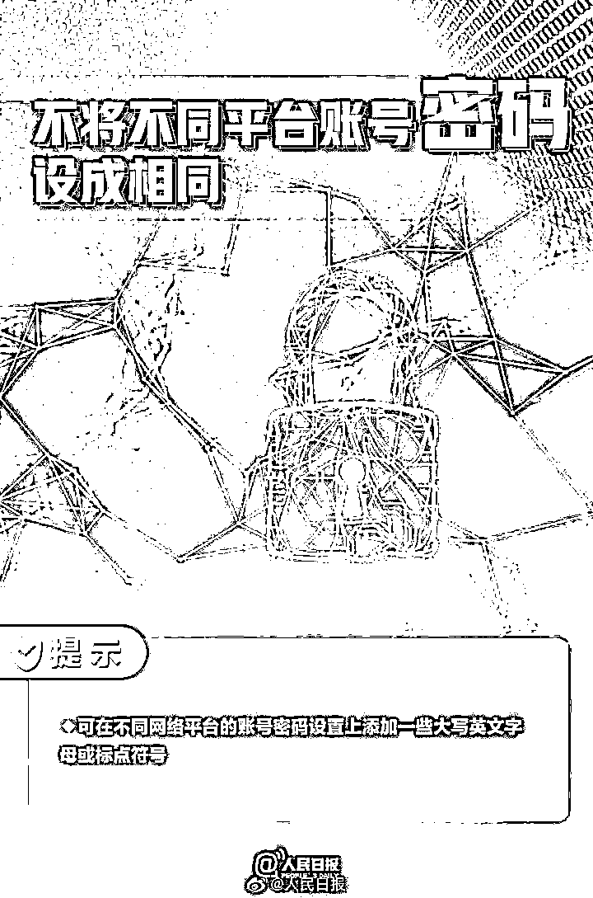
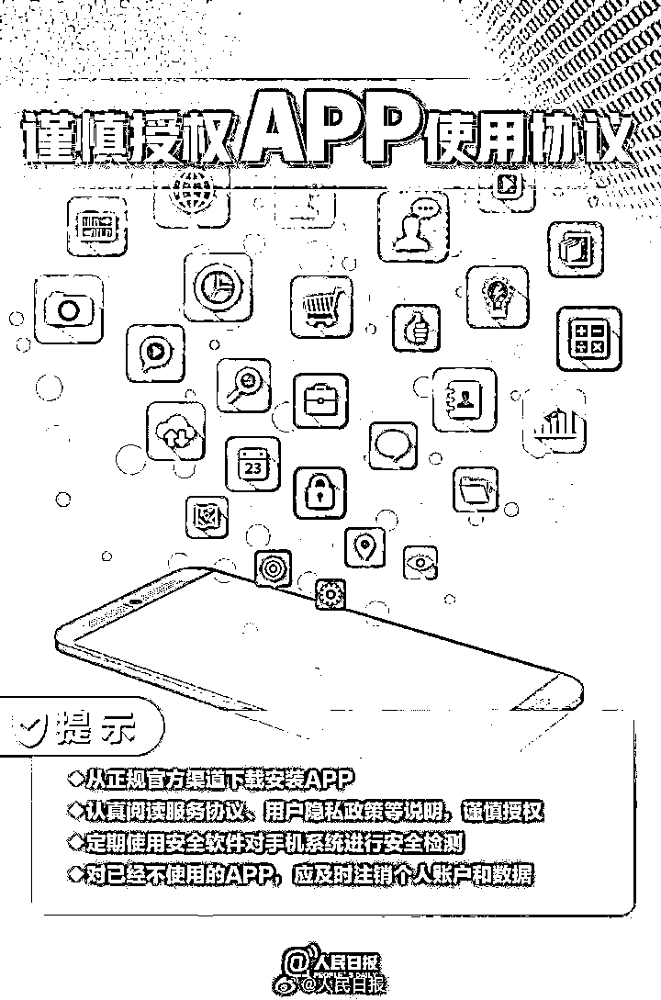

# 热搜第一！警方提醒：赶紧自查

> 原文：[`mp.weixin.qq.com/s?__biz=MzIyMDYwMTk0Mw==&mid=2247533818&idx=6&sn=921a8b8cea99d37b00f27841ce2d01a5&chksm=97cb8fc2a0bc06d4924e0a6491c39e6e34bb7d02a26da8fc78aeb57412d8dec9caf3bd17cdad&scene=27#wechat_redirect`](http://mp.weixin.qq.com/s?__biz=MzIyMDYwMTk0Mw==&mid=2247533818&idx=6&sn=921a8b8cea99d37b00f27841ce2d01a5&chksm=97cb8fc2a0bc06d4924e0a6491c39e6e34bb7d02a26da8fc78aeb57412d8dec9caf3bd17cdad&scene=27#wechat_redirect)

你知道你的身份证下

有几张电话卡吗？

先别斩钉截铁地回答

**因为**

**答案很可能出乎你意料喔！**

近日

深圳龙岗分局民警何警官现身说法

**身份证外借**

**可能被他人注册电话卡用于犯罪**

并喊话大家赶紧查一查

相关视频被人民日报官微转发

并冲上微博热搜榜榜首

引起广泛关注

▼

一起来看看详细情况

**你的身份证借过给别人吗？**

** 深圳龙岗分局：有风险！赶紧查查**

近日，深圳市公安局龙岗分局一则视频被人民日报官微转发，并冲上微博热搜榜榜首，引起广泛关注。

视频中，龙岗分局民警告诉大家：**身份证外借可能被他人注册电话卡用于犯罪，有风险，并喊话赶紧查一查！**

视频中，龙岗分局民警何警官现身说法——

> **你的身份证借给过别人吗？被别人用过吗？如果你的身份证被别人用来开电话卡，再用来实施犯罪，那可就麻烦了。**

**如何查询名下到底有几张电话卡？**

何警官介绍—— 

首先打开微信，搜索“国务院客户端”，在便民服务中点击“更多”，进入后在搜索框中搜索“电话卡”。选中“电话卡一证通查”，点击后按要求填写相关信息，再点击“查询”，然后就可以在四十八小时内收到反馈短信。

**如果发现名下有多余的电话号码，马上联系运营商，注销。**

记者按照视频介绍操作，在国务院客户端输入自己的身份信息后，不久就收到了短信通知，告知本人名下持有的手机号码。**整个过程简单快捷，**验证后，仅一分钟左右就收到了短信回复。 

在该热搜话题中

很多网友立马按照相关指示查了

有人显示只有一张

▼

**而也有网友查出**

**自己的身份证被别人办卡了**

▼

还有不少网友

因为身份证被公司用去办电话卡

而表示担忧

▼

看完了网友的查询结果

大家伙是不是也跃跃欲试了呢？

**具体怎么查询呢？**

听完何警官的介绍

记者已经一步一步操作过啦

这就图文并茂告诉大家~

▼

**1**

**打开微信**

**搜索国务院客户端**

**2**

**在便民服务中**

**点击“更多”** 

**3**

**进入后在搜索框中**

**搜索“电话卡”** 

**4**

**选中“电话卡一证通查“** 

**5**

**点击后按要求填写相关信息**

**再点击”查询“** 

事实上

身份证信息泄露事件时有发生

有人甚至因此惹上了“大麻烦”

接下来

一起看看深圳发生的几起案例

**身份证信息泄露事件多发**

**这些事项要注意**

**01**

**深圳男子丢身份证后**

**成法人代表**

2020 年 1 月，深圳市民周先生向记者诉说了自己的遭遇。周先生称自己身份证丢失两年后，突然发现自己**“被成为”一家公司的法人代表及唯一股东。**记者查询天眼查信息看到，这家公司的法人代表、执行董事、股东均显示为周先生的姓名，且持股比例为 100%。

让周先生感到苦恼的是，自己前往市监部门希望撤销这一变更时，却被告知**需要自己出钱进行笔迹鉴定，费用达 3000 多。**对此，有关部门回应称，依照“谁申请、谁支付”的原则，笔迹鉴定的费用大部分情况下还是由本人来支付。如果当事人确实有现实困难，拿不出鉴定费，部门也会酌情申请费用。

**02**

# **身份证信息被冒用了四年**

# **深圳男子“负债”7900 万**

2016 年，在深圳生活近 20 年的刘汉廷向记者反映，自 2012 年以来，其身份证信息一直被人冒用，并被充当深圳几家公司的法人代表四处举债，四年下来至今，**涉 32 宗诉讼案，已“负债”超过 7900 万元。**

全家人一直过着提心吊胆的日子。让刘汉廷无法理解的是，经过自己多方努力自证清白后，法院还是在多达 32 宗诉讼案件中将自己列为被告人，并**将自己列入失信执行名单中。**

无端遇到这样的事情

的确让人很苦恼

在日益复杂的网络环境下

提高个人信息的保护意识

显得尤其重要

在日常生活中

如何预防个人信息泄露呢？

这些小知识快 get 起来~

▼

来源：南方都市报、深圳大件事、N 视频报道、人民日报

← 向右滑动与灰产圈互动交流 →

