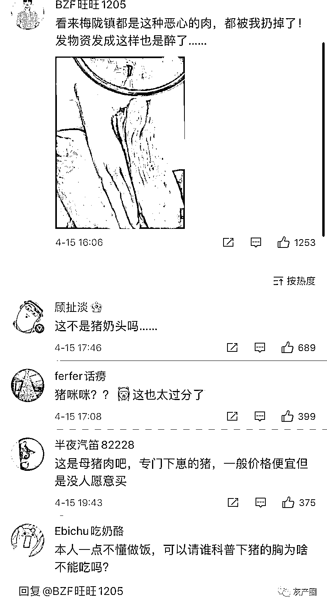
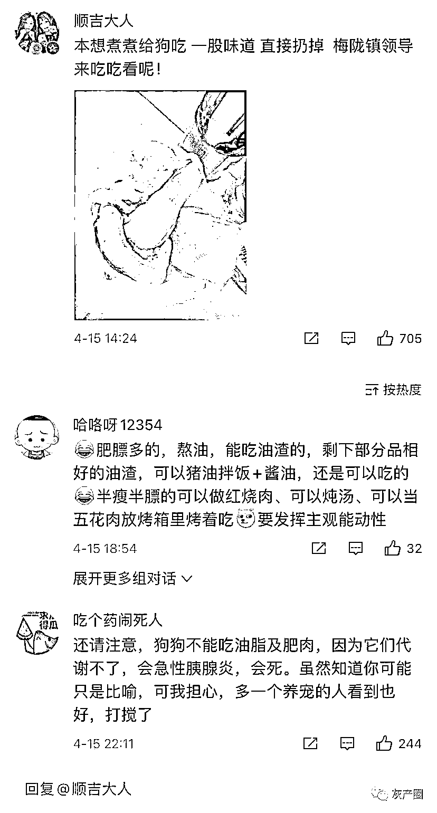

# 全上海的 neinei 都去了梅陇镇？这肉狗看了都不吃！

> 原文：[`mp.weixin.qq.com/s?__biz=MzIyMDYwMTk0Mw==&mid=2247533909&idx=1&sn=33c2aea048138d19a2a382fc8c25e5e7&chksm=97cb8e6da0bc077b73d7bb01bc885fc4850114ff144b7640d4a1b9683a3235c1bbf9aa93b928&scene=27#wechat_redirect`](http://mp.weixin.qq.com/s?__biz=MzIyMDYwMTk0Mw==&mid=2247533909&idx=1&sn=33c2aea048138d19a2a382fc8c25e5e7&chksm=97cb8e6da0bc077b73d7bb01bc885fc4850114ff144b7640d4a1b9683a3235c1bbf9aa93b928&scene=27#wechat_redirect)

今天有网友爆料闵行区梅陇镇莲花公寓 4/14 日发放的猪肉肥肉占 80%都是大肥膘，而且颜色不新鲜，简直让人怀疑这是不是给人吃的。很多群众收到之后就直接扔掉了，甚至有些群众觉得给宠物吃都怕吃出毛病。这些物资虽然是政府免费赠送，但也是用纳税人的钱买的，到底是什么人在其中牟取暴利？！什么人消费政府的公信力？！什么人在发国难财？！希望能够彻查此事，给人民一个交代！

************

**可能会引起不适，谨慎下滑！！！**

****可能会引起不适，谨慎下滑！！！****

****可能会引起不适，谨慎下滑！！！****

虽然是猪 neinei，我还是打上马赛克比较好，那 naizi 比人的都大！！

********

************

************************

**网友在评论区晒收到的猪肉——** 

**“只有更差没有最差”**

****

**“常兴家园也一样！！恶心的一塌糊涂 ”**

****

****

**“看来梅陇镇都是这种恶心的肉，都被我扔掉了！发物资发成这样也是醉了…… ”**

****

****

**“你们良心不痛嘛  我们关了整整 32 天了 ”** 

****

**“本想煮煮给狗吃 一股味道 直接扔掉  梅陇镇领导来吃吃看呢！”** 

****

**“这些肉让梅陇镇的领导直播吃吃看 ”** 

****

**"我是四个咪咪头 "**

****

**"团购买到 140"** 

****

**“拿到的那一刻我吐了”** 

****

**“我收到的”貌似淋巴肉** 

****

**“我刚才收到的，这个算不算新鲜啊我真不知道 ”** 

****

**“这就是换了领导之后发的肉？？还不如之前！！！”** 

****

**“梅陇镇+1， 请镇领导出来走两步 ”** 

****

**“我敢吃？？？”** 

****

****

****

****

**如果不想发可以不发，发的都是老母猪肉，而且很多胸部肉，发一箱子奶头真的没必要，甚至有的看上去已经变质了，不怕吃死人吗？**

**事件不断发酵，16 日凌晨，梅陇镇防控办通过**@闵行梅陇镇** 发布情况说明称，4 月 14 日至 15 日，有居民陆续反映闵行梅陇镇发放的第四批生活保障物资中，部分猪肉存在质量问题。**经初步核查，情况基本属实，梅陇镇立即叫停了该批物资的发放，并启动相关调查问责程序。**在此，向广大居民朋友表示深深的歉意！

此次保障物资中的猪肉由**上海咨谕实业有限公司（具有相关资质）**提供，协议约定为五花肉（2 斤）、蹄髈（1 斤）。但部分居民收到的商品实物确实存在**肥肉过多、品相不佳、多为边角料且变质变味**等问题，与协议约定及企业样品存在明显质量差异。我镇已终止与该批次生活保障物资供应商的合作，相关企业已被列入黑名单，并将通过法律途径解决后续事宜。同时，积极开拓货源，联系新的供应商，在确保物资品质的前提下，将重新给居民朋友发放生活保障物资。 **

****

**我通过天眼查发现，**上海咨谕实业有限公司**这家公司是没有冷藏冷冻食品经营资质的。镇领导可真会挑选合作供货商呢**

****

**而且实缴资本为零，参保人员为零，两股东关联投资信息无。能拿这种单子大概率就是个开票拿标的壳子。**

****

**说真的，还就是在上海。这次封城后的大部分乱象其他城市封控真没有，或者一有冒头就被严惩，之后没人再敢。在上海不但明目张胆，而且事情发生后没后续说法，相关行为没代价，也无人问责，等于鼓励和纵容这些害群之马，于是各种乱象重复出现。**

****发国难财的人，你的良心不痛吗？****

**来源： 吃瓜不吐葡萄皮**

****

**← 向右滑动与灰产圈互动交流 →**

****