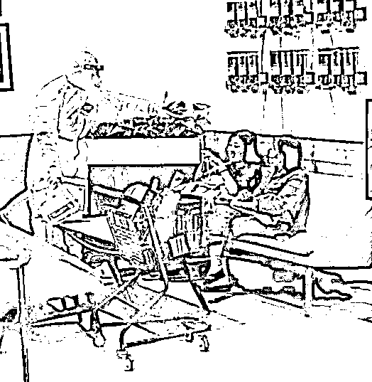

# 上海疫情，你太对不起苏州了

> 原文：[`mp.weixin.qq.com/s?__biz=MzIyMDYwMTk0Mw==&mid=2247533909&idx=2&sn=41c25d0dc95a23ecfddb0c7f5d6501c1&chksm=97cb8e6da0bc077bc346f5f9ee322499f6399561b0e2f985bba965ca315ac81a641f5f4d8104&scene=27#wechat_redirect`](http://mp.weixin.qq.com/s?__biz=MzIyMDYwMTk0Mw==&mid=2247533909&idx=2&sn=41c25d0dc95a23ecfddb0c7f5d6501c1&chksm=97cb8e6da0bc077bc346f5f9ee322499f6399561b0e2f985bba965ca315ac81a641f5f4d8104&scene=27#wechat_redirect)

包邮区，没有局外人。

因为苏州全域实行封闭管理，两张图在网上疯传。

**图一** 

****

**图二**

**多一个请字可不太好排版，又不是请他们来。** 

不好意思，这一波，我站苏州。

苏州太难了。

**-1-**

**一波三折的苏州**

**默默扛下了所有** 

大家的目光都集中在上海，但大家可能忽视了在上海旁边压力山大的苏州。

事实上，苏州今年以来已经独自扑灭疫情至少 3 回了。

**2 月 13 日，苏州突发疫情，星夜鏖战终摘星。**

**3 月 13 日，苏州再起疫情，坚壁苦战斩关联。**

**4 月 13 日，苏州疫情起伏，形势严峻令人忧。**

有人说，苏州人不怕“历劫”，却担心“轮回”。苏州人不怕阻击战，却担心“消耗战”。

2022 年 3 月份以来，苏州市累计报告本土感染者超 500 例。

4 月 16 日，苏州又新增阳性感染者 13 例。

**本轮疫情累计追踪排查在苏州密接 25117 人，次密接 39026 人。**

**苏州为此划定封控区 158 个、管控区 110 个、防范区 15 个。**

面对防不胜防的奥密克戎，全面排查乃至各种围追堵截，仍然显得力不从心。

根据 4 月 12 日苏州疫情防控新闻发布会上的通报，苏州市与上海关联阳性感染者占比高达 73%。

**因为苏州不想与上海共沉沦，于是在 4 月 16 日，苏州的疫情防控进一步升级！**

4 月 16 日，江苏苏州市新冠肺炎疫情联防联控指挥部发布通告。非必要不流动，全面加强社会面管控，取消各类公众聚集性活动和堂食。凡是可以居家办公的一律居家办公。所有居民小区、城中村、集宿区、产业园区实行封闭式管理，严格实行“一门一岗”，严格查验所有出入人员，外来人员和车辆非必须不得进入。所有旅馆（酒店）新入住人员必须持有 24 小时核酸检测阴性证明，已入住人员严格落实核酸每日一检。

自己不封城，逼得别人封自己。

**升级的防控，最无奈的还是苏州市的人民。**

只能不停地封闭静默再核酸，甚至有网友无奈晒出铺满一地的核酸检测采样凭证。

有件事大家可能没注意，苏州的学生过年后到现在还没开学。

因为上海的疫情，苏州的学生两次开学失败，网课上了两个多月了，一直在被迫陪跑。

4 月 10 日，江苏省苏州中学，一名高三学生的生日

**乃至于高三年级师生只能封闭住校，因为高考才是改变人命运的重要一环。**

只希望这些学生，在学校能吃好住好，尽量不要影响他们的复习备考。

再看下苏州代管的重镇——昆山 4+210，真能怪人家苏州吗？

特别理解苏州抗疫的无奈选择，只要不躺平，必须有所作为，这已经不是面子问题了，必须要唱黑脸。

苏州不想和上海共沉沦，于是把自己“封”了。

**-2-**

**享受上海都市圈的红利**

**也得背起它的锅**

苏州表示不想和上海共躺平，于是把自己“封”了。

据报道，苏沪交界处已经出现瞭望台，有防疫人员坐上了临时搭建的“岗哨”。

为什么？

因为真的跟上海隔得太近了。

上海和苏州有多近呢？

从上海火车站，到苏州火车站 84 公里；到苏州园区站 74 公里，到昆山站 49 公里。

****

喊了 N 多年“沪苏同城”的苏州，在高铁、轨交、公路上已经和上海无缝对接。

**从上海虹桥站到苏州北站 81 公里，最快 23 分钟就能到，高铁动车密度是 190 班次/天，每隔 5~10 分钟就有班次，不输地铁！**

****

苏州人去上海乘地铁，还压根不用买票，两地市民使用本地 APP 即可在苏州、上海扫码乘车。

身边有一个日增 2 万多感染者、还不断外溢的上海，苏州苦不堪言。

连苏州市委书记都在疫情防控工作会上提出：**要坚决守住江苏“东大门”。**

图源：政知见

于是苏州开始出现魔幻一幕：**抢光“上海-苏州”火车票，让周边城市的人都过不来！**

换句话就是：你别过来啊！

**难的是，江浙地区大量的医护都去支援了上海，不知道剩下的人力能否扛起疫情防线，所以苏州一定要支棱起来。**

**-3-**

**上海绿码已经失去信用**

**最后再说句“上海加油”吧**

上海不是封城了吗？为什么外溢还这么多？其实到现在，上海的防疫措施并没有禁止出去这项，只是写的非必要不离沪。**讲个笑话：上海没有高风险地区。****别忘了，上海就是绿码，出了上海市别的城市才给你转红码。**同样苏州为了应对这种情况，现在的措施是行程卡带星就 7+7。当初西安疫情，西安市政府做的第一件事就是“严控离开西安，不把疫情传给外省市”。 在上海的苏州市民如果从上海出来的人能做到自我隔离 5 天，自己进行两次抗原检测阴性再出门，那大家对上海出来的人就不会这么排斥。**现在的问题是，许多从上海出来的人，一下火车或飞机就迫不及待地去各个人多的商场、饭店、酒吧，导致当地被封锁。**典型例子就是刚解除上海的隔离，就去杭州逛吃逛喝一整天的母女。只一个阳性，就掀翻了半座杭州市。 讲真，我真不明白上海这样做的目的是什么？周边兄弟省市在积极抗疫，你在悄咪咪地“放人”？ **你给他援助，他还你外溢，简直就离谱！**上海的疫情是基于躺平思想造成的，不负责任的外溢给全国造成了危害。至今还有阳性患者到处流窜，其它省市该支援的都支援了，所以剩下的唯有自保。**上海躺平，谁也站不稳，尤其是苏州，太难了。**如此一来，上海的战疫只要不取得全胜，那么外溢到外溢到别的省市将不可避免。我不知道这波疫情要持续多久，但只要上海不攻下来，一切都很难，希望上海再加加油吧。**三月未能下扬州，四月不能茶楼坐，但愿五月瑞光千丈。**来源：昌南大队长

← 向右滑动与灰产圈互动交流 →

