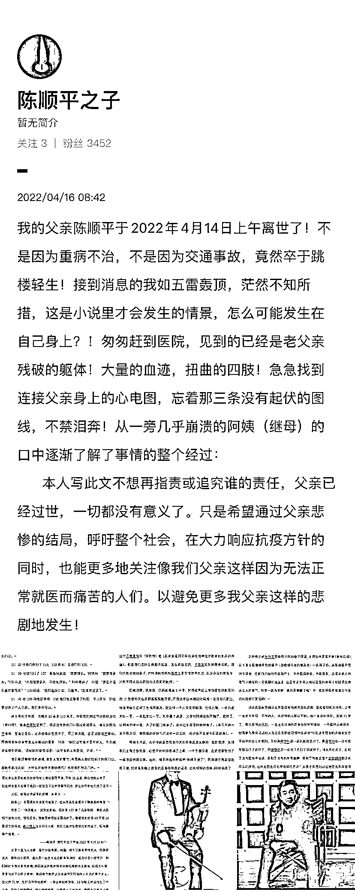
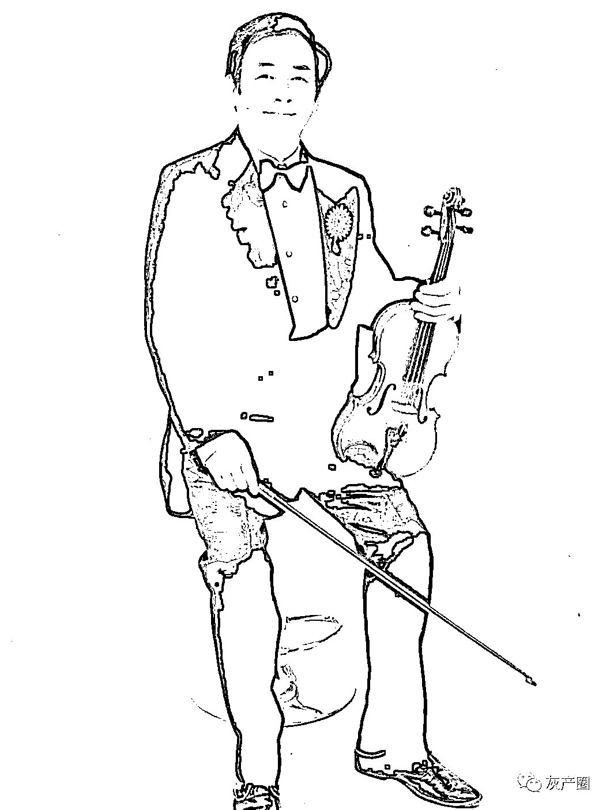

# 一夜疼痛难忍，上海小提琴家陈顺平于天亮后跳楼

> 原文：[`mp.weixin.qq.com/s?__biz=MzIyMDYwMTk0Mw==&mid=2247533909&idx=4&sn=7e968fd44e2e9bd73751672b0a63fbd5&chksm=97cb8e6da0bc077bc17378cb93f3a4ff71f97787e48a676eff33ee725fad889e48fb16eca506&scene=27#wechat_redirect`](http://mp.weixin.qq.com/s?__biz=MzIyMDYwMTk0Mw==&mid=2247533909&idx=4&sn=7e968fd44e2e9bd73751672b0a63fbd5&chksm=97cb8e6da0bc077bc17378cb93f3a4ff71f97787e48a676eff33ee725fad889e48fb16eca506&scene=27#wechat_redirect)

4 月 14 日，上海交响乐团退休的小提琴手、71 岁的陈顺平，因突发急性胰腺炎，连去两家医院就诊未果。回家后留下遗嘱跳楼身亡。急性胰腺炎是极其凶险的病症，如果不能得到及时救治，死亡率很高，而且其痛苦非普通人能承受。愿类似的悲剧不再上演

在这则微博中，“**陈顺平之子”详细讲述了陈顺平先生的去世过程和细节。**因为内容是截图，同时字体太小，为此我特意整理出文字来。以下为全部内容：

2022 年 4 月 13 日晚上 9 点多，我父亲腹部开感觉不适，初以为是晚饭多吃了，过一会就好了，还用开塞露方便。没想到逐渐开始疼痛，并越来越剧烈，还伴随呕吐(无腹泻)。我阿姨发现情况不对，赶紧联系寻求帮助。我们先通过小区党委，再联系小区对接医院事务的同志，第一时间帮我们开到了出门证。

11:37 分，我们先打了 110，110 表示：让我们打 120。

11:39 分，我们打了 120，客服回复说：“需要排队。”我阿姨问：“需要等多久。”120 回复：“不知道要多久，只能先排队。”阿姨激动了，问道：“那是不是只能在家等死？”120 回复：“我们也没办法，只能等。“就结束通话了。

11:41 分，120 回电话表示，110 也打电话联系了他们，可以派车，但还要排在 2 个人后面。我们表示可以。

终于等到了希望，大概在 12 点多 120 来了。带着我们到达同济医院总部（新村路），谁曾想医院是到了，但是连急诊的门口都没能进得去，被告知医院不接诊。里面全是阳。父亲腹痛实在受不了，再三请求后，还是回复说不接诊。阿姨看着急症室里面人头攒动的景象，问她：“你们这里面不是有病人，怎么就不接我们看病。”得到的回复依旧是：“这里面的人都是阳，不接。”

我们能理解疫情的艰难，医务人员的忙碌。可是病人已经到了医院门口，连医生都没见到，为什么不治疗不救助我们？就将我们拒之门外。

看着同济医院进不去，我们只能坐着 120 再去找另外的医院，第二家找到的是“第十人民医院”，结果十院没开门。

120 车里医生说，今天晚上本来就所有的医院都不接收病人的，如果我们还在找医院去，但医院大概率还是不接收病人的，并表示如果是送到罗店的医院，他们 120 是不负责送我们回来的。这种情况交不到车回来的情况下，怎么可能还冒险去罗店的医院碰运气？父亲两人决定还是回家。

回去路上，父亲求（问）120 车上有没有急救的消炎药水，紧急挂个盐水消炎也好，但 120 里没有盐水可挂。120 建议我们：这个病不致命，回家买这个匹维溴铵片（得舒特）吃（后来查是用于医治消化道神经紊乱相关的疼痛）。但是我们连什么病都不知道，怎么敢乱吃药，半夜又能到哪里去买药。我们只能忍痛回家了。对同济医院的拒接表示非常愤怒和无奈。在没办法的情况下，只能等明天白天再想办法找别的医院。

回家消毒、洗漱后，已经将近凌晨 3 点多，阿姨在手机上查询怎样才买到药，计划着明天白天哪些医院开着。而我父亲这样剧烈的痛楚一直没有间断过。他推测自己是得了急性胰腺炎。就这样一个人忍受着剧痛，无法入睡，一会儿起来吐一下，一会起来吐一下。早晨 7 点多，父亲对阿姨说，他不躺了，起床了，让阿姨再睡一会，关了卧室出门去。由于过于疲劳阿姨睡着了。（事后阿姨一直不停叨念，最懊悔的是她当时没有一起起床，也许不会发生后面的事情）。

等到 8 点多，由于阿姨是志愿者今天的任务是派发抗原，赶忙起床，发现茶几上有 2 张纸条，心里不好的感涌了上来，一个字都没看，赶紧在家里找了一圈没找到我父亲。这时，楼下响起了呼喊声“谁摔下楼了”，阿姨顾不得多想赶紧下楼，结果看到地上躺着的是那张熟悉的面孔，血肉模糊的身体。阿姨崩溃了，抱着父亲呼喊谁能帮帮她！

等到 120 车来了，送到同济医院抢救室，已经晚了。

阿姨和医院哭诉说：“我们凌晨来急诊的时候你们说不让我们进去，也不和我们说明情况，就说里面都是阳，不接。”得到解释说：昨天晚上是有阳，但是消杀后还接诊的。”阿姨听了更是火了：“为什么来的时候，不详细解释，非要赶人走？我们可以在外面等，那也不会发生悲剧。”

我赶到时，只见父亲这最后一面。医生告诉我们抢救无效，2022 年 4 月 14 日 9：58 分他走了。其实我们知道，父亲在跃下落地时就已经走了。

之后我茫然带着警察和法医勘查了现场，得知他离开家（家住四楼），是从 5 至 6 层楼梯平台的窗户（整幢楼可去的最高处）一跃而下的。从那扇窗户我往下望，想象自己也站在这窗户上，不禁腿脚发软。不敢想象，这是有多大的勇气才能做到义无反顾的站上去，这是有多少常人难以忍受的疼痛才能赋予父亲这么大的勇气。他一跃而下时，真的是解脱了吗？不！我觉得是带着那无可名状的绝望和冤屈的！

法医反复向我确认是否有精神方面的疾病，是否有抑郁的情况。父亲一直是个乐观、平和的人，认识他的人都认可。也一直身体很好，虽然 71 岁了。但在疫情风控前，一直还在交响乐团参与排练和演出，一个喜好古典音乐，经常参与集体活动的人怎么会突然出现精神疾病呢？可能这个疼痛发生在平时不会这么剧烈，平时再痛想到忍一忍到医院就好了。再痛想到忍一忍有医生给治疗就好了，再痛想到忍一忍吃了药打了针就好了。可父亲也忍了，忍到了没有医院肯收治，忍到没有药可缓解，忍到了可能是整个封控期间都没有尽头的疼痛。这种无穷无尽的疼痛如何再忍？父亲才会以这种方式草草了结自己的一生。

如果当晚同济医院能说明，当时只是消杀一会就能恢复救治。如果当晚能确认还有第三家医院是能接诊的，即便再远一点。如果当晚医生哪怕只开一例止痛药来缓解一下。都能给父亲留下一个希望，都不致使父亲走上这条不归路。

宣布父亲死亡后，医院告诉我们，现在冷库冰箱都是满的，人没办法留在医院，你们要么自己带走遗体，要么只能联系殡仪馆过来把人带走，不是带去殡仪馆整理遗体，而是带走直接去火化，火化后也要等疫情解封才能去领取骨灰，没有第二选择，这还是父亲遗体核酸检测是隐性的情况下。我只能匆忙回家整理父亲生前买的新衣服给他穿上擦拭整理干净。下午 15 点多，殡仪馆的人来了，就这样在迫于无奈下我们一起送走顺平同志，就这样简单地完成了送行。

之后，细看父亲的遗嘱，共两页：

纸条一：**“我要提前和亲友们告别了，因为我实在忍受不了胰腺炎的痛苦！”**

纸条二：**“昨天晚上，我突发疾病，后联系 120 去了几家医院，都因为疫情不接我治疗，我很无奈”**回家后病情就显露出来了。根据我的经验，89 不离 10 是得了胰腺炎，昨一晚上没有办法入睡，我自己估计生命快走到终点了，现特意留个遗嘱。

——陈顺平 匆忙中立下字据 2022 年 4 月 14 日。

父亲一直与人为善，是个开朗和善、风趣、对活富有热情的人，他热爱艺术，喜欢拉小提琴，退休后一直在大众乐团演奏演出，每天伴看小提琴声，和我阿姨的非常美满。我退休后在同济分院每周都当志愿者，疫情发生后，更是当起了小区志愿者，他们两个就是这么普通但又积极向上生活的两个老人。我丈夫 71 岁，生前没有基础疾病，一直注意锻炼身体，13 号上午到底他生了什么病，是什么样的剧痛，什么样的绝望，让他走上这条路。我们永远都不可能知道了。

虽然疫情肆虐，但是上海各处角落还有多少像我父亲这样给病痛折磨着的人却无法就医？！求助受阻，求医无门。为何？为何？为何？！

* * *

* * *

没有人是与世隔绝的孤岛；每个人都是大地的一部分；如果海流冲走一团泥土，大陆就失去了一块，如同失去一个海岬，如同朋友或自己失去家园：任何人的死都让我受损，因为我是人类的一员。 —— 约翰·多恩

来源： 吃瓜不吐葡萄皮

← 向右滑动与灰产圈互动交流 →

