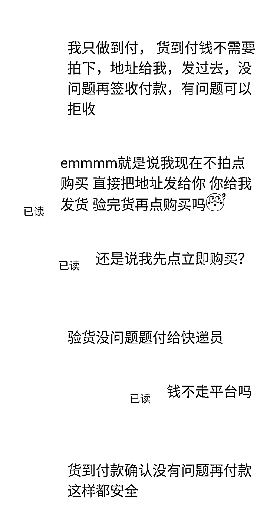

# 二手 iPhone 13 只要 3000 块？揭秘闲鱼低价骗局！

> 原文：[`mp.weixin.qq.com/s?__biz=MzIyMDYwMTk0Mw==&mid=2247533909&idx=5&sn=804dee0a2403fc26e3ae444b23720a58&chksm=97cb8e6da0bc077b6b41b3304c0a10622adf6ccffcf7f2da13ac84e4e9c56db2a35cdc9964ef&scene=27#wechat_redirect`](http://mp.weixin.qq.com/s?__biz=MzIyMDYwMTk0Mw==&mid=2247533909&idx=5&sn=804dee0a2403fc26e3ae444b23720a58&chksm=97cb8e6da0bc077b6b41b3304c0a10622adf6ccffcf7f2da13ac84e4e9c56db2a35cdc9964ef&scene=27#wechat_redirect)

随着这些年闲鱼用户越来越多，也让不少不法分子盯上了这里，现在的闲鱼可谓真的是鱼龙混杂，有真实商家，也有很多打着卖手机的旗号来骗人的。为什么经常能看到那些 1000 多，2000 多的苹果 12 系列，13 系列的手机，是不是真实的呢?

想写这篇文章，是在我查阅各大社交平台都无果的情况下含着被坑的血泪写下的文章，想让那些想买心动闲鱼低价手机的学生们亡羊补牢。真的要记住：天上不会掉馅饼。

低价诱惑真的很难抵御。当你看到闲鱼上眼花缭乱的低价时，你已经中套了。

类似这样的话题已经屡见不鲜，当然有的人很聪明不会上钩，可就算一百个人中有 99 个人不会上当，只要有一个人上钩骗子就会赚的盆满钵满。请不要相信这个低价陷阱，已经被眼前的利益冲昏了头脑加上卖家的不断督促，很难有人继续维持理智。

**咸鱼有两种人不能信，一种是卖货的女生，还有一种是货到付****款的卖家。**因为这两种情况都会让你放松警戒心，你觉得非常安全的时候，恰恰就是你最不安全的时候。下面小编为大家揭露一些闲鱼常见骗局。

1

低价骗局

**1.翻新机**

就是各种摔过的、爆屏的，然后换个新零件，看起来就跟新手机一样，其实内部烂成啥样都不知道，寿命和使用都是个问题，但是很多坏手机短时间内你是察觉不出来的。

**2.组装机**

就是把几部损坏的手机上好的零件拼凑到一起，贵的可以卖的或者可以做维修替换用的内部元件给你找个次品或者成本较低的替代元件换上，再东拼西凑组装起来。就比如原装电池和屏幕给你换成国产的。

**3.扩容机**

就是 128g 的内存，给你扩容成 256G 的，这样的就能多卖你几百，但是最终会导致系统卡顿、耗电等。

**4.改信息**

这个就更坑爹了，16g 内存直接给你改了，爱思助手一看全绿，其实上是全红，你都不知道他换过哪些零部件，看不出任何问题。

**5.卡贴机**

也就是国外合约机，需要配合卡贴解码读取信号，所以叫卡贴机，这种有锁机一般要搭配一个卡贴，卡贴可以让国内的手机卡冒充国外运营商，就可以用了，有个最大的缺点就是信号更差，苹果手机本来信号就不咋地，再配个卡贴那就更差了，有时候电话显示有信号别人都打不通。当然有的运营商的有锁机是可以解锁的，这种一般是深度玩家，如果你不懂就别上车

**6.钓鱼网**

钓鱼网之类的诈骗手段层出不穷，首先通过低价吸引你，然后再一步一步引导你通过微信、QQ 之类的聊天工具沟通，然后再说什么转转交易之类的，绕你一大圈，最后把你绕晕了给你发个钓鱼网，这类钓鱼网做的跟真的一模一样，甚至有的时候专业做网站的人一不留神都会看走眼，更别说普通网民了，所以就算你通过其他平台联系，也不要从对方给的链接里付款，平台之外给你发链接的 99.999%都是钓鱼网，你要去测试那 0.001%的话当我没说。

2

面交骗局

第二种方式，，面交，那真的就是高手中的高手了。

很多人估计很诧异，当面交易他还能怎么骗我呢，机子有问题我不要就是了，兄弟们想得太简单啦，下面就让我一一道来，大家耐心点看完喔！

这些骗子一般都是团伙作案，他们一般选择高价值品牌手机，并且挂很低价吸引目光，而且他们还会特别说明只支持面交，只支持面交。 他们会约你去一个类似于营业厅的地方或是一个偏僻大楼内的某个办公室之类的，然后必定会有几个大汉在这里坐镇。

他们拿出之前说的手机，让你验机什么的，机子是正常的，没有任何毛病，过程即便你砍价也会爽快答应，最后你发现机子也没问题，是正品机付钱了，这时候他们的套路就来了，你交完了钱，他们就会告诉你这是一个类似于合约机的东西，绑定有一个手机卡，每个月得交好几百的话费，卡停了手机也用不了，还得再交 1-2 年才能解除这个套餐。

这时候想要退款那是肯定不可能的，更让人恶心的是，他还会假装好心地给你提供折中方案，上让你选部别的手机来抵消上述的合约机，其实这里能选的就是垃圾机了，或者可以让你选个稍微正常点的机，但是要补钱，不用多说，反正就是要坑钱，每个都是远远高过常规市场价的，最后等于花了高价买了个很普通的手机。

3

货到付款骗局

这第三种骗术，就是在很多人看来最靠谱的收货方式——货到付款。

在沟通时卖家跟你说：**“直接发你，货到了没问题再把货款给快递员”。**不少买家抱着**满意了再给钱、不好就拒收**的心理，并且不由地认为货到付款比起在平台先行支付更为可靠，所以同意了卖家的要求。然而噩梦是从收货后开始的。

快递到了之后，如果你仅仅是看了外观及一些基本功能没发现问题便支付货款给到快递员就确认收货。一收货问题就来了，可能你收到的就是翻新机、炸弹机、ID 机等问题机器，当你想要找卖家理论时，结果和预想一样**无人回应**。当你又尝试和平台以及快递方面联系，却被告知“**举证不足、有违规定**”。最终的结果是，你的的钱款无法被追回。

又或者卖知只设置 10 块 20 块这样的低价让你拍下手机，并说剩下的货到付款，结局同上，就算你提供了证据且申诉成功，你最多能追回的也仅有那 10 块 20 块而已！

以上就是闲鱼比较常见的骗局，你要知道这些套路，但是不能去利用这些去骗人！时刻谨记，一分钱一分货，没有天上掉馅饼的好事。

来源：华强北手机报价号

← 向右滑动与灰产圈互动交流 →

