# 抖音知乎小红书上线的新功能，让这群人破大防！

> 原文：[`mp.weixin.qq.com/s?__biz=MzIyMDYwMTk0Mw==&mid=2247533971&idx=2&sn=5dbcb2de45a67009b4ef7c6c36db63f8&chksm=97cb8eaba0bc07bd87378e4e0fdad507478898ec24f62c2c82a04e9b8003b03f23973eae456e&scene=27#wechat_redirect`](http://mp.weixin.qq.com/s?__biz=MzIyMDYwMTk0Mw==&mid=2247533971&idx=2&sn=5dbcb2de45a67009b4ef7c6c36db63f8&chksm=97cb8eaba0bc07bd87378e4e0fdad507478898ec24f62c2c82a04e9b8003b03f23973eae456e&scene=27#wechat_redirect)

可能有朋友注意到了，最近几天，抖音、快手、知乎、小红书、今日头条等平台好似商量好了一样，纷纷宣布上马新功能 —— 展示用户 IP 归属地。

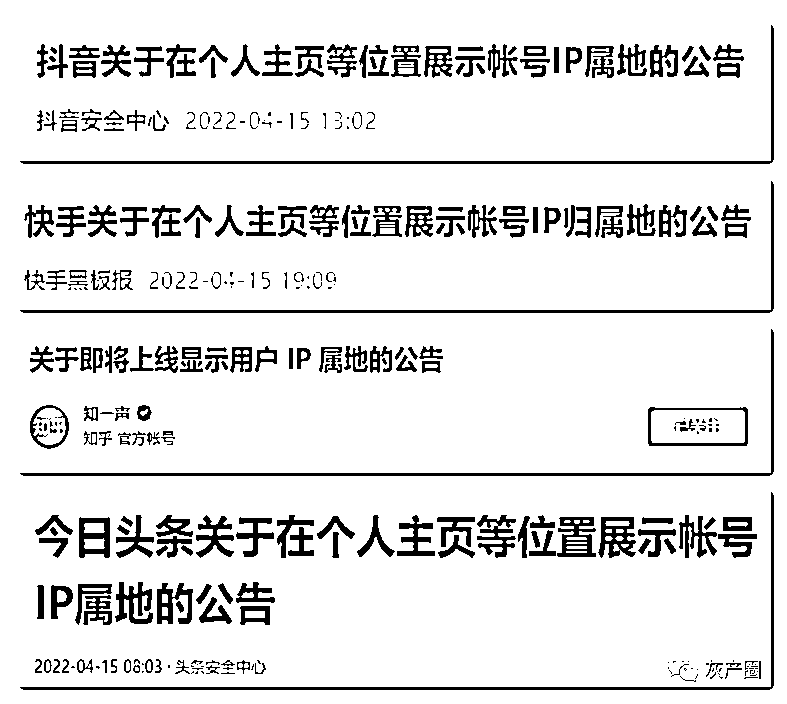

可能有朋友要问了，为啥这些平台都统一开整同一个功能？ 

这里，浪歌要先简单介绍一下，最开始搞公示 IP 归属地的微博。

上个月，微博就表示，上线“用户个人资料页展示近期发帖所在地”的功能。

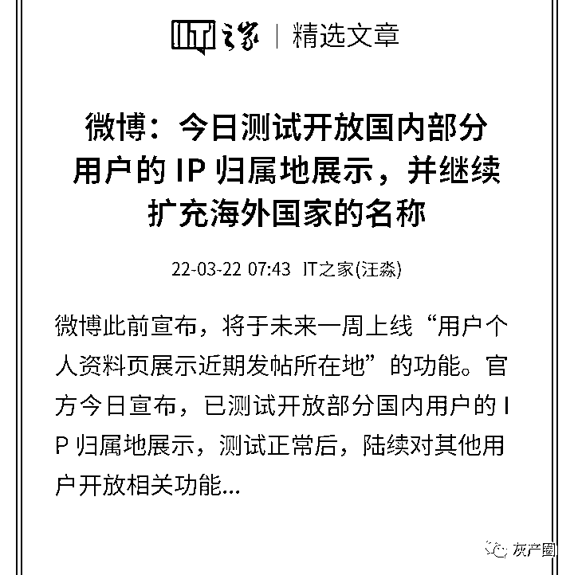

而这一功能上线后，网友连呼好家伙，微博上众多煽风点火的“牛鬼蛇神”暴露了真身。 

比如这个自家民房被征用，无家可归露宿街头的“**上海台湾人**”：

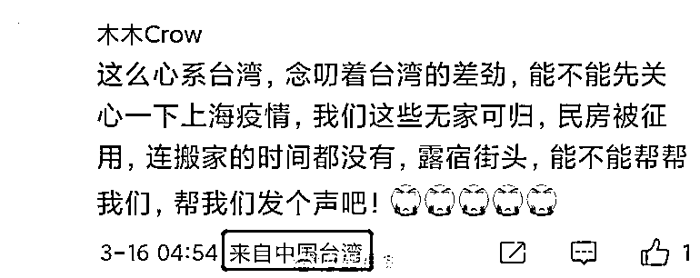

比如天天在微博挑起两性对立的“**台湾女拳师**”：

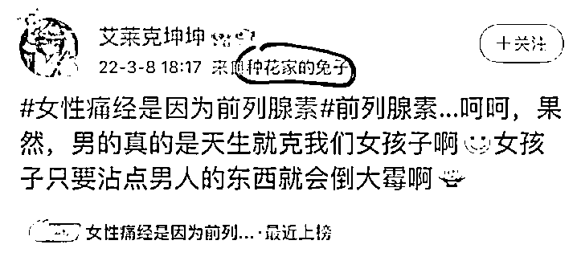

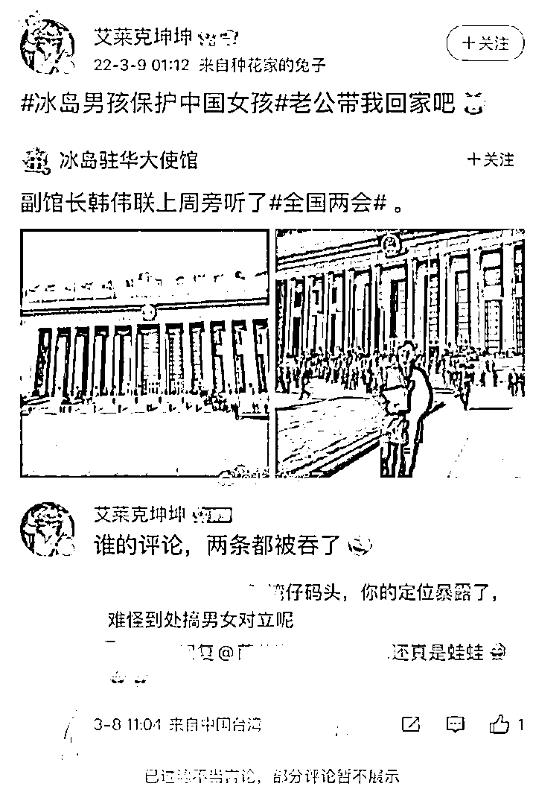

而在俄乌冲突后，**海外军团**也在微博密集驰援乌克兰： 

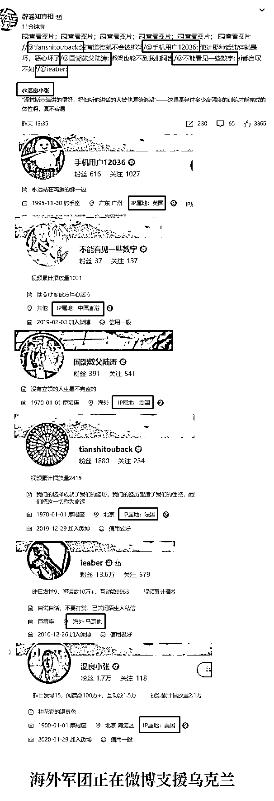

更加引人关注的是，在微博开放展示 IP 归属地功能后，有网友发现过去多起互联网事件，**背后都有海外 IP 账号在煽风点火**。 

例如四十九中事件。

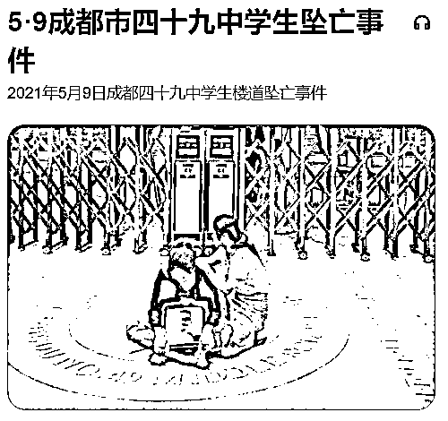

2021 年 5 月 9 日下午 6 点多，成都市第四十九中学一高二学生在学校坠亡，当地公安经过多日详细调查和尸检后，确定是该学生因压力过大而导致的轻生自尽，家属接受了这一调查结果。**朋友圈**和**微博热搜**中关于救护车两小时才到和未通知家属也被证实为**谣言**。

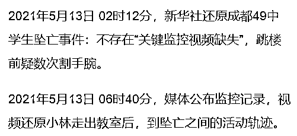

而在这一悲剧事件发生后，有大量微博账号在带节奏： 

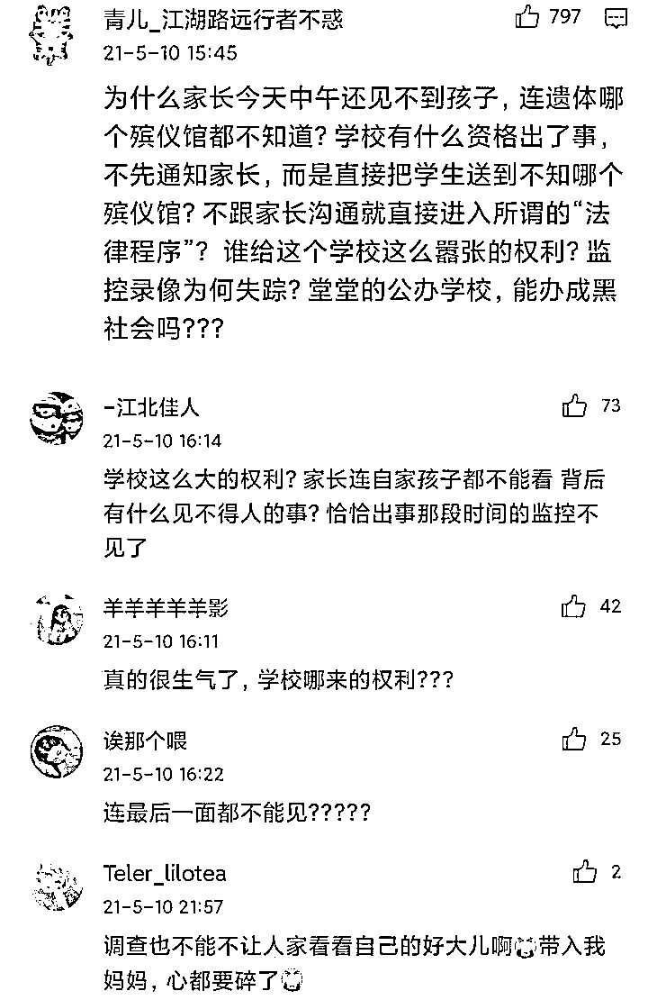

在微博开放 IP 归属地查看功能后，网友们发觉，这群人虽然在个人信息里写的是来自“四川”、“福建”，不过真实 IP 地址却是在美国、丹麦....

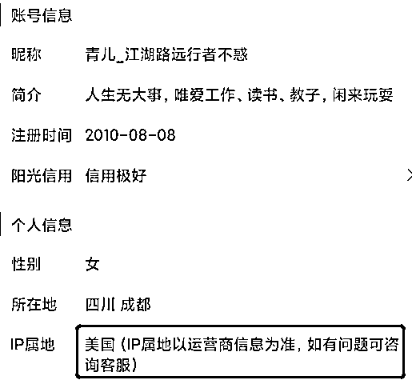

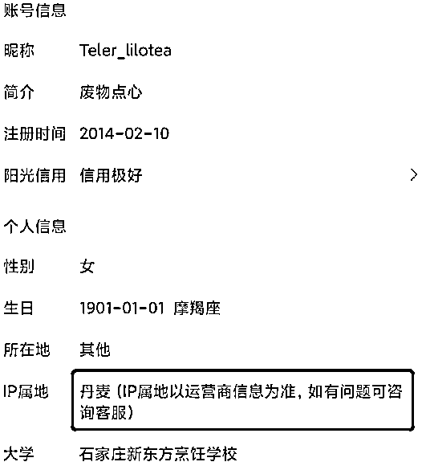

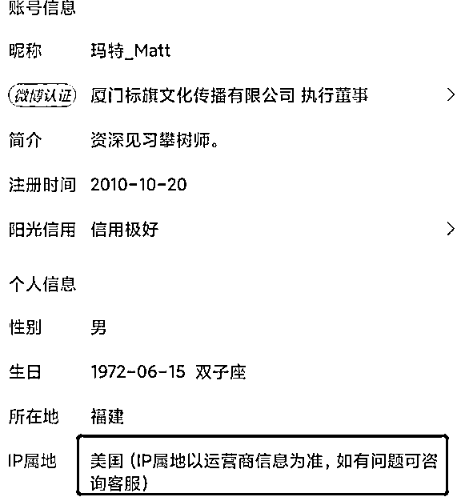

有网友看完这群人的真实身份后，直接蚌埠住了：**微博还有大陆人吗？**

而在微博宣布展示账号 IP 后，第一个跳出来反对的，也是这些中国台湾省和来自海外的人士： 

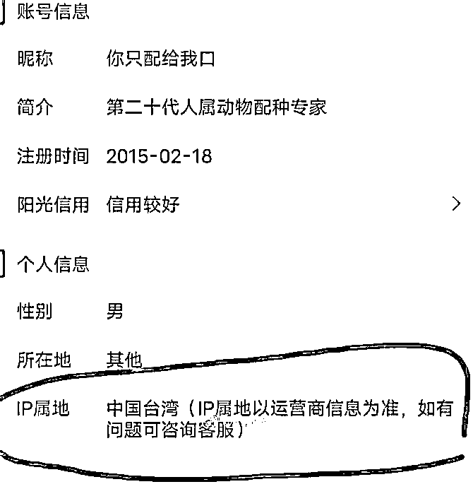

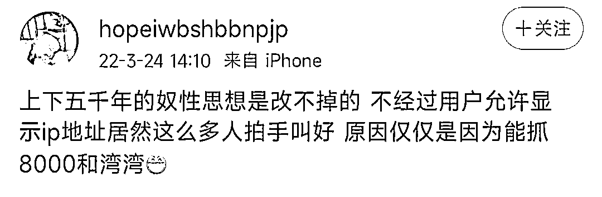

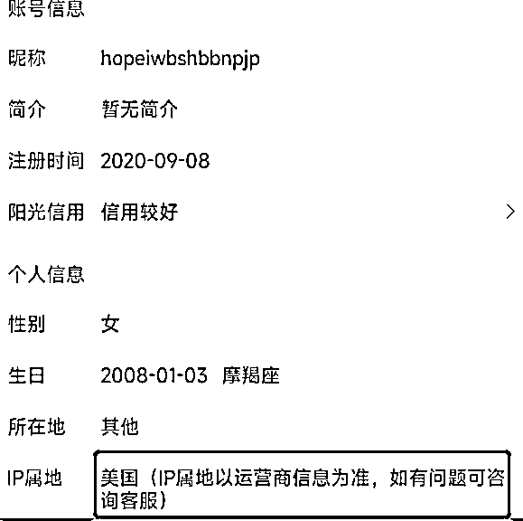

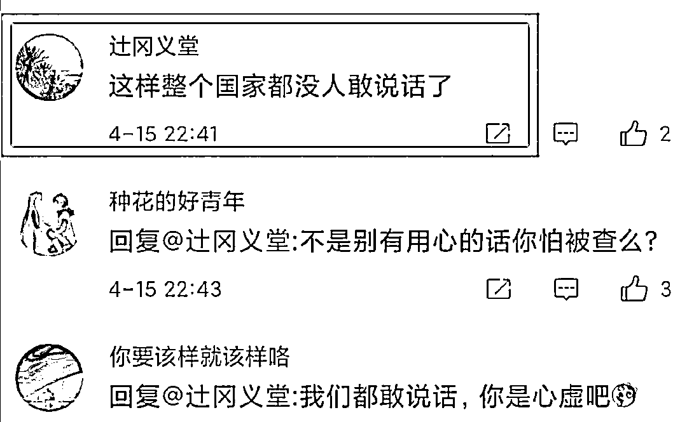

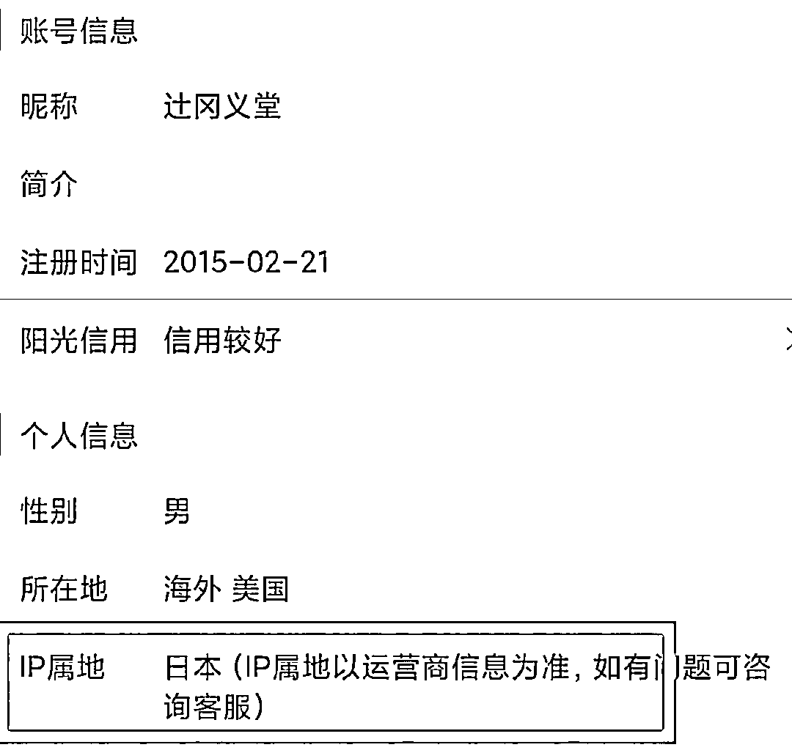

想想也是，往后这些阴阳人想继续在网上挑拨离间的成本可就高了，还要买代理才能伪装成大陆人，**微博这波操作属实破大防了**。

到这里，估计也会有读者注意到，貌似这些阴阳怪气的家伙，怎么很多都是来自中国台湾省呢？

这里，浪歌需要插播一个知识点：**1450 网军**。

三年前，中国台湾省“农委会”曝光的“2019 年度加强农业讯息因应对策计划”遭指控编列 1450 万元新台币预算，以每月 4 万元以上薪资，招募人员在网络论坛等社交平台进行“讯息实时澄清”等工作。

所以“1450”就成为了一个梗，意指**民进党和台独的舆论战部队**。

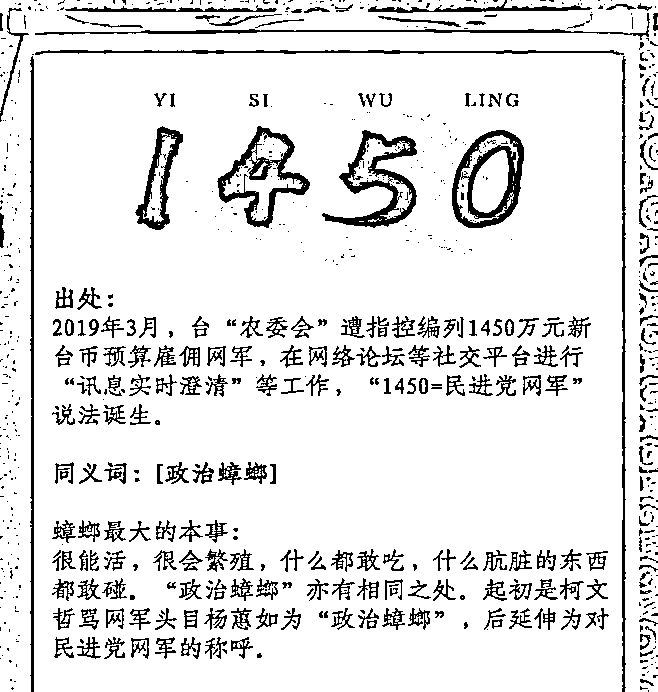

1450 肩负双重“使命”：一是在中国台湾省内，与民进党当局呼应配合，给绿营出台的政策背书，疯狂打压国民党、蓝营等竞争对手。二是在全球互联网上，抹黑大陆的社会经济、惠台政策，在互联网上制造矛盾冲突，甚至在香港“修例风波”中，民进党都出动了 1450 网军，意图让香港局面进一步混乱。

1450 之猖狂，连台湾本地人都受不了了，许多被网暴的人站了出来，痛批 1450 是民进党的**暗黑网军**。 

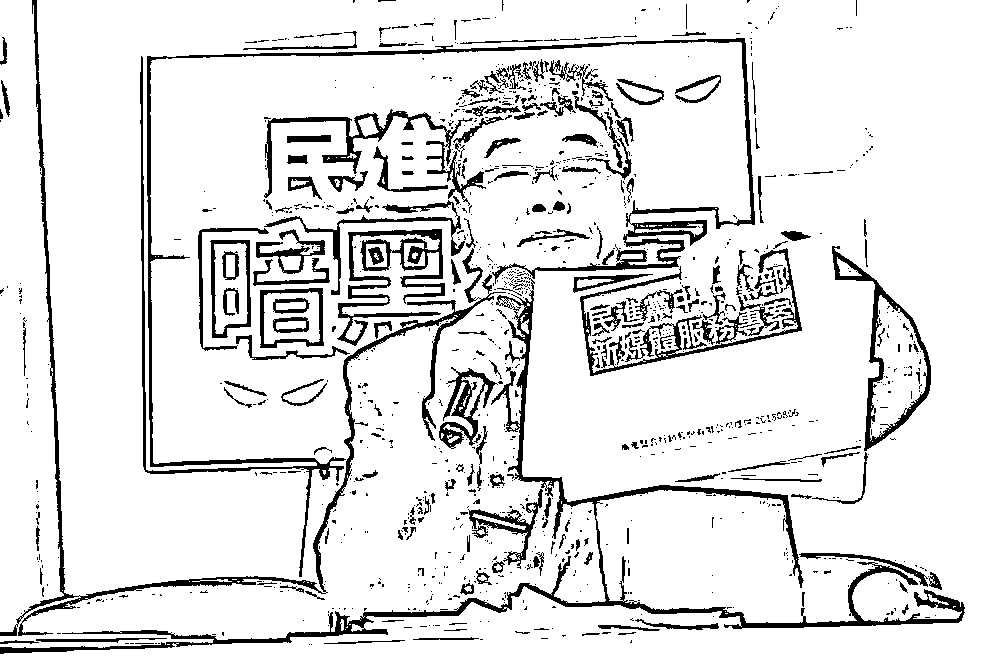

而在微博推出 IP 归属地展示功能后，有网友发现，微博的舆论突然就干净了，四处引战的 1450 少了很多。 

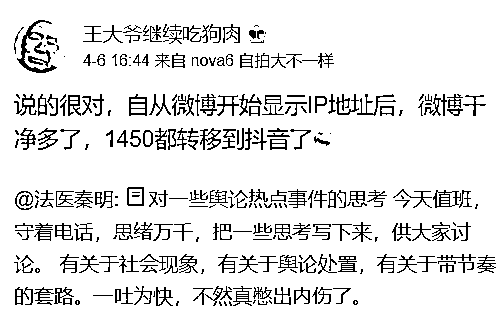

不过，知乎、抖音等社交媒体平台，又开始乱起来了： 

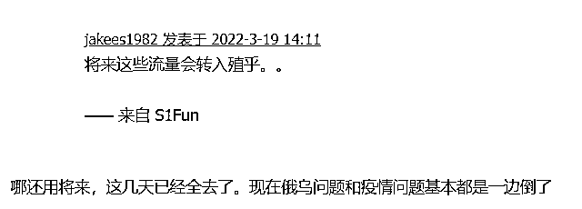

所以，像知乎、今日头条、抖音等各大社交媒体平台，也开始跟上微博的节奏，用展示 IP 归属地功能，让 1450 们无所遁形。

而对于 1450 和海外舆论战军团们，知乎网友 @经过 2018 进行了鞭辟入里的分析：

> **海外人士不辞劳苦，认真学习简体中文和大陆文化，然后在中文论坛上教育我们如何正确看待俄乌战争，强迫我们接受海外人士的价值观，不接受就是闭关锁国，这是种什么精神？**

> **这是种看了日本 AV 之后就敢跑去日本地铁上去勾引少妇的意淫精神；**

> **这是种看了美国队长之后就带着美国国旗去解放 XX 的自大精神；**

> **这是种是看到了有人质疑美国的民主自由就要去杀人家全家的和平精神。**

而对于这些漂洋过海来看我们的“道德师爷”，网友们也只想说一句：敬谢不敏！ 

部分图片与内容来自知乎@在在在在在@经过 2018@虚中载物来源：IT 之家

← 向右滑动与灰产圈互动交流 →

