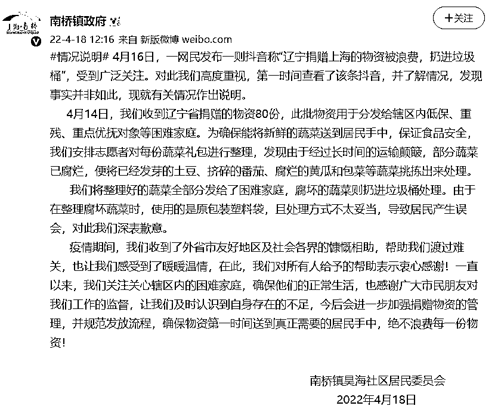
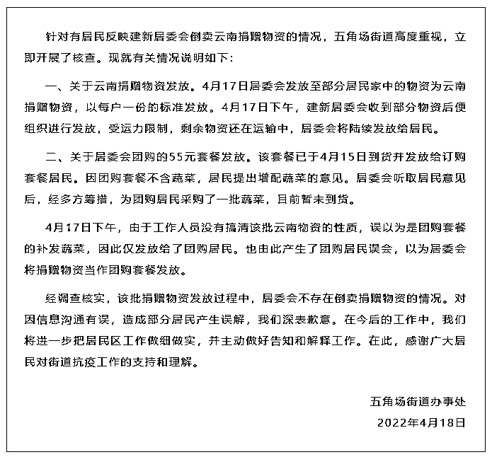
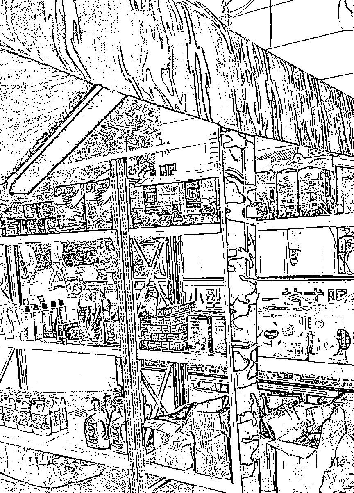

# 援沪蔬菜被丢进垃圾桶、铲入垃圾车？居委会倒卖捐赠物资？都有回应了

> 原文：[`mp.weixin.qq.com/s?__biz=MzIyMDYwMTk0Mw==&mid=2247533971&idx=3&sn=125c6de7cfeddcce13c3670f32d5deca&chksm=97cb8eaba0bc07bd4182f23bc5d54d61a4523578ef9817acebae7c60d8ce73ee4146894f657f&scene=27#wechat_redirect`](http://mp.weixin.qq.com/s?__biz=MzIyMDYwMTk0Mw==&mid=2247533971&idx=3&sn=125c6de7cfeddcce13c3670f32d5deca&chksm=97cb8eaba0bc07bd4182f23bc5d54d61a4523578ef9817acebae7c60d8ce73ee4146894f657f&scene=27#wechat_redirect)

**辽宁捐赠上海的物资被扔进垃圾桶？**

**南桥镇回应**

4 月 16 日，一网民发布一则抖音称“辽宁捐赠上海的物资被浪费，扔进垃圾桶”，受到广泛关注。今天中午，南桥镇政府发布微博，回应相关情况。

<mpvideosnap class="js_uneditable custom_select_card channels_iframe" data-pluginname="videosnap" data-id="export/UzFfAgtgekIEAQAAAAAAr8oYNfe7XQAAAAstQy6ubaLX4KHWvLEZgBPEjYMISEkcIOuDzNPgMIu2hPYLpJgVLqwk93yPiE2J" data-url="https://findermp.video.qq.com/251/20304/stodownload?encfilekey=rjD5jyTuFrIpZ2ibE8T7YmwgiahniaXswqzOPia47OsexgiaYDV53e7dzqqV2S97ImycPlAd854nSCiaKGOf6oI5YJSBaupYK8Ln6qXcxj5iaH27BoEWjI9dDSV9g&amp;adaptivelytrans=0&amp;bizid=1023&amp;dotrans=0&amp;hy=SH&amp;idx=1&amp;m=&amp;scene=0&amp;token=AxricY7RBHdVSGNIKI6dUNMN67AbNrRKQXTPGvjiaKFGzKoelmyTo3RYibU2GOic6KPN0ibMfTcCTuCU" data-headimgurl="http://wx.qlogo.cn/finderhead/4QtDCkraacOpF7qV3icdNYq2mTCIVn30mgA0Pu7ib9kTrDNhuksSnic7A/0" data-username="v2_060000231003b20faec8c6e18f18c3d6cd07e43cb0779db566d68d71ee3381a889954683ee17@finder" data-nickname="上海时刻" data-desc="#辽宁 捐赠#上海 物资被扔进垃圾桶？#奉贤 #南桥镇 ：整理腐坏蔬菜时使用了原包装塑料袋，且处理方式不太妥当，导致居民产生误会，对此深表歉意。#关注本土疫情" data-nonceid="15355861267922708949" data-type="video"></mpvideosnap>该视频号不可引用

> 4 月 14 日，南桥镇收到辽宁省捐赠的物资 80 份，此批物资用于分发给辖区内低保、重残、重点优抚对象等困难家庭。为确保能将新鲜的蔬菜送到居民手中，保证食品安全，我们安排志愿者对每份蔬菜礼包进行整理，**发现由于经过长时间的运输颠簸，部分蔬菜已腐烂，便将已经发芽的土豆、挤碎的番茄、腐烂的黄瓜和包菜等蔬菜挑拣出来处理。**
> 
> 我们将整理好的蔬菜全部分发给了困难家庭，腐坏的蔬菜则扔进垃圾桶处理。由于在整理腐坏蔬菜时，使用的是原包装塑料袋，且处理方式不太妥当，导致居民产生误会，对此我们深表歉意。

**援沪物资被铲入垃圾车？** 

**系蔬菜腐烂，运回作无害化处理**

4 月 17 日，一段大量蔬菜被铲入垃圾车的视频引起关注。记者根据视频中显示的蔬菜外包装箱联系到江苏大丰仓农业集团，综合办赵女士说，由于蔬菜运送周期长，导致蔬菜腐烂在箱子里面，已和大丰区城管局申请无害化处理，“（视频里）沪牌车是因为运输只能上海的卡车来回，我们这边的车是进不了上海的。”

<mpvideosnap class="js_uneditable custom_select_card channels_iframe" data-pluginname="videosnap" data-id="export/UzFfAgtgekIEAQAAAAAA7IMX6OVjOgAAAAstQy6ubaLX4KHWvLEZgBPE1IIEDw1tA-uDzNPgMIvfS3DEZ50hO2-gBXKm1TZj" data-url="https://findermp.video.qq.com/251/20304/stodownload?encfilekey=rjD5jyTuFrIpZ2ibE8T7YmwgiahniaXswqzQQeSzrfgibMstUyPH9m2wkOibtYib6VziaxrNiacECc6F2AzrzNgwibGyZ4HCQqUWA5rCvv6Oj0rXX5S4GW9MLPp5GdQ&amp;adaptivelytrans=0&amp;bizid=1023&amp;dotrans=0&amp;hy=SH&amp;idx=1&amp;m=&amp;scene=0&amp;token=cztXnd9GyrF7K9Dj45z7tjlHtgtbcFUWBWNmLE5daF2972zKsWcyfed2JO2CtA7hSwmiagoQmflM" data-headimgurl="http://wx.qlogo.cn/finderhead/PiajxSqBRaELvu2qO83aQfqRiaOGPRsOhB5RjQt7Amdvqpvk2ibFM9FCg/0" data-username="v2_060000231003b20faec8cae28b11c6d0cb03ed31b0773d30ae1acbf0ddab1be36440826ad480@finder" data-nickname="东方网" data-desc="【援沪物资被铲入垃圾车？捐赠公司：蔬菜腐烂，运回作无害化处理】#上海战疫 #关注本土疫情 
昨天（4 月 17 日），一段大量蔬菜被铲入垃圾车的视频引起关注。东方网·纵相新闻记者根据视频中显示的蔬菜外包装箱联系到江苏大丰仓农业集团，综合办赵女士告诉东方网·纵相新闻，由于蔬菜运送周期长，导致蔬菜腐烂在箱子里面，已和大丰区城管局申请无害化处理，“召回都是上海的车运回来，我们这边的车是进不了上海的”。盐城市大丰区城管局办公室工作人员向记者表示确有此事。（东方网·纵相视频 陈丽娜 汪鹏翀）
" data-nonceid="6631405568069536261" data-type="video"></mpvideosnap>

**杨浦一居委会倒卖云南捐赠物资？**

**街道：系工作人员误发**

今日凌晨，微信公众号“魅力五角场”发布消息称，针对有居民反映建新居委会倒卖云南捐赠物资的情况，五角场街道高度重视，立即开展了核查。现就有关情况说明如下：

一、关于云南捐赠物资发放。4 月 17 日居委会发放至部分居民家中的物资为云南捐赠物资，以每户一份的标准发放。4 月 17 日下午，建新居委会收到部分物资后便组织进行发放，受运力限制，剩余物资还在运输中，居委会将陆续发放给居民。

二、关于居委会团购的 55 元套餐发放。该套餐已于 4 月 15 日到货并发放给订购套餐居民。因团购套餐不含蔬菜，居民提出增配蔬菜的意见。居委会听取居民意见后，经多方筹措，为团购居民采购了一批蔬菜，目前暂未到货。

4 月 17 日下午，**由于工作人员没有搞清该批云南物资的性质，误以为是团购套餐的补发蔬菜，因此仅发放给了团购居民。**也由此产生了团购居民误会，以为居委会将捐赠物资当作团购套餐发放。

经调查核实，该批捐赠物资发放过程中，居委会不存在倒卖捐赠物资的情况。对因信息沟通有误，造成部分居民产生误解，我们深表歉意。在今后的工作中，我们将进一步把居民区工作做细做实，并主动做好告知和解释工作。在此，感谢广大居民对街道抗疫工作的支持和理解。

**奉贤回应** 

**“满天星便民超市货架物品造假”传言**

4 月 17 日，有网友在网络上发布有关奉贤区奉浦街道“满天星便民超市”的相关视频和聊天截图，受到广泛关注。当晚，奉浦街道在官方微博发出情况说明，具体如下：

目前，奉浦街道“满天星便民超市”分为线上线下两种服务模式，**且以线上服务为主。**每天由保供单位推出各类套餐，职能部门推送至各社区线上“星管家”处，再由线上“星管家”在居民群中发布具体内容，居民根据实际需求自行预定，各类物资一般隔天送达居民区。

**线下服务作为线上服务的延伸，主要为居民提供一些不方便团购的物资，或为老年人、婴幼儿、养宠人士等特定人群提供特殊服务。**视频中的“景怡佳苑”是目前奉浦街道“满天星便民超市”在防范区开展线下试点营业的其中一个小区，鉴于上海的疫情防控形势，目前营业时间为上午 8：00-9：00，下午 2：00-3：00，由居民分批分时段自行至门口“满天星便民超市”购买所需物品。由于露天场地不利于货物存放，营业时间结束后货物下架，临时存放至小区物业处，故在非营业时间段内超市货架上不摆放物品，对此，可能造成了部分居民的误解。后续现场工作人员积极向大家做好解释工作，居民表示理解。

之后，我们将采取登记制度，有采购需求的市民可以按照每日货物价目表，在线上向星管家进行登记购买，由线下星管家提前备货，在上下午两个时间段有序来门口排队提货付款。

疫情当前，奉浦街道“满天星便民超市”将以满足居民的生活需求为第一要务，线上、线下同时发力，努力做到价平量足、保障供应，为居民生活所需保驾护航。

来源：新民晚报综合@南桥镇政府、东方网·纵相新闻、“魅力五角场” 微信公众号、@贤韵奉浦、上海网络辟谣

← 向右滑动与灰产圈互动交流 →

