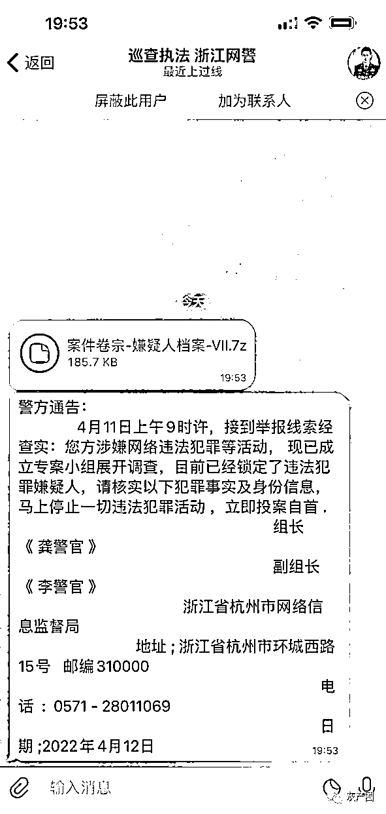
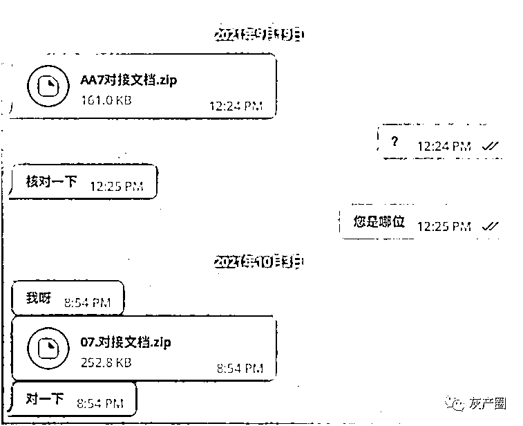

# 警惕！Telegram 已出现新诈骗方式，冒充警方诈骗同胞

> 原文：[`mp.weixin.qq.com/s?__biz=MzIyMDYwMTk0Mw==&mid=2247533971&idx=5&sn=7418ca7f7cf33f3a4b3f183d27ad1c6c&chksm=97cb8eaba0bc07bd03626420100180f3483746e8e98edcd25b8f0bf39950d9d0d158362ba5db&scene=27#wechat_redirect`](http://mp.weixin.qq.com/s?__biz=MzIyMDYwMTk0Mw==&mid=2247533971&idx=5&sn=7418ca7f7cf33f3a4b3f183d27ad1c6c&chksm=97cb8eaba0bc07bd03626420100180f3483746e8e98edcd25b8f0bf39950d9d0d158362ba5db&scene=27#wechat_redirect)

消息，近日，Telegram 群组近段时间出现新的诈骗方式，公然冒充国内警方发送通告！

一读者表示，近日，她突然收到几则 Telegram 信息，该号码标注为**浙江网警巡查执法**，向其发送了一个名为**“案件卷宗—嫌疑人档案—VII.7”**的文件后，又发送一个“警方通告”。

该通告表示：“**4 月 11 日上午 9 时许，接到举报线索经查实：您方涉及网络违法犯罪等活动，现已成立专案小组展开调查，目前已经锁定了违法犯罪嫌疑人，请核实以下犯罪事实及身份信息，马上停止一切违法犯罪活动，立即投案自首。**”

该通告落款为“组长《龚警官》，副组长《李警官》，浙江省杭州市网络信息监督局，地址；浙江省杭州市环城路西城 15 号，邮编 310000，电话：0571—28011069”。

读者提供图片 

该读者表示，这几则信息中，公然以警方身份发送的通告内容对于多数用户来说无太大意义。因为多数生活在海外的中国同胞会清楚知晓**在国内无法正常使用 Telegram 等国际社交软件，国内警方更不可能通过此类社交软件发布非正式的通告。**

**但可能造成很多人受骗的，是那个不起眼的文件包。**因为文件包可能包含着木马病毒，使误点入链接的人陷入程序病毒陷阱，从而造成手机上的支付软件被挟持、进而造成资金或其他财产损失。

且该读者透露，她已经有朋友在上个月因点开文件包，造成手机支付软件账号被盗，损失 1000 多美元。如此，她才在看到这个雷同的信息时有所警惕。（该读者未提供这位被骗者的相关资料，真实性尚未能查证，但此类消息涉及明显骗局，仍旧值得所有人警惕。）

因此，该读者希望通过媒体提醒在海外的同胞，在遭遇此类莫名的文件及信息时，请一定要谨慎，仔细辨别，以免造成资金或财产损失。

无独有偶，此前在 2021 年 9 月份时，也曾有几位读者向记者爆料 Telegram 出现陌生账号冒充熟人发送文件包信息。

读者提供图片

借此机会，呼吁所有的读者：

因为 Telegram、Whatsapp、Facebook 等此类国际社交软件可不通过添加好友直接发送信息进入聊天界面，因此请大家一定要警惕陌生账号发送过来的文件包、莫名信息，仔细辨别信息后再进行回复，以免遭遇骗局和陷阱，造成个人资产损失。

且在境外遭遇此类诈骗，报警程序繁琐、追查困难，资金及资产损失挽回几率渺茫，务请所有人警惕、谨慎对待国际社交软件上的陌生账号信息。

来源：泛亚生活

← 向右滑动与灰产圈互动交流 →

